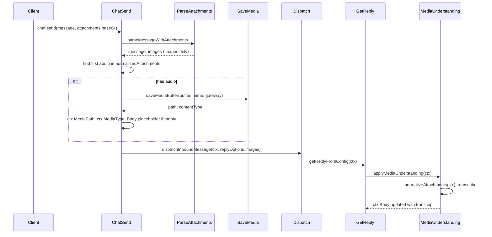

# Add audio support to Gateway WebSocket (chat.send)

## Current behavior

- **Gateway** [src/gateway/server-methods/chat.ts](src/gateway/server-methods/chat.ts): `chat.send` accepts `attachments` with `content` (base64 or ArrayBuffer). It normalizes to base64 and calls [src/gateway/chat-attachments.ts](src/gateway/chat-attachments.ts) `parseMessageWithAttachments`, which **only keeps image attachments** (drops non-image with a warn). It builds `ctx` **without** `MediaPath`/`MediaType` and passes `images` in `replyOptions` to `dispatchInboundMessage`.
- **Media understanding** runs in `getReplyFromConfig` and reads `ctx.MediaPath`, `ctx.MediaUrl`, `ctx.MediaType` from [src/media-understanding/attachments.ts](src/media-understanding/attachments.ts) `normalizeAttachments(ctx)`. So for audio to be transcribed, `ctx` must have `MediaPath` and `MediaType` set before dispatch.

## Approach

Keep image handling unchanged. **After** parsing images and **before** calling `dispatchInboundMessage`, detect the **first audio** attachment in `normalizedAttachments`, write it to disk with the existing [src/media/store.ts](src/media/store.ts) `saveMediaBuffer`, and set `ctx.MediaPath` and `ctx.MediaType`. Optionally set `ctx.Body` to a placeholder when the message body is empty and we have audio.

## Implementation steps

### 1. Stash first audio attachment in `chat.send` ([src/gateway/server-methods/chat.ts](src/gateway/server-methods/chat.ts))

- After building `ctx` (around line 455) and before `dispatchInboundMessage` (line 511):
  - Iterate `normalizedAttachments` and find the first attachment that is audio:
    - Prefer `mimeType` (normalized): if it starts with `"audio/"`, treat as audio.
    - If no mimeType or not audio, optionally sniff: decode base64 to a small buffer, call `detectMime` from [src/media/mime.ts](src/media/mime.ts); if result starts with `"audio/"`, treat as audio.
  - For that attachment: decode full base64 to `Buffer`, enforce a **max size** (e.g. 20 MB, from [src/media-understanding/defaults.ts](src/media-understanding/defaults.ts) `DEFAULT_MAX_BYTES.audio` or a gateway constant), call `saveMediaBuffer(buffer, mimeType, "gateway", maxBytes)` from [src/media/store.ts](src/media/store.ts). Set `ctx.MediaPath = saved.path`, `ctx.MediaType = saved.contentType ?? mimeType`.
  - If `ctx.Body` is empty and we set `MediaPath`, set `ctx.Body = "<media:audio>"` so downstream logic has a placeholder.
- Use subdir `"gateway"` so gateway-written files live under `media/gateway/` (same pattern as web `"inbound"`). No change to `saveMediaBuffer` signature.
- On size exceed or invalid base64, treat like other invalid params: respond with `ErrorCodes.INVALID_REQUEST` and message (e.g. "audio attachment exceeds size limit").

### 2. Helper to pick and validate audio (optional but recommended)

- Either inline the “first audio” logic in chat.ts or add a small helper (e.g. in [src/gateway/chat-attachments.ts](src/gateway/chat-attachments.ts) or a new gateway helper file) that:
  - Takes `normalizedAttachments` (array of `{ mimeType?, content: string }`) and `maxBytes`.
  - Returns the first attachment that is audio (by mime or sniff) and its decoded buffer, or `null`. Validates base64 and size; throws or returns null on invalid.
- This keeps chat.ts readable and makes unit testing easy (test helper with mock attachments).

### 3. Protocol and validation

- **No schema change.** [src/gateway/protocol/schema/logs-chat.ts](src/gateway/protocol/schema/logs-chat.ts) `ChatSendParamsSchema` already has `attachments: Type.Optional(Type.Array(Type.Unknown()))`. Attachment shape (content, mimeType) is validated in chat.ts; adding audio does not require new schema fields.
- Existing rule “message or attachment required” already allows empty message when there are attachments; after this change, a single audio attachment (no images) will still pass and get processed.

### 4. Edge cases

- **Image + audio:** Images continue to be parsed and passed as `replyOptions.images`; first audio is stashed and set on `ctx`. Media understanding runs for audio; vision uses images. No conflict.
- **Multiple audio attachments:** Only the first audio is stashed (single `MediaPath`/`MediaType`), matching Web/Signal behavior. Document in code or docs.
- **Empty body + audio:** Set `ctx.Body = "<media:audio>"` when we stash audio and body is empty so the pipeline does not treat the message as empty.

### 5. Tests

- **Unit:** Test the “first audio” helper (or the inline logic) with: (1) one audio attachment (base64 + mimeType) → returns path and mimeType; (2) only image attachments → no audio stashed; (3) first image, second audio → audio stashed; (4) oversized audio → error. Use a temp dir or mock `saveMediaBuffer` to avoid touching real config dir.
- **E2E:** In [src/gateway/server.chat.gateway-server-chat.e2e.test.ts](src/gateway/server.chat.gateway-server-chat.e2e.test.ts) (or equivalent), add a test that sends `chat.send` with one audio attachment (small base64 audio, e.g. minimal ogg/mp3), and assert that the request succeeds and that the context passed to the reply path has `MediaPath` and `MediaType` set (e.g. by inspecting a mock or by checking that media understanding was invoked if test setup allows). Prefer not requiring a live Deepgram/API key; mocking the reply resolver or asserting on ctx is enough.

### 6. Cleanup (optional follow-up)

- Files under `media/gateway/` are not currently cleaned by [src/media/store.ts](src/media/store.ts) `cleanOldMedia` (it only cleans the top-level media dir). A follow-up could add TTL-based cleanup for `media/gateway/` (e.g. same pattern as `cleanOldMedia` for a subdir) if needed.

## Flow (after change)

## Files to touch

| File                                                                             | Change                                                                                                                                                                                                                                                          |
| -------------------------------------------------------------------------------- | --------------------------------------------------------------------------------------------------------------------------------------------------------------------------------------------------------------------------------------------------------------- |
| [src/gateway/server-methods/chat.ts](src/gateway/server-methods/chat.ts)         | After building `ctx`, detect first audio in `normalizedAttachments`, decode and validate size, call `saveMediaBuffer(..., "gateway", maxBytes)`, set `ctx.MediaPath`, `ctx.MediaType`, and optional `ctx.Body` placeholder. Handle errors with INVALID_REQUEST. |
| [src/gateway/chat-attachments.ts](src/gateway/chat-attachments.ts) or new helper | Optional: add a small function that, given normalized attachments and maxBytes, returns the first audio attachment’s buffer + mime (or null) after validation.                                                                                                  |
| Gateway chat E2E test file                                                       | Add test for `chat.send` with one audio attachment; assert ctx has MediaPath/MediaType or that media understanding is triggered.                                                                                                                                |
| [docs/media-understanding-overview.md](docs/media-understanding-overview.md)     | Short note that Gateway WebSocket (`chat.send`) now supports one audio attachment via base64; server writes it to a temp path and sets MediaPath/MediaType for media understanding.                                                                             |

## Out of scope

- **Video** attachments: same pattern could be added later (stash first video, set MediaPath/MediaType).
- **Multiple audio** attachments: only first is supported; extending to MediaPaths/MediaTypes would be a separate change.
- **Protocol schema** for attachment type (e.g. `type: "audio"`): not required; detection by mime (and optional sniff) is enough.

