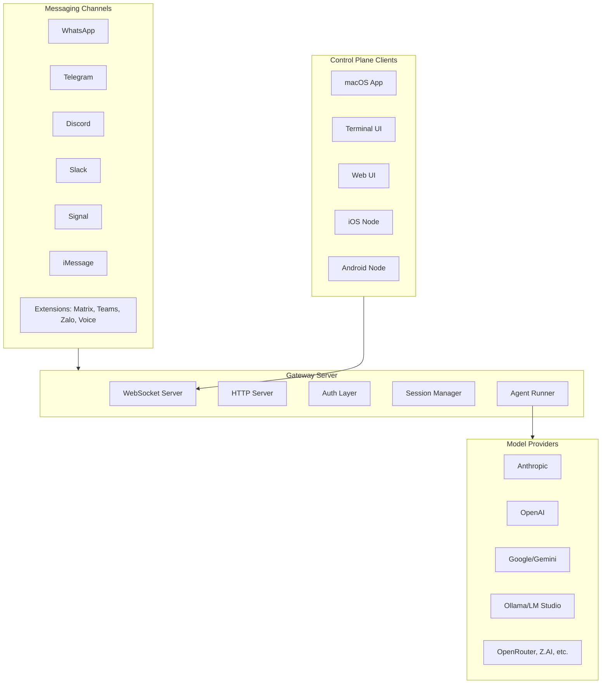
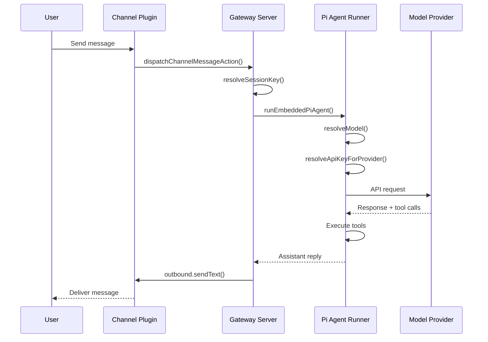

# Moltbot Systems Architecture Audit Report

## Executive Summary

Moltbot is a multi-channel AI agent gateway that connects AI models to messaging platforms (WhatsApp, Telegram, Discord, Slack, Signal, iMessage, and more). It provides a WebSocket-based gateway server, native companion apps (macOS, iOS, Android), a terminal UI, and an extensible plugin system.

---

## 1. Core Architecture Overview

### System Components




### Key Entry Points


| Entry Point    | File Path                                                    | Purpose               |
| -------------- | ------------------------------------------------------------ | --------------------- |
| CLI Binary     | `moltbot.mjs` -> `src/index.ts`                              | Main CLI entry        |
| Gateway Server | `src/gateway/server.impl.ts`                                 | WebSocket/HTTP server |
| TUI            | `src/tui/tui.ts`                                             | Terminal UI client    |
| macOS App      | `apps/macos/Sources/Moltbot/MenuBar.swift`                   | Menubar app           |
| iOS App        | `apps/ios/Sources/ClawdbotApp.swift`                         | iOS node app          |
| Android App    | `apps/android/app/src/main/java/bot/molt/android/NodeApp.kt` | Android node app      |


---

## 2. Directory Structure

```
src/
├── agents/                 # Agent execution, Pi integration, tools, models
│   ├── pi-embedded-runner/ # Core agent runner
│   ├── tools/              # Agent tools (message, sessions, gateway, etc.)
│   ├── model-selection.ts  # Model resolution logic
│   ├── model-auth.ts       # Provider authentication
│   └── local-provider-discovery.ts  # Ollama/LM Studio discovery
├── gateway/                # WebSocket server, protocol, handlers
│   ├── server.impl.ts      # Main server implementation
│   ├── server-methods/     # RPC method handlers
│   ├── protocol/           # Wire protocol definitions
│   └── startup-validation.ts # Startup health checks
├── cli/                    # CLI program, commands, routing
│   ├── program/            # Commander.js setup, lazy loading
│   ├── deps.ts             # Dependency injection
│   └── route.ts            # Fast-path command routing
├── commands/               # CLI command implementations
├── config/                 # Configuration loading, types, validation
│   ├── io.ts               # Config file I/O
│   ├── zod-schema.ts       # Zod validation schemas
│   └── legacy-migrate.ts   # Config migration
├── channels/               # Channel infrastructure
│   ├── plugins/            # Channel plugin system
│   ├── dock.ts             # Channel capabilities registry
│   └── registry.ts         # Channel registry
├── routing/                # Message routing, session keys
├── memory/                 # RAG system, embeddings, vector search
├── plugins/                # Plugin loader, registry, runtime
├── tui/                    # Terminal UI components
├── telegram/               # Telegram channel
├── discord/                # Discord channel
├── slack/                  # Slack channel
├── signal/                 # Signal channel
├── imessage/               # iMessage channel
├── web/                    # WhatsApp Web channel
└── infra/                  # Infrastructure utilities

extensions/                 # Plugin extensions (workspace packages)
├── msteams/                # Microsoft Teams
├── matrix/                 # Matrix protocol
├── zalo/                   # Zalo messenger
├── voice-call/             # Voice telephony (Twilio, Telnyx, Plivo)
└── ...

apps/                       # Native applications
├── macos/                  # macOS menubar app (Swift)
├── ios/                    # iOS node app (Swift)
├── android/                # Android node app (Kotlin)
└── shared/MoltbotKit/      # Shared Swift package

docs/                       # Mintlify documentation (293+ markdown files)
```

---

## 3. Message Flow Architecture




### Session Key Format

Sessions are keyed with the pattern: `agent:{agentId}:{channel}:{accountId}:dm:{peerId}`

Examples:

- `agent:main:telegram:123456789:dm:987654321`
- `agent:main:whatsapp:+15551234567:dm:+15559876543`
- `agent:dev:subagent:uuid-here`

---

## 4. Agent System

### Agent Resolution Flow

1. **Config Loading**: `resolveAgentConfig()` reads from `cfg.agents.list[]`
2. **Defaults**: Falls back to `agents.defaults` for missing values
3. **Model Selection**: `resolveConfiguredModelRef()` resolves `provider/model` format
4. **Provider Discovery**: `resolveImplicitProviders()` discovers Ollama/LM Studio
5. **Auth Resolution**: `resolveApiKeyForProvider()` resolves credentials

### Pi Embedded Runner

The core agent execution happens in `src/agents/pi-embedded-runner/`:

- **run.ts**: Main entry point, model resolution, auth failover
- **compact.ts**: Session compaction on context overflow
- **model.ts**: Model discovery and resolution
- **lanes.ts**: Lane-based queueing for serialization

### Key Constraints

- **Minimum context window**: 16,000 tokens (enforced by `MINIMUM_CONTEXT_TOKENS`)
- **Default context**: 32,768 tokens for local providers
- **Auth modes**: `api-key`, `aws-sdk`, `oauth`, `token`, `none` (for local)

### Local Provider Discovery

```typescript
// From src/agents/local-provider-discovery.ts
// Ollama: probes http://127.0.0.1:11434/api/tags
// LM Studio: probes http://127.0.0.1:1234/v1/models
// Sets auth: "none" for local providers
```

---

## 5. Gateway Server

### Startup Sequence

1. Config migration/validation
2. Plugin auto-enable
3. Diagnostics initialization
4. **Startup validation** (validates default model can resolve)
5. Plugin loading
6. TLS setup
7. HTTP/WebSocket server creation
8. Discovery service (Bonjour/mDNS)
9. Channel initialization

### Authentication Modes


| Mode      | Description        | Config Key                                             |
| --------- | ------------------ | ------------------------------------------------------ |
| Token     | Bearer token auth  | `gateway.auth.token` or `CLAWDBOT_GATEWAY_TOKEN`       |
| Password  | Password auth      | `gateway.auth.password` or `CLAWDBOT_GATEWAY_PASSWORD` |
| Tailscale | Tailscale identity | `gateway.tailscaleMode: "serve"`                       |


### WebSocket Protocol

- **Transport**: WebSocket, text frames with JSON payloads
- **Handshake**: First frame must be `connect` request
- **Request format**: `{type:"req", id, method, params}`
- **Response format**: `{type:"res", id, ok, payload|error}`
- **Events**: `{type:"event", event, payload, seq?, stateVersion?}`

### Key Gateway Methods

- `agent` - Run agent turn
- `agent.wait` - Wait for agent completion
- `sessions.list` - List sessions
- `sessions.resolve` - Resolve session key
- `chat.history` - Get message history
- `config.get/apply/patch` - Configuration management
- `health` - Health check

---

## 6. Configuration System

### Config File Format

- **Format**: JSON5 (supports comments, trailing commas)
- **Location**: `~/.clawdbot/moltbot.json` or `~/.moltbot/moltbot.json`
- **Override**: `MOLTBOT_CONFIG_PATH` or `CLAWDBOT_CONFIG_PATH`

### Loading Flow

1. Parse JSON5 from disk
2. Resolve `$include` directives
3. Apply `config.env.vars` to `process.env`
4. Substitute `${VAR_NAME}` references
5. Validate with Zod schema
6. Apply defaults
7. Normalize paths

### Key Config Sections

```json5
{
  agents: { defaults: {}, list: [] },
  models: { providers: {} },
  channels: { telegram: {}, discord: {}, ... },
  gateway: { auth: {}, bind: {}, port: 18789 },
  tools: { policy: {} },
  hooks: { internal: {}, custom: {} }
}
```

---

## 7. Plugin System

### Plugin Manifest (`clawdbot.plugin.json`)

```json
{
  "id": "plugin-id",
  "name": "Plugin Name",
  "kind": "channel",
  "channels": ["channel-id"],
  "configSchema": { ... }
}
```

### Plugin API

```typescript
// Plugins import from clawdbot/plugin-sdk
api.registerChannel({ plugin: channelPlugin });
api.registerTool({ name, description, parameters, execute });
api.registerHook(["event.name"], handler);
api.registerGatewayMethod(method, handler);
api.registerService(service);
```

### Extension Structure

```
extensions/plugin-name/
├── clawdbot.plugin.json    # Manifest
├── package.json            # NPM metadata
├── index.ts                # Entry point
└── src/
    ├── channel.ts          # Channel plugin
    ├── runtime.ts          # Runtime bridge
    └── ...
```

---

## 8. Native Apps Integration

### Discovery

All platforms use Bonjour/mDNS for local gateway discovery:

- Service type: `_moltbot-gw._tcp`
- Default port: 18789
- Wide-area: Tailscale unicast DNS-SD

### Connection Flow

1. **Discovery**: Apps discover gateways via Bonjour/NSD
2. **Pairing**: Device identity exchange, approval required
3. **Connection**: WebSocket to `ws://<host>:<port>`
4. **Authentication**: Token/password validation
5. **Session**: Persistent WebSocket connection

### Version Locations


| Platform | Location                                          | Fields                                          |
| -------- | ------------------------------------------------- | ----------------------------------------------- |
| CLI      | `package.json`                                    | `version`                                       |
| iOS      | `apps/ios/Sources/Info.plist`                     | `CFBundleShortVersionString`, `CFBundleVersion` |
| Android  | `apps/android/app/build.gradle.kts`               | `versionName`, `versionCode`                    |
| macOS    | `apps/macos/Sources/Moltbot/Resources/Info.plist` | `CFBundleShortVersionString`, `CFBundleVersion` |


---

## 9. Testing Infrastructure

### Test Suites


| Suite            | Config                  | Files            | Purpose                   |
| ---------------- | ----------------------- | ---------------- | ------------------------- |
| Unit/Integration | `vitest.config.ts`      | `*.test.ts`      | Fast, deterministic tests |
| E2E              | `vitest.e2e.config.ts`  | `*.e2e.test.ts`  | Gateway smoke tests       |
| Live             | `vitest.live.config.ts` | `*.live.test.ts` | Real provider tests       |


### Coverage Thresholds

- Lines: 70%
- Functions: 70%
- Branches: 55%
- Statements: 70%

### Key Test Commands

```bash
pnpm test              # Unit/integration
pnpm test:coverage     # With coverage
pnpm test:e2e          # End-to-end
pnpm test:live         # Live (requires real keys)
pnpm test:docker:all   # Docker test suite
```

---

## 10. Build and Development

### Requirements

- Node.js 22+
- pnpm (primary package manager)
- Bun (for TypeScript execution)

### Key Commands

```bash
pnpm install           # Install dependencies
pnpm build             # Type-check and build
pnpm lint              # Lint with oxlint
pnpm format            # Format with oxfmt
pnpm test              # Run tests
pnpm moltbot ...       # Run CLI in dev mode
```

### Scripts


| Script                             | Purpose               |
| ---------------------------------- | --------------------- |
| `scripts/package-mac-app.sh`       | Package macOS app     |
| `scripts/codesign-mac-app.sh`      | Code signing          |
| `scripts/notarize-mac-artifact.sh` | Notarization          |
| `scripts/committer`                | Create scoped commits |


---

## 11. Documentation Alignment Analysis

### Verified Accurate in CLAUDE.md/AGENTS.md

1. **Project structure** - Correctly documents `src/`, `extensions/`, `apps/` layout
2. **Build commands** - All commands verified (`pnpm install`, `pnpm build`, etc.)
3. **Testing guidelines** - Coverage thresholds and test naming conventions accurate
4. **Version locations** - All version file paths verified correct
5. **Gateway port** - Default 18789 confirmed
6. **Session paths** - `~/.clawdbot/sessions/` confirmed
7. **Channel list** - All core channels and extensions documented

### Discrepancies Found

#### 1. Session Path Documentation

**CLAUDE.md states**: "Pi sessions live under `~/.clawdbot/sessions/` by default"

**Actual behavior**: Sessions are stored at `~/.clawdbot/agents/{agentId}/sessions/{sessionKey}.jsonl`

**Impact**: Medium - developers looking for session files may check wrong location

#### 2. Coverage Branch Threshold

**CLAUDE.md states**: "70% lines/branches/functions/statements"

**Actual config** (`vitest.config.ts`): Branch threshold is 55%, not 70%

**Impact**: Low - documents stricter than actual

#### 3. Default Provider Change (Current Branch)

**CLAUDE.md implies**: Anthropic as default provider

**Current branch changes** (`src/agents/defaults.ts`):

- DEFAULT_PROVIDER changed from "anthropic" to "ollama"
- DEFAULT_MODEL changed from "claude-opus-4-5" to "llama3:chat"

**Impact**: High - major behavioral change not reflected in docs

#### 4. Auth Mode "none"

**Not documented**: The `auth: "none"` mode for local providers

**Actual implementation**: `ModelProviderAuthMode` now includes `"none"` for authless local providers

**Impact**: Medium - developers may not understand local provider auth flow

#### 5. Startup Validation

**Not documented**: Gateway startup validation that checks model availability

**Actual implementation**: `src/gateway/startup-validation.ts` validates default model at startup

**Impact**: Medium - developers may be confused by startup failures

---

## 12. Pitfalls and Gotchas

### Critical Pitfalls

1. **Context Window Minimum**: Models with <16,000 token context window will fail with "blocked model (context window too small)"
2. **Local Provider Discovery**: Set `CLAWDBOT_SKIP_LOCAL_DISCOVERY=1` to disable auto-discovery of Ollama/LM Studio
3. **Startup Validation Skip**: Tests must set `CLAWDBOT_SKIP_STARTUP_VALIDATION=1` to avoid requiring real model config
4. **Plugin Dependencies**: Never use `workspace:*` in plugin `dependencies` - use `devDependencies` or `peerDependencies`
5. **Carbon Dependency**: Never update the Carbon dependency (documented constraint)
6. **Patched Dependencies**: Dependencies with `pnpm.patchedDependencies` must use exact versions (no `^`/`~`)

### Common Mistakes

1. **Tool Schema Unions**: Avoid `Type.Union` in tool schemas - use `stringEnum` instead
2. **Format Property**: Avoid `format` property name in tool schemas (reserved keyword)
3. **Gateway on macOS**: Don't run gateway in ad-hoc tmux sessions - use the app or `scripts/restart-mac.sh`
4. **Session File Path**: Sessions are per-agent at `~/.clawdbot/agents/{id}/sessions/`, not `~/.clawdbot/sessions/`
5. **Streaming to Channels**: Never send streaming/partial replies to external channels (WhatsApp, Telegram) - only final replies

---

## 13. Recommended Documentation Updates

### High Priority

1. **Update DEFAULT_PROVIDER documentation** - Document the local-first approach with Ollama as default
2. **Document startup validation** - Add section on gateway startup checks and how to troubleshoot
3. **Fix session path documentation** - Update to show correct path structure
4. **Document auth mode "none"** - Add section on local provider authentication

### Medium Priority

1. **Fix branch coverage threshold** - Update from 70% to 55%
2. **Add context window requirements** - Document minimum 16,000 token requirement
3. *Document CLAWDBOT_SKIP_ environment variables** - List all skip flags for testing/debugging

### Low Priority

1. **Add architecture diagram** - Visual overview of system components
2. **Document TUI reconnection** - The clientRef pattern for gateway reconnection
3. **Document token resolution precedence** - CLI > config > env

---

## 14. Key Files for Common Tasks

### Adding a New Channel

1. Create extension in `extensions/new-channel/`
2. Add `clawdbot.plugin.json` manifest
3. Implement `ChannelPlugin` interface
4. Register via `api.registerChannel()`
5. Update `.github/labeler.yml`
6. Add docs in `docs/channels/`

### Adding a New Model Provider

1. Add to `src/agents/models-config.providers.ts`
2. Implement auth in `src/agents/model-auth.ts`
3. Add model definitions to `models.json` schema
4. Update `src/config/types.models.ts` if new auth mode needed
5. Add docs in `docs/providers/`

### Adding a New Agent Tool

1. Create tool in `src/agents/tools/new-tool.ts`
2. Define TypeBox schema for parameters
3. Implement `execute` function
4. Register in `src/agents/moltbot-tools.ts`
5. Add docs in `docs/tools/`

### Adding a CLI Command

1. Create handler in `src/commands/`
2. Register in `src/cli/program/command-registry.ts` or lazy-load
3. Add to `registerLazyCommand()` if needed
4. Add docs in `docs/cli/`

