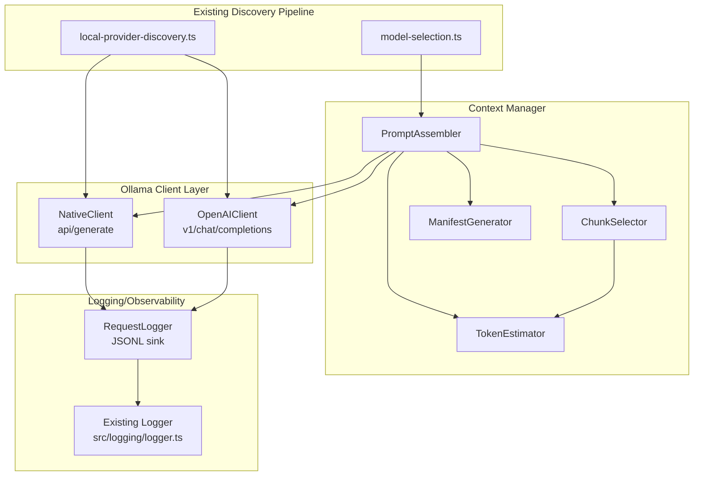

# Ollama Context Manager + Safer Client

## Architecture Overview



## Module Structure

All new code lives under `src/agents/ollama/` to integrate with existing provider architecture:

```
src/agents/ollama/
├── client/
│   ├── native.ts           # /api/generate wrapper (smoke tests, context stripping)
│   ├── openai.ts           # /v1/chat/completions wrapper (production)
│   ├── types.ts            # Shared response types
│   └── response-filter.ts  # Strip context array, normalize responses
├── context/
│   ├── token-estimator.ts  # Wraps existing estimateTokens with multiplier+reserve
│   ├── chunk-selector.ts   # Deterministic score-based chunk selection
│   ├── prompt-assembler.ts # Budget-aware prompt assembly with hard-fail
│   └── manifest.ts         # Manifest generation with provenance + prompt hash
├── logging/
│   └── request-logger.ts   # JSONL sink extending existing logger
├── index.ts                # Public API exports
└── smoke.ts                # Smoke test implementations
```

## Key Files to Modify/Create

### 1. Token Estimator ([src/agents/ollama/context/token-estimator.ts](src/agents/ollama/context/token-estimator.ts))

Reuses existing `estimateTokens` from `@mariozechner/pi-coding-agent` (already used in [src/agents/compaction.ts](src/agents/compaction.ts)):

```typescript
import { estimateTokens } from "@mariozechner/pi-coding-agent";
import { SAFETY_MARGIN } from "../compaction.js"; // Existing 1.2 multiplier

export interface TokenEstimatorConfig {
  multiplier?: number;        // Default: SAFETY_MARGIN (1.2 = 20% buffer)
  reserveTokens?: number;     // Default: 2000
  maxContextTokens?: number;  // Default: 32768 (from discovery or defaults.ts)
}

export function createTokenEstimator(config: TokenEstimatorConfig) {
  const { 
    multiplier = SAFETY_MARGIN, 
    reserveTokens = 2000, 
    maxContextTokens = 32768 
  } = config;
  const maxPromptTokens = maxContextTokens - reserveTokens;
  
  return {
    estimate: (text: string) => Math.ceil(estimateTokens(text) * multiplier),
    maxPromptTokens,
    maxContextTokens,
    reserveTokens,
    multiplier,
  };
}
```

### 2. Chunk Selector ([src/agents/ollama/context/chunk-selector.ts](src/agents/ollama/context/chunk-selector.ts))

Deterministic chunk selection with provenance tracking:

```typescript
export interface ContextChunk {
  id: string;                              // Stable ID (required, used for tie-breaking)
  text: string;
  source: string;                          // File path / doc ID
  provenance?: {
    page?: number;
    offsetStart?: number;
    offsetEnd?: number;
    blockName?: string;
  };
  score?: number;                          // Retrieval score (higher = better)
}

export type SelectionMode = "default" | "strict_provenance";

export interface SelectionResult {
  included: ContextChunk[];
  excluded: Array<{ chunk: ContextChunk; reason: string }>;
  totalTokens: number;
}

// Deterministic: sort by score desc, then by chunk.id asc for tie-breaking
export function selectChunks(
  chunks: ContextChunk[],
  budget: number,
  estimator: TokenEstimator,
  mode: SelectionMode = "default",
): SelectionResult;
```

### 3. Prompt Assembler ([src/agents/ollama/context/prompt-assembler.ts](src/agents/ollama/context/prompt-assembler.ts))

Hard-fail over budget with manifest and prompt hash:

```typescript
import { createHash } from "node:crypto";

export interface AssembleInput {
  system: string;
  instructions: string;
  userQuery: string;
  candidateChunks: ContextChunk[];
  budget?: number;                         // Override max tokens
}

export interface PromptManifest {
  promptHash: string;                      // SHA256 of assembled prompt
  systemTokens: number;
  instructionsTokens: number;
  userQueryTokens: number;
  includedChunks: Array<{
    id: string;
    source: string;
    tokens: number;
    provenance?: ContextChunk["provenance"];
  }>;
  excludedChunks: Array<{
    id: string;
    reason: string;
  }>;
  totalTokens: number;
  budgetTokens: number;
  withinBudget: boolean;
}

export interface AssembleResult {
  prompt: string;
  manifest: PromptManifest;
}

// HARD FAIL: throws OverBudgetError if totalTokens > budget
export function assemblePrompt(input: AssembleInput, estimator: TokenEstimator): AssembleResult;
```

### 4. Native Ollama Client ([src/agents/ollama/client/native.ts](src/agents/ollama/client/native.ts))

Wraps `/api/generate` with context array stripping by default:

```typescript
import type { ProviderConfig } from "../models-config.providers.js";

// Response with context array STRIPPED by default
export interface NativeOllamaResponse {
  response: string;
  done: boolean;
  done_reason?: string;
  eval_count?: number;
  prompt_eval_count?: number;
  total_duration?: number;
  load_duration?: number;
  prompt_eval_duration?: number;
  eval_duration?: number;
  // context: number[]  <-- STRIPPED unless includeContext=true
}

export interface NativeClientConfig {
  providerConfig: ProviderConfig;         // From discoverLocalOllama() return shape
  timeout?: number;                        // Default: 120000ms
  includeContext?: boolean;                // Default: false (MUST strip context array)
}

export function createNativeClient(config: NativeClientConfig): {
  generate: (params: GenerateParams) => Promise<NativeOllamaResponse>;
  ping: () => Promise<PingResult>;         // Uses /api/tags (native) + /v1/models (OpenAI)
};
```

### 5. OpenAI-Compatible Client ([src/agents/ollama/client/openai.ts](src/agents/ollama/client/openai.ts))

For production use via `/v1/chat/completions`:

```typescript
import type { ProviderConfig } from "../models-config.providers.js";

export interface OpenAIClientConfig {
  providerConfig: ProviderConfig;         // From discoverLocalOllama() - uses baseUrl
  timeout?: number;                        // Default: 120000ms
}

// Standard OpenAI-compatible response (no context array issue)
export function createOpenAIClient(config: OpenAIClientConfig): {
  chat: (params: ChatParams) => Promise<ChatResponse>;
  ping: () => Promise<PingResult>;         // Uses /v1/models
};
```

### 6. Request Logger ([src/agents/ollama/logging/request-logger.ts](src/agents/ollama/logging/request-logger.ts))

Extends existing logger with JSONL sink for Ollama requests:

```typescript
import { getLogger } from "../../logging/logger.js";
import fs from "node:fs";
import path from "node:path";

// Log directory: ~/.clawdbot/logs/ollama/
export interface RequestLogEntry {
  timestamp: string;          // ISO8601
  requestId: string;          // UUID
  model: string;
  tokenEstimate: number;
  actualPromptTokens?: number;
  promptHash: string;         // SHA256 of assembled prompt
  chunkManifest: Array<{
    id: string;
    source: string;
    tokens: number;
    included: boolean;
    reason?: string;
  }>;
  responseMetadata: {
    done: boolean;
    doneReason?: string;
    evalCount?: number;
    promptEvalCount?: number;
    durationMs?: number;
  };
  error?: {
    code: string;
    message: string;
    stack?: string;
  };
}

export function createRequestLogger(logDir?: string): {
  log: (entry: RequestLogEntry) => void;
  flush: () => Promise<void>;
};
```

### 7. Smoke Tests ([src/commands/ollama-smoke.ts](src/commands/ollama-smoke.ts))

Register as `moltbot ollama smoke [test]`:

```typescript
// smoke:ping - Uses /api/tags (native) AND /v1/models (OpenAI-compat)
//   Reports: { native: boolean, openai: boolean, models: string[] }

// smoke:truncate - Send 40k "A " tokens via /api/generate
//   Assert: prompt_eval_count <= 32768 (Ollama truncates to ctx window)
//   Assert: done_reason === "length" or response is non-empty

// smoke:guard - Attempt 200k tokens
//   Assert: OverBudgetError thrown BEFORE HTTP call
//   Assert: No network request made (verify via request logger)
```

### 8. Integration with Existing Pipeline

Wire into existing discovery via [src/agents/local-provider-discovery.ts](src/agents/local-provider-discovery.ts):

```typescript
// In local-provider-discovery.ts or new integration file:
import { createTokenEstimator } from "./ollama/context/token-estimator.js";
import { createNativeClient, createOpenAIClient } from "./ollama/client/index.js";

// Use ProviderConfig from discoverLocalOllama() return shape
// DO NOT duplicate OLLAMA_API_BASE_URL - use providerConfig.baseUrl
export function createOllamaContextManager(providerConfig: ProviderConfig) {
  const contextWindow = providerConfig.models?.[0]?.contextWindow ?? 32768;
  const estimator = createTokenEstimator({ maxContextTokens: contextWindow });
  
  // baseUrl from discovery: "http://127.0.0.1:11434/v1" (OpenAI-compat)
  // Native API: strip /v1 suffix -> "http://127.0.0.1:11434"
  const nativeBaseUrl = providerConfig.baseUrl.replace(/\/v1$/, "");
  
  return {
    estimator,
    nativeClient: createNativeClient({ providerConfig: { ...providerConfig, baseUrl: nativeBaseUrl } }),
    openaiClient: createOpenAIClient({ providerConfig }),
  };
}
```

## Testing Strategy

- Unit tests for token estimator boundary cases (colocated `*.test.ts`)
- Unit tests for chunk selection ordering/determinism (verify same input = same output)
- Unit tests for prompt assembler budget enforcement (verify hard-fail)
- Unit tests for response filter (verify context array stripped)
- Integration tests for native client (mock fetch)
- E2E smoke tests (require running Ollama, skip in CI unless `CLAWDBOT_TEST_LOCAL_DISCOVERY=1`)

## Documentation

Create [docs/context_manager.md](docs/context_manager.md) covering:

1. **Token Budgeting Rules** - multiplier (1.2), reserve (2000), maxPromptTokens calculation
2. **Chunk Selection Strategy** - score desc, tie-break by ID, strict_provenance mode
3. **Logging Format** - JSONL schema, manifest structure, prompt hash
4. **Failure Modes** - OverBudgetError (hard fail), Ollama HTTP errors, timeout handling
5. **Integration Guide** - using with existing agent system via ProviderConfig

## Files from Existing Codebase to Reference

- [src/agents/local-provider-discovery.ts](src/agents/local-provider-discovery.ts) - ProviderConfig shape, discoverLocalOllama(), MINIMUM_CONTEXT_WINDOW
- [src/agents/compaction.ts](src/agents/compaction.ts) - estimateTokens usage, SAFETY_MARGIN (1.2)
- [src/agents/defaults.ts](src/agents/defaults.ts) - DEFAULT_CONTEXT_TOKENS (32768), MINIMUM_CONTEXT_TOKENS (16000)
- [src/logging/logger.ts](src/logging/logger.ts) - JSONL logging patterns, DEFAULT_LOG_DIR
- [src/cli/program/command-registry.ts](src/cli/program/command-registry.ts) - CLI registration pattern

