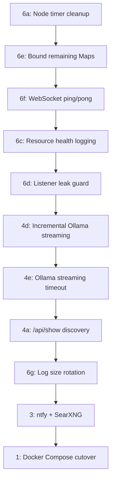

# Gateway Stability Plan -- Review and Recommended Updates

## Status Changes Needed

### Items to mark COMPLETED

**Phase 4c (model fallback chain)** is currently marked `pending` but is fully implemented:

- Schema in `[src/config/zod-schema.agent-defaults.ts](src/config/zod-schema.agent-defaults.ts)` (lines 17-23): `agents.defaults.model.primary` + `agents.defaults.model.fallbacks`
- Runtime in `[src/agents/model-fallback.ts](src/agents/model-fallback.ts)`: `resolveFallbackCandidates()` and `runWithModelFallback()` are both implemented

**Phase 6b (channel abort cleanup)** is effectively implemented. The `.finally()` block in `[src/gateway/server-channels.ts](src/gateway/server-channels.ts)` (lines 253-260) cleans up both `store.tasks` and `store.aborts` when any channel task completes, including crashes. `stopChannel` also aborts and deletes. This could be marked complete or downgraded to a minor edge-case hardening item.

### Older plans to deprecate

The two older plan files are fully superseded by the consolidated plan:

- `phased_stability_refactor_c67b81a1.plan.md` (original plan)
- `phased_stability_refactor_8246eb55.plan.md` (Feb 15 review)

Their todos are stale (e.g., Phase 2 still marked pending, Phase 4c still pending). Recommend deleting or adding a "DEPRECATED: see gateway_stability_plan" header.

---

## Items Still Pending (Confirmed)

These remain valid and unimplemented:

- **Phase 6a** -- Node presence timer cleanup on disconnect. Confirmed: `nodePresenceTimers` in `[src/gateway/server.impl.ts](src/gateway/server.impl.ts)` are not cleaned up when a node disconnects in `[src/gateway/server/ws-connection.ts](src/gateway/server/ws-connection.ts)` (line 245). Timers only cleared on full shutdown in `[src/gateway/server-close.ts](src/gateway/server-close.ts)`.
- **Phase 6c** -- Resource health logging. The maintenance timer in `[src/gateway/server-maintenance.ts](src/gateway/server-maintenance.ts)` does cleanup but logs nothing about Map sizes or heap usage.
- **Phase 6d** -- Event listener leak guard. Both `[src/infra/agent-events.ts](src/infra/agent-events.ts)` and `[src/infra/heartbeat-events.ts](src/infra/heartbeat-events.ts)` have no size cap on their listener Sets.
- **Phase 4d** -- Incremental Ollama streaming. `[src/agents/ollama-stream.ts](src/agents/ollama-stream.ts)` (lines 347-394) still accumulates the entire response before emitting a single `done` event. No `text-delta` events during generation.
- **Phase 4a** -- `/api/show` discovery. `[src/agents/models-config.providers.ts](src/agents/models-config.providers.ts)` only calls `/api/tags` and hardcodes `contextWindow: 128000`.
- **Phase 3** -- ntfy + SearXNG. No code written.
- **Phase 1** -- Docker Compose. No files created.

---

## New Items to Add

The codebase exploration uncovered several stability gaps not covered by the current plan:

### Phase 6e (NEW): Bound remaining unbounded Maps

Six Maps/Sets in the gateway grow without size limits:

1. `**costUsageCache` in `[src/gateway/server-methods/usage.ts](src/gateway/server-methods/usage.ts)` -- has TTL but no size cap
2. `**nodeSubscriptions` / `sessionSubscribers` in `[src/gateway/server-node-subscriptions.ts](src/gateway/server-node-subscriptions.ts)` -- no size limit or TTL
3. `**channelStores` in `[src/gateway/server-channels.ts](src/gateway/server-channels.ts)` -- grows per channel, never shrinks
4. `**wsInflightOptimized` in `[src/gateway/ws-log.ts](src/gateway/ws-log.ts)` -- clears all at 2000 instead of evicting oldest
5. `**hookAuthFailures` in `[src/gateway/server-http.ts](src/gateway/server-http.ts)` -- no size limit or TTL
6. `**restartAttempts` in `[src/gateway/server-channels.ts](src/gateway/server-channels.ts)` -- could accumulate

These are lower-risk than Phase 6a but should be bounded for defense-in-depth.

### Phase 6f (NEW): WebSocket ping/pong for node connections

Currently no WebSocket-level ping/pong frames in `[src/gateway/server/ws-connection.ts](src/gateway/server/ws-connection.ts)`. The 30s tick provides application-level keepalive, but half-open TCP connections (node crashes without FIN) are only detected by slow TCP timeouts. Adding `ws.ping()` every 30-60s with a pong timeout would detect dead connections in under a minute instead of minutes-to-hours.

### Phase 4e (NEW): Ollama streaming timeout guard

The streaming fetch in `[src/agents/ollama-stream.ts](src/agents/ollama-stream.ts)` (line 331) uses `options?.signal` but has no explicit timeout. If the signal is undefined or the Ollama Cloud endpoint hangs mid-stream, the request blocks indefinitely. Add a timeout (e.g., 120s) wrapping the streaming fetch, especially for cloud endpoints.

### Phase 6g (NEW): Size-based log rotation

`[src/logging/logger.ts](src/logging/logger.ts)` does daily date-based rotation and prunes files older than 24h, but a single day's log has no size cap. Under high volume, a single day's log could consume significant disk. Add size-based rotation (e.g., rotate at 50-100MB).

---

## Suggested Updated Priority Order

**Tier 1 -- Immediate (leak/crash hardening):** 6a, 6e, 6f, 6c, 6d
**Tier 2 -- Soon (responsiveness):** 4d, 4e, 4a
**Tier 3 -- Quality of life:** 6g, 3
**Tier 4 -- Final infra:** 1

---

## Summary of Changes to Make to the Plan

- Mark **Phase 4c** completed
- Mark **Phase 6b** completed (or note as "effectively done, edge cases only")
- Add **Phase 6e** (bound unbounded Maps)
- Add **Phase 6f** (WebSocket ping/pong)
- Add **Phase 4e** (Ollama streaming timeout)
- Add **Phase 6g** (log size rotation)
- Deprecate or archive the two older `phased_stability_refactor` plan files
- Update the flowchart and priority tiers
