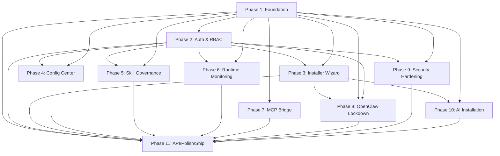

# OCCC Agent Roadmap

> Master reference for the agent-driven automation pipeline that implements the OpenClaw Command Center.
> All agents reference this document for phase-to-sprint mapping, dependency ordering, and handoff protocol.

**Last Updated**: 2026-02-23

---

## Pipeline Flow

Each sprint follows this exact cycle. Handoff buttons in VS Code (`.agent.md` `handoffs:` frontmatter) drive transitions. The human operator reviews at step 6 before proceeding.

```
Sprint Planner ──[handoff]──► Architect ──[handoff]──► Developer(s)
                                                           │
                                                     [handoff]
                                                           ▼
                                 Sprint Planner ◄── Tester ◄── Reviewer
                                       │             ▲           │
                                       │             └── [fix] ──┘
                                 [next sprint]
                                       │
                                 *** HUMAN GATE ***
                                 (send: false — user must
                                  review diffs before proceeding)
```

### Step-by-Step

1. **`occc-sprint-planner`** reads `OCCC_SPRINT_TRACKER.md`, identifies next phase, creates GitHub issue(s), hands off to architect
2. **`occc-architect`** reads Implementation Plan + existing code, produces scoped design doc (read-only — no code changes), hands off to developer
3. **`occc-{domain}-dev`** implements per architect's design, commits via `scripts/committer`, hands off to reviewer
4. **`occc-reviewer`** reviews code (read-only), outputs structured findings, hands off to tester (if READY) or back to developer (if BLOCKER)
5. **`occc-tester`** runs `pnpm tsgo && pnpm check && pnpm test`, hands off to sprint planner (if PASS) or back to developer (if FAIL)
6. **HUMAN REVIEW GATE** — user reviews all diffs in VS Code, accepts or sends feedback
7. **`occc-sprint-planner`** updates tracker (`status → done`), invokes existing `run-pr` pipeline for merge, hands off to next sprint

---

## Agent Inventory

| Agent | File | Role | Read-Only | Phases |
|-------|------|------|-----------|--------|
| `occc-sprint-planner` | `occc-sprint-planner.agent.md` | Orchestrator hub | No (edits tracker) | All |
| `occc-architect` | `occc-architect.agent.md` | Solution architect | **Yes** | All |
| `occc-electron-dev` | `occc-electron-dev.agent.md` | Electron main process | No | 1, 3, 6, 7, 10, 11 |
| `occc-react-dev` | `occc-react-dev.agent.md` | React renderer UI | No | 3, 4, 5, 6, 10, 11 |
| `occc-security-dev` | `occc-security-dev.agent.md` | Auth, RBAC, security | No | 2, 5, 9 |
| `occc-docker-dev` | `occc-docker-dev.agent.md` | Docker, containers | No | 1, 3, 9 |
| `occc-lockdown-dev` | `occc-lockdown-dev.agent.md` | Core OpenClaw changes | No | 8 |
| `occc-reviewer` | `occc-reviewer.agent.md` | Code review | **Yes** | All |
| `occc-tester` | `occc-tester.agent.md` | Testing, verification | No | All |
| `occc-docs` | `occc-docs.agent.md` | Documentation | No | 11 |

---

## Sprint-to-Agent Mapping

| Sprint | Phase(s) | Architect | Primary Developer | Secondary Developer | Reviewer | Tester |
|--------|----------|-----------|-------------------|--------------------|---------|----|
| 1 | 1: Foundation | occc-architect | occc-electron-dev | occc-docker-dev | occc-reviewer | occc-tester |
| 2 | 2: Auth & RBAC | occc-architect | occc-security-dev | — | occc-reviewer | occc-tester |
| 3 | 3: Installer Wizard | occc-architect | occc-electron-dev | occc-react-dev | occc-reviewer | occc-tester |
| 4 | 4: Config Center | occc-architect | occc-react-dev | — | occc-reviewer | occc-tester |
| 5 | 5: Skill Governance | occc-architect | occc-security-dev | occc-react-dev | occc-reviewer | occc-tester |
| 6 | 6: Runtime Monitoring | occc-architect | occc-react-dev | occc-electron-dev | occc-reviewer | occc-tester |
| 7 | 7: MCP Bridge | occc-architect | occc-electron-dev | — | occc-reviewer | occc-tester |
| 8 | 8: OpenClaw Lockdown | occc-architect | occc-lockdown-dev | — | occc-reviewer | occc-tester |
| 9 | 9: Security Hardening | occc-architect | occc-security-dev | occc-docker-dev | occc-reviewer | occc-tester |
| 10 | 10: AI Installation | occc-architect | occc-react-dev | occc-electron-dev | occc-reviewer | occc-tester |
| 11 | 11: API/Polish/Ship | occc-architect | occc-electron-dev | occc-react-dev + occc-docs | occc-reviewer | occc-tester |

---

## Phase Dependency Graph



---

## Output Contracts

Every implementing agent MUST end its response with a `## Next Step` block:

```markdown
## Next Step

Phase <N> implementation complete. Now invoke **occc-reviewer** to review:

Select the `Review Code` handoff button, or invoke manually:

    Switch to the `occc-reviewer` agent and send:
    Review Phase <N> (<description>) implementation in apps/command-center/src/<domain>/.
    Check for: <specific concerns>.
```

Every reviewer MUST end with either:

```markdown
## Next Step — READY FOR TESTING

    Switch to the `occc-tester` agent and send:
    Test Phase <N> implementation. Run: pnpm tsgo && pnpm check && pnpm test apps/command-center/
```

Or:

```markdown
## Next Step — NEEDS FIXES

    Switch to the `occc-<domain>-dev` agent and send:
    Fix review findings: <list of issues>
```

---

## Key Files Reference

| Need | Location |
|------|----------|
| Implementation Plan | `Implementation Plan` (repo root) |
| Sprint Tracker | `apps/command-center/OCCC_SPRINT_TRACKER.md` |
| This Roadmap | `apps/command-center/OCCC_AGENT_ROADMAP.md` |
| IPC Types | `apps/command-center/src/shared/ipc-types.ts` |
| Main Process Entry | `apps/command-center/src/main/index.ts` |
| Shared Constants | `apps/command-center/src/shared/constants.ts` |
| Forge Config | `apps/command-center/forge.config.ts` |
| Existing Zod Schemas | `src/config/zod-schema.ts` |
| Skill Scanner | `src/security/skill-scanner.ts` |
| Gateway Protocol | `src/gateway/protocol/` |
| Gateway Auth | `src/gateway/auth.ts` |
| Sandbox Validator | `src/agents/sandbox/validate-sandbox-security.ts` |

---

## Conventions (Inherited from OpenClaw)

- TypeScript ESM, `.js` extensions on local imports, `import type` for type-only
- No `any` — strict types throughout
- Files < 700 LOC — extract helpers when needed
- Commits via `scripts/committer "<msg>" <file...>` — never raw `git add`/`git commit`
- Lint/format: `pnpm check` must pass
- Tests: colocated `*.test.ts`, Vitest, V8 coverage
- Electron-specific: `contextIsolation: true`, `sandbox: true`, typed preload IPC only
