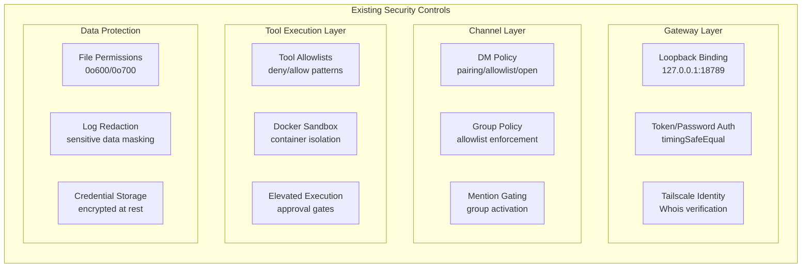
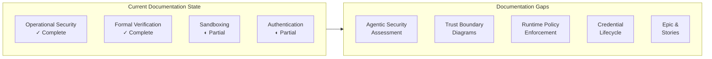
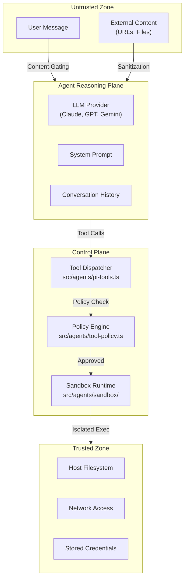
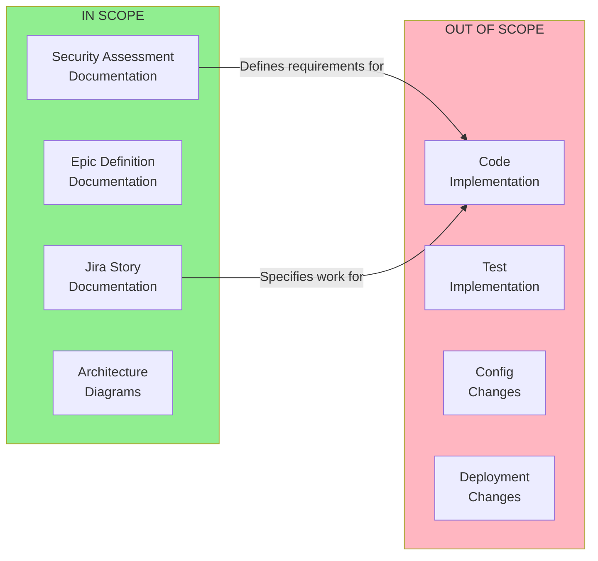

# Technical Specification

# 0. Agent Action Plan

## 0.1 Intent Clarification

### 0.1.1 Core Documentation Objective

Based on the provided requirements, the Blitzy platform understands that the documentation objective is to **create comprehensive security assessment documentation** for the OpenClaw agentic system, specifically addressing seven critical agentic-security failure modes. This documentation task encompasses three distinct deliverables:

**Documentation Category:** Create new documentation
**Documentation Type:** Security Assessment Report + Project Management Artifacts (Epic/Stories)

**User Requirements with Enhanced Clarity:**

| Requirement | Interpretation | Technical Documentation Approach |
|-------------|----------------|----------------------------------|
| Security report for 7 failure modes | Comprehensive threat analysis documentation for each agentic security concern | Create `docs/security/agentic-security-assessment.md` with detailed risk analysis, current state assessment, target architecture, and runtime controls |
| Epic definition for remediation | Project-level security initiative documentation | Create `docs/security/security-epic.md` capturing problem statement, objectives, success criteria, and scope boundaries |
| Jira stories per concern | Execution-ready work breakdown documentation | Create `docs/security/stories/*.md` files with implementation-ready stories grouped by security concern |

**Implicit Documentation Needs Identified:**

Based on code analysis of the OpenClaw repository, the following implicit documentation gaps exist:

- **Architecture Decision Records (ADRs)** for security-critical design choices (agent/control plane separation, tool execution sandboxing)
- **Trust Boundary Diagrams** documenting the flow of untrusted content through the system
- **Runtime Policy Documentation** explaining the enforcement mechanisms for tool execution
- **Credential Lifecycle Documentation** capturing token rotation, session management, and OAuth refresh policies
- **Sandboxing Implementation Guide** for the Docker-based isolation system in `src/agents/sandbox/`

### 0.1.2 Special Instructions and Constraints

**CRITICAL Directives Captured:**

| Directive | Implementation Requirement |
|-----------|---------------------------|
| "Do not assume humans will manually intervene" | All remediation must be documented with enforceable automation, not manual procedures |
| "Do not rely on best practices without implementation detail" | Every recommendation must include specific file paths, configuration changes, and code patterns |
| "All remediation must be enforceable by the system itself" | Focus on architectural controls, policy engines, and runtime guards rather than process documentation |
| "Prefer architectural fixes over procedural ones" | Document structural changes to codebase over operational runbooks |

**Output Format Requirements:**

1. **Executive Security Summary** - High-level risk overview and remediation priorities
2. **Detailed Findings** - One section per security concern with:
   - Risk description and attack classes
   - Current architecture assessment with specific file citations
   - Target secure architecture definition
   - Runtime control specifications
3. **Security Remediation Epic** - Single epic with measurable success criteria
4. **Jira Stories** - Grouped by concern, execution-ready with acceptance criteria

**Template/Style Requirements:**

- Follow existing documentation style in `docs/gateway/security/index.md`
- Use Mermaid diagrams for architecture and trust boundary visualization
- Include source code citations in format: `Source: /path/to/file.ts:LineNumber`
- Structure tables for controls, findings, and story metadata

### 0.1.3 Technical Interpretation

These documentation requirements translate to the following technical documentation strategy:

**To document the 7 agentic-security failure modes**, we will create a comprehensive security assessment document (`docs/security/agentic-security-assessment.md`) that:

- Maps each failure mode to specific components in the OpenClaw codebase
- Identifies trust boundaries in `src/gateway/`, `src/agents/`, and `src/security/`
- Documents the current mitigation status based on existing controls in `src/security/audit.ts`
- Specifies target architectures with Mermaid diagrams
- Defines runtime enforcement requirements

**To create the Security Remediation Epic**, we will produce `docs/security/security-epic.md` that:

- Consolidates all 7 failure modes into a unified problem statement
- Defines measurable security objectives (quantifiable reduction in attack surface)
- Establishes success criteria that can be verified through automated testing
- Explicitly scopes out non-security changes

**To generate Jira-ready stories**, we will create individual story files in `docs/security/stories/` that:

- Are small enough for autonomous execution by Blitzy
- Include concrete acceptance criteria with testable assertions
- Specify verification methods (unit tests, integration tests, security audits)
- Map to specific source files and configuration changes

### 0.1.4 Inferred Documentation Needs

Based on repository analysis, the following documentation needs are inferred:

**Based on code analysis:**

| Module | Finding | Documentation Need |
|--------|---------|-------------------|
| `src/gateway/server-http.ts` | Exposes HTTP/WebSocket endpoints with configurable authentication | Document trust boundaries for each endpoint type |
| `src/agents/pi-embedded-runner.ts` | Executes AI model interactions with tool calling | Document separation between reasoning and execution planes |
| `src/agents/bash-tools.exec.ts` | Implements shell command execution | Document execution guardrails and approval gates |
| `src/security/external-content.ts` | Contains prompt injection detection | Document content gating policies and detection patterns |
| `src/agents/sandbox/` | Implements Docker-based isolation | Document isolation boundaries and escape prevention |
| `src/config/types.auth.ts` | Defines credential management types | Document token lifecycle and rotation policies |
| `src/plugins/` | Manages third-party extension loading | Document plugin trust verification and allowlisting |

**Based on structure:**

- Feature spans multiple files requiring consolidated security documentation:
  - Tool execution path: `src/agents/tool-policy.ts` → `src/agents/bash-tools.exec.ts` → `src/agents/sandbox/`
  - Authentication flow: `src/gateway/auth.ts` → `src/gateway/device-auth.ts` → `src/config/types.auth.ts`
  - Policy enforcement: `src/sessions/send-policy.ts` → `src/security/audit.ts`

**Based on dependencies:**

- Integration between Gateway and Agent Runtime requires interface documentation for security handoffs
- Plugin system requires trust boundary documentation for third-party code execution

**Based on user journey:**

- New security feature implementation requires:
  - Risk assessment guide
  - Architecture decision template
  - Implementation verification checklist
  - Incident response runbook updates

## 0.2 Documentation Discovery and Analysis

### 0.2.1 Existing Documentation Infrastructure Assessment

**Repository analysis reveals a Mintlify/Jekyll-based documentation structure with partial security coverage:**

| Documentation Component | Status | Location |
|------------------------|--------|----------|
| Documentation Framework | Mintlify | `docs/docs.json`, `docs/_config.yml` |
| Security Policy | Exists (basic) | `SECURITY.md` |
| Operational Security Guide | Exists (comprehensive) | `docs/gateway/security/index.md` |
| Formal Verification Docs | Exists | `docs/security/formal-verification.md` |
| Agentic Security Assessment | **MISSING** | Target: `docs/security/agentic-security-assessment.md` |
| Security Epic/Stories | **MISSING** | Target: `docs/security/stories/` |

**Documentation Generator Configuration:**

```
Current Framework: Mintlify with Jekyll fallback
Configuration: docs/docs.json (navigation, redirects, theming)
Theme: "mint" with custom branding colors (#FF5A36)
Navigation Groups: 14 groups including "Gateway & Ops" containing security pages
```

**Existing Security Documentation Structure:**

```
docs/
├── security/
│   └── formal-verification.md          # TLA+/TLC security models
├── gateway/
│   └── security/
│       ├── index.md                    # Operational security guide
│       └── formal-verification.md       # (symlink/duplicate)
└── [other sections]
```

### 0.2.2 Repository Code Analysis for Documentation

**Search patterns used for security-relevant code to document:**

| Pattern | Target | Files Found |
|---------|--------|-------------|
| `src/security/**/*.ts` | Core security modules | `audit.ts`, `audit-extra.ts`, `audit-fs.ts`, `external-content.ts`, `fix.ts`, `windows-acl.ts` |
| `src/gateway/auth*.ts` | Authentication handlers | `auth.ts`, `device-auth.ts` |
| `src/agents/sandbox/**/*.ts` | Sandbox implementation | 17 files including `config.ts`, `context.ts`, `docker.ts` |
| `src/agents/tool-policy*.ts` | Tool execution policies | `tool-policy.ts`, `sandbox/tool-policy.ts` |
| `src/plugins/**/*.ts` | Plugin trust system | `enable.ts`, `loader.ts`, `manifest.ts` |
| `src/sessions/send-policy.ts` | Authorization policies | `send-policy.ts` |

**Key directories examined:**

| Directory | Security Relevance | Documentation Status |
|-----------|-------------------|---------------------|
| `src/security/` | Core audit and remediation | Partially documented in `docs/gateway/security/` |
| `src/gateway/` | Control plane, authentication | Well documented |
| `src/agents/` | Agent runtime, tool execution | Sandbox docs exist, tool execution gaps |
| `src/plugins/` | Third-party code execution | Basic plugin docs exist |
| `src/sessions/` | Session management, authorization | Basic concept docs exist |
| `src/config/types.auth.ts` | Credential lifecycle | Undocumented |

**Related documentation found:**

| Document | Relevance | Gap Identified |
|----------|-----------|----------------|
| `docs/gateway/security/index.md` | Operational security | Missing agentic-specific failure modes |
| `docs/gateway/sandboxing.md` | Container isolation | Missing security threat model |
| `docs/gateway/authentication.md` | Gateway auth | Missing credential lifecycle |
| `docs/tools/elevated.md` | Elevated execution | Missing approval workflow details |
| `SECURITY.md` | Disclosure policy | Missing architectural security guidance |

### 0.2.3 Web Search Research Conducted

**Research Topics for Documentation Best Practices:**

| Topic | Purpose | Application |
|-------|---------|-------------|
| OWASP Agentic AI Security Guidelines | Framework alignment | Structure security assessment sections |
| LLM Security Threat Modeling | Industry patterns | Document attack vectors specific to agentic systems |
| Container Security Documentation Standards | Isolation docs | Document sandbox security boundaries |
| API Security Documentation Patterns | Control surface docs | Document WebSocket/HTTP endpoint security |
| Zero Trust Architecture Documentation | Trust boundary docs | Document control plane separation |

**Key Industry Standards Referenced:**

- OWASP Top 10:2025 for Agentic Systems (emerging)
- NIST AI Risk Management Framework
- MITRE ATLAS (Adversarial Threat Landscape for AI Systems)
- CWE entries for prompt injection and command injection

### 0.2.4 Current Security Control Inventory

Based on analysis of `src/security/audit.ts` and related modules:

**Existing Security Controls:**



**Security Audit Check Categories (from `src/security/audit.ts`):**

| Category | Checks Performed | Current Coverage |
|----------|------------------|------------------|
| Filesystem | Permissions, symlinks, world-readable files | Complete |
| Gateway | Bind address, auth config, TLS, Control UI | Complete |
| Channels | DM policies, group policies, allowlists | Complete |
| Browser | CDP exposure, remote control settings | Complete |
| Tools | Elevated permissions, sandbox status | Partial |
| Plugins | Trust verification, allowlist enforcement | Partial |
| Models | Legacy model detection, hygiene checks | Complete |
| **Agent Reasoning** | **Not assessed** | **MISSING** |
| **Runtime Policy** | **Not assessed** | **MISSING** |
| **Credential Lifecycle** | **Not assessed** | **MISSING** |

## 0.3 Documentation Scope Analysis

### 0.3.1 Code-to-Documentation Mapping

**Security Concern 1: Lack of Separation Between Agent Reasoning and Control Plane**

| Source Component | Current Documentation | Documentation Gap |
|-----------------|----------------------|-------------------|
| `src/agents/pi-embedded-runner.ts` | None | Agent reasoning flow documentation |
| `src/agents/pi-embedded-subscribe.ts` | None | Message/reasoning stream handling |
| `src/gateway/server-methods.ts` | Protocol docs | Control plane boundary documentation |
| `src/gateway/server-chat.ts` | None | Chat dispatch security model |

**Security Concern 2: Internet-Exposed Control Surfaces**

| Source Component | Current Documentation | Documentation Gap |
|-----------------|----------------------|-------------------|
| `src/gateway/server-http.ts` | Basic gateway docs | Endpoint security matrix |
| `src/gateway/control-ui.ts` | Control UI docs | Authentication bypass risks |
| `src/gateway/openai-http.ts` | API docs | HTTP API security hardening |
| `src/gateway/hooks.ts` | Hooks docs | Hook endpoint exposure risks |

**Security Concern 3: Untrusted Inputs Influencing Tool Execution**

| Source Component | Current Documentation | Documentation Gap |
|-----------------|----------------------|-------------------|
| `src/security/external-content.ts` | None | Prompt injection detection docs |
| `src/agents/bash-tools.exec.ts` | Exec tool docs | Command injection prevention |
| `src/agents/pi-tools.ts` | None | Tool input validation docs |
| `src/gateway/chat-sanitize.ts` | None | Input sanitization policies |

**Security Concern 4: Over-Privileged, Long-Lived Credentials**

| Source Component | Current Documentation | Documentation Gap |
|-----------------|----------------------|-------------------|
| `src/config/types.auth.ts` | None | Credential type documentation |
| `src/agents/auth-profiles.ts` | None | Profile rotation documentation |
| `src/gateway/session-utils.ts` | Session docs | Session lifecycle security |
| `src/pairing/pairing-store.ts` | Pairing docs | Pairing code security model |

**Security Concern 5: Missing Runtime Policy Enforcement**

| Source Component | Current Documentation | Documentation Gap |
|-----------------|----------------------|-------------------|
| `src/agents/tool-policy.ts` | Basic tool docs | Policy enforcement documentation |
| `src/sessions/send-policy.ts` | None | Send policy rule documentation |
| `src/gateway/node-command-policy.ts` | None | Node command policies |
| `src/agents/sandbox/tool-policy.ts` | Sandbox docs | Sandbox tool policy docs |

**Security Concern 6: Insufficient Runtime Isolation**

| Source Component | Current Documentation | Documentation Gap |
|-----------------|----------------------|-------------------|
| `src/agents/sandbox/config.ts` | Sandbox docs | Isolation boundary documentation |
| `src/agents/sandbox/docker.ts` | Basic Docker docs | Container security hardening |
| `src/agents/sandbox/context.ts` | None | Runtime context isolation |
| `src/agents/bash-tools.exec.ts` | Exec docs | Host access restrictions |

**Security Concern 7: Security as Deployment Hygiene**

| Source Component | Current Documentation | Documentation Gap |
|-----------------|----------------------|-------------------|
| `src/security/audit.ts` | Security guide | Design-time security integration |
| `src/security/fix.ts` | Security guide | Automated remediation docs |
| `src/config/` | Config docs | Secure-by-default configuration |
| CI/CD pipeline | None | Security scanning integration |

### 0.3.2 Documentation Gap Analysis

**Given the requirements and repository analysis, documentation gaps include:**



**Undocumented Public APIs Requiring Security Documentation:**

| API Surface | Location | Security Documentation Need |
|-------------|----------|----------------------------|
| WebSocket RPC Methods | `src/gateway/server-methods-list.ts` | Method-level authorization matrix |
| HTTP Endpoints | `src/gateway/server-http.ts` | Endpoint authentication requirements |
| Plugin HTTP Routes | `src/plugins/http-registry.ts` | Plugin route security policies |
| Tool Execution API | `src/agents/pi-tools.ts` | Tool invocation security model |
| Hook Endpoints | `src/gateway/hooks.ts` | Hook execution security boundaries |

**Missing User Guides:**

| Feature | Current Coverage | Gap |
|---------|------------------|-----|
| Agentic Security Hardening | None | Full guide needed |
| Credential Rotation | None | Operational guide needed |
| Runtime Policy Configuration | Basic | Advanced policy examples |
| Incident Response | Basic | Agentic-specific procedures |

**Incomplete Architecture Documentation:**

| Area | Current State | Required |
|------|---------------|----------|
| Agent/Control Plane Separation | Undocumented | Full architecture diagram with trust boundaries |
| Tool Execution Flow | Partial | End-to-end security flow documentation |
| Credential Trust Chain | Undocumented | Token lifecycle and rotation documentation |
| Plugin Security Model | Basic | Comprehensive trust verification documentation |

### 0.3.3 Security Concern Mapping to Source Files

**Complete Mapping of Security Concerns to Affected Components:**

| Security Concern | Primary Source Files | Test Files | Config Files |
|-----------------|---------------------|------------|--------------|
| 1. Agent/Control Plane | `src/agents/pi-embedded-runner.ts`, `src/gateway/server-methods.ts` | `src/agents/pi-embedded-runner.test.ts` | N/A |
| 2. Exposed Surfaces | `src/gateway/server-http.ts`, `src/gateway/control-ui.ts`, `src/gateway/openai-http.ts` | `src/gateway/server.auth.e2e.test.ts` | `gateway.bind`, `gateway.controlUi` |
| 3. Prompt Injection | `src/security/external-content.ts`, `src/agents/bash-tools.exec.ts` | `src/security/external-content.test.ts` | `tools.elevated` |
| 4. Credentials | `src/agents/auth-profiles.ts`, `src/config/types.auth.ts`, `src/gateway/session-utils.ts` | `src/agents/auth-profiles.*.test.ts` | `authProfiles`, `dmScope` |
| 5. Runtime Policy | `src/agents/tool-policy.ts`, `src/sessions/send-policy.ts` | `src/agents/tool-policy.test.ts`, `src/sessions/send-policy.test.ts` | `tools.policy`, `sessions.sendPolicy` |
| 6. Runtime Isolation | `src/agents/sandbox/**/*.ts`, `src/agents/bash-tools.exec.ts` | `src/agents/sandbox/*.test.ts` | `sandbox.*` |
| 7. Security as System Property | `src/security/audit.ts`, `src/security/fix.ts` | `src/security/audit.test.ts`, `src/security/fix.test.ts` | All security-related configs |

## 0.4 Documentation Implementation Design

### 0.4.1 Documentation Structure Planning

**Documentation Hierarchy:**

```
docs/
├── security/
│   ├── agentic-security-assessment.md     # Main security report
│   │   ├── Executive Summary
│   │   ├── Concern 1: Agent/Control Plane Separation
│   │   ├── Concern 2: Internet-Exposed Control Surfaces
│   │   ├── Concern 3: Prompt Injection Risks
│   │   ├── Concern 4: Credential Management
│   │   ├── Concern 5: Runtime Policy Enforcement
│   │   ├── Concern 6: Runtime Isolation
│   │   └── Concern 7: Security as System Property
│   │
│   ├── security-epic.md                    # Epic definition
│   │   ├── Epic Name & Problem Statement
│   │   ├── Security Objectives
│   │   ├── Success Criteria
│   │   └── Out-of-Scope Items
│   │
│   ├── stories/
│   │   ├── concern-1-agent-control-plane.md
│   │   ├── concern-2-exposed-surfaces.md
│   │   ├── concern-3-prompt-injection.md
│   │   ├── concern-4-credentials.md
│   │   ├── concern-5-runtime-policy.md
│   │   ├── concern-6-runtime-isolation.md
│   │   └── concern-7-security-system-property.md
│   │
│   └── formal-verification.md              # (existing)
│
├── gateway/
│   └── security/
│       └── index.md                        # (existing, to be updated)
│
└── docs.json                               # Navigation update required
```

### 0.4.2 Content Generation Strategy

**Information Extraction Approach:**

| Information Source | Extraction Method | Target Section |
|-------------------|-------------------|----------------|
| `src/security/audit.ts` | Parse audit check definitions | Current Architecture Assessment |
| `src/gateway/server-methods-list.ts` | Extract RPC method manifest | Control Surface Documentation |
| `src/agents/tool-policy.ts` | Parse tool groups and policies | Runtime Policy Documentation |
| `src/agents/sandbox/config.ts` | Extract sandbox configuration | Isolation Boundary Documentation |
| `src/config/types.*.ts` | Parse TypeScript types | Configuration Reference |
| Test files (`*.test.ts`) | Extract test scenarios | Verification Method Documentation |

**Template Application for Security Concerns:**

Each security concern section will follow this structure:

```
## Concern N: [Title]

#### Risk Description

- How this failure mode manifests in agentic systems
- Attack classes enabled
- Enterprise scaling concerns

#### Current Architecture Assessment

- Trust boundaries identified
- Control planes documented
- Tool execution paths mapped
- Source: [file.ts:LineNumber]

#### Target Secure Architecture

- "Secure by design" definition
- Required invariants (must always be true)

#### Runtime Controls

- Enforcement mechanisms
- Violation detection
- Handling procedures
```

**Documentation Standards:**

| Standard | Implementation |
|----------|---------------|
| Markdown Headers | `#` for doc title, `##` for sections, `###` for subsections |
| Mermaid Integration | `\`\`\`mermaid` blocks for all architecture diagrams |
| Code Examples | `\`\`\`typescript` blocks with syntax highlighting |
| Source Citations | Format: `Source: /src/path/file.ts:LineNumber` |
| Tables | For parameter descriptions, control matrices |
| Consistent Terminology | Follow existing glossary in tech spec |

### 0.4.3 Diagram and Visual Strategy

**Mermaid Diagrams to Create:**

| Diagram Type | Purpose | Location |
|--------------|---------|----------|
| Trust Boundary Diagram | Show separation between reasoning and control plane | Concern 1 |
| Attack Surface Diagram | Visualize exposed control surfaces | Concern 2 |
| Data Flow Diagram | Show untrusted input propagation | Concern 3 |
| Credential Lifecycle | Illustrate token/session management | Concern 4 |
| Policy Enforcement Flow | Show runtime policy evaluation | Concern 5 |
| Isolation Architecture | Container and process boundaries | Concern 6 |
| Security Integration Points | Where security is enforced | Concern 7 |

**Example Trust Boundary Diagram (Concern 1):**



### 0.4.4 Story Template Structure

**Jira Story Template:**

```
# Story: [TITLE]

#### Metadata

- **Category:** [Architecture | Runtime | Tooling | Policy | Observability]
- **Security Concern:** [1-7]
- **Priority:** [Critical | High | Medium | Low]

#### Description

[Detailed description of what needs to be implemented]

#### Acceptance Criteria

- [ ] [Specific, testable criterion 1]
- [ ] [Specific, testable criterion 2]
- [ ] [Specific, testable criterion 3]

#### Dependencies

- [Story ID or prerequisite]

#### Security Risk Reduced

- [Specific attack vector mitigated]

#### Verification Method

- [How to prove the fix works]

#### Affected Files

| File | Change Type |
|------|-------------|
| `path/to/file.ts` | Modify |

#### Estimated Complexity

- [Small | Medium | Large]
```

### 0.4.5 Navigation and Configuration Updates

**docs.json Navigation Update Required:**

```json
{
  "group": "Gateway & Ops",
  "pages": [
    // ... existing pages ...
    "gateway/security",
    "security/agentic-security-assessment",  // NEW
    "security/security-epic",                 // NEW
    "security/formal-verification"
  ]
}
```

**Cross-Documentation Dependencies:**

| Document | Links To | Links From |
|----------|----------|------------|
| `agentic-security-assessment.md` | `security-epic.md`, `stories/*.md`, `formal-verification.md` | `gateway/security/index.md` |
| `security-epic.md` | `stories/*.md` | `agentic-security-assessment.md` |
| `stories/*.md` | Source files | `security-epic.md`, `agentic-security-assessment.md` |
| `gateway/security/index.md` | `agentic-security-assessment.md` | All gateway docs |

## 0.5 Documentation File Transformation Mapping

### 0.5.1 File-by-File Documentation Plan

**Documentation Transformation Modes:**
- **CREATE** - Create a new documentation file
- **UPDATE** - Update an existing documentation file
- **REFERENCE** - Use as an example for documentation style and structure

| Target Documentation File | Transformation | Source Code/Docs | Content/Changes |
|---------------------------|----------------|------------------|-----------------|
| `docs/security/agentic-security-assessment.md` | CREATE | `src/security/*.ts`, `src/agents/*.ts`, `src/gateway/*.ts` | Complete security assessment covering 7 agentic failure modes with risk descriptions, architecture assessments, target architectures, and runtime controls |
| `docs/security/security-epic.md` | CREATE | `docs/security/agentic-security-assessment.md` | Epic definition with problem statement, security objectives, success criteria, and out-of-scope items |
| `docs/security/stories/concern-1-agent-control-plane.md` | CREATE | `src/agents/pi-embedded-runner.ts`, `src/gateway/server-methods.ts` | Jira stories for agent/control plane separation with acceptance criteria and verification methods |
| `docs/security/stories/concern-2-exposed-surfaces.md` | CREATE | `src/gateway/server-http.ts`, `src/gateway/control-ui.ts` | Jira stories for hardening internet-exposed control surfaces |
| `docs/security/stories/concern-3-prompt-injection.md` | CREATE | `src/security/external-content.ts`, `src/agents/bash-tools.exec.ts` | Jira stories for prompt injection defense mechanisms |
| `docs/security/stories/concern-4-credentials.md` | CREATE | `src/agents/auth-profiles.ts`, `src/config/types.auth.ts` | Jira stories for credential lifecycle management |
| `docs/security/stories/concern-5-runtime-policy.md` | CREATE | `src/agents/tool-policy.ts`, `src/sessions/send-policy.ts` | Jira stories for runtime policy enforcement |
| `docs/security/stories/concern-6-runtime-isolation.md` | CREATE | `src/agents/sandbox/**/*.ts` | Jira stories for runtime isolation improvements |
| `docs/security/stories/concern-7-security-system-property.md` | CREATE | `src/security/audit.ts`, `src/security/fix.ts` | Jira stories for making security a system property |
| `docs/gateway/security/index.md` | UPDATE | `docs/security/agentic-security-assessment.md` | Add reference to new agentic security assessment, update threat model section |
| `docs/docs.json` | UPDATE | N/A | Add new security pages to navigation under "Gateway & Ops" group |
| `SECURITY.md` | UPDATE | `docs/security/agentic-security-assessment.md` | Add reference to comprehensive security documentation |
| `docs/gateway/security/index.md` | REFERENCE | N/A | Use as style reference for security documentation format |
| `docs/security/formal-verification.md` | REFERENCE | N/A | Use as style reference for technical security documentation |

### 0.5.2 New Documentation Files Detail

**File: `docs/security/agentic-security-assessment.md`**

```
Type: Security Assessment Report
Source Code: src/security/*.ts, src/agents/*.ts, src/gateway/*.ts
Sections:
    - Executive Security Summary (overview, risk matrix, priority recommendations)
    - Concern 1: Agent/Control Plane Separation (from src/agents/pi-embedded-runner.ts)
    - Concern 2: Internet-Exposed Control Surfaces (from src/gateway/server-http.ts)
    - Concern 3: Prompt Injection Risks (from src/security/external-content.ts)
    - Concern 4: Credential Management (from src/agents/auth-profiles.ts)
    - Concern 5: Runtime Policy Enforcement (from src/agents/tool-policy.ts)
    - Concern 6: Runtime Isolation (from src/agents/sandbox/)
    - Concern 7: Security as System Property (from src/security/audit.ts)
Diagrams:
    - Trust boundary diagram showing agent/control plane separation
    - Attack surface diagram for exposed endpoints
    - Data flow diagram for untrusted inputs
    - Credential lifecycle diagram
    - Policy enforcement flowchart
    - Isolation architecture diagram
    - Security integration points diagram
Key Citations: 
    - src/security/audit.ts
    - src/security/external-content.ts
    - src/agents/pi-embedded-runner.ts
    - src/agents/tool-policy.ts
    - src/agents/sandbox/config.ts
    - src/gateway/server-http.ts
    - src/gateway/auth.ts
```

**File: `docs/security/security-epic.md`**

```
Type: Project Epic Definition
Source: docs/security/agentic-security-assessment.md
Sections:
    - Epic Name: "Agentic Security Hardening Initiative"
    - Problem Statement (consolidates 7 failure modes)
    - Security Objectives (measurable goals)
    - Success Criteria (verifiable outcomes)
    - Out-of-Scope Items (explicit exclusions)
Diagrams:
    - Epic scope diagram showing story groupings
Key Citations:
    - docs/security/agentic-security-assessment.md
    - docs/security/stories/*.md
```

**File: `docs/security/stories/concern-1-agent-control-plane.md`**

```
Type: Jira Story Collection
Source Code: src/agents/pi-embedded-runner.ts, src/gateway/server-methods.ts
Stories:
    - Story 1.1: Implement reasoning/control plane boundary marker
    - Story 1.2: Add tool dispatch audit logging
    - Story 1.3: Create agent reasoning isolation tests
    - Story 1.4: Document trust boundary architecture
Each Story Contains:
    - Title, Description, Category
    - Acceptance Criteria (testable)
    - Dependencies
    - Security Risk Reduced
    - Verification Method
    - Affected Files
```

**File: `docs/security/stories/concern-2-exposed-surfaces.md`**

```
Type: Jira Story Collection
Source Code: src/gateway/server-http.ts, src/gateway/control-ui.ts
Stories:
    - Story 2.1: Implement endpoint authentication matrix
    - Story 2.2: Add rate limiting to exposed APIs
    - Story 2.3: Create network binding audit checks
    - Story 2.4: Implement TLS enforcement for Control UI
    - Story 2.5: Add WebSocket authentication hardening
```

**File: `docs/security/stories/concern-3-prompt-injection.md`**

```
Type: Jira Story Collection
Source Code: src/security/external-content.ts, src/agents/bash-tools.exec.ts
Stories:
    - Story 3.1: Enhance prompt injection detection patterns
    - Story 3.2: Implement content gating for tool inputs
    - Story 3.3: Add command injection sanitization
    - Story 3.4: Create untrusted content boundary markers
    - Story 3.5: Implement tool result sanitization
```

**File: `docs/security/stories/concern-4-credentials.md`**

```
Type: Jira Story Collection
Source Code: src/agents/auth-profiles.ts, src/config/types.auth.ts
Stories:
    - Story 4.1: Implement credential TTL enforcement
    - Story 4.2: Add session expiration policies
    - Story 4.3: Create automatic token rotation
    - Story 4.4: Implement least-privilege credential scoping
    - Story 4.5: Add credential usage audit logging
```

**File: `docs/security/stories/concern-5-runtime-policy.md`**

```
Type: Jira Story Collection
Source Code: src/agents/tool-policy.ts, src/sessions/send-policy.ts
Stories:
    - Story 5.1: Implement policy-as-code framework
    - Story 5.2: Add runtime policy violation alerts
    - Story 5.3: Create tool execution approval workflow
    - Story 5.4: Implement policy change audit trail
    - Story 5.5: Add policy testing framework
```

**File: `docs/security/stories/concern-6-runtime-isolation.md`**

```
Type: Jira Story Collection
Source Code: src/agents/sandbox/**/*.ts
Stories:
    - Story 6.1: Enhance Docker security configuration
    - Story 6.2: Implement seccomp profiles for sandbox
    - Story 6.3: Add namespace isolation verification
    - Story 6.4: Create filesystem isolation tests
    - Story 6.5: Implement network isolation controls
```

**File: `docs/security/stories/concern-7-security-system-property.md`**

```
Type: Jira Story Collection
Source Code: src/security/audit.ts, src/security/fix.ts
Stories:
    - Story 7.1: Integrate security checks into CI/CD
    - Story 7.2: Implement secure-by-default configurations
    - Story 7.3: Add security regression tests
    - Story 7.4: Create security metrics dashboard
    - Story 7.5: Implement automated security scanning
```

### 0.5.3 Documentation Files to Update Detail

**`docs/gateway/security/index.md` - Add Agentic Security Reference**

```
## Changes Required:

- Add new section: "Agentic Security Assessment"
  - Reference to docs/security/agentic-security-assessment.md
  - Summary of 7 security concerns
- Update "Threat Model" section
  - Add agentic-specific threats
  - Reference formal verification for invariants
- Update "Incident Response" section
  - Add agentic attack response procedures
Source Citations: docs/security/agentic-security-assessment.md
```

**`docs/docs.json` - Navigation Update**

```json
// Update "Gateway & Ops" group:
{
  "group": "Gateway & Ops",
  "pages": [
    "gateway",
    // ... existing pages ...
    "gateway/security",
    "security/agentic-security-assessment",  // ADD
    "security/security-epic",                 // ADD
    "security/formal-verification"
  ]
}

// Add new "Security Stories" group:
{
  "group": "Security Stories",
  "pages": [
    "security/stories/concern-1-agent-control-plane",
    "security/stories/concern-2-exposed-surfaces",
    "security/stories/concern-3-prompt-injection",
    "security/stories/concern-4-credentials",
    "security/stories/concern-5-runtime-policy",
    "security/stories/concern-6-runtime-isolation",
    "security/stories/concern-7-security-system-property"
  ]
}
```

**`SECURITY.md` - Add Documentation Reference**

```
## Changes Required:

- Add section: "Comprehensive Security Documentation"
  - Link to docs/security/agentic-security-assessment.md
  - Link to docs/gateway/security/index.md
- Update "Operational Guidance" section
  - Reference agentic security concerns
```

### 0.5.4 Cross-Documentation Dependencies

| Document | Depends On | Required By |
|----------|-----------|-------------|
| `agentic-security-assessment.md` | Source code analysis | `security-epic.md`, all story files |
| `security-epic.md` | `agentic-security-assessment.md` | Story files (for context) |
| `stories/concern-*.md` | `security-epic.md`, source code | None (leaf documents) |
| `docs.json` | All new document paths | Site navigation |
| `gateway/security/index.md` | `agentic-security-assessment.md` | Existing security documentation |

## 0.6 Dependency Inventory

### 0.6.1 Documentation Dependencies

**Documentation Tools and Packages:**

| Registry | Package Name | Version | Purpose |
|----------|--------------|---------|---------|
| npm | mintlify | Latest | Documentation site generator (detected from docs.json) |
| gem | jekyll | 4.x | Fallback documentation generator (detected from _config.yml) |
| npm | mermaid | 10.x | Diagram generation from markdown |
| N/A | Markdown | N/A | Primary documentation format |
| N/A | JSON5 | N/A | Configuration documentation format |

**Project Runtime Dependencies (Security-Relevant):**

| Registry | Package Name | Version | Security Relevance |
|----------|--------------|---------|-------------------|
| npm | ws | ^8.x | WebSocket server - control surface |
| npm | @whiskeysockets/baileys | ^6.x | WhatsApp integration - channel security |
| npm | zod | ^3.x | Schema validation - input security |
| npm | @sinclair/typebox | ^0.x | Type validation - runtime security |
| npm | ajv | ^8.x | JSON Schema validation |

**Development Dependencies (Security Tooling):**

| Registry | Package Name | Version | Purpose |
|----------|--------------|---------|---------|
| pip | detect-secrets | 1.5.0 | Secret detection in CI/CD |
| npm | vitest | ^1.x | Security test framework |
| npm | typescript | ^5.x | Type-safe security code |

### 0.6.2 Documentation Reference Updates

**Documentation files requiring link updates:**

| File | Link Type | Update Required |
|------|-----------|-----------------|
| `docs/gateway/security/index.md` | Internal | Add link to `security/agentic-security-assessment.md` |
| `docs/index.md` | Internal | Add security documentation to getting started |
| `SECURITY.md` | Internal | Add link to comprehensive docs |
| `README.md` | Internal | Add security section link |

**Link transformation rules:**

| Context | Old Pattern | New Pattern |
|---------|-------------|-------------|
| Security reference | `[Security Guide](gateway/security)` | `[Security Guide](gateway/security)` and `[Agentic Security](security/agentic-security-assessment)` |
| Epic reference | N/A | `[Security Epic](security/security-epic)` |
| Story references | N/A | `[Stories](security/stories/concern-N-*)` |

### 0.6.3 External Standards Dependencies

**Security Standards Referenced:**

| Standard | Version | Application |
|----------|---------|-------------|
| OWASP Top 10 | 2025 | Web application security alignment |
| OWASP ASVS | 4.0 | Application security verification |
| NIST AI RMF | 1.0 | AI risk management framework |
| MITRE ATLAS | Current | Adversarial threat landscape |
| CWE | Current | Common weakness enumeration |

**Formal Verification Dependencies:**

| Tool | Repository | Purpose |
|------|------------|---------|
| TLA+ | `vignesh07/openclaw-formal-models` | Security property verification |
| TLC | Bundled in models repo | Model checking execution |
| Java | 11+ | TLC runtime requirement |

### 0.6.4 Source Code Dependencies for Documentation

**Files Required for Documentation Accuracy:**

| Source File | Documentation Target | Information Extracted |
|-------------|---------------------|----------------------|
| `src/security/audit.ts` | All concern sections | Existing security checks and severities |
| `src/security/external-content.ts` | Concern 3 | Prompt injection patterns |
| `src/agents/tool-policy.ts` | Concern 5 | Tool policy groups and allowlists |
| `src/agents/sandbox/config.ts` | Concern 6 | Sandbox configuration options |
| `src/gateway/server-http.ts` | Concern 2 | HTTP endpoint configuration |
| `src/gateway/auth.ts` | Concern 4 | Authentication mechanisms |
| `src/agents/pi-embedded-runner.ts` | Concern 1 | Agent reasoning flow |
| `src/gateway/server-methods-list.ts` | Concern 2 | RPC method inventory |
| `src/config/types.auth.ts` | Concern 4 | Credential type definitions |
| `src/sessions/send-policy.ts` | Concern 5 | Send policy rules |

## 0.7 Coverage and Quality Targets

### 0.7.1 Documentation Coverage Metrics

**Current Coverage Analysis:**

| Documentation Area | Current | Target | Gap |
|--------------------|---------|--------|-----|
| Security failure modes documented | 0/7 | 7/7 | 7 |
| Epic definitions | 0/1 | 1/1 | 1 |
| Jira stories | 0/35+ | 35+/35+ | 35+ |
| Trust boundary diagrams | 0/3 | 3/3 | 3 |
| Runtime control documentation | 20% | 100% | 80% |
| Credential lifecycle documentation | 0% | 100% | 100% |

**Target Coverage: 100% for all 7 security concerns**

**Coverage Gaps to Address:**

| Module | Current Documentation | Target Documentation | Focus Areas |
|--------|----------------------|---------------------|-------------|
| Agent Reasoning | 0% | 100% | Trust boundaries, reasoning flow, tool dispatch |
| Control Surfaces | 40% | 100% | Endpoint inventory, authentication matrix |
| Prompt Injection | 10% | 100% | Detection patterns, content gating policies |
| Credentials | 20% | 100% | Lifecycle, rotation, scoping policies |
| Runtime Policy | 30% | 100% | Enforcement mechanisms, violation handling |
| Runtime Isolation | 50% | 100% | Container security, namespace isolation |
| Security as System Property | 40% | 100% | CI/CD integration, secure defaults |

### 0.7.2 Documentation Quality Criteria

**Completeness Requirements:**

| Element | Requirement | Verification |
|---------|-------------|--------------|
| Risk Description | Each concern has attack class enumeration | Manual review |
| Architecture Assessment | Specific file citations for all claims | Grep validation |
| Target Architecture | Invariants defined for each concern | Checklist review |
| Runtime Controls | Enforcement mechanisms specified | Code reference check |
| Jira Stories | Acceptance criteria are testable | AC validation |
| Diagrams | Mermaid syntax valid | Render test |

**Accuracy Validation:**

| Validation Type | Method | Frequency |
|-----------------|--------|-----------|
| Code Reference Accuracy | File path and line number verification | Per citation |
| Configuration Accuracy | Schema validation against `src/config/types.*.ts` | Per config example |
| API Accuracy | Cross-reference with `server-methods-list.ts` | Per API mention |
| Test Accuracy | Verify test files exist | Per test reference |

**Clarity Standards:**

| Standard | Implementation |
|----------|---------------|
| Technical Accuracy | All claims backed by source code citations |
| Accessible Language | Define jargon on first use, link to glossary |
| Progressive Disclosure | Executive summary → detailed findings → stories |
| Consistent Terminology | Use terms from existing tech spec glossary |

**Maintainability:**

| Requirement | Implementation |
|-------------|---------------|
| Source Citations | Every technical claim references file:line |
| Update Triggers | Document which code changes require doc updates |
| Template-Based | Stories follow consistent template structure |
| Navigation | All docs accessible from docs.json navigation |

### 0.7.3 Example and Diagram Requirements

**Minimum Diagrams per Section:**

| Section | Diagram Type | Count |
|---------|--------------|-------|
| Executive Summary | Risk Matrix | 1 |
| Concern 1 | Trust Boundary Diagram | 1 |
| Concern 2 | Attack Surface Diagram | 1 |
| Concern 3 | Data Flow Diagram | 1 |
| Concern 4 | Credential Lifecycle | 1 |
| Concern 5 | Policy Enforcement Flow | 1 |
| Concern 6 | Isolation Architecture | 1 |
| Concern 7 | Security Integration Points | 1 |
| Epic | Scope Diagram | 1 |

**Code Example Requirements:**

| Document | Example Type | Count |
|----------|--------------|-------|
| Security Assessment | Configuration snippets | 7+ |
| Stories | Implementation examples | 1 per story |
| Architecture sections | Code references | 3+ per section |

**Visual Content Freshness:**

| Content Type | Update Policy |
|--------------|---------------|
| Architecture Diagrams | Update when source architecture changes |
| Configuration Examples | Validate against current schema |
| Code Snippets | Verify against current codebase |

### 0.7.4 Story Quality Metrics

**Story Completeness Checklist:**

| Element | Required | Validation |
|---------|----------|------------|
| Title | Yes | Clear, action-oriented |
| Description | Yes | Implementation-specific |
| Category | Yes | One of: Architecture, Runtime, Tooling, Policy, Observability |
| Acceptance Criteria | Yes (3+) | Each criterion is independently testable |
| Dependencies | Yes | List or "None" |
| Security Risk Reduced | Yes | Specific attack vector |
| Verification Method | Yes | Concrete test approach |
| Affected Files | Yes | Complete file list |

**Story Sizing Criteria:**

| Size | Criteria | Blitzy Execution |
|------|----------|------------------|
| Small | Single file change, < 100 lines | Autonomous |
| Medium | 2-3 file changes, < 300 lines | Autonomous |
| Large | 4+ file changes, > 300 lines | Split into smaller stories |

**Story Independence:**

- Each story must be independently implementable
- Dependencies must be explicitly listed
- No circular dependencies between stories
- Stories must collectively fully remediate the concern

## 0.8 Scope Boundaries

### 0.8.1 Exhaustively In Scope

**New Documentation Files:**

| Pattern | Description |
|---------|-------------|
| `docs/security/agentic-security-assessment.md` | Main security assessment report |
| `docs/security/security-epic.md` | Epic definition document |
| `docs/security/stories/concern-*.md` | All 7 concern story files |

**Documentation File Updates:**

| Pattern | Description |
|---------|-------------|
| `docs/gateway/security/index.md` | Add agentic security references |
| `docs/docs.json` | Navigation configuration updates |
| `SECURITY.md` | Add comprehensive documentation links |

**Documentation Content Types:**

| Type | In Scope |
|------|----------|
| Security Risk Descriptions | Yes - for all 7 failure modes |
| Architecture Assessments | Yes - current state analysis |
| Target Architectures | Yes - secure-by-design specifications |
| Runtime Controls | Yes - enforcement mechanism documentation |
| Epic Definitions | Yes - single remediation epic |
| Jira Stories | Yes - all stories for all concerns |
| Mermaid Diagrams | Yes - trust boundaries, data flows, architecture |
| Configuration Examples | Yes - security-related config snippets |
| Source Code Citations | Yes - file:line references |

**Documentation Assets:**

| Pattern | Description |
|---------|-------------|
| Mermaid diagrams in markdown | Embedded architecture visualizations |
| Configuration examples | JSON5 snippets for security config |
| Code references | TypeScript snippets for context |

### 0.8.2 Explicitly Out of Scope

**Source Code Modifications:**

| Exclusion | Reason |
|-----------|--------|
| Implementation of security fixes | This is documentation only; implementation is separate |
| New security features | Stories define requirements, not implementation |
| Test file modifications | Unless documenting test requirements |
| Configuration file changes | Unless updating documentation config (docs.json) |

**Non-Security Documentation:**

| Exclusion | Reason |
|-----------|--------|
| Feature documentation | Not related to security assessment |
| API reference updates | Unless security-relevant |
| Tutorial content | Not part of security assessment scope |
| Changelog entries | Security findings don't go in changelog |

**Deployment and Operations:**

| Exclusion | Reason |
|-----------|--------|
| Deployment configuration changes | Documentation only |
| Infrastructure modifications | Out of scope |
| CI/CD pipeline changes | Stories may reference, but not implement |
| Monitoring setup | Stories may reference, but not implement |

**Unrelated Documentation:**

| Exclusion | Reason |
|-----------|--------|
| Channel-specific documentation | Unless security-relevant |
| Provider integration docs | Unless security-relevant |
| Platform-specific guides | Unless security-relevant |
| User onboarding content | Not part of security assessment |

### 0.8.3 Boundary Clarifications

**What "Documentation Only" Means:**



**Story Scope Clarification:**

| Story Element | In Scope | Out of Scope |
|---------------|----------|--------------|
| Story definition | Yes | No |
| Acceptance criteria | Yes | No |
| Implementation details in docs | Yes | No |
| Actual code implementation | No | Yes |
| Verification method description | Yes | No |
| Actual test implementation | No | Yes |

### 0.8.4 User-Specified Exclusions

Based on user instructions, the following are explicitly excluded:

| Exclusion | User Directive |
|-----------|---------------|
| Manual intervention procedures | "Do not assume humans will manually intervene" |
| Best practices without implementation | "Do not rely on best practices without implementation detail" |
| Documentation-only stories without controls | "No documentation only stories unless paired with enforceable controls" |
| Procedural fixes | "Prefer architectural fixes over procedural ones" |

### 0.8.5 Conditional Inclusions

**Include if Directly Security-Relevant:**

| Item | Condition |
|------|-----------|
| Plugin documentation updates | If documenting plugin security model |
| Channel documentation updates | If documenting channel security policies |
| Gateway documentation updates | If documenting gateway security controls |
| Configuration documentation | If documenting security configuration options |

**Include if Required for Completeness:**

| Item | Condition |
|------|-----------|
| Glossary updates | If new security terms introduced |
| Navigation updates | If new pages added |
| Cross-references | If linking between security docs |

## 0.9 Execution Parameters

### 0.9.1 Documentation-Specific Instructions

**Documentation Build Commands:**

| Command | Purpose |
|---------|---------|
| `mintlify dev` | Local documentation preview |
| `mintlify build` | Build documentation site |
| N/A | Mermaid diagrams render automatically in Mintlify |

**Documentation Preview:**

```bash
# Install Mintlify CLI (if not installed)

npm install -g mintlify

#### Navigate to docs directory

cd docs

#### Start local preview server

mintlify dev
```

**Diagram Generation:**

- Mermaid diagrams are rendered automatically by Mintlify
- No separate generation command required
- Validate syntax using Mermaid Live Editor: https://mermaid.live

### 0.9.2 Documentation Validation

**Link Checking:**

```bash
# Mintlify validates links during build

mintlify build

#### Manual link validation

grep -r '\[.*\](.*\.md)' docs/ | xargs -I {} sh -c 'file=$(echo {} | sed "s/.*(\(.*\))/\1/"); [ -f "docs/$file" ] || echo "Broken: {}"'
```

**Markdown Linting:**

```bash
# Install markdownlint

npm install -g markdownlint-cli

#### Lint documentation files

markdownlint 'docs/**/*.md' --ignore docs/node_modules
```

**Mermaid Syntax Validation:**

```bash
# Validate Mermaid diagrams render correctly

#### Use Mintlify dev server and visually verify diagrams

mintlify dev
```

### 0.9.3 Default Formatting Standards

**Markdown Format:**

| Element | Standard |
|---------|----------|
| Headings | `#` for title, `##` for sections, `###` for subsections |
| Code blocks | Triple backticks with language identifier |
| Diagrams | `\`\`\`mermaid` blocks |
| Tables | Pipe-separated with header row |
| Lists | `-` for bullets, `1.` for numbered |
| Links | `[text](relative/path.md)` for internal |

**Citation Format:**

```
Source: src/path/to/file.ts:LineNumber
```

**Configuration Example Format:**

```json5
// Example: Security-relevant configuration
{
  "gateway": {
    "auth": {
      "token": "your-secure-token-here"
    }
  }
}
```

### 0.9.4 Style Guide Adherence

**Follow Existing Patterns From:**

| Reference Document | Pattern to Follow |
|-------------------|-------------------|
| `docs/gateway/security/index.md` | Security documentation structure |
| `docs/security/formal-verification.md` | Technical security documentation |
| `docs/gateway/configuration.md` | Configuration documentation format |

**Terminology Consistency:**

| Term | Definition | Usage |
|------|------------|-------|
| Agent | AI model interaction runtime | Use consistently, not "bot" or "assistant" |
| Gateway | Central orchestration daemon | Not "server" or "backend" |
| Control Plane | Non-reasoning system components | Distinguish from "reasoning plane" |
| Tool | Agent-invokable function | Not "function" or "command" |
| Sandbox | Docker-based isolation container | Not "container" alone |

### 0.9.5 Documentation Deployment

**For Mintlify-hosted documentation:**

| Environment | URL | Deployment |
|-------------|-----|------------|
| Production | https://docs.openclaw.ai | Automatic on merge to main |
| Preview | Generated per PR | Automatic on PR creation |

**For local/self-hosted:**

```bash
# Build static site

mintlify build

#### Output in .mintlify/output/

#### Deploy to any static hosting

```

### 0.9.6 Quality Gates

**Before Merge:**

| Check | Requirement |
|-------|-------------|
| Build passes | `mintlify build` succeeds |
| Links valid | No broken internal links |
| Diagrams render | Mermaid syntax valid |
| Code snippets | Syntax highlighting works |
| Citations valid | Referenced files exist |

**Review Checklist:**

- [ ] All 7 security concerns documented
- [ ] Epic definition complete with success criteria
- [ ] All stories have testable acceptance criteria
- [ ] Diagrams render correctly
- [ ] Source citations are accurate
- [ ] Navigation updated in docs.json
- [ ] Cross-references work correctly

## 0.10 Rules for Documentation

### 0.10.1 User-Specified Documentation Rules

The following rules are explicitly emphasized by the user and MUST be adhered to:

**Rule 1: No Human Intervention Assumption**
> "Do not assume humans will manually intervene to enforce security"

- All documented remediation must be enforceable by automation
- No procedural steps that require human judgment
- Controls must be machine-verifiable
- Stories must include automated verification methods

**Rule 2: Implementation Detail Required**
> "Do not rely on best practices without implementation detail"

- Every recommendation must include specific file paths
- Configuration changes must show exact syntax
- Code patterns must be concrete, not abstract
- No generic advice without actionable specifics

**Rule 3: System-Enforceable Remediation**
> "All remediation must be enforceable by the system itself"

- Focus on architectural controls over policies
- Prefer code-level enforcement over configuration
- Runtime guards over documentation warnings
- Automated checks over manual reviews

**Rule 4: Architectural Over Procedural**
> "Prefer architectural fixes over procedural ones"

- Prioritize structural changes to codebase
- Design-time security over deployment-time
- Type system enforcement over runtime checks where possible
- Prevention over detection

**Rule 5: No Documentation-Only Stories**
> "No documentation only stories unless paired with enforceable controls"

- Every story must result in enforceable security improvement
- Documentation updates must accompany security controls
- Stories must have verifiable security outcomes
- No "awareness" stories without technical controls

### 0.10.2 Documentation Structure Rules

**Content Organization:**

| Rule | Requirement |
|------|-------------|
| Section Structure | Each concern follows: Risk → Assessment → Target → Controls |
| Story Structure | Each story follows template exactly |
| Diagram Placement | One major diagram per concern section |
| Citation Placement | After each technical claim |

**Formatting Consistency:**

| Element | Rule |
|---------|------|
| Headings | Use exact hierarchy (##, ###, ####) |
| Code blocks | Always include language identifier |
| Tables | Use for structured data, not prose |
| Lists | Use for enumeration, not paragraphs |

### 0.10.3 Content Quality Rules

**Accuracy Requirements:**

| Rule | Verification |
|------|--------------|
| File paths must exist | Verify against repository |
| Line numbers must be current | Check source files |
| API names must match code | Cross-reference with source |
| Configuration options must be valid | Check against schema |

**Completeness Requirements:**

| Rule | Verification |
|------|--------------|
| All 7 concerns must be documented | Checklist validation |
| Each concern must have all sections | Structure validation |
| Epic must have all required fields | Template validation |
| Stories must have all required elements | Template validation |

**Clarity Requirements:**

| Rule | Implementation |
|------|---------------|
| Define jargon on first use | Link to glossary or inline definition |
| Use consistent terminology | Follow terminology guide |
| Provide context for code snippets | Include purpose comments |
| Explain diagram elements | Add legend or description |

### 0.10.4 Story-Specific Rules

**Acceptance Criteria Rules:**

- Each criterion must be independently testable
- Criteria must be specific, not vague
- Minimum 3 acceptance criteria per story
- No subjective criteria ("works well", "is secure")

**Verification Method Rules:**

- Must specify concrete test approach
- Must be automatable where possible
- Must include expected outcome
- Must reference test framework if applicable

**Dependency Rules:**

- List all prerequisite stories explicitly
- No circular dependencies
- Dependencies must be from same or earlier concerns
- "None" is valid if truly independent

### 0.10.5 Diagram Rules

**Mermaid Syntax Rules:**

```
- Use flowchart TB for vertical flows
- Use flowchart LR for horizontal flows
- Use sequenceDiagram for interactions
- Include clear labels on all nodes
- Use subgraphs for logical grouping
- Apply consistent styling
```

**Content Rules:**

| Rule | Requirement |
|------|-------------|
| Trust Boundaries | Clearly marked with subgraphs |
| Data Flows | Labeled with data type |
| Security Controls | Highlighted distinctly |
| Attack Vectors | Shown in red/warning colors |

### 0.10.6 Citation Rules

**Format:**

```
Source: src/path/to/file.ts:LineNumber
```

**Requirements:**

| Rule | Requirement |
|------|-------------|
| Frequency | Every technical claim must have citation |
| Accuracy | File and line must exist and be current |
| Specificity | Line numbers preferred over file-only |
| Multiple Sources | List all relevant sources |

### 0.10.7 Review and Audience Rules

**Target Audience:**
> "Assume this output will be reviewed by security engineers, architects, and auditors"

- Use precise technical language
- Include sufficient context for external reviewers
- Avoid internal jargon without definition
- Provide complete traceability to source code

**Review Readiness:**

| Criterion | Requirement |
|-----------|-------------|
| Self-contained | Document standalone, not requiring codebase access |
| Auditable | All claims traceable to evidence |
| Actionable | Clear next steps from each finding |
| Prioritized | Severity and urgency clearly indicated |

## 0.11 References

### 0.11.1 Repository Files Searched

**Core Security Modules:**

| File Path | Relevance |
|-----------|-----------|
| `src/security/audit.ts` | Security audit orchestration, check definitions |
| `src/security/audit-extra.ts` | Higher-level audit heuristics |
| `src/security/audit-fs.ts` | Filesystem permission inspection |
| `src/security/external-content.ts` | Prompt injection detection |
| `src/security/fix.ts` | Security remediation implementation |
| `src/security/windows-acl.ts` | Windows ACL handling |

**Gateway and Control Plane:**

| File Path | Relevance |
|-----------|-----------|
| `src/gateway/server-http.ts` | HTTP/WebSocket server, control surfaces |
| `src/gateway/server-methods.ts` | RPC method handlers |
| `src/gateway/server-methods-list.ts` | Method/event manifest |
| `src/gateway/auth.ts` | Gateway authentication |
| `src/gateway/device-auth.ts` | Device authentication |
| `src/gateway/control-ui.ts` | Control UI security |
| `src/gateway/hooks.ts` | Hook endpoint handling |

**Agent Runtime:**

| File Path | Relevance |
|-----------|-----------|
| `src/agents/pi-embedded-runner.ts` | Agent reasoning execution |
| `src/agents/pi-embedded-subscribe.ts` | Message/tool stream handling |
| `src/agents/tool-policy.ts` | Tool execution policies |
| `src/agents/bash-tools.exec.ts` | Shell command execution |
| `src/agents/auth-profiles.ts` | API key rotation and management |

**Sandbox and Isolation:**

| File Path | Relevance |
|-----------|-----------|
| `src/agents/sandbox/config.ts` | Sandbox configuration resolution |
| `src/agents/sandbox/docker.ts` | Docker orchestration |
| `src/agents/sandbox/context.ts` | Runtime context management |
| `src/agents/sandbox/tool-policy.ts` | Sandbox tool policies |

**Session and Authorization:**

| File Path | Relevance |
|-----------|-----------|
| `src/sessions/send-policy.ts` | Send policy authorization |
| `src/config/types.auth.ts` | Credential type definitions |
| `src/pairing/pairing-store.ts` | Pairing and allowlist management |

**Plugin System:**

| File Path | Relevance |
|-----------|-----------|
| `src/plugins/loader.ts` | Plugin loading and trust |
| `src/plugins/enable.ts` | Plugin enablement policies |
| `src/plugins/manifest.ts` | Plugin manifest handling |

### 0.11.2 Documentation Files Analyzed

**Existing Security Documentation:**

| File Path | Content Summary |
|-----------|-----------------|
| `SECURITY.md` | Security policy, disclosure, runtime requirements |
| `docs/gateway/security/index.md` | Operational security guide, threat model, hardening |
| `docs/security/formal-verification.md` | TLA+/TLC security models, invariants |
| `docs/gateway/sandboxing.md` | Sandbox framework reference |
| `docs/gateway/authentication.md` | Gateway authentication methods |
| `docs/tools/elevated.md` | Elevated execution documentation |

**Documentation Configuration:**

| File Path | Content Summary |
|-----------|-----------------|
| `docs/docs.json` | Mintlify navigation, redirects, theming |
| `docs/_config.yml` | Jekyll configuration fallback |

### 0.11.3 Technical Specification Sections Referenced

| Section | Relevance |
|---------|-----------|
| 5.1 HIGH-LEVEL ARCHITECTURE | Gateway-centric design, system boundaries |
| 6.4 Security Architecture | Defense-in-depth model, authentication framework |

### 0.11.4 Folders Explored

| Folder Path | Content Summary |
|-------------|-----------------|
| `src/` | Root source directory |
| `src/security/` | Core security modules |
| `src/gateway/` | Gateway server implementation |
| `src/agents/` | Agent runtime, tools, sandbox |
| `src/agents/sandbox/` | Docker isolation implementation |
| `src/plugins/` | Plugin system implementation |
| `src/sessions/` | Session management |
| `src/config/` | Configuration types and handling |
| `docs/` | Documentation root |
| `docs/security/` | Security documentation |
| `docs/gateway/` | Gateway documentation |
| `docs/gateway/security/` | Gateway security documentation |
| `docs/experiments/` | Experimental documentation |

### 0.11.5 External Standards Referenced

| Standard | URL | Application |
|----------|-----|-------------|
| OWASP Top 10:2025 | https://owasp.org/Top10/ | Web security alignment |
| OWASP ASVS | https://owasp.org/asvs/ | Verification standard |
| NIST AI RMF | https://www.nist.gov/itl/ai-risk-management-framework | AI risk framework |
| MITRE ATLAS | https://atlas.mitre.org/ | AI threat landscape |
| CWE | https://cwe.mitre.org/ | Weakness enumeration |

### 0.11.6 User-Provided Input Summary

**Assessment Scope (7 Security Concerns):**

1. Lack of separation between agent reasoning and control plane
2. Internet-exposed control surfaces (UI, APIs, WebSockets, tool endpoints)
3. Untrusted inputs directly influencing tool execution (prompt injection risk)
4. Over-privileged, long-lived credentials and sessions
5. Missing runtime policy enforcement and execution guardrails
6. Insufficient isolation between agent runtime and host system
7. Security treated as deployment hygiene rather than a system property

**Required Deliverables:**

| Deliverable | Description |
|-------------|-------------|
| Security Report | Executive summary + detailed findings per concern |
| Epic Definition | Single remediation epic with success criteria |
| Jira Stories | Grouped by concern, execution-ready |

**Key Constraints:**

- No human intervention assumptions
- Implementation detail required
- System-enforceable remediation only
- Architectural fixes preferred
- No documentation-only stories

### 0.11.7 Attachments and External Resources

**Attachments Provided:** None

**Figma URLs Provided:** None

**External References from User Instructions:**

| Reference | Content |
|-----------|---------|
| User-defined failure modes | 7 agentic-security failure modes |
| Output format specification | Executive summary, findings, epic, stories |
| Story template | Title, description, category, AC, dependencies, risk, verification |
| Epic template | Name, problem statement, objectives, success criteria, out-of-scope |

