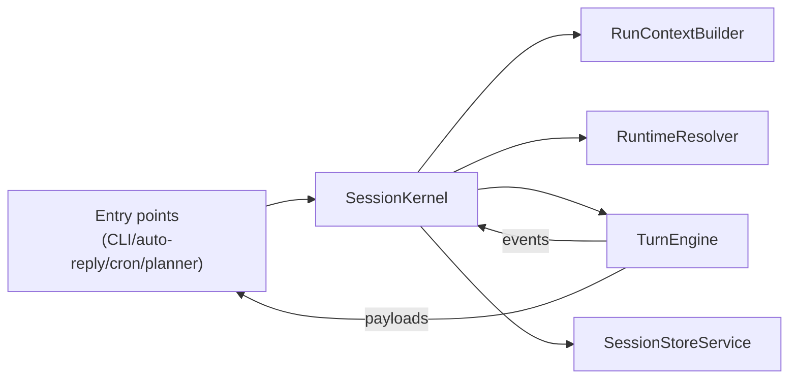

# Synthesis: Execution Kernel (SessionKernel + RunContext + RuntimeResolver + TurnEngine)

This document rewrites and synthesizes the intent behind:

- `designs/refactor-proposal/agent-session-kernel.md`
- `designs/refactor-proposal/runtime-context-resolver.md`
- `designs/refactor-proposal/turn-execution-pipeline.md`
- `designs/refactor-proposal/session-state-metadata-service.md`
- `designs/refactor-proposal/entry-point-consolidation.md`
- `designs/primitive-brainstorms/results-3/agent-run-context.md`

## Problem

OpenClaw has multiple “agent run entry points” (CLI, auto-reply, follow-ups, cron, planner) that each re-assemble:

- agent config overrides + runtime defaults
- workspace bootstrapping
- skill snapshot resolution + eligibility filtering
- model/provider selection + fallback behavior
- runtime selection (Pi vs SDK vs CLI adapter)
- tool policy + sandbox policy
- streaming normalization + block reply accumulation
- session metadata updates (model used, usage tokens, transcript paths, etc.)

Even when these paths are “conceptually the same”, they drift because correctness lives in the callers, not in one canonical engine.

## Goal

Create one canonical, reusable execution stack that:

- makes all entry points thin IO adapters
- centralizes runtime selection and turn execution semantics
- produces a single normalized outcome shape
- updates session state consistently after every turn
- is testable via parity tests (old vs new path) during migration

## Non-goals

- Replace Pi or SDK runtime implementations.
- Rewrite channel delivery (each channel can keep its deliverer).
- Introduce a new tool system.
- Change user-facing behavior without parity tests.

## Proposed primitives (one stack, small surfaces)

The “stack” is composed of four small components, but only **SessionKernel** is used by entry points.



### 1) `RunContextBuilder`

Single builder that resolves the _stable inputs_ needed to run turns consistently:

- agent config resolution (including overrides / inheritance rules)
- workspace directory + bootstrap behavior
- skills snapshot + eligibility map
- model selection intent (requested vs defaults vs fallback)

Output: `AgentRunContext` (pure data).

Key property: **any entry point** can produce the same `AgentRunContext` given the same inputs.

### 2) `RuntimeResolver`

Pure decision function that returns a fully-instantiated runtime adapter plus the policies it must obey:

- runtime kind (`pi` | `sdk` | `cli`)
- `toolPolicy` (allowlists, read/write gating, etc.)
- `sandboxContext` (or `null` when tools are disabled)
- runtime capabilities (`supportsTools`, `supportsStreaming`, etc.)

It should be the only place that:

- chooses runtime kind (including inheritance rules)
- instantiates SDK runtime and CLI adapter
- decides whether tools are enabled and how sandboxing applies

### 3) `TurnEngine`

Canonical execution pipeline for a **single turn**. Responsibilities:

- run lifecycle: `runId`, start/end/error semantics
- execute runtime with fallback (provider/model)
- normalize streaming + partial output into final `ReplyPayload[]`
- unify “block reply” chunking and flush behavior
- strip reasoning tags / reasoning blocks consistently
- interact with tool result persistence (via a tool ledger or existing guard)
- emit normalized run events (`AgentEvent[]`)

TurnEngine should have **no channel awareness**; it emits payloads and events.

### 4) `SessionStoreService`

Canonical service for “write-after-run” updates:

- model/provider actually used (preferring runtime metadata)
- normalized token usage
- runtime session ids
- transcript path resolution
- `updatedAt` and other metadata

The kernel calls this once per successful/failed turn (with consistent rules).

### 5) `SessionKernel` (the only public primitive)

Entry points call one method:

```ts
type KernelRunInput = {
  agentId: string;
  sessionKey?: string;
  sessionId?: string;

  messageContext?: MessageContext; // channel/thread metadata
  workspaceDirOverride?: string;
  skipBootstrap?: boolean;

  requestedModel?: string;
  prompt: string;
  images?: ImageContent[];
  extraSystemPrompt?: string;
  timeoutMs: number;

  delivery: {
    // entry point decides how to send; kernel returns payloads/events
    // delivery sink exists so the kernel can provide typing callbacks etc later
    kind: "none" | "channel";
  };
};

type KernelRunOutcome = {
  sessionId: string;
  sessionKey?: string;
  fallback?: { provider: string; model?: string };
  payloads: ReplyPayload[];
  events: AgentEventPayload[];
  result: AgentRuntimeResult;
};

await sessionKernel.runTurn(input): Promise<KernelRunOutcome>;
```

Notes:

- `sessionId` can be optional (kernel can generate or resolve); the important part is that the _rule_ is centralized.
- The kernel returns a normalized outcome; the entry point owns the channel send.

## Where code should live (suggestion, not a requirement)

- `src/agents/kernel/session-kernel.ts`
- `src/agents/kernel/run-context.ts`
- `src/agents/kernel/runtime-resolver.ts`
- `src/agents/kernel/turn-engine.ts`
- `src/agents/kernel/session-store-service.ts`

## Migration plan (safe + incremental)

### Phase 0: scaffolding + feature flag

- Implement kernel stack behind a flag (env or config).
- Add “parity harness” helpers for comparing old vs new results.

### Phase 1: migrate the CLI entry point

- Migrate `src/commands/agent.ts` to call `SessionKernel`.
- Keep old path available for rollback.
- Add parity tests for:
  - runtime kind resolution
  - model fallback behavior
  - reasoning tag stripping
  - tool policy resolution (no behavior change)

### Phase 2: migrate auto-reply + follow-ups

- Move streaming normalization and block reply logic fully into `TurnEngine`.
- Migrate `src/auto-reply/reply/*` entry points.
- Add “golden” delivery payload tests per channel deliverer.

### Phase 3: migrate cron isolated runs + planner

- Migrate `src/cron/isolated-agent/run.ts` and `src/agents/hybrid-planner.ts`.
- Ensure hooks and session updates match behavior.

### Phase 4: delete duplicated glue

- Remove unused duplicated helpers once all entry points are migrated.

## Testing strategy

- **Parity tests**: given the same inputs, old path and kernel path yield the same:
  - `payloads` (text/media)
  - session metadata updates
  - “did we send via messaging tool” markers
  - event ordering (where applicable)
- **Unit tests**:
  - runtime resolution precedence rules
  - reasoning tag stripping edge cases
  - block reply chunking behavior
  - session store updates (model/usage/session ids)

## Key design constraints (to keep the kernel healthy)

1. **Kernel should not become “where everything lives”**.
   - Keep strict boundaries: resolve context, run turn, update state.
   - Channel-specific logic stays outside (adapters).

2. **Make inputs explicit and typed**.
   - Eliminate “ambient” reads that differ by entry point.

3. **Make outcomes stable**.
   - A stable `KernelRunOutcome` is what unlocks reliable debugging and tooling.
