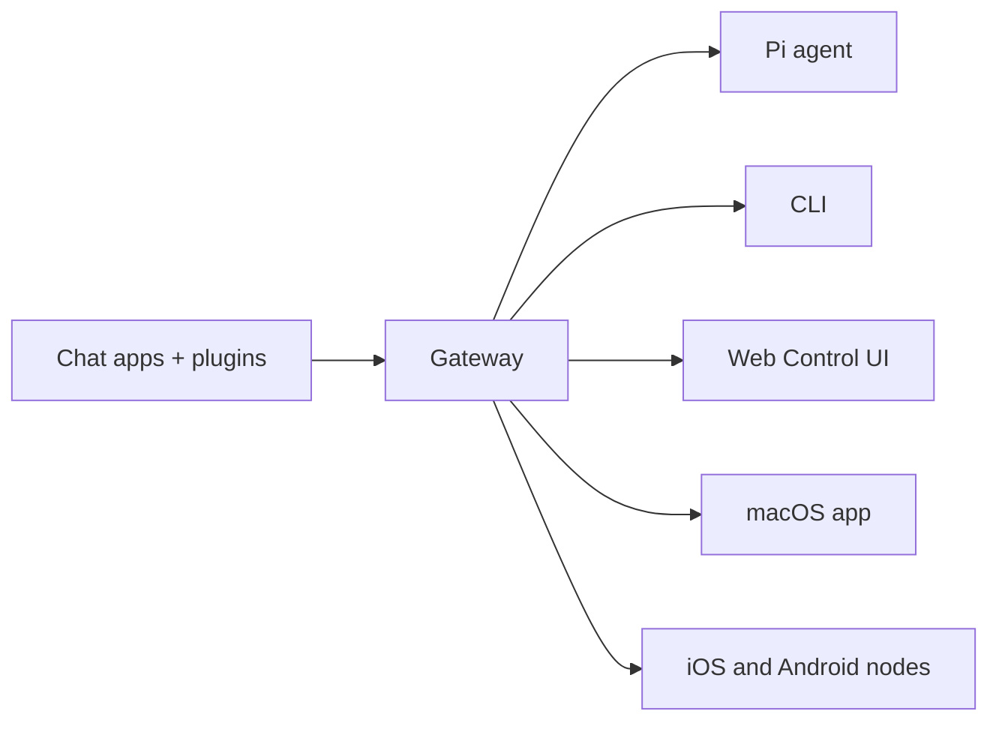

# OpenClaw 🦞

<p align="center">
    
    
</p>

> _„EXFOLIATE! EXFOLIATE!“_ — Ein Weltraumhummer, vermutlich

<p align="center">
  <strong>Gateway für KI-Agenten auf jedem Betriebssystem über WhatsApp, Telegram, Discord, iMessage und mehr.</strong><br />
  Senden Sie eine Nachricht und erhalten Sie eine Agentenantwort direkt aus Ihrer Tasche. Plugins fügen Mattermost und mehr hinzu.
</p>

<Columns>
  <Card title="Erste Schritte" href="/start/getting-started" icon="rocket">
    Installieren Sie OpenClaw und starten Sie das Gateway in wenigen Minuten.
  </Card>
  <Card title="Assistent ausführen" href="/start/wizard" icon="sparkles">
    Geführte Einrichtung mit `openclaw onboard` und Kopplungsabläufen.
  </Card>
  <Card title="Control UI öffnen" href="/web/control-ui" icon="layout-dashboard">
    Starten Sie das Browser-Dashboard für Chat, Konfiguration und Sitzungen.
  </Card>
</Columns>

## Was ist OpenClaw?

OpenClaw ist ein **selbst gehostetes Gateway**, das Ihre bevorzugten Chat-Apps — WhatsApp, Telegram, Discord, iMessage und mehr — mit KI-Coding-Agenten wie Pi verbindet. Sie führen einen einzigen Gateway-Prozess auf Ihrer eigenen Maschine (oder einem Server) aus, der als Brücke zwischen Ihren Messaging-Apps und einem jederzeit verfügbaren KI-Assistenten dient.

**Für wen ist es gedacht?** Entwickler und Power-User, die einen persönlichen KI-Assistenten möchten, den sie von überall aus anschreiben können — ohne die Kontrolle über ihre Daten aufzugeben oder sich auf einen gehosteten Dienst zu verlassen.

**Was macht es anders?**

- **Selbst gehostet**: läuft auf Ihrer Hardware, nach Ihren Regeln
- **Mehrkanal**: ein Gateway bedient WhatsApp, Telegram, Discord und mehr gleichzeitig
- **Agent-nativ**: entwickelt für Coding-Agenten mit Werkzeugnutzung, Sitzungen, Speicher und Multi-Agent-Routing
- **Open Source**: MIT-lizenziert, community-getrieben

**Was benötigen Sie?** Node 22+, einen API-Schlüssel (Anthropic empfohlen) und 5 Minuten.

## Wie es funktioniert



Das Gateway ist die einzige Quelle der Wahrheit für Sitzungen, Routing und Kanalverbindungen.

## Zentrale Fähigkeiten

<Columns>
  <Card title="Mehrkanal-Gateway" icon="network">
    WhatsApp, Telegram, Discord und iMessage mit einem einzigen Gateway-Prozess.
  </Card>
  <Card title="Plugin-Kanäle" icon="plug">
    Fügen Sie Mattermost und mehr mit Erweiterungspaketen hinzu.
  </Card>
  <Card title="Multi-Agent-Routing" icon="route">
    Isolierte Sitzungen pro Agent, Workspace oder Absender.
  </Card>
  <Card title="Medienunterstützung" icon="image">
    Senden und empfangen Sie Bilder, Audio und Dokumente.
  </Card>
  <Card title="Web Control UI" icon="monitor">
    Browser-Dashboard für Chat, Konfiguration, Sitzungen und Nodes.
  </Card>
  <Card title="Mobile Nodes" icon="smartphone">
    Koppeln Sie iOS- und Android-Nodes mit Canvas-Unterstützung.
  </Card>
</Columns>

## Schnellstart

<Steps>
  <Step title="OpenClaw installieren">
    ```bash
    npm install -g openclaw@latest
    ```
  </Step>
  <Step title="Einführung durchführen und den Dienst installieren">
    ```bash
    openclaw onboard --install-daemon
    ```
  </Step>
  <Step title="WhatsApp koppeln und das Gateway starten">
    ```bash
    openclaw channels login
    openclaw gateway --port 18789
    ```
  </Step>
</Steps>

Benötigen Sie die vollständige Installations- und Entwicklungsumgebung? Siehe [Schnellstart](/start/quickstart).

## Dashboard

Öffnen Sie die browserbasierte Control UI, nachdem das Gateway gestartet ist.

- Lokaler Standard: http://127.0.0.1:18789/
- Remote-Zugriff: [Web surfaces](/web) und [Tailscale](/gateway/tailscale)

<p align="center">
  
</p>

## Konfiguration (optional)

Die Konfiguration befindet sich unter `~/.openclaw/openclaw.json`.

- Wenn Sie **nichts tun**, verwendet OpenClaw die gebündelte Pi-Binary im RPC-Modus mit sitzungsbasierter Trennung pro Absender.
- Wenn Sie es einschränken möchten, beginnen Sie mit `channels.whatsapp.allowFrom` und (für Gruppen) mit Erwähnungsregeln.

Beispiel:

```json5
{
  channels: {
    whatsapp: {
      allowFrom: ["+15555550123"],
      groups: { "*": { requireMention: true } },
    },
  },
  messages: { groupChat: { mentionPatterns: ["@openclaw"] } },
}
```

## Hier starten

<Columns>
  <Card title="Dokumentations-Hubs" href="/start/hubs" icon="book-open">
    Alle Dokumente und Leitfäden, nach Anwendungsfall organisiert.
  </Card>
  <Card title="Konfiguration" href="/gateway/configuration" icon="settings">
    Zentrale Gateway-Einstellungen, Tokens und Anbieter-Konfiguration.
  </Card>
  <Card title="Remote-Zugriff" href="/gateway/remote" icon="globe">
    SSH- und Tailnet-Zugriffsmuster.
  </Card>
  <Card title="Kanäle" href="/channels/telegram" icon="message-square">
    Kanalspezifische Einrichtung für WhatsApp, Telegram, Discord und mehr.
  </Card>
  <Card title="Nodes" href="/nodes" icon="smartphone">
    iOS- und Android-Nodes mit Kopplung und Canvas.
  </Card>
  <Card title="Hilfe" href="/help" icon="life-buoy">
    Häufige Lösungen und Einstiegspunkt zur Fehlerbehebung.
  </Card>
</Columns>

## Mehr erfahren

<Columns>
  <Card title="Vollständige Funktionsliste" href="/concepts/features" icon="list">
    Vollständige Kanal-, Routing- und Medienfunktionen.
  </Card>
  <Card title="Multi-Agent-Routing" href="/concepts/multi-agent" icon="route">
    Workspace-Isolation und sitzungsbasierte Trennung pro Agent.
  </Card>
  <Card title="Sicherheit" href="/gateway/security" icon="shield">
    Tokens, Allowlists und Sicherheitskontrollen.
  </Card>
  <Card title="Fehlerbehebung" href="/gateway/troubleshooting" icon="wrench">
    Gateway-Diagnose und häufige Fehler.
  </Card>
  <Card title="Über das Projekt und Danksagungen" href="/reference/credits" icon="info">
    Projektursprung, Mitwirkende und Lizenz.
  </Card>
</Columns>
