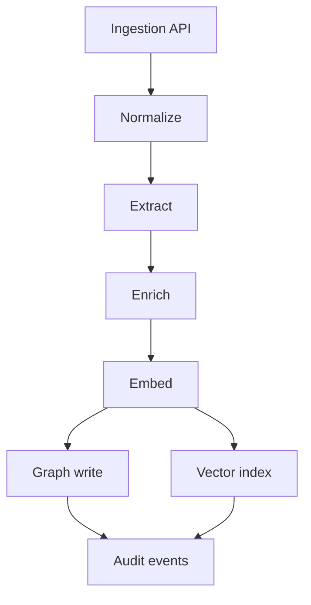
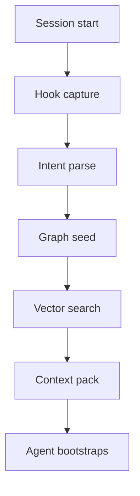
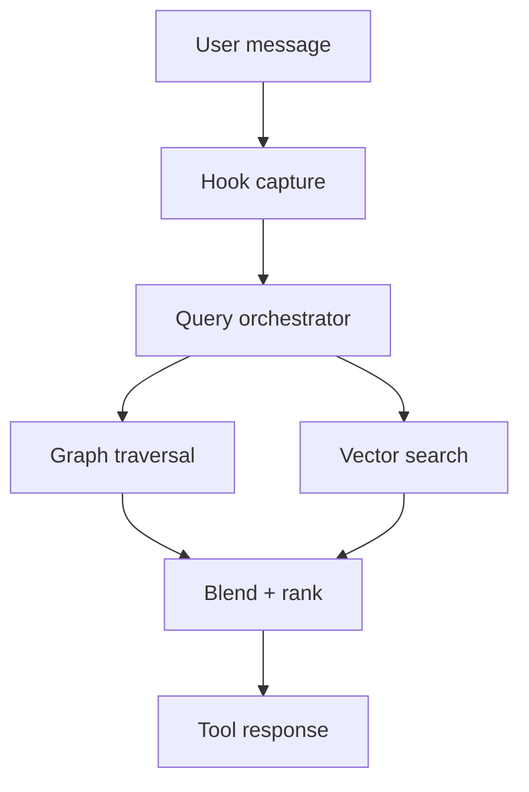

# Meridia graph memory design

## Purpose and goals

This design proposes a graph database backed memory system for Meridia that supports:

- Multi-modal ingestion for text, image, audio, and video content with metadata.
- A capture pipeline that can enrich, dedupe, and normalize content into graph entities.
- A query side that blends graph traversal with vector retrieval for RAG.
- Bootstrapping an agent with context derived from the first user prompt.
- In-conversation memory lookups for relevant people, facts, and relationships.

## High level architecture

### Core services

- **Ingestion API**: Public entry point for content objects and metadata.
- **Capture pipeline**: Parses, transforms, and writes to graph storage plus vector store.
- **Graph store**: Stores entities, relationships, and provenance.
- **Embedding store**: Stores embeddings for search and similarity.
- **Query orchestrator**: Blends graph traversal and vector search.
- **Tooling and hooks**: Provide agent entry points and session lifecycle hooks.

### Extension choices

- **Plugin**: Use a plugin to expose tools, manage background workers, and register gateway RPC methods for ingestion and querying.
- **Hook**: Use hooks to capture conversation events such as session start, message received, and compaction summaries.

## Data model overview

### Entity types

- **Content**: Raw content objects with a canonical identifier and metadata.
- **Artifact**: Derived artifacts such as transcripts, captions, OCR, summaries, or embeddings.
- **Fact**: Structured facts extracted from content with confidence.
- **Person**: Known or inferred people, including agent and user identities.
- **Topic**: Canonical topic nodes to support traversal and grouping.
- **Session**: Conversation sessions for provenance.

### Relationship types

- `AUTHORED_BY`: Content -> Person
- `MENTIONS`: Content -> Person
- `ABOUT`: Content -> Topic
- `DERIVED_FROM`: Artifact -> Content
- `EVIDENCES`: Fact -> Content
- `CONTAINS`: Session -> Content
- `REFERENCES`: Content -> Content
- `SAME_AS`: Person -> Person or Topic -> Topic

### Provenance

Every entity and edge includes:

- `source_id`, `source_type` (system, user, tool, hook)
- `observed_at`, `ingested_at`
- `confidence`, `schema_version`

## Ingestion and capture pipeline

### Entry point API

All ingestion happens through a single entry point that accepts any number of content objects.

```ts
export type ContentType = "text" | "image" | "audio" | "video" | "document";

export interface ContentObject {
  id?: string;
  type: ContentType;
  uri?: string;
  text?: string;
  bytesBase64?: string;
  mimeType?: string;
  language?: string;
  metadata?: Record<string, string | number | boolean>;
  tags?: string[];
}

export interface IngestRequest {
  batchId?: string;
  sessionId?: string;
  userId?: string;
  source: "hook" | "tool" | "api" | "system";
  content: ContentObject[];
  properties?: Record<string, string | number | boolean>;
}

export interface IngestResponse {
  batchId: string;
  accepted: number;
  rejected: number;
  warnings?: string[];
}
```

### Capture pipeline stages

1. **Normalize**: Validate content objects, set IDs, and store raw objects.
2. **Extract**: OCR, ASR, captions, or parsing into structured text.
3. **Enrich**: Entity extraction, topic tagging, and co-reference resolution.
4. **Embed**: Generate embeddings for raw text, transcripts, and summaries.
5. **Graph write**: Create nodes and edges with provenance and confidence.
6. **Index**: Store embeddings and metadata in vector store.
7. **Audit**: Emit events for monitoring and tracing.

### Event flow diagram



## Query side and RAG

### Query pipeline

1. **Intent parse**: Extract entities and topics from the user prompt.
2. **Graph seed**: Retrieve entities and related nodes with traversal rules.
3. **Vector search**: Run a semantic search across embeddings.
4. **Blend**: Rank results with a hybrid scoring model.
5. **Assemble context**: Build a context pack for the agent.

### Context pack

```ts
export interface ContextPack {
  summary: string;
  citations: Array<{
    id: string;
    sourceType: "content" | "fact" | "artifact";
    excerpt?: string;
    confidence: number;
  }>;
  graphSubgraph: {
    nodes: Array<{ id: string; type: string; label: string }>;
    edges: Array<{ from: string; to: string; type: string }>;
  };
  rawChunks: Array<{
    contentId: string;
    text: string;
    score: number;
  }>;
}
```

### Blending logic

- **Graph score**: Number of hops, edge weight, and confidence.
- **Vector score**: Embedding similarity and recency.
- **Session score**: Prefer content from the same session or user.

## Bootstrapping context from first prompt

### Event flow



### Bootstrapping rules

- Use prompt entities to seed traversal.
- Include top `k` facts and artifacts with confidence above threshold.
- Limit to a maximum token budget for the context pack.

## In conversation query flow



## Internal entry point for content submission

### Tool interface

```ts
export interface MemoryIngestTool {
  ingest(request: IngestRequest): Promise<IngestResponse>;
}
```

### Tool usage

- Accepts batch ingestion from tools, hooks, or external API.
- Allows ingesting multiple content objects with a single call.
- Returns a batch ID for audit and trace lookup.

## Extension and tools working together

- **Hook**: Captures session start and messages, sends content to the ingest tool.
- **Plugin tool**: Exposes `memory.ingest` and `memory.query` to the agent.
- **Gateway RPC**: Receives ingestion events from external services.

# <<<<<<< ours

## Graphiti evaluation

Graphiti is an open-source framework for building temporally-aware knowledge graphs geared toward agent memory. It
emphasizes incremental updates, bi-temporal data handling, and hybrid retrieval (semantic embeddings, keyword search,
and graph traversal) with optional reranking. It also supports multiple graph backends (Neo4j, FalkorDB, Kuzu, and
Amazon Neptune) and ships with a FastAPI server and an MCP server for external tool access. These capabilities map well
to our desired capture pipeline and query orchestration needs, especially where we want temporal reasoning and hybrid
retrieval without building the entire stack from scratch.

### How Graphiti lines up with Meridia needs

- **Capture pipeline alignment**: Graphiti already ingests episodes (text or structured JSON) and builds a knowledge
  graph incrementally. This is close to our normalize/extract/enrich stages, but we still need to front-load multi-modal
  extraction (OCR, ASR, captioning) before we pass the resulting text to Graphiti for episode ingestion.
- **Temporal reasoning**: Graphiti’s bi-temporal model and temporal edge invalidation provide the historical accuracy we
  want for “what was true at time T” queries without recomputation, which is a direct match for Meridia’s memory goals.
- **Hybrid retrieval**: Graphiti’s hybrid search (semantic + keyword + graph traversal) mirrors our planned blend stage,
  meaning we can reuse its retrieval primitives and focus on context-pack assembly and token budgeting.
- **Tooling**: The existing REST server and MCP server can reduce the surface area of new tooling we must build, though
  we still need an ingestion API that accepts multi-modal content objects and metadata.

### Gaps or risks

- **Multi-modal ingestion**: Graphiti centers on text and structured episodes. We would still need our own pipeline to
  convert images, audio, and video into transcripts, OCR, or captions before ingestion.
- **Control over schema and provenance**: Graphiti supports custom entity definitions, but we must validate it can
  express our provenance fields (`source_id`, `observed_at`, confidence, etc.) without forcing schema compromises.
- **Dependency footprint**: Graphiti is a Python framework. Adopting it implies running and orchestrating a Python
  service alongside the Node-based gateway, which could increase operational complexity unless we isolate it behind a
  small API boundary.
- **LLM provider requirements**: Graphiti assumes structured-output capable models and defaults to OpenAI. We need to
  confirm compatibility with our target providers and ensure we can supply our own embedding models.

### Recommendation

Graphiti is a strong candidate as the graph and retrieval core for Meridia because it already solves temporal knowledge
graph updates and hybrid retrieval. The best path is to keep our ingestion and multi-modal extraction pipeline, then
hand off normalized text episodes to Graphiti. We should prototype a thin “Meridia Graphiti adapter” service that
exposes `memory.ingest` and `memory.query` endpoints while retaining our context-pack assembly and policy controls. If
the schema/provenance model can map cleanly, this reduces implementation cost significantly while preserving our desired
pipeline behavior.

> > > > > > > theirs

## Implementation plan

### Phase 1

- Define shared interfaces in `src/memory/types.ts`.
- Add `memory.ingest` tool handler and hook wiring.
- Implement capture pipeline with stub stages and logging.

### Phase 2

- Add graph database client adapter and vector store adapter.
- Implement entity extraction and embedding service.
- Add query orchestrator with hybrid ranking.

### Phase 3

- Add context pack formatting, token budgeting, and agent integrations.
- Add diagnostics and metrics for ingestion and query latency.
- Document configuration for graph provider, vector provider, and thresholds.

### Core objects

```ts
export interface GraphAdapter {
  upsertNodes(nodes: GraphNode[]): Promise<void>;
  upsertEdges(edges: GraphEdge[]): Promise<void>;
  querySubgraph(query: GraphQuery): Promise<GraphSubgraph>;
}

export interface VectorAdapter {
  upsertEmbeddings(records: VectorRecord[]): Promise<void>;
  search(query: VectorQuery): Promise<VectorSearchResult[]>;
}

export interface QueryOrchestrator {
  buildContext(query: QueryRequest): Promise<ContextPack>;
}
```

## Security and privacy considerations

- Validate content types and limit payload size per request.
- Encrypt sensitive content at rest and apply access control.
- Provide audit logs for ingestion and query access.
- Support redaction or deletion by user ID or source.
