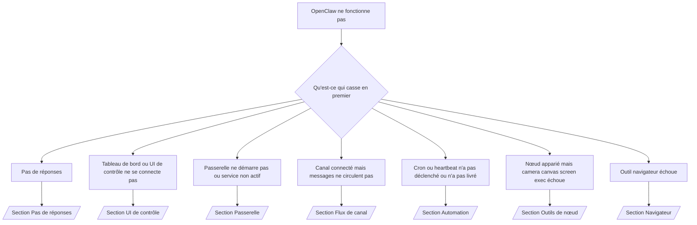

# Dépannage

Si vous n'avez que 2 minutes, utilisez cette page comme porte d'entrée de triage.

## Premières 60 secondes

Exécutez cette échelle exacte dans l'ordre :

```bash
openclaw status
openclaw status --all
openclaw gateway probe
openclaw gateway status
openclaw doctor
openclaw channels status --probe
openclaw logs --follow
```

Bonne sortie en une ligne :

- `openclaw status` → montre les canaux configurés et pas d'erreurs d'auth évidentes.
- `openclaw status --all` → rapport complet présent et partageable.
- `openclaw gateway probe` → cible de passerelle attendue est accessible.
- `openclaw gateway status` → `Runtime: running` et `RPC probe: ok`.
- `openclaw doctor` → pas d'erreurs bloquantes de config/service.
- `openclaw channels status --probe` → canaux rapportent `connected` ou `ready`.
- `openclaw logs --follow` → activité régulière, pas d'erreurs fatales répétées.

## Arbre de décision



<AccordionGroup>
  <Accordion title="Pas de réponses">
    ```bash
    openclaw status
    openclaw gateway status
    openclaw channels status --probe
    openclaw pairing list <channel>
    openclaw logs --follow
    ```

    Bonne sortie ressemble à :

    - `Runtime: running`
    - `RPC probe: ok`
    - Votre canal montre connected/ready dans `channels status --probe`
    - L'expéditeur apparaît approuvé (ou la politique DM est ouverte/liste autorisée)

    Signatures de journal courantes :

    - `drop guild message (mention required` → le gating de mention a bloqué le message dans Discord.
    - `pairing request` → l'expéditeur n'est pas approuvé et attend l'approbation d'appairage DM.
    - `blocked` / `allowlist` dans les journaux de canal → expéditeur, salle ou groupe est filtré.

    Pages profondes :

    - [/gateway/troubleshooting#no-replies](/fr-FR/gateway/troubleshooting#no-replies)
    - [/channels/troubleshooting](/fr-FR/channels/troubleshooting)
    - [/channels/pairing](/fr-FR/channels/pairing)

  </Accordion>

  <Accordion title="Tableau de bord ou UI de contrôle ne se connecte pas">
    ```bash
    openclaw status
    openclaw gateway status
    openclaw logs --follow
    openclaw doctor
    openclaw channels status --probe
    ```

    Bonne sortie ressemble à :

    - `Dashboard: http://...` est montré dans `openclaw gateway status`
    - `RPC probe: ok`
    - Pas de boucle d'auth dans les journaux

    Signatures de journal courantes :

    - `device identity required` → contexte HTTP/non-sécurisé ne peut pas compléter l'auth de dispositif.
    - `unauthorized` / boucle de reconnexion → mauvais token/mot de passe ou mode d'auth incompatible.
    - `gateway connect failed:` → l'UI cible la mauvaise URL/port ou passerelle inaccessible.

    Pages profondes :

    - [/gateway/troubleshooting#dashboard-control-ui-connectivity](/fr-FR/gateway/troubleshooting#dashboard-control-ui-connectivity)
    - [/web/control-ui](/fr-FR/web/control-ui)
    - [/gateway/authentication](/fr-FR/gateway/authentication)

  </Accordion>

  <Accordion title="Passerelle ne démarre pas ou service installé mais non actif">
    ```bash
    openclaw status
    openclaw gateway status
    openclaw logs --follow
    openclaw doctor
    openclaw channels status --probe
    ```

    Bonne sortie ressemble à :

    - `Service: ... (loaded)`
    - `Runtime: running`
    - `RPC probe: ok`

    Signatures de journal courantes :

    - `Gateway start blocked: set gateway.mode=local` → mode de passerelle non défini/distant.
    - `refusing to bind gateway ... without auth` → liaison non-loopback sans token/mot de passe.
    - `another gateway instance is already listening` ou `EADDRINUSE` → port déjà pris.

    Pages profondes :

    - [/gateway/troubleshooting#gateway-service-not-running](/fr-FR/gateway/troubleshooting#gateway-service-not-running)
    - [/gateway/background-process](/fr-FR/gateway/background-process)
    - [/gateway/configuration](/fr-FR/gateway/configuration)

  </Accordion>

  <Accordion title="Canal connecté mais messages ne circulent pas">
    ```bash
    openclaw status
    openclaw gateway status
    openclaw logs --follow
    openclaw doctor
    openclaw channels status --probe
    ```

    Bonne sortie ressemble à :

    - Transport de canal est connecté.
    - Les vérifications d'appairage/liste autorisée passent.
    - Les mentions sont détectées où requises.

    Signatures de journal courantes :

    - `mention required` → le gating de mention de groupe a bloqué le traitement.
    - `pairing` / `pending` → l'expéditeur DM n'est pas encore approuvé.
    - `not_in_channel`, `missing_scope`, `Forbidden`, `401/403` → problème de token de permission de canal.

    Pages profondes :

    - [/gateway/troubleshooting#channel-connected-messages-not-flowing](/fr-FR/gateway/troubleshooting#channel-connected-messages-not-flowing)
    - [/channels/troubleshooting](/fr-FR/channels/troubleshooting)

  </Accordion>

  <Accordion title="Cron ou heartbeat n'a pas déclenché ou n'a pas livré">
    ```bash
    openclaw status
    openclaw gateway status
    openclaw cron status
    openclaw cron list
    openclaw cron runs --id <jobId> --limit 20
    openclaw logs --follow
    ```

    Bonne sortie ressemble à :

    - `cron.status` montre activé avec un prochain réveil.
    - `cron runs` montre des entrées `ok` récentes.
    - Heartbeat est activé et pas en dehors des heures actives.

    Signatures de journal courantes :

    - `cron: scheduler disabled; jobs will not run automatically` → cron est désactivé.
    - `heartbeat skipped` avec `reason=quiet-hours` → en dehors des heures actives configurées.
    - `requests-in-flight` → voie principale occupée ; réveil heartbeat a été différé.
    - `unknown accountId` → le compte cible de livraison heartbeat n'existe pas.

    Pages profondes :

    - [/gateway/troubleshooting#cron-and-heartbeat-delivery](/fr-FR/gateway/troubleshooting#cron-and-heartbeat-delivery)
    - [/automation/troubleshooting](/fr-FR/automation/troubleshooting)
    - [/gateway/heartbeat](/fr-FR/gateway/heartbeat)

  </Accordion>

  <Accordion title="Nœud apparié mais l'outil échoue camera canvas screen exec">
    ```bash
    openclaw status
    openclaw gateway status
    openclaw nodes status
    openclaw nodes describe --node <idOrNameOrIp>
    openclaw logs --follow
    ```

    Bonne sortie ressemble à :

    - Le nœud est listé comme connecté et apparié pour le rôle `node`.
    - La capacité existe pour la commande que vous invoquez.
    - L'état de permission est accordé pour l'outil.

    Signatures de journal courantes :

    - `NODE_BACKGROUND_UNAVAILABLE` → amenez l'app nœud au premier plan.
    - `*_PERMISSION_REQUIRED` → permission OS a été refusée/manquante.
    - `SYSTEM_RUN_DENIED: approval required` → approbation exec en attente.
    - `SYSTEM_RUN_DENIED: allowlist miss` → commande pas sur la liste autorisée exec.

    Pages profondes :

    - [/gateway/troubleshooting#node-paired-tool-fails](/fr-FR/gateway/troubleshooting#node-paired-tool-fails)
    - [/nodes/troubleshooting](/fr-FR/nodes/troubleshooting)
    - [/tools/exec-approvals](/fr-FR/tools/exec-approvals)

  </Accordion>

  <Accordion title="Outil navigateur échoue">
    ```bash
    openclaw status
    openclaw gateway status
    openclaw browser status
    openclaw logs --follow
    openclaw doctor
    ```

    Bonne sortie ressemble à :

    - Le statut navigateur montre `running: true` et un navigateur/profil choisi.
    - Le profil `openclaw` démarre ou le relais `chrome` a un onglet attaché.

    Signatures de journal courantes :

    - `Failed to start Chrome CDP on port` → le lancement local du navigateur a échoué.
    - `browser.executablePath not found` → le chemin binaire configuré est incorrect.
    - `Chrome extension relay is running, but no tab is connected` → extension non attachée.
    - `Browser attachOnly is enabled ... not reachable` → le profil attach-only n'a pas de cible CDP active.

    Pages profondes :

    - [/gateway/troubleshooting#browser-tool-fails](/fr-FR/gateway/troubleshooting#browser-tool-fails)
    - [/tools/browser-linux-troubleshooting](/fr-FR/tools/browser-linux-troubleshooting)
    - [/tools/chrome-extension](/fr-FR/tools/chrome-extension)

  </Accordion>
</AccordionGroup>
