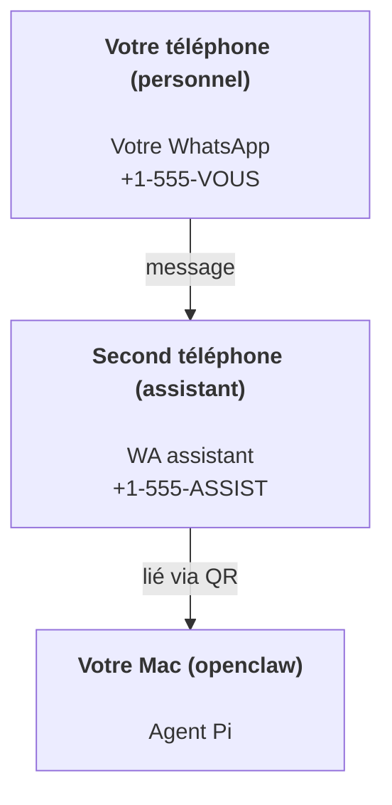

# Créer un assistant personnel avec OpenClaw

OpenClaw est une passerelle WhatsApp + Telegram + Discord + iMessage pour les agents **Pi**. Les plugins ajoutent Mattermost. Ce guide concerne la configuration "assistant personnel" : un numéro WhatsApp dédié qui se comporte comme votre agent toujours actif.

## ⚠️ Sécurité d'abord

Vous mettez un agent en position de :

- exécuter des commandes sur votre machine (selon votre configuration d'outils Pi)
- lire/écrire des fichiers dans votre espace de travail
- envoyer des messages via WhatsApp/Telegram/Discord/Mattermost (plugin)

Commencez de manière prudente :

- Définissez toujours `channels.whatsapp.allowFrom` (ne l'exécutez jamais ouvert au monde entier sur votre Mac personnel).
- Utilisez un numéro WhatsApp dédié pour l'assistant.
- Les battements de cœur sont désormais par défaut toutes les 30 minutes. Désactivez jusqu'à ce que vous fassiez confiance à la configuration en définissant `agents.defaults.heartbeat.every: "0m"`.

## Prérequis

- OpenClaw installé et intégré — consultez [Premiers pas](/fr-FR/start/getting-started) si vous ne l'avez pas encore fait
- Un deuxième numéro de téléphone (SIM/eSIM/prépayé) pour l'assistant

## La configuration à deux téléphones (recommandée)

Vous voulez ceci :



Si vous liez votre WhatsApp personnel à OpenClaw, chaque message pour vous devient "entrée d'agent". Ce n'est rarement ce que vous voulez.

## Démarrage rapide de 5 minutes

1. Appairer WhatsApp Web (affiche le QR ; scannez avec le téléphone assistant) :

```bash
openclaw channels login
```

2. Démarrez la passerelle (laissez-la en cours d'exécution) :

```bash
openclaw gateway --port 18789
```

3. Mettez une configuration minimale dans `~/.openclaw/openclaw.json` :

```json5
{
  channels: { whatsapp: { allowFrom: ["+15555550123"] } },
}
```

Maintenant, envoyez un message au numéro de l'assistant depuis votre téléphone autorisé.

Lorsque l'intégration se termine, nous ouvrons automatiquement le tableau de bord et imprimons un lien propre (sans token). S'il demande une authentification, collez le token de `gateway.auth.token` dans les paramètres de l'interface de contrôle. Pour le rouvrir plus tard : `openclaw dashboard`.

## Donnez à l'agent un espace de travail (AGENTS)

OpenClaw lit les instructions d'exploitation et la "mémoire" de son répertoire d'espace de travail.

Par défaut, OpenClaw utilise `~/.openclaw/workspace` comme espace de travail de l'agent, et le créera (plus les fichiers de démarrage `AGENTS.md`, `SOUL.md`, `TOOLS.md`, `IDENTITY.md`, `USER.md`, `HEARTBEAT.md`) automatiquement lors de la configuration/première exécution de l'agent. `BOOTSTRAP.md` n'est créé que lorsque l'espace de travail est tout nouveau (il ne devrait pas revenir après que vous l'ayez supprimé). `MEMORY.md` est optionnel (non créé automatiquement) ; lorsqu'il est présent, il est chargé pour les sessions normales. Les sessions de sous-agents n'injectent que `AGENTS.md` et `TOOLS.md`.

Astuce : traitez ce dossier comme la "mémoire" d'OpenClaw et faites-en un dépôt git (idéalement privé) afin que vos fichiers `AGENTS.md` + mémoire soient sauvegardés. Si git est installé, les nouveaux espaces de travail sont auto-initialisés.

```bash
openclaw setup
```

Disposition complète de l'espace de travail + guide de sauvegarde : [Espace de travail de l'agent](/fr-FR/concepts/agent-workspace)
Flux de travail de mémoire : [Mémoire](/fr-FR/concepts/memory)

Optionnel : choisissez un espace de travail différent avec `agents.defaults.workspace` (prend en charge `~`).

```json5
{
  agent: {
    workspace: "~/.openclaw/workspace",
  },
}
```

Si vous fournissez déjà vos propres fichiers d'espace de travail depuis un dépôt, vous pouvez désactiver complètement la création de fichiers d'initialisation :

```json5
{
  agent: {
    skipBootstrap: true,
  },
}
```

## La configuration qui en fait "un assistant"

OpenClaw a de bons paramètres par défaut pour un assistant, mais vous voudrez généralement ajuster :

- la persona/les instructions dans `SOUL.md`
- les valeurs par défaut de réflexion (si souhaité)
- les battements de cœur (une fois que vous lui faites confiance)

Exemple :

```json5
{
  logging: { level: "info" },
  agent: {
    model: "anthropic/claude-opus-4-6",
    workspace: "~/.openclaw/workspace",
    thinkingDefault: "high",
    timeoutSeconds: 1800,
    // Commencez avec 0 ; activez plus tard.
    heartbeat: { every: "0m" },
  },
  channels: {
    whatsapp: {
      allowFrom: ["+15555550123"],
      groups: {
        "*": { requireMention: true },
      },
    },
  },
  routing: {
    groupChat: {
      mentionPatterns: ["@openclaw", "openclaw"],
    },
  },
  session: {
    scope: "per-sender",
    resetTriggers: ["/new", "/reset"],
    reset: {
      mode: "daily",
      atHour: 4,
      idleMinutes: 10080,
    },
  },
}
```

## Sessions et mémoire

- Fichiers de session : `~/.openclaw/agents/<agentId>/sessions/{{SessionId}}.jsonl`
- Métadonnées de session (utilisation de tokens, dernière route, etc.) : `~/.openclaw/agents/<agentId>/sessions/sessions.json` (ancien : `~/.openclaw/sessions/sessions.json`)
- `/new` ou `/reset` démarre une nouvelle session pour ce chat (configurable via `resetTriggers`). Si envoyé seul, l'agent répond avec un bref bonjour pour confirmer la réinitialisation.
- `/compact [instructions]` compacte le contexte de la session et signale le budget de contexte restant.

## Battements de cœur (mode proactif)

Par défaut, OpenClaw exécute un battement de cœur toutes les 30 minutes avec le prompt :
`Lire HEARTBEAT.md s'il existe (contexte de l'espace de travail). Le suivre strictement. Ne pas inférer ou répéter d'anciennes tâches de discussions précédentes. Si rien ne nécessite d'attention, répondre HEARTBEAT_OK.`
Définissez `agents.defaults.heartbeat.every: "0m"` pour désactiver.

- Si `HEARTBEAT.md` existe mais est effectivement vide (seulement des lignes vides et des en-têtes markdown comme `# Titre`), OpenClaw ignore l'exécution du battement de cœur pour économiser les appels API.
- Si le fichier est manquant, le battement de cœur s'exécute toujours et le modèle décide quoi faire.
- Si l'agent répond avec `HEARTBEAT_OK` (éventuellement avec un court remplissage ; voir `agents.defaults.heartbeat.ackMaxChars`), OpenClaw supprime la livraison sortante pour ce battement de cœur.
- Les battements de cœur exécutent des tours d'agent complets — des intervalles plus courts brûlent plus de tokens.

```json5
{
  agent: {
    heartbeat: { every: "30m" },
  },
}
```

## Médias entrants et sortants

Les pièces jointes entrantes (images/audio/documents) peuvent être présentées à votre commande via des modèles :

- `{{MediaPath}}` (chemin de fichier temporaire local)
- `{{MediaUrl}}` (pseudo-URL)
- `{{Transcript}}` (si la transcription audio est activée)

Pièces jointes sortantes de l'agent : incluez `MEDIA:<chemin-ou-url>` sur sa propre ligne (sans espaces). Exemple :

```
Voici la capture d'écran.
MEDIA:https://example.com/screenshot.png
```

OpenClaw les extrait et les envoie comme médias aux côtés du texte.

## Liste de contrôle des opérations

```bash
openclaw status          # statut local (identifiants, sessions, événements en file d'attente)
openclaw status --all    # diagnostic complet (lecture seule, collable)
openclaw status --deep   # ajoute des sondes de santé de la passerelle (Telegram + Discord)
openclaw health --json   # instantané de santé de la passerelle (WS)
```

Les journaux se trouvent sous `/tmp/openclaw/` (par défaut : `openclaw-YYYY-MM-DD.log`).

## Prochaines étapes

- WebChat : [WebChat](/fr-FR/web/webchat)
- Opérations de passerelle : [Guide de la passerelle](/fr-FR/gateway)
- Cron + réveils : [Tâches cron](/fr-FR/automation/cron-jobs)
- Compagnon barre de menus macOS : [Application OpenClaw macOS](/fr-FR/platforms/macos)
- Application nœud iOS : [Application iOS](/fr-FR/platforms/ios)
- Application nœud Android : [Application Android](/fr-FR/platforms/android)
- Statut Windows : [Windows (WSL2)](/fr-FR/platforms/windows)
- Statut Linux : [Application Linux](/fr-FR/platforms/linux)
- Sécurité : [Sécurité](/fr-FR/gateway/security)
