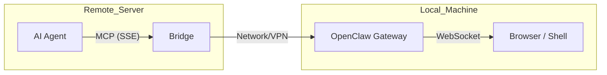

# MCP Bridge (AI Agents)

The **[openclaw-bridge-remote](https://github.com/lucas-jo/openclaw-bridge-remote)** allows you to connect remote AI agents (like OpenCode, Cursor, or Windsurf running on remote servers) to your local OpenClaw instance.

This is particularly useful when developing on powerful remote machines (GPU clusters, cloud instances) but needing to perform actions on your local machine, such as browser automation or local shell execution.

## Key Features

- **Remote-to-Local Bridge**: Gives remote agents "eyes and hands" on your desk.
- **MCP Native**: Exposes OpenClaw tools via the industry-standard Model Context Protocol.
- **Secure**: Implements OpenClaw's Ed25519 signing protocol and adds its own API Key layer.
- **One-liner Setup**: Easy installation on macOS via a simple install script.

## Architecture



## Quick Start

### 1. Install on your local machine

Install the bridge using the provided installer script:

```bash
git clone https://github.com/lucas-jo/openclaw-bridge-remote.git
cd openclaw-bridge-remote
./install.sh
```

### 2. Configure your Remote Agent

Add the bridge URL to your agent's MCP settings:

```json
{
  "mcpServers": {
    "openclaw-remote": {
      "type": "remote",
      "url": "http://<LOCAL_IP>:3100/sse?apiKey=<BRIDGE_API_KEY>"
    }
  }
}
```

<Tip>
We recommend using **Tailscale** for secure connectivity between your remote machine and local bridge.
</Tip>

## More Information

- **Repository**: [lucas-jo/openclaw-bridge-remote](https://github.com/lucas-jo/openclaw-bridge-remote)
- **Concepts**: [Remote Access](/gateway/remote), [Architecture](/concepts/architecture)
