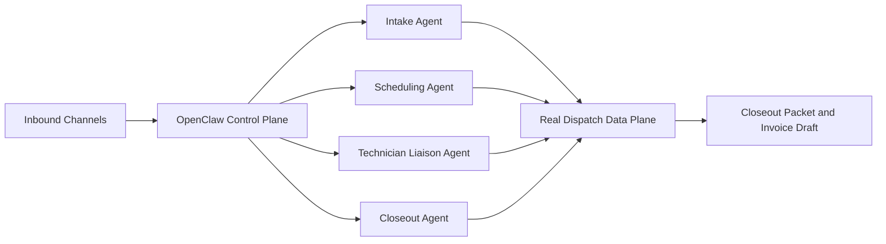

# Real Dispatch

**AI-first dispatch and closeout system for field service.**

Real Dispatch replaces the front-desk dispatcher workflow:

`intake -> schedule -> dispatch -> onsite comms -> closeout packet -> invoice draft`

## Product framing

- **OpenClaw scaffold** = control plane (channels, sessions, routing, scheduler wakeups)
- **Real Dispatch** = data plane (tickets, case files, attachments, audit trail, closeout outputs)

The scaffold orchestrates communication. Real Dispatch owns operational truth.

<Columns>
  <Card title="Getting started" href="/start/getting-started" icon="rocket">
    Bring up a local Real Dispatch development environment.
  </Card>
  <Card title="Dispatch setup guide" href="/start/openclaw" icon="route">
    Configure intake, scheduling, technician loop, and closeout flow.
  </Card>
  <Card title="Control UI" href="/web/control-ui" icon="layout-dashboard">
    Operate the control plane while keeping data-plane state in the case file.
  </Card>
</Columns>

For the full adopt/refactor/rebuild breakdown, see [OpenClaw reuse plan](/concepts/openclaw-reuse-plan).

## Core principles

- **System-of-record first:** all dispatch state is persisted in structured storage.
- **Closed toolset:** only approved dispatch actions are executable.
- **Least privilege:** role-specific permissions are enforced.
- **Auditability:** every state-changing action is attributable and replayable.
- **Safety defaults:** untrusted inbound inputs are gated and sanitized.

## Glossary

- **Ticket / Job**: unit of field work.
- **Case file**: canonical structured job record (database + attachments).
- **Closeout packet**: compiled completion bundle for billing and compliance.
- **Control plane**: gateway/channels/scheduler/runtime orchestration.
- **Data plane**: dispatch API + database + object storage.
- **Toolset**: closed list of permitted operations.

## Architecture

## MVP capability contract

<Columns>
  <Card title="Intake" icon="inbox">
    Convert multi-channel inbound requests into schedulable tickets.
  </Card>
  <Card title="Scheduling" icon="calendar-days">
    Propose slots, assign technicians, and keep ETA communication current.
  </Card>
  <Card title="Technician loop" icon="wrench">
    Capture onsite updates, notes, and photo evidence.
  </Card>
  <Card title="Closeout and billing" icon="file-check-2">
    Generate closeout packet and invoice draft with evidence gates.
  </Card>
</Columns>
