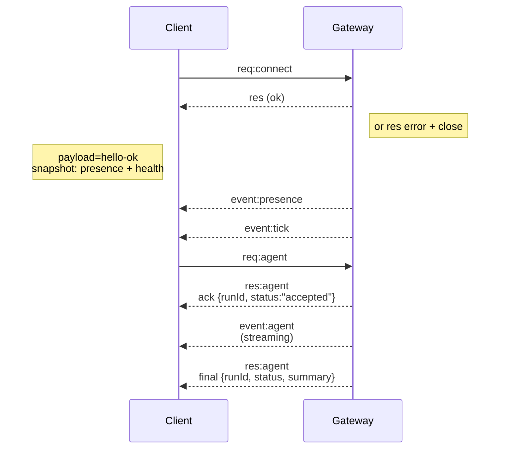

# 게이트웨이 아키텍처

최종 업데이트 날짜: 2026-01-22

## 개요

- 수명이 긴 단일 **게이트웨이**가 모든 메시징 표면을 소유합니다(WhatsApp을 통해)
  Baileys, grammY를 통한 텔레그램, Slack, Discord, Signal, iMessage, WebChat).
- 제어 평면 클라이언트(macOS 앱, CLI, 웹 UI, 자동화)는
  구성된 바인드 호스트에서 **WebSocket**을 통한 게이트웨이(기본값)
  `127.0.0.1:18789`).
- **노드**(macOS/iOS/Android/헤드리스)도 **WebSocket**을 통해 연결되지만
  명시적인 대문자/명령을 사용하여 `role: node`를 선언합니다.
- 호스트당 하나의 게이트웨이; WhatsApp 세션을 여는 유일한 장소입니다.
- **캔버스 호스트**(기본값 `18793`)는 에이전트 편집 가능한 HTML 및 A2UI를 제공합니다.

## 구성요소 및 흐름

### 게이트웨이(데몬)

- 공급자 연결을 유지합니다.
- 형식화된 WS API(요청, 응답, 서버 푸시 이벤트)를 노출합니다.
- JSON 스키마에 대해 인바운드 프레임의 유효성을 검사합니다.
- `agent`, `chat`, `presence`, `health`, `heartbeat`, `cron`와 같은 이벤트를 내보냅니다.

### 클라이언트(mac 앱/CLI/웹 관리자)

- 클라이언트당 하나의 WS 연결.
- 요청(`health`, `status`, `send`, `agent`, `system-presence`)을 보냅니다.
- 이벤트(`tick`, `agent`, `presence`, `shutdown`)를 구독하세요.

### 노드(macOS/iOS/Android/헤드리스)

- `role: node`를 사용하여 **동일한 WS 서버**에 연결합니다.
- `connect`에 장치 ID를 제공합니다. 페어링은 **장치 기반**(역할 `node`)이며
  승인은 장치 페어링 저장소에 있습니다.
- `canvas.*`, `camera.*`, `screen.record`, `location.get`와 같은 명령을 노출합니다.

프로토콜 세부정보:

- [게이트웨이 프로토콜](/gateway/protocol)

### 웹채팅

- 채팅 기록 및 전송을 위해 Gateway WS API를 사용하는 정적 UI입니다.
- 원격 설정에서는 다른 것과 동일한 SSH/Tailscale 터널을 통해 연결합니다.
  클라이언트.

## 연결 수명 주기(단일 클라이언트)



## 유선 프로토콜(요약)

- 전송: WebSocket, JSON 페이로드가 포함된 텍스트 프레임.
- 첫 번째 프레임은 **반드시** `connect`여야 합니다.
- 악수 후:
  - 요청: `{type:"req", id, method, params}` → `{type:"res", id, ok, payload|error}`
  - 이벤트: `{type:"event", event, payload, seq?, stateVersion?}`
- `OPENCLAW_GATEWAY_TOKEN` (또는 `--token`)가 설정된 경우, `connect.params.auth.token`
  일치해야 합니다. 그렇지 않으면 소켓이 닫힙니다.
- 부작용 메서드(`send`, `agent`)에는 멱등성 키가 필요합니다.
  안전하게 다시 시도하세요. 서버는 단기 중복 제거 캐시를 유지합니다.
- 노드에는 `role: "node"`와 `connect`에 대문자/명령/권한이 포함되어야 합니다.

## 페어링 + 로컬 신뢰

- 모든 WS 클라이언트(운영자 + 노드)는 `connect`에 **장치 ID**를 포함합니다.
- 새로운 장치 ID에는 페어링 승인이 필요합니다. 게이트웨이는 **장치 토큰**을 발행합니다.
  후속 연결을 위해.
- **로컬** 연결(루프백 또는 게이트웨이 호스트의 자체 tailnet 주소)이 가능합니다.
  동일한 호스트 UX를 원활하게 유지하기 위해 자동 승인됩니다.
- **비로컬** 연결은 `connect.challenge` nonce에 서명해야 하며 다음을 요구합니다.
  명시적인 승인.
- 게이트웨이 인증(`gateway.auth.*`)은 로컬 또는 **모든** 연결에 계속 적용됩니다.
  원격.

세부정보: [게이트웨이 프로토콜](/gateway/protocol), [페어링](/channels/pairing),
[보안](/gateway/security).

## 프로토콜 타이핑 및 코드 생성

- TypeBox 스키마는 프로토콜을 정의합니다.
- 해당 스키마에서 JSON 스키마가 생성됩니다.
- Swift 모델은 JSON 스키마에서 생성됩니다.

## 원격 액세스

- 선호: Tailscale 또는 VPN.
- 대안: SSH 터널

  ```bash
  ssh -N -L 18789:127.0.0.1:18789 user@host
  ```

- 동일한 핸드셰이크 + 인증 토큰이 터널에 적용됩니다.
- 원격 설정에서 WS에 대해 TLS + 선택적 고정을 활성화할 수 있습니다.

## 운영 스냅샷

- 시작: `openclaw gateway` (포그라운드, stdout에 로그).
- 상태: WS를 통한 `health`(`hello-ok`에도 포함됨).
- 감독: 자동 재시작을 위한 launchd/systemd.

## 불변

- 정확히 하나의 게이트웨이가 호스트당 단일 Baileys 세션을 제어합니다.
- 악수는 필수입니다. JSON이 아니거나 연결되지 않은 첫 번째 프레임은 모두 강제 종료됩니다.
- 이벤트는 재생되지 않습니다. 클라이언트는 간격이 있을 때 새로 고쳐야 합니다.
