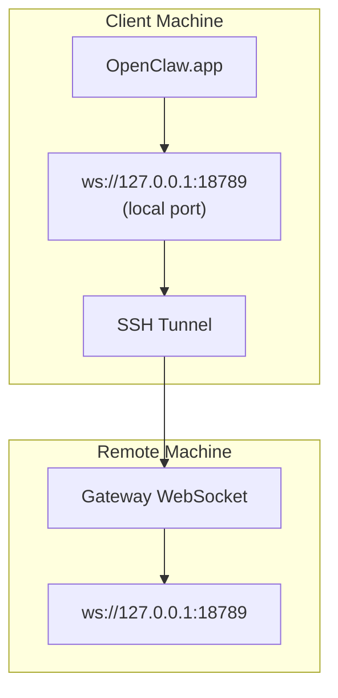

# 원격 게이트웨이로 OpenClaw.app 실행

OpenClaw.app은 SSH 터널링을 사용하여 원격 게이트웨이에 연결합니다. 이 가이드에서는 설정 방법을 보여줍니다.

## 개요



## 빠른 설정

### 1단계: SSH 구성 추가

`~/.ssh/config`를 편집하고 다음을 추가합니다.

```ssh
Host remote-gateway
    HostName <REMOTE_IP>          # e.g., 172.27.187.184
    User <REMOTE_USER>            # e.g., jefferson
    LocalForward 18789 127.0.0.1:18789
    IdentityFile ~/.ssh/id_rsa
```

`<REMOTE_IP>` 및 `<REMOTE_USER>`를 원하는 값으로 바꾸세요.

### 2단계: SSH 키 복사

공개 키를 원격 시스템에 복사합니다(비밀번호는 한 번 입력).

```bash
ssh-copy-id -i ~/.ssh/id_rsa <REMOTE_USER>@<REMOTE_IP>
```

### 3단계: 게이트웨이 토큰 설정

```bash
launchctl setenv OPENCLAW_GATEWAY_TOKEN "<your-token>"
```

### 4단계: SSH 터널 시작

```bash
ssh -N remote-gateway &
```

### 5단계: OpenClaw.app 다시 시작

```bash
# Quit OpenClaw.app (⌘Q), then reopen:
open /path/to/OpenClaw.app
```

이제 앱이 SSH 터널을 통해 원격 게이트웨이에 연결됩니다.

---

## 로그인 시 터널 자동 시작

로그인할 때 SSH 터널이 자동으로 시작되도록 하려면 시작 에이전트를 생성하세요.

### PLIST 파일 생성

이것을 `~/Library/LaunchAgents/bot.molt.ssh-tunnel.plist`로 저장합니다:

```xml
<?xml version="1.0" encoding="UTF-8"?>
<!DOCTYPE plist PUBLIC "-//Apple//DTD PLIST 1.0//EN" "http://www.apple.com/DTDs/PropertyList-1.0.dtd">
<plist version="1.0">
<dict>
    <key>Label</key>
    <string>bot.molt.ssh-tunnel</string>
    <key>ProgramArguments</key>
    <array>
        <string>/usr/bin/ssh</string>
        <string>-N</string>
        <string>remote-gateway</string>
    </array>
    <key>KeepAlive</key>
    <true/>
    <key>RunAtLoad</key>
    <true/>
</dict>
</plist>
```

### 실행 에이전트 로드

```bash
launchctl bootstrap gui/$UID ~/Library/LaunchAgents/bot.molt.ssh-tunnel.plist
```

이제 터널은 다음을 수행합니다.

- 로그인하면 자동으로 시작됩니다.
- 충돌이 발생하면 다시 시작하세요.
- 백그라운드에서 계속 실행

기존 참고 사항: 남은 `com.openclaw.ssh-tunnel` LaunchAgent가 있는 경우 제거합니다.

---

## 문제 해결

**터널이 실행 중인지 확인하세요.**

```bash
ps aux | grep "ssh -N remote-gateway" | grep -v grep
lsof -i :18789
```

**터널 다시 시작:**

```bash
launchctl kickstart -k gui/$UID/bot.molt.ssh-tunnel
```

**터널을 중지하세요.**

```bash
launchctl bootout gui/$UID/bot.molt.ssh-tunnel
```

---

## 작동 방식

| 구성요소                             | 그것이 하는 일                             |
| ------------------------------------ | ------------------------------------------ |
| `LocalForward 18789 127.0.0.1:18789` | 로컬 포트 ​​18789를 원격 포트 18789로 전달 |
| `ssh -N`                             | 원격 명령을 실행하지 않고 SSH(포트 전달만) |
| `KeepAlive`                          | 터널이 충돌하면 자동으로 다시 시작         |
| `RunAtLoad`                          | 에이전트가 로드될 때 터널을 시작합니다.    |

OpenClaw.app은 클라이언트 시스템의 `ws://127.0.0.1:18789`에 연결됩니다. SSH 터널은 해당 연결을 게이트웨이가 실행 중인 원격 시스템의 포트 18789로 전달합니다.
