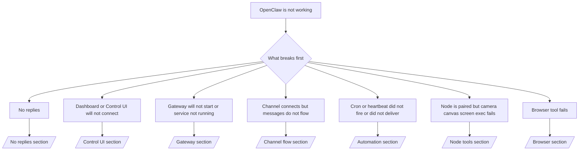

# 문제 해결

2분밖에 시간이 없다면 이 페이지를 분류 정문으로 사용하세요.

## 처음 60초

이 정확한 사다리를 순서대로 실행하십시오.

```bash
openclaw status
openclaw status --all
openclaw gateway probe
openclaw gateway status
openclaw doctor
openclaw channels status --probe
openclaw logs --follow
```

한 줄로 좋은 출력 :

- `openclaw status` → 구성된 채널을 표시하며 명백한 인증 오류는 없습니다.
- `openclaw status --all` → 전체 보고서가 존재하며 공유 가능합니다.
- `openclaw gateway probe` → 예상 게이트웨이 대상에 도달 가능합니다.
- `openclaw gateway status` → `Runtime: running` 및 `RPC probe: ok`.
- `openclaw doctor` → 차단 구성/서비스 오류가 없습니다.
- `openclaw channels status --probe` → 채널이 `connected` 또는 `ready`를 보고합니다.
- `openclaw logs --follow` → 꾸준한 활동, 치명적인 오류가 반복되지 않음.

## 의사결정 트리



<AccordionGroup>
  <Accordion title="No replies">
    ```bash
    openclaw status
    openclaw gateway status
    openclaw channels status --probe
    openclaw pairing list <channel>
    openclaw logs --follow
    ```

    좋은 출력은 다음과 같습니다.

    - `Runtime: running`
    - `RPC probe: ok`
    - 귀하의 채널이 `channels status --probe`에 연결됨/준비됨으로 표시됩니다.
    - 보낸 사람이 승인된 것으로 나타납니다(또는 DM 정책이 공개/허용 목록임).

    일반적인 로그 서명:

    - `drop guild message (mention required` → 게이팅이 Discord에서 메시지를 차단했다는 언급이 있습니다.
    - `pairing request` → 보낸 사람이 승인되지 않고 DM 페어링 승인을 기다리고 있습니다.
    - 채널 로그 내 `blocked` / `allowlist` → 발신자, 방, 그룹이 필터링됩니다.

    깊은 페이지:

    - [/gateway/troubleshooting#no-replies](/gateway/troubleshooting#no-replies)
    - [/채널/문제 해결](/channels/troubleshooting)
    - [/채널/페어링](/channels/pairing)

  </Accordion>

  <Accordion title="Dashboard or Control UI will not connect">
    ```bash
    openclaw status
    openclaw gateway status
    openclaw logs --follow
    openclaw doctor
    openclaw channels status --probe
    ```

    좋은 출력은 다음과 같습니다.

    - `Dashboard: http://...`는 `openclaw gateway status`에 표시됩니다.
    - `RPC probe: ok`
    - 로그에 인증 루프가 없습니다.

    일반적인 로그 서명:

    - `device identity required` → HTTP/비보안 컨텍스트에서는 장치 인증을 완료할 수 없습니다.
    - `unauthorized` / 루프 재연결 → 잘못된 토큰/비밀번호 또는 인증 모드 불일치.
    - `gateway connect failed:` → UI가 잘못된 URL/포트를 타겟팅하거나 연결할 수 없는 게이트웨이입니다.

    깊은 페이지:

    - [/gateway/troubleshooting#dashboard-control-ui-connectivity](/gateway/troubleshooting#dashboard-control-ui-connectivity)
    - [/web/control-ui](/web/control-ui)
    - [/gateway/인증](/gateway/authentication)

  </Accordion>

  <Accordion title="Gateway will not start or service installed but not running">
    ```bash
    openclaw status
    openclaw gateway status
    openclaw logs --follow
    openclaw doctor
    openclaw channels status --probe
    ```

    좋은 출력은 다음과 같습니다.

    - `Service: ... (loaded)`
    - `Runtime: running`
    - `RPC probe: ok`

    일반적인 로그 서명:

    - `Gateway start blocked: set gateway.mode=local` → 게이트웨이 모드가 설정 해제/원격입니다.
    - `refusing to bind gateway ... without auth` → 토큰/비밀번호 없이 비루프백 바인딩.
    - `another gateway instance is already listening` 또는 `EADDRINUSE` → 포트가 이미 사용 중입니다.

    깊은 페이지:

    - [/gateway/troubleshooting#gateway-service-not-running](/gateway/troubleshooting#gateway-service-not-running)
    - [/gateway/백그라운드 프로세스](/gateway/background-process)
    - [/gateway/구성](/gateway/configuration)

  </Accordion>

  <Accordion title="Channel connects but messages do not flow">
    ```bash
    openclaw status
    openclaw gateway status
    openclaw logs --follow
    openclaw doctor
    openclaw channels status --probe
    ```

    좋은 출력은 다음과 같습니다.

    - 채널 전송이 연결되었습니다.
    - 페어링/허용 목록 확인이 통과되었습니다.
    - 필요한 경우 멘션이 감지됩니다.

    일반적인 로그 서명:

    - `mention required` → 그룹 언급 게이팅 차단 처리.
    - `pairing` / `pending` → DM 발송자는 아직 승인되지 않았습니다.
    - `not_in_channel`, `missing_scope`, `Forbidden`, `401/403` → 채널 권한 토큰이 발급됩니다.

    깊은 페이지:

    - [/gateway/troubleshooting#channel-connected-messages-not-flowing](/gateway/troubleshooting#channel-connected-messages-not-flowing)
    - [/채널/문제 해결](/channels/troubleshooting)

  </Accordion>

  <Accordion title="Cron or heartbeat did not fire or did not deliver">
    ```bash
    openclaw status
    openclaw gateway status
    openclaw cron status
    openclaw cron list
    openclaw cron runs --id <jobId> --limit 20
    openclaw logs --follow
    ```

    좋은 출력은 다음과 같습니다.

    - `cron.status`는 다음 깨우기로 활성화된 것으로 표시됩니다.
    - `cron runs`는 최근 `ok` 항목을 보여줍니다.
    - 하트비트가 활성화되어 있으며 활동 시간을 벗어나지 않습니다.

    일반적인 로그 서명:

    - `cron: scheduler disabled; jobs will not run automatically` → 크론이 비활성화됩니다.
    - `heartbeat skipped`는 `reason=quiet-hours` → 구성된 활동 시간을 벗어났습니다.
    - `requests-in-flight` → 메인 레인이 혼잡함; 심장박동 깨우기가 연기되었습니다.
    - `unknown accountId` → 하트비트 전달 대상 계정이 존재하지 않습니다.

    깊은 페이지:

    - [/gateway/troubleshooting#cron-and-heartbeat-delivery](/gateway/troubleshooting#cron-and-heartbeat-delivery)
    - [/자동화/문제 해결](/automation/troubleshooting)
    - [/gateway/heartbeat](/gateway/heartbeat)

  </Accordion>

  <Accordion title="Node is paired but tool fails camera canvas screen exec">
    ```bash
    openclaw status
    openclaw gateway status
    openclaw nodes status
    openclaw nodes describe --node <idOrNameOrIp>
    openclaw logs --follow
    ```

    좋은 출력은 다음과 같습니다.

    - 노드는 `node` 역할에 대해 연결 및 페어링된 것으로 나열됩니다.
    - 호출하는 명령에 대한 기능이 존재합니다.
    - 도구에 대한 권한 상태가 부여됩니다.

    일반적인 로그 서명:

    - `NODE_BACKGROUND_UNAVAILABLE` → 노드 앱을 포그라운드로 가져옵니다.
    - `*_PERMISSION_REQUIRED` → OS 권한이 거부/누락되었습니다.
    - `SYSTEM_RUN_DENIED: approval required` → 실행 승인이 보류 중입니다.
    - `SYSTEM_RUN_DENIED: allowlist miss` → 실행 허용 목록에 없는 명령입니다.

    깊은 페이지:

    - [/gateway/troubleshooting#node-paired-tool-fails](/gateway/troubleshooting#node-paired-tool-fails)
    - [/nodes/문제 해결](/nodes/troubleshooting)
    - [/tools/exec-승인](/tools/exec-approvals)

  </Accordion>

  <Accordion title="Browser tool fails">
    ```bash
    openclaw status
    openclaw gateway status
    openclaw browser status
    openclaw logs --follow
    openclaw doctor
    ```

    좋은 출력은 다음과 같습니다.

    - 브라우저 상태는 `running: true` 및 선택한 브라우저/프로필을 표시합니다.
    - `openclaw` 프로필이 시작되거나 `chrome` 릴레이에 탭이 첨부되어 있습니다.

    일반적인 로그 서명:

    - `Failed to start Chrome CDP on port` → 로컬 브라우저 실행에 실패했습니다.
    - `browser.executablePath not found` → 구성된 바이너리 경로가 잘못되었습니다.
    - `Chrome extension relay is running, but no tab is connected` → 확장자가 첨부되지 않았습니다.
    - `Browser attachOnly is enabled ... not reachable` → 연결 전용 프로필에는 라이브 CDP 대상이 없습니다.

    깊은 페이지:

    - [/gateway/troubleshooting#browser-tool-fails](/gateway/troubleshooting#browser-tool-fails)
    - [/tools/browser-linux-문제 해결](/tools/browser-linux-troubleshooting)
    - [/tools/chrome-extension](/tools/chrome-extension)

  </Accordion>
</AccordionGroup>
