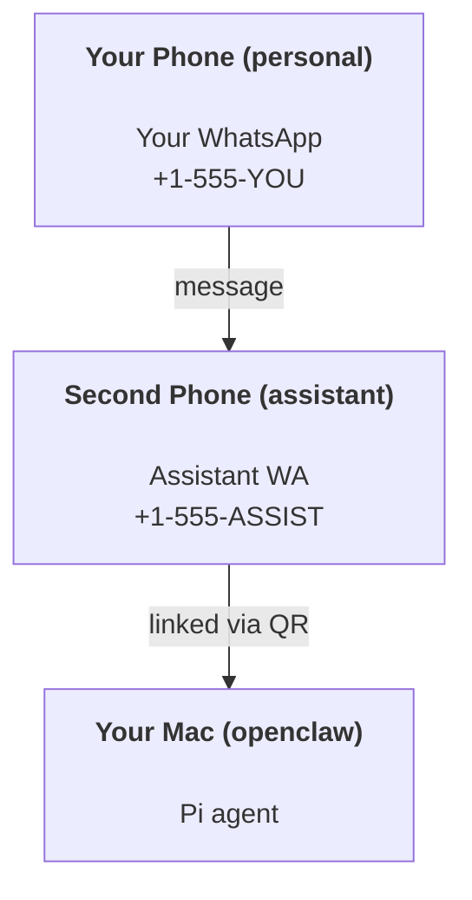

# OpenClaw로 개인 비서 구축하기

OpenClaw는 **Pi** 에이전트를 위한 WhatsApp + Telegram + Discord + iMessage 게이트웨이입니다. 플러그인은 Mattermost를 추가합니다. 이 가이드는 "개인 비서" 설정입니다. 상시 상담원처럼 작동하는 전용 WhatsApp 번호입니다.

## ⚠️ 안전 제일

상담원은 다음과 같은 역할을 맡게 됩니다.

- 컴퓨터에서 명령 실행(Pi 도구 설정에 따라 다름)
- 작업 공간에서 파일 읽기/쓰기
- WhatsApp/Telegram/Discord/Mattermost(플러그인)를 통해 메시지를 다시 보냅니다.

보수적으로 시작하세요:

- 항상 `channels.whatsapp.allowFrom`를 설정하세요(개인용 Mac에서 오픈투더월드(open-to-the-world)를 실행하지 마세요).
- 어시스턴트 전용 WhatsApp 번호를 사용하세요.
- 하트비트는 이제 기본적으로 30분마다로 설정됩니다. `agents.defaults.heartbeat.every: "0m"`를 설정하여 설정을 신뢰할 때까지 비활성화합니다.

## 전제조건

- OpenClaw 설치 및 온보딩 - 아직 수행하지 않은 경우 [시작하기](/start/getting-started)를 참조하세요.
- 보조자를 위한 두 번째 전화번호(SIM/eSIM/선불)

## 두 대의 전화기 설정(권장)

당신은 이것을 원합니다 :



개인 WhatsApp을 OpenClaw에 연결하면 귀하에게 보내는 모든 메시지가 "에이전트 입력"이 됩니다. 당신이 원하는 것은 거의 없습니다.

## 5분 빠른 시작

1. WhatsApp Web을 페어링합니다(QR 표시, 보조 전화기로 스캔).

```bash
openclaw channels login
```

2. 게이트웨이를 시작합니다(실행 상태로 둡니다).

```bash
openclaw gateway --port 18789
```

3. `~/.openclaw/openclaw.json`에 최소 구성을 입력합니다.

```json5
{
  channels: { whatsapp: { allowFrom: ["+15555550123"] } },
}
```

이제 허용 목록에 있는 전화기에서 보조자 번호로 메시지를 보내세요.

온보딩이 완료되면 대시보드가 ​​자동으로 열리고 깨끗한(토큰화되지 않은) 링크가 인쇄됩니다. 인증을 요청하는 메시지가 나타나면 `gateway.auth.token`의 토큰을 Control UI 설정에 붙여넣습니다. 나중에 다시 열려면: `openclaw dashboard`.

## 에이전트에게 작업 공간 제공(AGENTS)

OpenClaw는 작업 공간 디렉토리에서 작동 지침과 "메모리"를 읽습니다.

기본적으로 OpenClaw는 `~/.openclaw/workspace`를 에이전트 작업 공간으로 사용하고 이를 생성합니다(스타터 `AGENTS.md`, `SOUL.md`, `TOOLS.md`, `IDENTITY.md`, `USER.md`, `HEARTBEAT.md`) 설정/첫 번째 에이전트 실행 시 자동으로. `BOOTSTRAP.md`는 작업공간이 완전히 새로운 경우에만 생성됩니다(삭제한 후에는 다시 돌아오지 않아야 함). `MEMORY.md`는 선택 사항입니다(자동 생성되지 않음). 존재하는 경우 일반 세션에 대해 로드됩니다. 하위 에이전트 세션은 `AGENTS.md` 및 `TOOLS.md`만 삽입합니다.

팁: 이 폴더를 OpenClaw의 "메모리"처럼 취급하고 git repo(이상적으로는 비공개)로 만들어 `AGENTS.md` + 메모리 파일을 백업하세요. git이 설치되면 새로운 작업 공간이 자동으로 초기화됩니다.

```bash
openclaw setup
```

전체 작업공간 레이아웃 + 백업 가이드: [에이전트 작업공간](/concepts/agent-workspace)
메모리 작업 흐름: [메모리](/concepts/memory)

선택 사항: `agents.defaults.workspace`를 사용하여 다른 작업 공간을 선택합니다(`~` 지원).

```json5
{
  agent: {
    workspace: "~/.openclaw/workspace",
  },
}
```

이미 저장소에서 자체 작업공간 파일을 제공한 경우 부트스트랩 파일 생성을 완전히 비활성화할 수 있습니다.

```json5
{
  agent: {
    skipBootstrap: true,
  },
}
```

## "어시스턴트"로 바꾸는 구성

OpenClaw는 기본적으로 좋은 어시스턴트 설정을 제공하지만 일반적으로 다음을 조정하고 싶습니다.

- `SOUL.md`의 페르소나/지침
- 사고 기본값(원하는 경우)
- 하트비트(한 번 신뢰하면)

예:

```json5
{
  logging: { level: "info" },
  agent: {
    model: "anthropic/claude-opus-4-6",
    workspace: "~/.openclaw/workspace",
    thinkingDefault: "high",
    timeoutSeconds: 1800,
    // Start with 0; enable later.
    heartbeat: { every: "0m" },
  },
  channels: {
    whatsapp: {
      allowFrom: ["+15555550123"],
      groups: {
        "*": { requireMention: true },
      },
    },
  },
  routing: {
    groupChat: {
      mentionPatterns: ["@openclaw", "openclaw"],
    },
  },
  session: {
    scope: "per-sender",
    resetTriggers: ["/new", "/reset"],
    reset: {
      mode: "daily",
      atHour: 4,
      idleMinutes: 10080,
    },
  },
}
```

## 세션 및 메모리

- 세션 파일: `~/.openclaw/agents/<agentId>/sessions/{{SessionId}}.jsonl`
- 세션 메타데이터(토큰 사용량, 마지막 경로 등): `~/.openclaw/agents/<agentId>/sessions/sessions.json` (레거시: `~/.openclaw/sessions/sessions.json`)
- `/new` 또는 `/reset`는 해당 채팅에 대한 새로운 세션을 시작합니다(`resetTriggers`를 통해 구성 가능). 단독으로 전송된 경우 에이전트는 재설정을 확인하기 위해 짧은 인사로 응답합니다.
- `/compact [instructions]`는 세션 컨텍스트를 압축하고 남은 컨텍스트 예산을 보고합니다.

## 하트비트(사전 모드)

기본적으로 OpenClaw는 다음 메시지와 함께 30분마다 하트비트를 실행합니다.
`Read HEARTBEAT.md if it exists (workspace context). Follow it strictly. Do not infer or repeat old tasks from prior chats. If nothing needs attention, reply HEARTBEAT_OK.`
비활성화하려면 `agents.defaults.heartbeat.every: "0m"`를 설정하세요.

- `HEARTBEAT.md`가 존재하지만 실질적으로 비어 있는 경우(`# Heading`와 같은 마크다운 헤더와 빈 줄만 해당) OpenClaw는 API 호출을 저장하기 위해 하트비트 실행을 건너뜁니다.
- 파일이 누락된 경우에도 하트비트는 계속 실행되며 모델이 수행할 작업을 결정합니다.
- 에이전트가 `HEARTBEAT_OK`(선택적으로 짧은 패딩 포함, `agents.defaults.heartbeat.ackMaxChars` 참조)로 응답하면 OpenClaw는 해당 하트비트에 대한 아웃바운드 전달을 억제합니다.
- 하트비트는 전체 에이전트 회전을 실행합니다. 간격이 짧을수록 더 많은 토큰이 소모됩니다.

```json5
{
  agent: {
    heartbeat: { every: "30m" },
  },
}
```

## 미디어 입출력

인바운드 첨부 파일(이미지/오디오/문서)은 템플릿을 통해 명령에 표시될 수 있습니다.

- `{{MediaPath}}` (로컬 임시 파일 경로)
- `{{MediaUrl}}` (의사 URL)
- `{{Transcript}}` (오디오 전사가 활성화된 경우)

에이전트의 아웃바운드 첨부 파일: 자체 줄에 `MEDIA:<path-or-url>`를 포함합니다(공백 없음). 예:

```
Here’s the screenshot.
MEDIA:https://example.com/screenshot.png
```

OpenClaw는 이를 추출하여 텍스트와 함께 미디어로 보냅니다.

## 운영 체크리스트

```bash
openclaw status          # local status (creds, sessions, queued events)
openclaw status --all    # full diagnosis (read-only, pasteable)
openclaw status --deep   # adds gateway health probes (Telegram + Discord)
openclaw health --json   # gateway health snapshot (WS)
```

로그는 `/tmp/openclaw/` 아래에 저장됩니다(기본값: `openclaw-YYYY-MM-DD.log`).

## 다음 단계

- 웹챗: [웹챗](/web/webchat)
- 게이트웨이 작전: [게이트웨이 런북](/gateway)
- Cron + 웨이크업: [Cron 작업](/automation/cron-jobs)
- macOS 메뉴 표시줄 동반: [OpenClaw macOS 앱](/platforms/macos)
- iOS 노드 앱: [iOS 앱](/platforms/ios)
- Android 노드 앱: [Android 앱](/platforms/android)
- Windows 상태: [Windows(WSL2)](/platforms/windows)
- 리눅스 상태 : [리눅스 앱](/platforms/linux)
- 보안 : [보안](/gateway/security)
