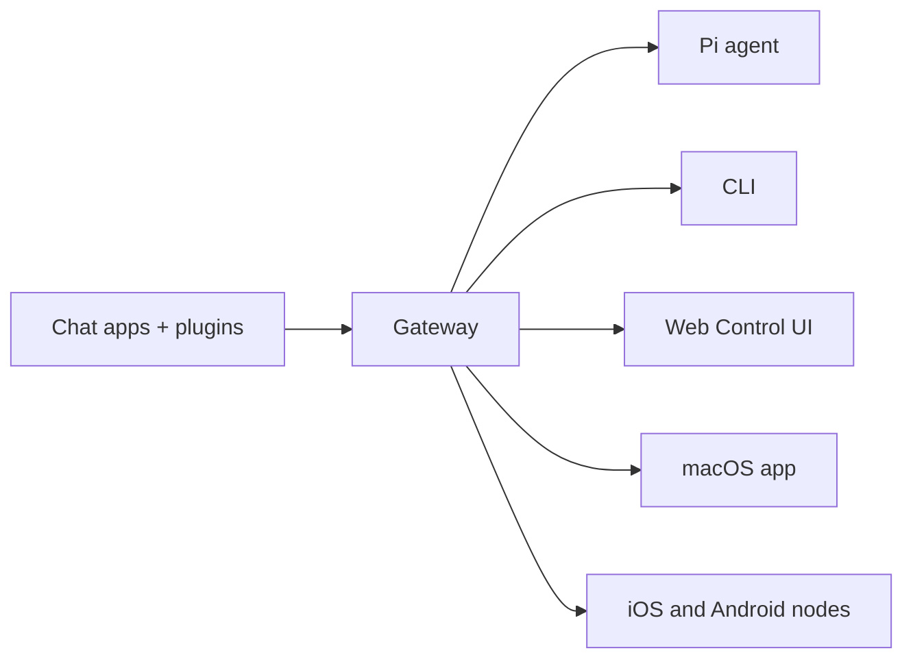

# OpenClaw 🦞

<p align="center">
    
    
</p>

> _"EXFOLIATE! EXFOLIATE!"_ — 아마도 우주 바닷가재

<p align="center">
  <strong>WhatsApp, Telegram, Discord, iMessage 등에서 AI 에이전트를 위한 어떤 OS 용 Gateway(게이트웨이).</strong><br />
  메시지를 보내면, 주머니 속에서 에이전트의 응답을 받습니다. 플러그인으로 Mattermost 등도 추가할 수 있습니다.
</p>

<Columns>
  <Card title="시작하기" href="/start/getting-started" icon="rocket">
    OpenClaw 를 설치하고 몇 분 안에 Gateway(게이트웨이)를 실행합니다.
  </Card>
  <Card title="마법사 실행" href="/start/wizard" icon="sparkles">
    `openclaw onboard` 및 페어링 흐름으로 안내되는 설정입니다.
  </Card>
  <Card title="Control UI 열기" href="/web/control-ui" icon="layout-dashboard">
    채팅, 설정, 세션을 위한 브라우저 대시보드를 실행합니다.
  </Card>
</Columns>

## OpenClaw 란 무엇인가요?

OpenClaw 는 즐겨 사용하는 채팅 앱(WhatsApp, Telegram, Discord, iMessage 등)을 Pi 같은 AI 코딩 에이전트에 연결하는 **자체 호스팅 Gateway(게이트웨이)** 입니다. 사용자는 자신의 머신(또는 서버)에서 단일 Gateway(게이트웨이) 프로세스를 실행하며, 이 프로세스가 메시징 앱과 언제나 사용 가능한 AI 어시스턴트 사이의 브릿지가 됩니다.

**누구를 위한 것인가요?** 어디서든 메시지로 연락할 수 있는 개인 AI 어시스턴트를 원하면서도, 데이터에 대한 통제권을 포기하거나 호스팅 서비스에 의존하고 싶지 않은 개발자와 파워 유저를 위한 것입니다.

**무엇이 다른가요?**

- **자체 호스팅**: 내 하드웨어, 내 규칙으로 실행합니다
- **멀티 채널**: 하나의 Gateway(게이트웨이)가 WhatsApp, Telegram, Discord 등 여러 채널을 동시에 제공합니다
- **에이전트 네이티브**: 도구 사용, 세션, 메모리, 멀티 에이전트 라우팅을 갖춘 코딩 에이전트를 위해 구축되었습니다
- **오픈 소스**: MIT 라이선스, 커뮤니티 주도

**무엇이 필요하나요?** Node 22+, API 키(Anthropic 권장), 그리고 5분입니다.

## 작동 방식



Gateway(게이트웨이)는 세션, 라우팅, 채널 연결에 대한 단일 진실 소스입니다.

## 주요 기능

<Columns>
  <Card title="멀티 채널 Gateway(게이트웨이)" icon="network">
    단일 Gateway(게이트웨이) 프로세스로 WhatsApp, Telegram, Discord, iMessage 를 사용합니다.
  </Card>
  <Card title="플러그인 채널" icon="plug">
    확장 패키지로 Mattermost 등도 추가합니다.
  </Card>
  <Card title="멀티 에이전트 라우팅" icon="route">
    에이전트, 워크스페이스, 발신자별로 분리된 세션을 제공합니다.
  </Card>
  <Card title="미디어 지원" icon="image">
    이미지, 오디오, 문서를 송수신합니다.
  </Card>
  <Card title="웹 Control UI" icon="monitor">
    채팅, 설정, 세션, 노드를 위한 브라우저 대시보드입니다.
  </Card>
  <Card title="모바일 노드" icon="smartphone">
    Canvas 지원과 함께 iOS 및 Android 노드를 페어링합니다.
  </Card>
</Columns>

## 빠른 시작

<Steps>
  <Step title="OpenClaw 설치">
    ```bash
    npm install -g openclaw@latest
    ```
  </Step>
  <Step title="온보딩 및 서비스 설치">
    ```bash
    openclaw onboard --install-daemon
    ```
  </Step>
  <Step title="WhatsApp 페어링 및 Gateway(게이트웨이) 시작">
    ```bash
    openclaw channels login
    openclaw gateway --port 18789
    ```
  </Step>
</Steps>

전체 설치 및 개발 설정이 필요하신가요? [빠른 시작](/start/quickstart)을 참고하세요.

## 대시보드

Gateway(게이트웨이)가 시작된 후 브라우저 Control UI 를 여세요.

- 로컬 기본값: http://127.0.0.1:18789/
- 원격 액세스: [웹 표면](/web) 및 [Tailscale](/gateway/tailscale)

<p align="center">
  
</p>

## 설정 (선택 사항)

설정은 `~/.openclaw/openclaw.json` 에 있습니다.

- **아무것도 하지 않으면**, OpenClaw 는 번들된 Pi 바이너리를 RPC 모드로 사용하며, 발신자별 세션을 사용합니다.
- 잠그고 싶다면, `channels.whatsapp.allowFrom` 및 (그룹의 경우) 멘션 규칙부터 시작하세요.

예:

```json5
{
  channels: {
    whatsapp: {
      allowFrom: ["+15555550123"],
      groups: { "*": { requireMention: true } },
    },
  },
  messages: { groupChat: { mentionPatterns: ["@openclaw"] } },
}
```

## 여기서 시작하세요

<Columns>
  <Card title="문서 허브" href="/start/hubs" icon="book-open">
    사용 사례별로 정리된 모든 문서와 가이드입니다.
  </Card>
  <Card title="설정" href="/gateway/configuration" icon="settings">
    핵심 Gateway(게이트웨이) 설정, 토큰, 프로바이더 설정입니다.
  </Card>
  <Card title="원격 액세스" href="/gateway/remote" icon="globe">
    SSH 및 tailnet 액세스 패턴입니다.
  </Card>
  <Card title="채널" href="/channels/telegram" icon="message-square">
    WhatsApp, Telegram, Discord 등 채널별 설정입니다.
  </Card>
  <Card title="노드" href="/nodes" icon="smartphone">
    페어링 및 Canvas 를 지원하는 iOS 및 Android 노드입니다.
  </Card>
  <Card title="도움말" href="/help" icon="life-buoy">
    일반적인 해결 방법과 문제 해결 진입점입니다.
  </Card>
</Columns>

## 더 알아보기

<Columns>
  <Card title="전체 기능 목록" href="/concepts/features" icon="list">
    채널, 라우팅, 미디어 기능 전체입니다.
  </Card>
  <Card title="멀티 에이전트 라우팅" href="/concepts/multi-agent" icon="route">
    워크스페이스 격리 및 에이전트별 세션입니다.
  </Card>
  <Card title="보안" href="/gateway/security" icon="shield">
    토큰, 허용 목록, 안전 제어입니다.
  </Card>
  <Card title="문제 해결" href="/gateway/troubleshooting" icon="wrench">
    Gateway(게이트웨이) 진단 및 일반적인 오류입니다.
  </Card>
  <Card title="소개 및 크레딧" href="/reference/credits" icon="info">
    프로젝트 기원, 기여자, 라이선스입니다.
  </Card>
</Columns>
