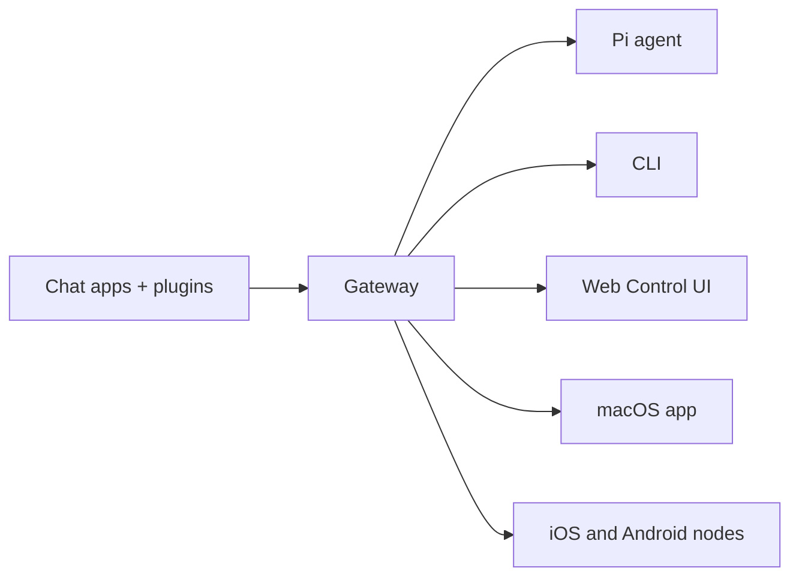

---
read_when:
    - 신규 사용자에게 OpenClaw 소개
summary: OpenClaw는 모든 OS에서 실행되는 AI 에이전트용 멀티채널 게이트웨이입니다.
title: OpenClaw
x-i18n:
    generated_at: "2026-02-08T16:04:45Z"
    model: gtx
    provider: google-translate
    source_hash: 22725fdce9eafb337e9eb36958644009aa4a9f630e3a251c800cf921a987cb1c
    source_path: index.md
    workflow: 15
---

# OpenClaw 🦞

<p align="center">
    
    
</p>

> _"EXFOLIATE! EXFOLIATE!"_ - 아마 우주 랍스터일 겁니다

<p align="center">
  <strong>WhatsApp, Telegram, Discord, iMessage 등에서 동작하는 AI 에이전트용 멀티 OS 게이트웨이.</strong><br />
  메시지를 보내면 언제든 에이전트 응답을 받을 수 있습니다. 플러그인으로 Mattermost 등도 확장할 수 있습니다.
</p>

<Columns>
  <Card title="시작하기" href="/start/getting-started" icon="rocket">
    OpenClaw를 설치하고 몇 분 안에 Gateway를 실행하세요.
  </Card>
  <Card title="마법사 실행" href="/start/wizard" icon="sparkles">
    `openclaw onboard`와 페어링 흐름으로 안내형 설정을 진행합니다.
  </Card>
  <Card title="Control UI 열기" href="/web/control-ui" icon="layout-dashboard">
    채팅, 구성, 세션 관리를 위한 브라우저 대시보드를 엽니다.
  </Card>
</Columns>

## OpenClaw란

OpenClaw는 **셀프 호스팅 게이트웨이**입니다. WhatsApp, Telegram, Discord, iMessage 같은 메시징 앱을 Pi 같은 AI 코딩 에이전트와 연결해 줍니다. 내 PC(또는 서버)에서 Gateway 프로세스 하나만 실행하면, 메시징 앱과 항상 대기 중인 AI 비서 사이의 브리지 역할을 합니다.

**누가 쓰면 좋은가요?** 데이터 통제권을 유지하면서, 호스팅 서비스에 의존하지 않고 어디서나 메시지로 AI 비서를 쓰고 싶은 개발자와 파워 유저.

**무엇이 다른가요?**

- **셀프 호스팅**: 내 하드웨어, 내 운영 방식
- **멀티 채널**: 하나의 Gateway로 WhatsApp, Telegram, Discord 등을 동시에 연결
- **에이전트 네이티브**: 도구 호출, 세션, 메모리, 멀티 에이전트 라우팅에 최적화
- **오픈 소스**: MIT 라이선스, 커뮤니티 중심 개발

**무엇이 필요한가요?** Node 22+, API 키(Anthropic 권장), 그리고 5분.

## 동작 방식



Gateway는 세션, 라우팅, 채널 연결의 단일 기준점입니다.

## 핵심 기능

<Columns>
  <Card title="멀티 채널 게이트웨이" icon="network">
    단일 Gateway 프로세스로 WhatsApp, Telegram, Discord, iMessage를 연결합니다.
  </Card>
  <Card title="플러그인 채널" icon="plug">
    확장 패키지로 Mattermost 등 추가 채널을 연결할 수 있습니다.
  </Card>
  <Card title="멀티 에이전트 라우팅" icon="route">
    에이전트, 워크스페이스, 발신자 단위로 세션을 분리합니다.
  </Card>
  <Card title="미디어 지원" icon="image">
    이미지, 오디오, 문서를 주고받을 수 있습니다.
  </Card>
  <Card title="Web Control UI" icon="monitor">
    채팅, 구성, 세션, 노드를 관리하는 브라우저 대시보드입니다.
  </Card>
  <Card title="모바일 노드" icon="smartphone">
    iOS/Android 노드를 페어링하고 Canvas 기능을 사용할 수 있습니다.
  </Card>
</Columns>

## 빠른 시작

<Steps>
  <Step title="OpenClaw 설치">
    ```bash
    npm install -g openclaw@latest
    ```
  </Step>
  <Step title="온보딩 및 서비스 설치">
    ```bash
    openclaw onboard --install-daemon
    ```
  </Step>
  <Step title="WhatsApp 페어링 후 Gateway 시작">
    ```bash
    openclaw channels login
    openclaw gateway --port 18789
    ```
  </Step>
</Steps>

전체 설치와 개발 환경 설정이 필요하면 [빠른 시작](/start/quickstart)을 참고하세요.

## 대시보드

Gateway가 실행되면 브라우저에서 Control UI를 여세요.

- 로컬 기본값: [http://127.0.0.1:18789/](http://127.0.0.1:18789/)
- 원격 접근: [Web surfaces](/web), [Tailscale](/gateway/tailscale)

<p align="center">
  
</p>

## 구성 선택 사항

구성 파일 경로: `~/.openclaw/openclaw.json`

- 기본 설정 그대로 사용하면 OpenClaw는 번들된 Pi 바이너리를 RPC 모드로 실행하고 발신자별 세션을 사용합니다.
- 접근 제어를 강화하려면 `channels.whatsapp.allowFrom`과 (그룹용) 멘션 규칙부터 설정하세요.

예시:

```json5
{
  channels: {
    whatsapp: {
      allowFrom: ["+15555550123"],
      groups: { "*": { requireMention: true } },
    },
  },
  messages: { groupChat: { mentionPatterns: ["@openclaw"] } },
}
```

## 여기서 시작

<Columns>
  <Card title="문서 허브" href="/start/hubs" icon="book-open">
    사용 사례별로 정리된 문서와 가이드를 확인하세요.
  </Card>
  <Card title="구성" href="/gateway/configuration" icon="settings">
    Gateway 핵심 설정, 토큰, 모델 제공자 구성을 다룹니다.
  </Card>
  <Card title="원격 접근" href="/gateway/remote" icon="globe">
    SSH와 tailnet 기반 원격 접근 패턴을 설명합니다.
  </Card>
  <Card title="채널" href="/channels/telegram" icon="message-square">
    WhatsApp, Telegram, Discord 등 채널별 설정 가이드입니다.
  </Card>
  <Card title="노드" href="/nodes" icon="smartphone">
    iOS/Android 노드 페어링과 Canvas 사용 방법을 안내합니다.
  </Card>
  <Card title="도움말" href="/help" icon="life-buoy">
    자주 발생하는 문제와 해결 가이드를 제공합니다.
  </Card>
</Columns>

## 더 알아보기

<Columns>
  <Card title="전체 기능 목록" href="/concepts/features" icon="list">
    채널, 라우팅, 미디어 기능을 한 번에 확인하세요.
  </Card>
  <Card title="멀티 에이전트 라우팅" href="/concepts/multi-agent" icon="route">
    워크스페이스 분리와 에이전트별 세션 전략을 다룹니다.
  </Card>
  <Card title="보안" href="/gateway/security" icon="shield">
    토큰, 허용 목록, 안전 제어를 설명합니다.
  </Card>
  <Card title="문제 해결" href="/gateway/troubleshooting" icon="wrench">
    Gateway 진단 방법과 대표 오류 대응 방법을 확인하세요.
  </Card>
  <Card title="프로젝트 정보" href="/reference/credits" icon="info">
    프로젝트 배경, 기여자, 라이선스를 확인할 수 있습니다.
  </Card>
</Columns>
