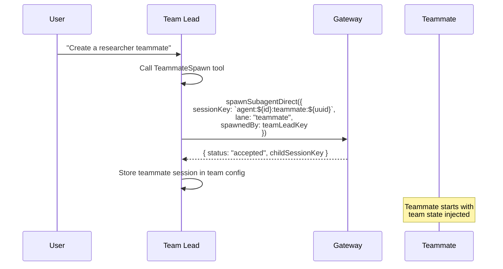
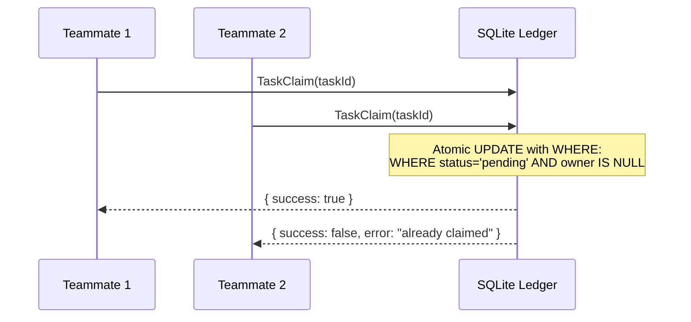
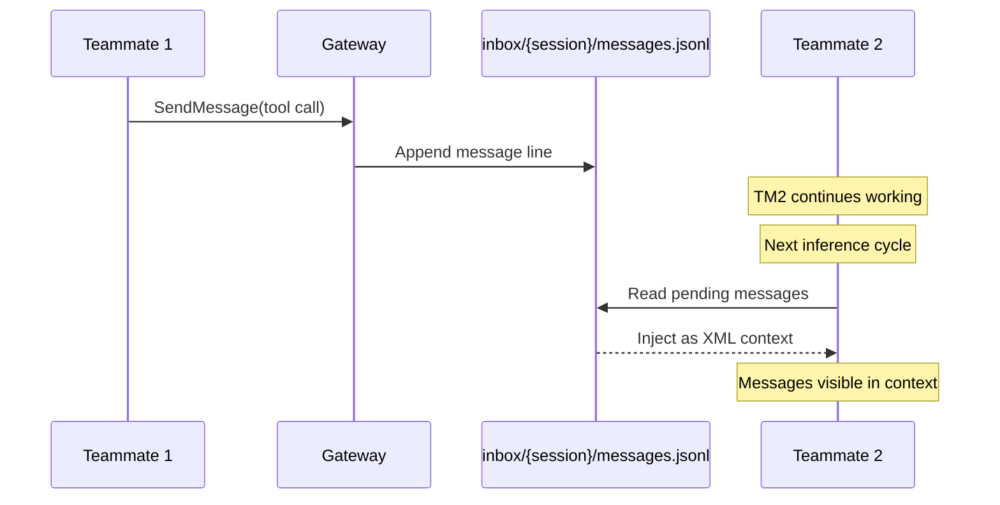
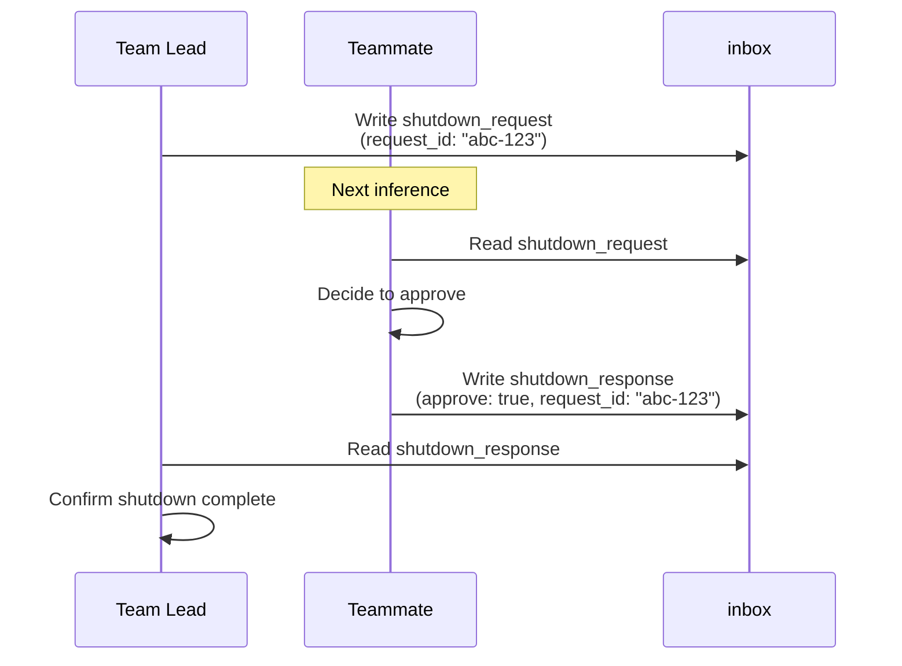
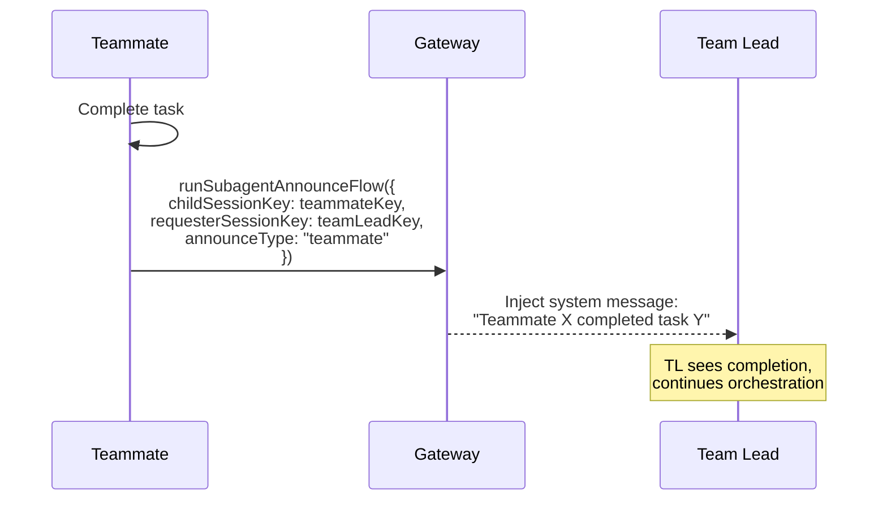

# OpenClaw Agent Teams Design

## Context

This document describes the design for implementing Claude Code-style multi-agent team orchestration in OpenClaw. The design enables a Team Lead agent to coordinate multiple independent Teammate agents through a shared task ledger with SQLite-backed concurrency control and a mailbox protocol for peer-to-peer communication.

**Key Design Decisions:**

1. **Teammate as Subagent**: Teammates spawn via `spawnSubagentDirect()` using dedicated `teammate` lane
2. **Hybrid Communication**: Mailbox for async peer-to-peer + Announce flow for completion reporting
3. **Unified Storage**: Team data in `~/.openclaw/teams/`, simplifying Claude Code's dual `teams/` + `tasks/` structure

## Requirements

### Success Criteria for MVP

| Feature                 | Description                                                                          |
| ----------------------- | ------------------------------------------------------------------------------------ |
| **Team Creation**       | `TeamCreate` tool creates team config at `~/.openclaw/teams/{team_name}/config.json` |
| **Teammate Spawning**   | `TeammateSpawn` spawns via `spawnSubagentDirect()` with `lane: "teammate"`           |
| **Task Ledger**         | SQLite at `~/.openclaw/teams/{team}/ledger.db` with atomic claiming                  |
| **Task Dependencies**   | `dependsOn`/`blockedBy` resolution with auto-unblock on completion                   |
| **Mailbox Protocol**    | File-based inbox for async peer-to-peer messaging                                    |
| **Shutdown Protocol**   | Request/response pattern for graceful teammate termination                           |
| **Completion Announce** | `runSubagentAnnounceFlow()` for teammate → team lead reporting                       |

### Technical Constraints

- **Language**: TypeScript (ESM), Node.js 22+, pnpm package manager
- **Database**: SQLite (node:sqlite) with WAL mode
- **Implementation**: Native OpenClaw tools (not skills/extensions)
- **Testing**: Vitest with BDD scenarios (84 total)
- **Integration**: Reuse `spawnSubagentDirect`, `runSubagentAnnounceFlow`, Gateway delivery

## Rationale

### Why Hybrid Communication Model

| Pattern              | Use Case                     | Implementation                    |
| -------------------- | ---------------------------- | --------------------------------- |
| **Mailbox (inbox/)** | Peer-to-peer async messaging | File-based, injected into context |
| **Announce Flow**    | Task completion → team lead  | Reuse `runSubagentAnnounceFlow()` |
| **Broadcast**        | Team-wide announcements      | Write to all member inboxes       |

This hybrid approach:

- Avoids reinventing delivery logic (reuse announce flow)
- Enables true peer-to-peer async communication (mailbox)
- Aligns with OpenClaw's existing subagent infrastructure

### Why SQLite for Task Ledger

The task ledger is a shared resource accessed concurrently by multiple independent Node.js event loops. SQLite with WAL mode provides:

1. **Transactional Integrity**: Atomic updates for task claiming prevent race conditions
2. **Concurrent Reads**: Multiple agents can query tasks while writes are in progress
3. **Persistence**: Survives Gateway restarts, no data loss
4. **Simplicity**: No complex file locking logic required

### Why File-Based Team Storage

OpenClaw follows a local-first, file-driven design. Storing team data in `~/.openclaw/teams/` provides:

1. **Transparency**: Users can inspect team state directly
2. **Durability**: Survives process crashes and restarts
3. **Alignment**: Consistent with existing `~/.openclaw/agents/` patterns
4. **Debuggability**: Direct file inspection for troubleshooting

### Why Teammate as Subagent

| Aspect        | Claude Code              | OpenClaw (Revised)             |
| ------------- | ------------------------ | ------------------------------ |
| Spawn backend | tmux, iTerm2, in-process | `spawnSubagentDirect()`        |
| Session key   | Custom format            | `agent:${id}:teammate:${uuid}` |
| Lane          | N/A                      | `AGENT_LANE_TEAMMATE`          |
| Communication | Mailbox only             | Mailbox + Announce flow        |

## Detailed Design

### Architecture Overview

```mermaid
graph TB
    subgraph User Interface
        U[User Message]
    end

    subgraph Gateway
        G[Gateway WebSocket Server]
        TL[Team Lead Session]
    end

    subgraph Team Storage
        DIR[~/.openclaw/teams/{team}/]
        CFG[config.json]
        DB[ledger.db SQLite]
        INBOX[inbox/]
    end

    subgraph Teammates
        TM1[Teammate 1 Session<br/>lane: teammate]
        TM2[Teammate 2 Session<br/>lane: teammate]
    end

    U --> G
    G --> TL

    TL -->|TeamCreate| DIR
    TL -->|TeammateSpawn| G
    G -->|spawnSubagentDirect| TM1
    G -->|spawnSubagentDirect| TM2

    TM1 -->|TaskClaim| DB
    TM2 -->|TaskClaim| DB

    TM1 -->|SendMessage| INBOX
    TM2 -->|SendMessage| INBOX
    TL -->|SendMessage| INBOX

    INBOX -->|inject context| TM1
    INBOX -->|inject context| TM2
    INBOX -->|inject context| TL

    TM1 -->|AnnounceFlow| TL
    TM2 -->|AnnounceFlow| TL
```

### Directory Structure

```
~/.openclaw/
├── teams/
│   ├── teams.json                    # Team registry (name → path mapping)
│   └── {team_name}/
│       ├── config.json               # Team configuration
│       ├── ledger.db                 # SQLite task ledger
│       ├── ledger.db-shm             # WAL shared memory
│       ├── ledger.db-wal             # WAL log
│       └── inbox/
│           ├── {session_key}/
│           │   └── messages.jsonl    # Message queue (one line per message)
```

### Session Key Patterns

| Session Type | Format                              | Example                                                       |
| ------------ | ----------------------------------- | ------------------------------------------------------------- |
| Team Lead    | `agent:${agentId}:team:${teamName}` | `agent:default:team:my-project`                               |
| Teammate     | `agent:${agentId}:teammate:${uuid}` | `agent:default:teammate:550e8400-e29b-41d4-a716-446655440000` |

### SQLite Schema

```sql
-- Tasks table
CREATE TABLE IF NOT EXISTS tasks (
  id TEXT PRIMARY KEY,
  subject TEXT NOT NULL,
  description TEXT NOT NULL,
  activeForm TEXT,
  status TEXT NOT NULL CHECK(status IN ('pending', 'claimed', 'in_progress', 'completed', 'failed')),
  owner TEXT,                    -- sessionKey of claiming agent
  dependsOn TEXT,                -- JSON array of task IDs
  blockedBy TEXT,                -- JSON array (computed)
  metadata TEXT,                 -- JSON object
  createdAt INTEGER NOT NULL,
  claimedAt INTEGER,
  completedAt INTEGER
);

-- Team members table (optional, for team state)
CREATE TABLE IF NOT EXISTS members (
  sessionKey TEXT PRIMARY KEY,
  agentId TEXT NOT NULL,
  name TEXT,
  role TEXT CHECK(role IN ('lead', 'member')),
  joinedAt INTEGER NOT NULL
);

-- Indexes
CREATE INDEX IF NOT EXISTS idx_tasks_status ON tasks(status);
CREATE INDEX IF NOT EXISTS idx_tasks_owner ON tasks(owner);
CREATE INDEX IF NOT EXISTS idx_tasks_created ON tasks(createdAt);
```

### Tool API

#### Team Management Tools

**TeamCreate**: Creates a new team

```typescript
{
  team_name: string;           // Required: Path-safe team identifier
  description?: string;        // Optional: Team description
  agent_type?: string;         // Optional: Agent type for team lead
}
```

**TeammateSpawn**: Creates a teammate session via `spawnSubagentDirect`

```typescript
{
  team_name: string;           // Required: Team to join
  name: string;                // Required: Display name
  agent_id?: string;           // Optional: Agent type ID
  model?: string;              // Optional: Model override
  task?: string;               // Optional: Initial task prompt
}
```

**TeamShutdown**: Gracefully shuts down a team

```typescript
{
  team_name: string;           // Required: Team to shutdown
  reason?: string;             // Optional: Shutdown reason
}
```

#### Task Management Tools

**TaskCreate**: Adds a task to the ledger

```typescript
{
  team_name: string;           // Required: Team to add task to
  subject: string;             // Required: Task subject
  description: string;         // Required: Task description
  activeForm?: string;         // Optional: Present continuous form
  dependsOn?: string[];        // Optional: Task ID dependencies
  metadata?: Record<string, unknown>; // Optional: Additional metadata
}
```

**TaskList**: Queries available tasks

```typescript
{
  team_name: string;           // Required: Team to query
  status?: string;             // Optional: Filter by status
  owner?: string;              // Optional: Filter by owner
  includeCompleted?: boolean;  // Optional: Include completed tasks
}
```

**TaskClaim**: Atomically claims a task

```typescript
{
  team_name: string; // Required: Team containing task
  task_id: string; // Required: Task ID to claim
}
```

**TaskComplete**: Marks a task as completed

```typescript
{
  team_name: string; // Required: Team containing task
  task_id: string; // Required: Task ID to complete
}
```

#### Communication Tools

**SendMessage**: Sends a message to teammate(s)

```typescript
{
  team_name: string;           // Required: Team context
  type: "message" | "broadcast" | "shutdown_request" | "shutdown_response";
  recipient?: string;          // Required for message type (session key)
  content: string;             // Required: Message content
  summary?: string;            // Optional: 5-10 word summary for UI
  request_id?: string;         // Required for shutdown_request/response
  approve?: boolean;           // Required for shutdown_response
  reason?: string;             // Optional: Reject reason for shutdown_response
}
```

### Session State Integration

Add team-related fields to `SessionEntry` type in `src/config/sessions/types.ts`:

```typescript
export type SessionEntry = {
  // ... existing fields ...
  teamId?: string; // ID of team session belongs to
  teamRole?: "lead" | "member"; // Role in team
  teamName?: string; // Human-readable team name
  teammateColor?: string; // Display color for UI (e.g., "#D94A4A")
};
```

### Communication Flows

#### 1. Teammate Spawn Flow



#### 2. Task Claim Flow



#### 3. Peer-to-Peer Message Flow



#### 4. Shutdown Protocol Flow



#### 5. Task Completion Announce Flow



### Context Injection

#### Team State for Team Lead

```typescript
function injectTeamState(session: SessionEntry): string {
  if (!session.teamId || session.teamRole !== "lead") {
    return "";
  }

  const teamState = loadTeamState(session.teamId);
  let state = "\n\n=== TEAM STATE ===\n";
  state += `Team: ${teamState.name} (${session.teamId})\n`;
  state += `Role: Team Lead\n`;
  state += `Active Members (${teamState.members.length}):\n`;
  for (const member of teamState.members) {
    state += `  - ${member.name} (${member.agentId})\n`;
  }
  state += `Pending Tasks: ${teamState.pendingTaskCount}\n`;
  state += "====================\n\n";

  return state;
}
```

#### Mailbox Messages for All Members

```xml
<teammate-message teammate_id="researcher" type="message" summary="Found critical bug in auth">
Found a critical security vulnerability in the auth module at src/auth/jwt.ts:42.
The token expiration check is bypassed when using admin claims.

I recommend we prioritize fixing this before deploying to production.
</teammate-message>

<teammate-message teammate_id="team-lead" type="shutdown_request" request_id="abc-123">
Task complete, wrapping up the session
</teammate-message>
```

## Design Documents

- [BDD Specifications](./bdd-specs.md) - Behavior scenarios and testing strategy
- [Architecture](./architecture.md) - System architecture and component details
- [Best Practices](./best-practices.md) - Security, performance, and code quality guidelines

## Implementation Checklist

### Phase 1: Core Infrastructure

- [ ] Create `src/teams/manager.ts` for SQLite operations
- [ ] Create `src/config/teams/store.ts` for team config persistence
- [ ] Define TypeScript types for teams, tasks, members, messages
- [ ] Implement WAL mode configuration
- [ ] Add `AGENT_LANE_TEAMMATE` to `src/agents/lanes.ts`

### Phase 2: Team Tools

- [ ] Implement `TeamCreate` tool
- [ ] Implement `TeammateSpawn` tool (wraps `spawnSubagentDirect`)
- [ ] Implement `TeamShutdown` tool
- [ ] Add team fields to SessionEntry type

### Phase 3: Task Tools

- [ ] Implement `TaskCreate` tool
- [ ] Implement `TaskList` tool
- [ ] Implement `TaskClaim` tool (atomic with retry)
- [ ] Implement `TaskComplete` tool (with unblock logic)

### Phase 4: Communication Tools

- [ ] Implement `SendMessage` tool
- [ ] Implement inbox directory structure
- [ ] Implement message injection into context
- [ ] Implement shutdown protocol
- [ ] Integrate `runSubagentAnnounceFlow` for completion

### Phase 5: Testing

- [ ] Write unit tests for SQLite operations
- [ ] Write integration tests for tool interactions
- [ ] Write concurrency tests for race conditions
- [ ] Implement BDD step definitions for all 84 scenarios
