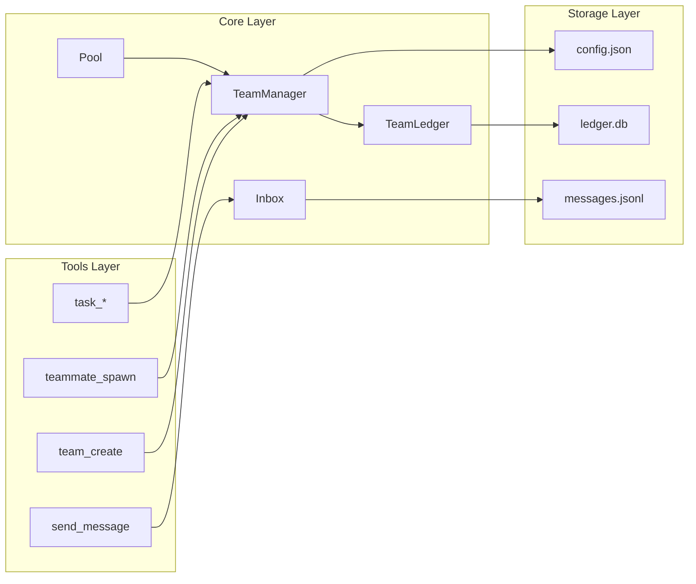

# Agent Teams Architecture

## Context

This document describes the architecture of OpenClaw's Agent Teams implementation. The system enables Team Lead agents to coordinate multiple independent Teammate agents through a shared SQLite task ledger.

**IMPORTANT**: Agent Teams integrates with OpenClaw's existing multi-agent infrastructure:

- Teammates are real Gateway sessions (via `callGateway`)
- Communication uses `sessions_send` with `agentToAgent` policy
- Session keys follow `agent:{id}:teammate:{uuid}` format

See [Integration Guide](./integration.md) for implementation details.

## Design Principles

### 1. SQLite WAL Mode for Concurrency

Multiple independent Node.js processes (teammates) need concurrent access to shared state. SQLite with WAL (Write-Ahead Logging) mode provides:

- **Transactional Integrity**: Atomic updates prevent race conditions
- **Concurrent Reads**: Multiple agents can query while writes are in progress
- **Persistence**: Survives Gateway restarts
- **Simplicity**: No complex distributed coordination

```typescript
// src/teams/ledger.ts
this.db.exec("PRAGMA journal_mode = WAL");
this.db.exec("PRAGMA wal_autocheckpoint = 1000");
```

### 2. File-Based Team Storage

OpenClaw follows a local-first, file-driven design:

- **Transparency**: Users can inspect team state directly
- **Durability**: Survives process crashes
- **Consistency**: Matches `~/.openclaw/agents/` patterns
- **Debuggability**: Direct file inspection for troubleshooting

### 3. Native Tools (Not Extensions)

Teams are implemented as native OpenClaw tools because:

- Tighter integration with session state management
- Direct access to Gateway internals
- Consistent with existing tool patterns
- Easier testing and maintenance

## Component Architecture



## Core Modules

### TeamLedger (`src/teams/ledger.ts`)

SQLite database operations with schema management:

```sql
-- Tasks table
CREATE TABLE IF NOT EXISTS tasks (
  id TEXT PRIMARY KEY,
  subject TEXT NOT NULL,
  description TEXT NOT NULL,
  activeForm TEXT,
  status TEXT NOT NULL CHECK(status IN ('pending', 'claimed', 'in_progress', 'completed', 'failed')),
  owner TEXT,
  dependsOn TEXT,
  blockedBy TEXT,
  blocks TEXT,
  metadata TEXT,
  createdAt INTEGER NOT NULL,
  claimedAt INTEGER,
  completedAt INTEGER
);

-- Members table
CREATE TABLE IF NOT EXISTS members (
  sessionKey TEXT PRIMARY KEY,
  agentId TEXT NOT NULL,
  name TEXT,
  role TEXT CHECK(role IN ('lead', 'member')),
  agentType TEXT,
  status TEXT CHECK(status IN ('idle', 'working', 'blocked')),
  currentTask TEXT,
  joinedAt INTEGER NOT NULL,
  lastActiveAt INTEGER
);

-- Messages table
CREATE TABLE IF NOT EXISTS messages (
  id TEXT PRIMARY KEY,
  fromSession TEXT NOT NULL,
  toSession TEXT NOT NULL,
  type TEXT NOT NULL CHECK(type IN ('message', 'broadcast', 'shutdown_request', 'shutdown_response', 'idle')),
  content TEXT NOT NULL,
  summary TEXT,
  requestId TEXT,
  approve INTEGER,
  reason TEXT,
  createdAt INTEGER NOT NULL,
  delivered INTEGER DEFAULT 0
);
```

### TeamManager (`src/teams/manager.ts`)

High-level orchestration API:

| Method                | Description                       |
| --------------------- | --------------------------------- |
| `createTask()`        | Create task with metadata         |
| `listTasks()`         | Query all tasks                   |
| `findAvailableTask()` | Find claimable tasks              |
| `claimTask()`         | Atomic task claiming              |
| `completeTask()`      | Mark complete, unblock dependents |
| `addMember()`         | Register team member              |
| `listMembers()`       | Query members                     |
| `storeMessage()`      | Persist message                   |
| `getTeamState()`      | Get state for context injection   |

### Inbox (`src/teams/inbox.ts`)

JSONL-based message queues:

```typescript
// Write message to inbox
await writeInboxMessage(teamName, teamsDir, recipient, message);

// Read pending messages
const messages = await readInboxMessages(teamName, teamsDir, sessionKey);

// Clear after processing
await clearInboxMessages(teamName, teamsDir, sessionKey);
```

### Pool (`src/teams/pool.ts`)

Connection pooling for TeamManager instances:

```typescript
// Get or create cached manager
const manager = getTeamManager(teamName, stateDir);

// Cleanup
closeTeamManager(teamName);
closeAll();
```

## Tool Implementations

### team_create

Creates team directory, config.json, and initializes SQLite ledger:

```typescript
// Input
{
  team_name: string;     // 1-50 chars, alphanumeric/hyphen
  description?: string;
  agent_type?: string;   // Default: "general-purpose"
}

// Output
{
  teamId: string;        // UUID
  teamName: string;
  status: "active";
  message: string;
}
```

### teammate_spawn

Spawns teammate via existing subagent infrastructure:

```typescript
// Input
{
  team_name: string;
  name: string;          // Display name
  agent_type?: string;
  model?: string;        // Optional model override
}

// Output
{
  teammateId: string;
  sessionKey: string;    // agent:{id}:teammate:{uuid}
  status: "spawned";
}
```

### task_claim

Atomic claiming with conflict detection:

```sql
UPDATE tasks
SET status = 'in_progress', owner = ?, claimedAt = ?
WHERE id = ? AND status = 'pending' AND (owner IS NULL OR owner = '')
```

### task_complete

Marks complete and auto-unblocks dependents:

```typescript
// 1. Mark task as completed
// 2. Find tasks blocked by this task
// 3. Remove from their blockedBy arrays
// 4. If blockedBy becomes empty, task becomes available
```

### send_message

Supports multiple message types:

| Type                | Description                          |
| ------------------- | ------------------------------------ |
| `message`           | Direct message to recipient          |
| `broadcast`         | Message to all members except sender |
| `shutdown_request`  | Request graceful shutdown            |
| `shutdown_response` | Approve/reject shutdown              |

## Context Injection

### Message Injection (`context-injection.ts`)

Messages are converted to XML tags before inference:

```xml
<teammate-message teammate_id="researcher-1" type="message" summary="Found critical bug">
Found a critical security vulnerability in the auth module at src/auth/jwt.ts:42.
The token expiration check is bypassed when using admin claims.
</teammate-message>
```

### State Injection (`state-injection.ts`)

Team leads receive team state to prevent context amnesia:

```
=== TEAM STATE ===
Team: alpha-squad
Status: active
Members: researcher (working), tester (idle)
Pending Tasks: 3
In Progress: 1
Completed: 2
==================
```

## Dependency Resolution

### Circular Dependency Detection

Uses DFS to detect cycles in task dependency graph:

```typescript
detectCircularDependencies(): string[][] {
  // Returns array of cycles found
}
```

### Auto-Unblock on Completion

When a task completes:

1. Find all tasks in its `blocks` array
2. Remove completed task ID from their `blockedBy` arrays
3. If `blockedBy` becomes empty, task status remains pending but is now claimable

## Resource Limits (`src/teams/limits.ts`)

| Limit                | Value       |
| -------------------- | ----------- |
| Max teams            | 10          |
| Max members per team | 10          |
| Max tasks per team   | 1000        |
| Max message size     | 100KB       |
| Max task subject     | 200 chars   |
| Max task description | 10000 chars |

## Concurrency Control

### SQLITE_BUSY Handling

Implement exponential backoff for database conflicts:

```typescript
async function withRetry<T>(fn: () => T, maxAttempts = 5): Promise<T> {
  for (let attempt = 0; attempt < maxAttempts; attempt++) {
    try {
      return fn();
    } catch (err: any) {
      if (err.code === "SQLITE_BUSY") {
        await sleep(50 * Math.pow(2, attempt));
        continue;
      }
      throw err;
    }
  }
  throw new Error("Database locked");
}
```

### Connection Caching

Pool caches TeamManager instances per team:

```typescript
const connectionCache = new Map<string, TeamManager>();
```

## Integration with Gateway

Tools are registered in `src/agents/openclaw-tools.ts`:

```typescript
// Team management
{ name: "team_create", ... },
{ name: "teammate_spawn", ... },
{ name: "team_shutdown", ... },

// Task management
{ name: "task_create", ... },
{ name: "task_list", ... },
{ name: "task_claim", ... },
{ name: "task_complete", ... },

// Communication
{ name: "send_message", ... },
```
