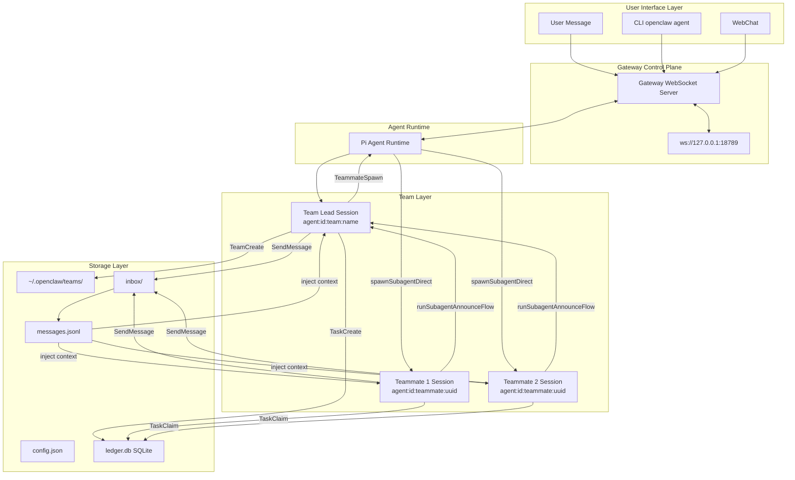

# Agent Teams Architecture

## System Architecture



## Component Architecture

### 1. Storage Layer

#### Team Directory Structure

```
~/.openclaw/teams/
├── teams.json                    # Team registry (name → path mapping)
├── {team_name}/
│   ├── config.json               # Team configuration
│   ├── ledger.db                 # SQLite task ledger
│   ├── ledger.db-shm             # WAL shared memory
│   ├── ledger.db-wal             # WAL log
│   └── inbox/
│       ├── {session_key_1}/
│       │   └── messages.jsonl    # Message queue
│       ├── {session_key_2}/
│       │   └── messages.jsonl
│       └── {session_key_3}/
│           └── messages.jsonl
```

#### Team Config Schema

```typescript
interface TeamConfig {
  id: string; // UUID
  name: string; // Path-safe team identifier
  description?: string; // Human-readable description
  agentType?: string; // Agent type for team lead
  createdAt: number; // Unix timestamp
  updatedAt: number; // Unix timestamp
  status: "active" | "shutting_down" | "shutdown";
  leadSessionKey: string; // Session key of team lead
  members: TeamMemberInfo[]; // Registered teammates
}

interface TeamMemberInfo {
  sessionKey: string; // teammate session key
  agentId: string; // agent type ID
  name: string; // display name
  color?: string; // UI color (e.g., "#D94A4A")
  joinedAt: number; // Unix timestamp
  lastActiveAt?: number; // Unix timestamp
}
```

#### SQLite Schema

**Tasks Table:**

```sql
CREATE TABLE IF NOT EXISTS tasks (
  id TEXT PRIMARY KEY,           -- UUID
  subject TEXT NOT NULL,         -- High-level summary
  description TEXT NOT NULL,     -- Detailed instructions for LLM
  activeForm TEXT,               -- Present continuous form for display
  status TEXT NOT NULL CHECK(
    status IN ('pending', 'claimed', 'in_progress', 'completed', 'failed')
  ),
  owner TEXT,                    -- sessionKey of claiming agent
  dependsOn TEXT,                -- JSON array: ["task-id-1", "task-id-2"]
  blockedBy TEXT,                -- JSON array (computed): ["task-id-3"]
  metadata TEXT,                 -- JSON object
  createdAt INTEGER NOT NULL,
  claimedAt INTEGER,
  completedAt INTEGER
);

CREATE INDEX IF NOT EXISTS idx_tasks_status ON tasks(status);
CREATE INDEX IF NOT EXISTS idx_tasks_owner ON tasks(owner);
CREATE INDEX IF NOT EXISTS idx_tasks_created ON tasks(createdAt);
```

**Members Table (optional, for team state persistence):**

```sql
CREATE TABLE IF NOT EXISTS members (
  sessionKey TEXT PRIMARY KEY,
  agentId TEXT NOT NULL,
  name TEXT,
  role TEXT CHECK(role IN ('lead', 'member')),
  joinedAt INTEGER NOT NULL,
  lastActiveAt INTEGER
);
```

### 2. Tool Layer

#### Tool Organization

```
src/agents/tools/teams/
├── team-create.ts
├── team-create.test.ts
├── teammate-spawn.ts
├── teammate-spawn.test.ts
├── team-shutdown.ts
├── team-shutdown.test.ts
├── task-create.ts
├── task-create.test.ts
├── task-list.ts
├── task-list.test.ts
├── task-claim.ts
├── task-claim.test.ts
├── task-complete.ts
├── task-complete.test.ts
├── send-message.ts
├── send-message.test.ts
└── common.ts                    # Shared utilities
```

#### Tool Registration

Update `src/agents/openclaw-tools.ts`:

```typescript
// Add team tools to createOpenClawTools
const tools: AnyAgentTool[] = [
  // ... existing tools ...
  createTeamCreateTool({
    agentSessionKey: opts?.agentSessionKey,
  }),
  createTeammateSpawnTool({
    agentSessionKey: opts?.agentSessionKey,
    agentChannel: opts?.agentChannel,
    agentAccountId: opts?.agentAccountId,
  }),
  createTeamShutdownTool({
    agentSessionKey: opts?.agentSessionKey,
  }),
  createTaskCreateTool({
    agentSessionKey: opts?.agentSessionKey,
  }),
  createTaskListTool({
    agentSessionKey: opts?.agentSessionKey,
  }),
  createTaskClaimTool({
    agentSessionKey: opts?.agentSessionKey,
  }),
  createTaskCompleteTool({
    agentSessionKey: opts?.agentSessionKey,
  }),
  createSendMessageTool({
    agentSessionKey: opts?.agentSessionKey,
  }),
];
```

### 3. Manager Layer

#### TeamManager Class

```typescript
// src/teams/manager.ts
import { randomUUID } from "node:crypto";
import { requireNodeSqlite } from "../memory/sqlite.js";
import type { DatabaseSync } from "node:sqlite";
import path from "node:path";
import fs from "node:fs/promises";

export class TeamManager {
  private readonly teamDir: string;
  private readonly db: DatabaseSync;
  private readonly teamName: string;

  constructor(teamName: string, stateDir: string) {
    this.teamName = teamName;
    this.teamDir = path.join(stateDir, "teams", teamName);
    this.db = this.openDatabase();
    this.ensureSchema();
  }

  private openDatabase(): DatabaseSync {
    const { DatabaseSync } = requireNodeSqlite();
    const dbPath = path.join(this.teamDir, "ledger.db");
    return new DatabaseSync(dbPath, { mode: "wal" });
  }

  private ensureSchema(): void {
    // Create tasks table and indexes
  }

  async createTask(params: {
    subject: string;
    description: string;
    activeForm?: string;
    dependsOn?: string[];
    metadata?: Record<string, unknown>;
  }): Promise<string> {
    const taskId = randomUUID();
    // Insert into tasks table...
    return taskId;
  }

  async claimTask(taskId: string, sessionKey: string): Promise<ClaimResult> {
    const stmt = this.db.prepare(`
      UPDATE tasks
      SET status = 'claimed',
          owner = ?,
          claimedAt = ?
      WHERE id = ?
        AND status = 'pending'
        AND owner IS NULL
    `);

    let attempts = 0;
    const maxAttempts = 5;
    const baseDelay = 50; // ms

    while (attempts < maxAttempts) {
      try {
        const result = stmt.exec(sessionKey, Date.now(), taskId);
        if (result.changes > 0) {
          return { success: true, taskId };
        }
        return { success: false, error: "Task already claimed" };
      } catch (err) {
        if (err.code === "SQLITE_BUSY") {
          const delay = baseDelay * Math.pow(2, attempts);
          await sleep(delay);
          attempts++;
          continue;
        }
        throw err;
      }
    }

    return { success: false, error: "Failed to claim task after retries" };
  }

  async completeTask(taskId: string, sessionKey: string): Promise<void> {
    // Update task status
    // Unblock dependent tasks (remove from blockedBy)
    // Auto-unblock: set status='pending' when blockedBy is empty
  }

  close(): void {
    this.db.close();
  }
}
```

### 4. Gateway Integration

#### Teammate Spawn Integration

```typescript
// src/agents/tools/teams/teammate-spawn.ts
import { spawnSubagentDirect, SUBAGENT_SPAWN_ACCEPTED_NOTE } from "../subagent-spawn.js";
import { AGENT_LANE_TEAMMATE } from "../../lanes.js";

export function createTeammateSpawnTool(deps: ToolDeps) {
  return async function teammateSpawn(params: TeammateSpawnParams): Promise<string> {
    const result = await spawnSubagentDirect(
      {
        task: params.task || `Join team ${params.team_name} as ${params.name}`,
        label: params.name,
        agentId: params.agent_id,
        model: params.model,
        mode: "session", // Teammates are persistent
        thread: true, // Thread-bound for follow-ups
        cleanup: "keep", // Keep session for mailbox
      },
      {
        agentSessionKey: deps.agentSessionKey,
        agentChannel: deps.agentChannel,
        agentAccountId: deps.agentAccountId,
      },
    );

    if (result.status === "accepted") {
      // Register teammate in team config
      await registerTeammate(params.team_name, {
        sessionKey: result.childSessionKey!,
        name: params.name,
        agentId: params.agent_id || "default",
      });
      return `Teammate "${params.name}" spawned successfully. ${SUBAGENT_SPAWN_ACCEPTED_NOTE}`;
    }

    throw new Error(result.error || "Failed to spawn teammate");
  };
}
```

#### Team Handlers (optional, for direct Gateway API)

```typescript
// src/gateway/server-methods/teams.ts
export const teamsHandlers: GatewayRequestHandlers = {
  "teams.create": async (opts) => {
    const { team_name, description, agent_type } = opts.params;
    const teamDir = path.join(resolveStateDir(), "teams", team_name);
    // Create team config
    // Create SQLite ledger
    // Respond with team ID
  },
  "teams.delete": async (opts) => {
    // Remove team directory
  },
  "teams.list": async (opts) => {
    // List all teams
  },
  "teams.get": async (opts) => {
    // Get team details
  },
};
```

### 5. Session State Integration

#### Extend SessionEntry

```typescript
// src/config/sessions/types.ts
export type SessionEntry = {
  sessionId: string;
  updatedAt: number;
  // ... existing fields ...

  // Team-related fields
  teamId?: string; // ID of team session belongs to
  teamRole?: "lead" | "member"; // Role in team
  teamName?: string; // Human-readable team name
  teammateColor?: string; // Display color for UI
};
```

#### Context Injection for Team State

```typescript
// In system prompt construction (src/agents/system-prompt.ts)
function buildSystemPrompt(session: SessionEntry, config: OpenClawConfig): string {
  let prompt = basePrompt;

  // Inject team state for team lead
  if (session.teamId && session.teamRole === "lead") {
    const teamState = loadTeamState(session.teamId);
    prompt += "\n\n=== TEAM STATE (GROUND TRUTH) ===\n";
    prompt += `Team: ${teamState.name} (${session.teamId})\n`;
    prompt += `Role: Team Lead\n`;
    prompt += `Active Members (${teamState.members.length}):\n`;
    for (const member of teamState.members) {
      prompt += `  - ${member.name} (${member.agentId})`;
      if (member.color) prompt += ` [${member.color}]`;
      prompt += "\n";
    }
    prompt += `Pending Tasks: ${teamState.pendingTaskCount}\n`;
    prompt += `In Progress Tasks: ${teamState.inProgressTaskCount}\n`;
    prompt += "=====================================\n\n";
  }

  // Inject mailbox messages for all team members
  if (session.teamId) {
    const mailboxContent = await injectPendingMessages(session);
    if (mailboxContent.trim()) {
      prompt += "\n\n=== TEAM MESSAGES ===\n";
      prompt += mailboxContent;
      prompt += "=======================\n\n";
    }
  }

  return prompt;
}
```

### 6. Mailbox System

#### Message Format

```typescript
interface TeamMessage {
  id: string; // UUID
  from: string; // Session key
  fromName: string; // Display name
  to?: string; // Session key (optional for broadcast)
  type: "message" | "broadcast" | "shutdown_request" | "shutdown_response" | "idle";
  content: string; // Message content
  summary?: string; // 5-10 word summary for UI
  requestId?: string; // For shutdown protocol
  approve?: boolean; // For shutdown_response
  reason?: string; // For shutdown_response reject
  timestamp: number; // Unix timestamp
}
```

#### Message Write

```typescript
// src/agents/tools/teams/send-message.ts
async function writeMessage(teamName: string, message: TeamMessage): Promise<void> {
  const inboxDir = path.join(resolveStateDir(), "teams", teamName, "inbox");

  if (message.type === "broadcast") {
    // Write to all members' inboxes (except sender)
    const members = await listTeamMembers(teamName);
    for (const member of members) {
      if (member.sessionKey !== message.from) {
        await writeToMemberInbox(inboxDir, member.sessionKey, message);
      }
    }
  } else if (message.to) {
    await writeToMemberInbox(inboxDir, message.to, message);
  }
}

async function writeToMemberInbox(
  inboxDir: string,
  sessionKey: string,
  message: TeamMessage,
): Promise<void> {
  const memberInbox = path.join(inboxDir, sanitizeSessionKey(sessionKey));
  await fs.mkdir(memberInbox, { recursive: true });

  const messagesFile = path.join(memberInbox, "messages.jsonl");
  const line = JSON.stringify(message) + "\n";
  await fs.appendFile(messagesFile, line, { mode: 0o600 });
}
```

#### Message Injection into Context

```typescript
async function injectPendingMessages(session: SessionEntry): Promise<string> {
  if (!session.teamId) {
    return "";
  }

  const inboxDir = path.join(
    resolveStateDir(),
    "teams",
    session.teamId,
    "inbox",
    sanitizeSessionKey(session.sessionKey),
  );

  const messagesFile = path.join(inboxDir, "messages.jsonl");

  try {
    const content = await fs.readFile(messagesFile, "utf-8");
    const lines = content.trim().split("\n").filter(Boolean);
    const messages: TeamMessage[] = lines.map((line) => JSON.parse(line));

    if (messages.length === 0) {
      return "";
    }

    // Build context from messages
    let context = "";
    for (const msg of messages) {
      const attrs = [`teammate_id="${msg.fromName}"`, `type="${msg.type}"`];
      if (msg.summary) attrs.push(`summary="${msg.summary}"`);
      if (msg.requestId) attrs.push(`request_id="${msg.requestId}"`);
      if (msg.approve !== undefined) attrs.push(`approve="${msg.approve}"`);
      if (msg.reason) attrs.push(`reason="${msg.reason}"`);

      context += `<teammate-message ${attrs.join(" ")}>\n`;
      context += `${msg.content}\n`;
      context += `</teammate-message>\n`;
    }

    // Clear processed messages (atomic rename)
    const processedFile = path.join(inboxDir, `messages.processed.${Date.now()}.jsonl`);
    await fs.rename(messagesFile, processedFile);
    // Schedule cleanup of processed files

    return context;
  } catch (err) {
    if (err.code !== "ENOENT") {
      logWarn(
        { err: String(err), session: session.sessionKey },
        "Failed to inject mailbox messages",
      );
    }
    return "";
  }
}
```

### 7. Completion Announce Flow

```typescript
// src/agents/tools/teams/task-complete.ts
import { runSubagentAnnounceFlow } from "../subagent-announce.js";

async function completeTaskAndAnnounce(params: {
  teamName: string;
  taskId: string;
  teammateSessionKey: string;
  teamLeadSessionKey: string;
  taskSubject: string;
}): Promise<void> {
  // Mark task as completed in SQLite
  await teamManager.completeTask(params.taskId, params.teammateSessionKey);

  // Announce completion to team lead
  await runSubagentAnnounceFlow({
    childSessionKey: params.teammateSessionKey,
    childRunId: `${params.teamName}:${params.taskId}`,
    requesterSessionKey: params.teamLeadSessionKey,
    task: params.taskSubject,
    timeoutMs: 30000,
    cleanup: "keep", // Keep teammate session
    roundOneReply: `Task "${params.taskSubject}" completed`,
    announceType: "teammate",
  });
}
```

## Concurrency Control

### SQLite WAL Mode

WAL (Write-Ahead Logging) mode enables:

- Concurrent readers during writes
- Better performance for read-heavy workloads
- Checkpoint-based persistence

Configuration:

```typescript
const db = new DatabaseSync(dbPath, { mode: "wal" });
db.pragma("wal_autocheckpoint = 1000"); // Every 1000 pages
```

### Atomic Task Claiming

```typescript
async claimTask(taskId: string, sessionKey: string): Promise<ClaimResult> {
  const stmt = this.db.prepare(`
    UPDATE tasks
    SET status = 'claimed',
        owner = ?,
        claimedAt = ?
    WHERE id = ?
      AND status = 'pending'
      AND owner IS NULL
  `);

  let attempts = 0;
  const maxAttempts = 5;
  const baseDelay = 50; // ms

  while (attempts < maxAttempts) {
    try {
      const result = stmt.exec(sessionKey, Date.now(), taskId);
      if (result.changes > 0) {
        return { success: true, taskId };
      }
      // No rows affected = already claimed
      return { success: false, error: 'Task already claimed' };
    } catch (err) {
      if (err.code === 'SQLITE_BUSY') {
        const delay = baseDelay * Math.pow(2, attempts);
        await sleep(delay);
        attempts++;
        continue;
      }
      throw err;
    }
  }

  return { success: false, error: 'Failed to claim task after retries' };
}
```

### Task Dependency Resolution

```typescript
async completeTask(taskId: string, sessionKey: string): Promise<void> {
  const db = this.db;

  // Mark task as completed
  const updateStmt = db.prepare(`
    UPDATE tasks
    SET status = 'completed',
        completedAt = ?
    WHERE id = ? AND owner = ?
  `);
  updateStmt.exec(Date.now(), taskId, sessionKey);

  // Find tasks blocked by this task
  const findBlocked = db.prepare(`
    SELECT id, blockedBy FROM tasks
    WHERE status IN ('pending', 'claimed')
      AND blockedBy LIKE ?
  `);

  const pattern = `%"${taskId}"%`;
  const blocked = findBlocked.all(pattern);

  // Update each blocked task
  const updateBlockedBy = db.prepare(`
    UPDATE tasks
    SET blockedBy = json_remove(blockedBy, ?)
    WHERE id = ?
  `);

  const unblockIfEmpty = db.prepare(`
    UPDATE tasks
    SET status = 'pending'
    WHERE id = ? AND json_array_length(blockedBy) = 0
  `);

  for (const task of blocked) {
    // Find index of completed task in blockedBy array
    const blockedByArr = JSON.parse(task.blockedBy || '[]');
    const idx = blockedByArr.indexOf(taskId);
    if (idx >= 0) {
      updateBlockedBy.exec(`$[${idx}]`, task.id);
      // Auto-unblock if no remaining dependencies
      unblockIfEmpty.exec(task.id);
    }
  }
}
```

## Security Considerations

### Path Traversal Prevention

```typescript
function sanitizeSessionKey(sessionKey: string): string {
  // Remove or replace dangerous characters
  return sessionKey.replace(/[.\/\\]/g, "_").substring(0, 100); // Limit length
}

function validateTeamName(name: string): boolean {
  // Only allow alphanumeric, hyphens, underscores
  return /^[a-zA-Z0-9_-]{1,50}$/.test(name);
}
```

### Team Isolation

- Each team has its own directory
- SQLite database is team-specific
- Inboxes are per-session scoped
- No cross-team message routing through tools

### Sandbox Integration

Teammate sessions should use Docker sandboxing when enabled:

```typescript
// When spawning teammate
await spawnSubagentDirect(
  {
    task: `Join team ${teamName} as ${name}`,
    agentId: requestedAgentId,
    // ...
  },
  {
    // Context ensures sandbox is inherited
    agentSessionKey: parentKey,
    // ...
  },
);
```

## Performance Considerations

### Connection Pooling

```typescript
// Shared connection manager per team
const connectionCache = new Map<string, TeamManager>();

function getTeamManager(teamName: string): TeamManager {
  if (!connectionCache.has(teamName)) {
    connectionCache.set(teamName, new TeamManager(teamName, resolveStateDir()));
  }
  return connectionCache.get(teamName)!;
}

function closeTeamManager(teamName: string): void {
  const manager = connectionCache.get(teamName);
  if (manager) {
    manager.close();
    connectionCache.delete(teamName);
  }
}
```

### WAL Checkpoint Configuration

```typescript
// Configure WAL checkpoint
db.pragma("wal_autocheckpoint = 1000"); // Every 1000 pages

// Or manual checkpoint
db.exec("PRAGMA wal_checkpoint(TRUNCATE)");
```

### Message Cleanup

```typescript
// Periodic cleanup of old messages
async function cleanupOldMessages(teamName: string, maxAge = 24 * 60 * 60 * 1000): Promise<void> {
  const inboxDir = path.join(resolveStateDir(), "teams", teamName, "inbox");
  const now = Date.now();

  const entries = await fs.readdir(inboxDir, { withFileTypes: true });

  for (const entry of entries) {
    if (!entry.isDirectory()) continue;

    const messagesFile = path.join(inboxDir, entry.name, "messages.jsonl");
    try {
      const content = await fs.readFile(messagesFile, "utf-8");
      const lines = content.trim().split("\n").filter(Boolean);
      const messages: TeamMessage[] = lines.map((line) => JSON.parse(line));

      // Filter out old messages
      const recent = messages.filter((m) => now - m.timestamp < maxAge);

      if (recent.length < messages.length) {
        const newContent = recent.map((m) => JSON.stringify(m)).join("\n") + "\n";
        await fs.writeFile(messagesFile, newContent, { mode: 0o600 });
      }
    } catch (err) {
      // Ignore missing files
    }
  }
}
```

### Index Strategy

```sql
-- Essential indexes for task queries
CREATE INDEX IF NOT EXISTS idx_tasks_status ON tasks(status);
CREATE INDEX IF NOT EXISTS idx_tasks_owner ON tasks(owner);
CREATE INDEX IF NOT EXISTS idx_tasks_created ON tasks(createdAt);
CREATE INDEX IF NOT EXISTS idx_tasks_blocked_by ON tasks(blockedBy);

-- For member queries (if using members table)
CREATE INDEX IF NOT EXISTS idx_members_role ON members(role);
```
