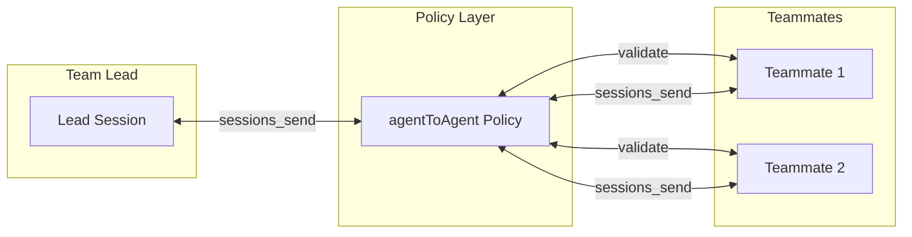
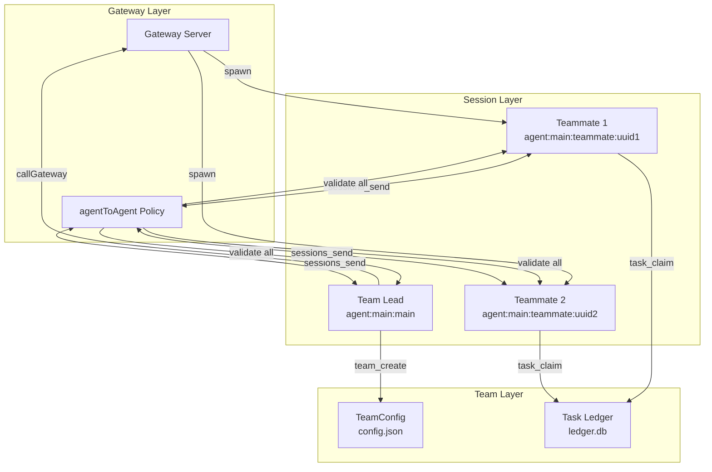

# Agent Teams Integration Guide

## Overview

This document describes how Agent Teams integrates with OpenClaw's existing multi-agent infrastructure. Proper integration ensures security, reuses proven patterns, and maintains consistency.

## Communication Patterns

### Bidirectional Communication

```
┌─────────────────────────────────────────────────────────────────┐
│                     Communication Matrix                        │
├─────────────────┬─────────────────────────────────────────────┤
│ From            │ To                                          │
├─────────────────┼─────────────────────────────────────────────┤
│ Team Lead       │ Teammate: task assignment, shutdown         │
│ Teammate        │ Team Lead: completion, status, questions    │
│ Teammate        │ Teammate: coordination, findings sharing    │
└─────────────────┴─────────────────────────────────────────────┘
```

All communication MUST go through `agentToAgent` policy:



### Message Types

| Type                | Direction           | Purpose                 |
| ------------------- | ------------------- | ----------------------- |
| `task_assignment`   | Lead → Teammate     | Assign specific task    |
| `status_request`    | Lead → Teammate     | Request progress update |
| `shutdown_request`  | Lead → Teammate     | Graceful shutdown       |
| `task_complete`     | Teammate → Lead     | Task finished           |
| `status_update`     | Teammate → Lead     | Progress report         |
| `question`          | Teammate → Lead     | Clarification needed    |
| `coordination`      | Teammate ↔ Teammate | Peer-to-peer sync       |
| `shutdown_response` | Teammate → Lead     | Shutdown approval       |

## Integration Architecture



## Required Integrations

### 1. Session Key Format

Teammates MUST use the standard session key format:

```typescript
// CORRECT
const sessionKey = `agent:${agentId}:teammate:${crypto.randomUUID()}`;
// Example: agent:main:teammate:550e8400-e29b-41d4-a716-446655440000

// WRONG - Current implementation
const sessionKey = crypto.randomUUID(); // Just a UUID
```

### 2. Gateway Session Creation

Teammates MUST be created as real Gateway sessions:

```typescript
// src/agents/tools/teams/teammate-spawn.ts

export async function spawnTeammate(params: {
  teamName: string;
  name: string;
  agentId?: string;
  task: string;
}): Promise<TeammateSpawnResult> {
  const { teamName, name, agentId = "main", task } = params;

  // 1. Generate session key in standard format
  const uuid = crypto.randomUUID();
  const sessionKey = `agent:${agentId}:teammate:${uuid}`;

  // 2. Register in team ledger
  const manager = getTeamManager(teamName, stateDir);
  await manager.addMember({
    name,
    sessionKey,
    agentId,
    agentType: "member",
  });

  // 3. Create real Gateway session
  await callGateway({
    method: "agent",
    params: {
      sessionKey,
      lane: "teammate",
      spawnedBy: opts.agentSessionKey,
      prompt: `
You are "${name}", a teammate in team "${teamName}".

Your role: ${task}

Available team tools:
- task_list: Find available tasks
- task_claim: Claim a task
- task_complete: Mark task complete
- send_message: Send messages to teammates

Workflow:
1. Call task_list to find pending tasks
2. Call task_claim to claim a task
3. Do the work
4. Call task_complete when done
5. Repeat or wait for messages
`,
      tools: {
        allow: ["task_list", "task_claim", "task_complete", "send_message", "read"],
      },
    },
  });

  return { teammateId: uuid, sessionKey, status: "spawned" };
}
```

### 3. agentToAgent Policy Integration

Team messaging MUST respect agentToAgent policy for ALL directions:

```typescript
// src/agents/tools/teams/send-message.ts

import { createAgentToAgentPolicy } from "../sessions-access.js";

export async function sendMessage(params: {
  teamName: string;
  type: MessageType;
  recipient?: string;
  content: string;
}): Promise<SendMessageResult> {
  const { teamName, type, recipient, content } = params;

  // Get team info
  const manager = getTeamManager(teamName, stateDir);
  const config = await manager.getTeamConfig();

  // Get sender info
  const senderSessionKey = opts.agentSessionKey;
  const senderMember = manager.listMembers().find((m) => m.sessionKey === senderSessionKey);

  if (!senderMember) {
    return { error: "Sender is not a team member" };
  }

  // Create policy checker - applies to ALL communication
  const a2aPolicy = createAgentToAgentPolicy(config);

  // Check agentToAgent policy for direct messages
  if (type === "message" && recipient) {
    const recipientMember = manager.listMembers().find((m) => m.name === recipient);
    if (!recipientMember) {
      return { error: `Recipient "${recipient}" not found in team` };
    }

    // POLICY CHECK - applies to:
    // - Lead → Teammate
    // - Teammate → Lead
    // - Teammate → Teammate
    if (!a2aPolicy.isAllowed(senderMember.agentId, recipientMember.agentId)) {
      return {
        error:
          `Agent-to-agent messaging denied by tools.agentToAgent policy. ` +
          `${senderMember.agentId} cannot message ${recipientMember.agentId}`,
      };
    }

    // Use sessions_send for delivery (Gateway handles actual delivery)
    await sessions_send({
      to: recipientMember.sessionKey,
      message: content,
    });
  }

  // For broadcast, send to each member (with policy check per recipient)
  if (type === "broadcast") {
    const members = manager.listMembers();
    const deliveredTo: string[] = [];

    for (const member of members) {
      if (member.sessionKey !== senderSessionKey) {
        // Each recipient gets policy checked
        if (a2aPolicy.isAllowed(senderMember.agentId, member.agentId)) {
          await sessions_send({
            to: member.sessionKey,
            message: content,
          });
          deliveredTo.push(member.name);
        }
      }
    }

    return { delivered: true, deliveredTo };
  }

  return { delivered: true };
}
```

### Bidirectional Communication Examples

#### Team Lead → Teammate (Task Assignment)

```typescript
// Lead assigns task to specific teammate
await send_message({
  team_name: "alpha-squad",
  type: "message",
  recipient: "researcher",
  content: "Please investigate the authentication module for potential vulnerabilities.",
});
```

#### Teammate → Team Lead (Status Update)

```typescript
// Teammate reports progress to lead
await send_message({
  team_name: "alpha-squad",
  type: "message",
  recipient: "team-lead", // Lead's name in members list
  content: "Found 3 potential issues in auth/jwt.ts. Need clarification on requirement #2.",
});
```

#### Teammate → Teammate (Coordination)

```typescript
// Researcher tells Tester about findings
await send_message({
  team_name: "alpha-squad",
  type: "message",
  recipient: "tester",
  content: "I found a critical bug in auth. Please prioritize testing that module.",
});
```

#### Team Lead → All (Broadcast)

```typescript
// Lead broadcasts to entire team
await send_message({
  team_name: "alpha-squad",
  type: "broadcast",
  content: "Deadline extended by 2 hours. Please update your estimates.",
});
```

### 4. Teammate Completion via Announce Flow

When teammates complete, use the existing announce mechanism:

```typescript
// In teammate session code
async function onTeammateComplete(result: TaskResult) {
  // Use existing announce flow
  await runSubagentAnnounceFlow({
    parentSessionKey: teamLeadSessionKey,
    result: {
      status: "ok",
      summary: result.summary,
      artifacts: result.artifacts,
    },
  });
}
```

### 5. Configuration Requirements

Users must enable agentToAgent for **all team members** to allow bidirectional communication:

```json5
// ~/.openclaw/openclaw.json
{
  tools: {
    agentToAgent: {
      enabled: true,
      // Allow all team communication patterns:
      // - Lead ↔ Teammate
      // - Teammate ↔ Teammate
      allow: ["main", "*"], // Or use specific patterns like "teammate-*"
    },
  },

  agents: {
    list: [
      {
        id: "main",
        workspace: "~/.openclaw/workspace",
        default: true,
      },
    ],
  },
}
```

**Important**: The `allow` list must include:

1. The lead's agentId (e.g., `"main"`)
2. Pattern for teammates (e.g., `"*"` or `"teammate-*"`)

This enables:

```
main → *     (Lead assigns tasks)
* → main     (Teammates report to lead)
* → *        (Teammates coordinate)
```

## Integration with Multi-Agent Sandbox

Teammates can have their own sandbox and tool restrictions:

```json5
{
  agents: {
    list: [
      {
        id: "main",
        workspace: "~/.openclaw/workspace",
        default: true,
      },
    ],

    // Teammates inherit from defaults or have specific profiles
    defaults: {
      sandbox: {
        mode: "non-main",
        scope: "session",
      },
      tools: {
        allow: ["read", "task_*", "send_message"],
        deny: ["exec", "write", "edit"],
      },
    },
  },
}
```

## Migration Path

### Current Implementation (Disconnected)

```
teammate_spawn → SQLite entry only (no Gateway session)
send_message → File write (no policy check)
inbox → JSONL files (no consumer)
```

### Target Implementation (Integrated)

```
teammate_spawn → callGateway({method: "agent"}) → Real session
send_message → sessions_send → agentToAgent policy check
completion → runSubagentAnnounceFlow → Lead notification
```

### Migration Steps

1. **Update teammate-spawn.ts**:
   - Use `agent:{agentId}:teammate:{uuid}` format
   - Call `callGateway({method: "agent"})`
   - Pass team context in prompt

2. **Update send-message.ts**:
   - Import `createAgentToAgentPolicy`
   - Check policy before delivery
   - Use `sessions_send` for actual delivery

3. **Update inbox.ts**:
   - Use sessions_send instead of file writes
   - Keep inbox for context injection during inference

4. **Add configuration validation**:
   - Check `tools.agentToAgent.enabled` in team_create
   - Warn if disabled

## Benefits of Integration

| Benefit     | Description                                      |
| ----------- | ------------------------------------------------ |
| Security    | All team messages go through agentToAgent policy |
| Consistency | Same patterns as sessions_spawn/sessions_send    |
| Visibility  | Teammates appear in sessions_list                |
| Lifecycle   | Teammates follow Gateway session lifecycle       |
| Debugging   | Standard logging and tracing                     |
| Monitoring  | Gateway metrics include teammates                |

## Testing Integration

```bash
# Verify agentToAgent is enabled
openclaw config get tools.agentToAgent

# List team sessions
openclaw sessions list | grep teammate

# Monitor team messages
tail -f ~/.openclaw/logs/gateway.log | grep -E "agentToAgent|teammate"

# Check policy enforcement
# Send message from non-allowlisted agent - should fail
```

## Related Documentation

- [Multi-Agent Routing](../../multi-agent-routing.md)
- [Multi-Agent Sandbox & Tools](../../multi-agent-sandbox.md)
- [Agent-to-Agent Communication](../../agent-to-agent.md)
- [sessions\_\* Tools Reference](../../sessions-tools.md)
