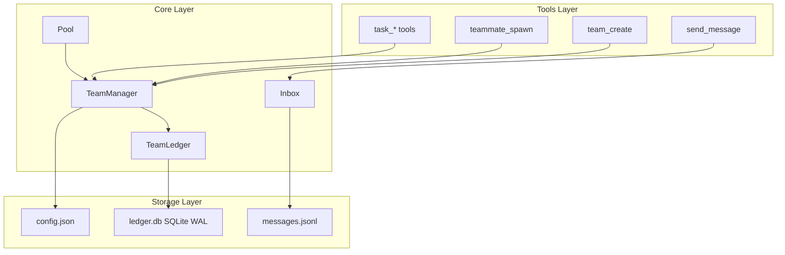

# OpenClaw Agent Teams Implementation Plan

## Overview

This plan documents the **completed** Agent Teams implementation in OpenClaw. The system is production-ready with full test coverage. Tasks are organized for verification, maintenance, and future enhancement.

**Design Reference:** [Agent Teams Design](../2026-02-23-agent-teams-design/)

**Implementation Status:** Complete
**Test Files:** 17
**Lines of Code:** ~8,540

## Goal

Verify and document the complete multi-agent team system with:

- Team creation and lifecycle management
- Task ledger with atomic claiming and dependency resolution
- Mailbox protocol for agent-to-agent communication
- Concurrency control using SQLite WAL mode
- Team state injection for context amnesia prevention

## Architecture



## Constraints

- **Language:** TypeScript (ESM), Node.js 22+
- **Package Manager:** pnpm
- **Database:** SQLite (node:sqlite) with WAL mode
- **Implementation:** Native OpenClaw tools (not skills/extensions)
- **Testing:** Vitest with BDD scenarios
- **Tool Naming:** snake_case (team_create, task_claim, send_message)

## Implemented Modules

### Core Infrastructure (`src/teams/`)

| File                   | Lines | Purpose                         |
| ---------------------- | ----- | ------------------------------- |
| `types.ts`             | 170   | Type definitions                |
| `ledger.ts`            | 129   | SQLite operations with WAL      |
| `manager.ts`           | 838   | High-level orchestration        |
| `storage.ts`           | 136   | Directory and config management |
| `inbox.ts`             | 144   | JSONL message queues            |
| `pool.ts`              | 59    | Connection caching              |
| `limits.ts`            | 86    | Resource enforcement            |
| `cleanup.ts`           | 247   | Maintenance operations          |
| `context-injection.ts` | 96    | Message to XML conversion       |
| `state-injection.ts`   | 68    | Team state injection            |

### Tools (`src/agents/tools/teams/`)

| Tool                     | Lines | Purpose                                |
| ------------------------ | ----- | -------------------------------------- |
| `team-create.ts`         | 92    | Initialize team with config and ledger |
| `teammate-spawn.ts`      | 80    | Spawn teammate agents                  |
| `team-shutdown.ts`       | 107   | Graceful shutdown with protocol        |
| `task-create.ts`         | 67    | Add tasks with dependencies            |
| `task-list.ts`           | 73    | Query tasks with filters               |
| `task-claim.ts`          | 56    | Atomic task claiming                   |
| `task-complete.ts`       | 49    | Mark complete, unblock dependents      |
| `task-find-available.ts` | 51    | Find claimable tasks                   |
| `task-auto-claim.ts`     | 78    | Auto-claim next available              |
| `send-message.ts`        | 128   | Direct/broadcast messaging             |

## Execution Plan

### Phase 1: Core Infrastructure Verification

- [Task 001: TypeScript Types](./task-001-types.md) - Verify type definitions
- [Task 002: SQLite Ledger](./task-002-ledger.md) - Verify WAL mode and schema
- [Task 003: Team Storage](./task-003-storage.md) - Verify directory management
- [Task 004: Connection Pool](./task-004-connection-pool.md) - Verify caching
- [Task 005: Team Manager](./task-005-manager.md) - Verify orchestration

### Phase 2: Tool Verification

- [Task 006: team_create Tool](./task-006-team-create.md)
- [Task 007: teammate_spawn Tool](./task-007-teammate-spawn.md)
- [Task 008: team_shutdown Tool](./task-008-team-shutdown.md)
- [Task 009: task_create Tool](./task-009-task-create.md)
- [Task 010: task_list Tool](./task-010-task-list.md)
- [Task 011: task_claim Tool](./task-011-task-claim.md)
- [Task 012: task_complete Tool](./task-012-task-complete.md)
- [Task 013: send_message Tool](./task-013-send-message.md)

### Phase 3: Integration Verification

- [Task 014: Inbox System](./task-014-inbox.md)
- [Task 015: Context Injection](./task-015-context-injection.md)
- [Task 016: Team State Injection](./task-016-state-injection.md)
- [Task 017: Tool Registration](./task-017-tool-registration.md)

### Phase 4: Quality Assurance

- [Task 018: Security Tests](./task-018-security.md)
- [Task 019: Concurrency Tests](./task-019-concurrency.md)
- [Task 020: Performance Tests](./task-020-performance.md)
- [Task 021: E2E Workflows](./task-021-e2e.md)
- [Task 022: Cleanup Operations](./task-022-cleanup.md)

## Test Files Reference

| Test File                             | Coverage                      |
| ------------------------------------- | ----------------------------- |
| `src/teams/types.test.ts`             | Type definitions              |
| `src/teams/ledger.test.ts`            | SQLite operations             |
| `src/teams/manager.test.ts`           | Core operations, dependencies |
| `src/teams/storage.test.ts`           | Directory management          |
| `src/teams/pool.test.ts`              | Connection caching            |
| `src/teams/inbox.test.ts`             | Message storage, retrieval    |
| `src/teams/limits.test.ts`            | Resource limits               |
| `src/teams/cleanup.test.ts`           | Maintenance operations        |
| `src/teams/context-injection.test.ts` | XML formatting                |
| `src/teams/state-injection.test.ts`   | State formatting              |
| `src/teams/security.test.ts`          | Path traversal, validation    |
| `src/teams/performance.test.ts`       | Concurrency, load             |
| `src/teams/e2e.test.ts`               | End-to-end workflows          |

## Running Tests

```bash
# Run all team tests
pnpm test src/teams/

# Run specific module
pnpm test src/teams/manager.test.ts

# Run tool tests
pnpm test src/agents/tools/teams/
```

## Success Criteria

The implementation is verified when:

- All tests pass: `pnpm test src/teams/`
- Atomic task claiming prevents race conditions
- Task dependencies resolve correctly
- Messages are delivered only to intended recipients
- Team state survives context compression
- No path traversal vulnerabilities exist

## Future Enhancements

Features from RFC-0001 not yet implemented:

- Coordination modes (normal/delegate)
- Plan approval workflow
- `team_status` tool
- tmux split-pane display
- Token budget management
