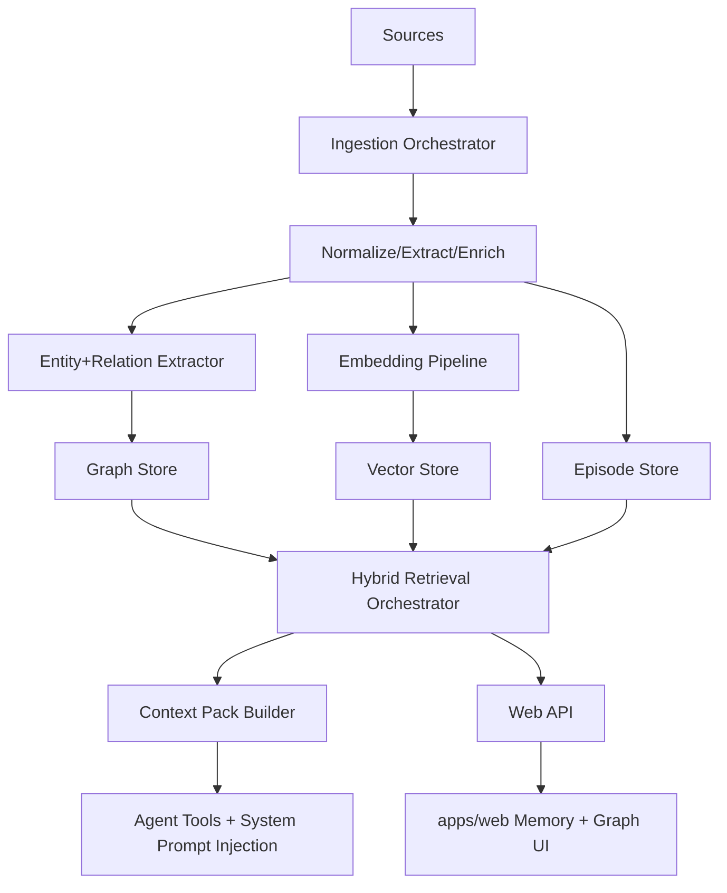

# Target Architecture: Clawdbrain Graph-RAG Memory System

## Scope

This is the proposed end-state architecture for Graph-RAG memory in Clawdbrain, grounded in:

- Existing local drafts in `docs/plans/graphrag/*`
- Progressive memory work in `docs/plans/2026-02-04-*` and `2026-02-05-*`
- Current code in `src/memory/*`, `src/agents/tools/*`, and `apps/web/*`

## Design Principles

1. Keep local-first defaults.
2. Separate hot-path retrieval from heavy offline summarization.
3. Support changing truths with explicit temporal semantics.
4. Keep provider/backends pluggable.
5. Make recall explainable (citations + why-ranked).
6. Avoid user-facing regressions in existing `memory_search` and `memory_get`.

## System Architecture

## Canonical Data Layers

### Layer 1: Episode and provenance layer

Purpose: preserve reduced, searchable conversational/document episodes and provenance pointers.

Core fields:

- `episode_id`
- `source_type` (`session`, `memory_file`, `manual_ingest`, `crawl`)
- `source_ref` (file path, URL, session id + offsets)
- `observed_at`, `ingested_at`
- `preview_text` (bounded)
- `summary_text` (optional)

### Layer 2: Entity/relationship layer

Purpose: represent stable concepts and connections extracted from episodes.

Core fields:

- Entities: `entity_id`, `name`, `type`, `description`, `first_seen`, `last_seen`, `mention_count`
- Relationships: `rel_id`, `source_entity_id`, `target_entity_id`, `type`, `weight`, `description`
- Evidence links: entity/relationship -> episode/chunk pointers

### Layer 3: Temporal facts layer

Purpose: capture changing truths explicitly.

Core fields:

- `subject`, `predicate`, `object`
- `valid_from`, `valid_to`
- `confidence`
- `supersedes_fact_id` (optional)
- provenance pointers

This layer is critical for preference/rule/policy drift over time.

### Layer 4: Vector and lexical retrieval layer

Purpose: low-latency semantic + keyword retrieval across episodes, entities, and reports.

Core fields:

- embedding vectors (queryable by type)
- lexical indexes (FTS/BM25)
- rerank metadata (`similarity`, `recency`, `salience`, `graph_proximity`)

## Retrieval Modes (Runtime)

### Mode A: Local task retrieval (default hot path)

- Query -> intent parse -> candidate entities
- Blend:
  - vector top-K episodes
  - lexical top-K episodes
  - graph 1-2 hop expansion
  - temporal fact matches
- Build bounded context pack for immediate model use

### Mode B: Global synthesis retrieval (explicit invocation)

- For broad questions (themes/status/risk posture)
- Uses precomputed summaries/reports where available
- Not default for every conversational turn

### Mode C: Temporal audit retrieval

- Point-in-time fact state
- Contradiction/supersession chain
- Used for compliance/policy/history-sensitive prompts

## Write Paths

### Automated write path

- Session/tool events -> ingestion pipeline -> episode + optional extraction

### Explicit write path

- `memory_store` for durable structured writes
- Optional `memory_ingest` for bulk/manual external content

### Reflection write path (deferred)

- Scheduled compaction/reflection generates derived durable memory entries
- Must remain bounded and auditable

## Explainability Contract

Every retrieval result must include:

- `source_ref` (where it came from)
- `why_ranked` (scoring components)
- `temporal_context` when facts are time-bound

This is required for trust and debugging.

## Backend Strategy

1. Default: SQLite-based local mode (existing pattern)
2. Scale mode: Postgres+pgvector
3. Advanced graph mode: Neo4j/Graphiti-compatible provider

Backends are selected via provider abstraction, not user-facing tool changes.

## Mapping to Existing Drafts

### Kept from current drafts

- Hybrid retrieval concept from `05-hybrid-retrieval.md`
- Overseer bridge concept from `06-overseer-integration.md`
- Agent tool expansion direction from `07-agent-tools.md`
- Progressive memory additive model from `2026-02-05-progressive-memory-system-design-v2.md`

### Adjusted from current drafts

- UI target moved to `apps/web/*` (not `ui/*`)
- Graph DB made optional, not default
- Heavy global summarization moved out of hot path

### Added in this design

- Explicit temporal facts layer
- Provider-gated backend evolution path
- Explainability contract as non-optional output requirement

## Non-Goals (Phase 1)

1. Full enterprise graph analytics surface.
2. Mandatory Neo4j dependency.
3. Automatic broad reflection/summarization without strict budgets and quality gates.
