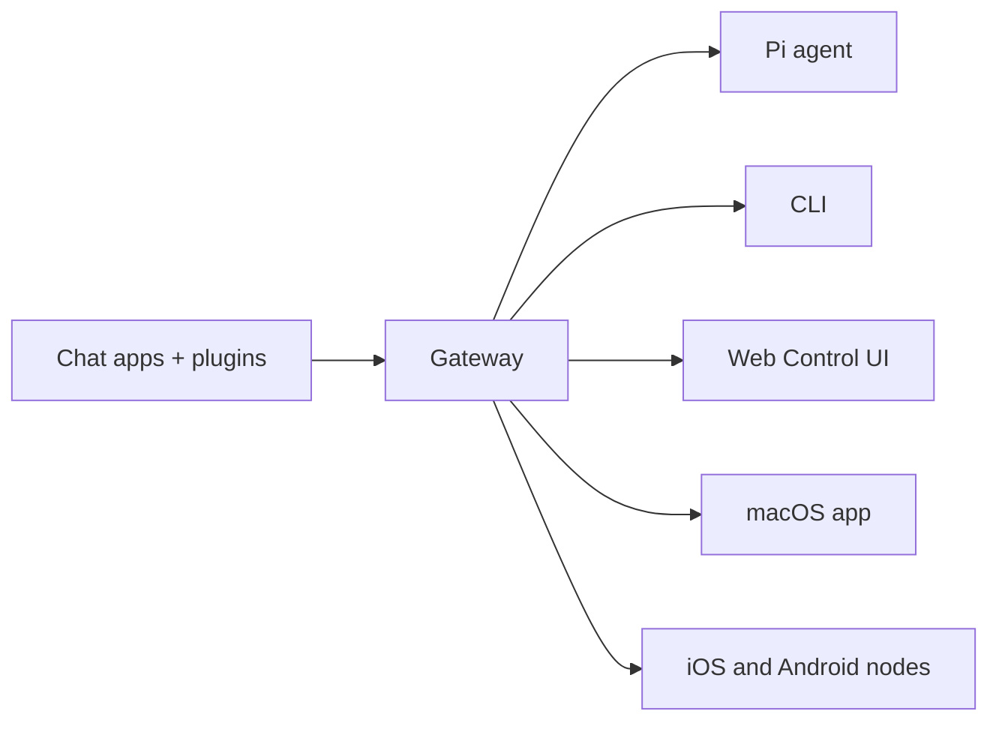

# OpenClaw 🦞

<p align="center">
    
    
</p>

> _"ESFOLIAR! ESFOLIAR!"_ — Uma lagosta espacial, provavelmente

<p align="center">
  <strong>Gateway para agentes de IA em qualquer SO, em WhatsApp, Telegram, Discord, iMessage e mais.</strong><br />
  Envie uma mensagem e receba a resposta de um agente no seu bolso. Plugins adicionam Mattermost e muito mais.
</p>

<Columns>
  <Card title="Primeiros Passos" href="/start/getting-started" icon="rocket">
    Instale o OpenClaw e coloque o Gateway no ar em minutos.
  </Card>
  <Card title="Executar o Assistente" href="/start/wizard" icon="sparkles">
    Configuração guiada com `openclaw onboard` e fluxos de pareamento.
  </Card>
  <Card title="Abrir a UI de Controle" href="/web/control-ui" icon="layout-dashboard">
    Inicie o painel no navegador para chat, configuracao e sessoes.
  </Card>
</Columns>

## O que é o OpenClaw?

OpenClaw é um **gateway auto-hospedado** que conecta seus aplicativos de chat favoritos — WhatsApp, Telegram, Discord, iMessage e mais — a agentes de codificacao com IA como o Pi. Voce executa um unico processo do Gateway na sua propria maquina (ou em um servidor), e ele se torna a ponte entre seus apps de mensagens e um assistente de IA sempre disponivel.

**Para quem é?** Desenvolvedores e usuarios avancados que querem um assistente de IA pessoal com o qual possam conversar de qualquer lugar — sem abrir mao do controle dos dados ou depender de um servico hospedado.

**O que o torna diferente?**

- **Auto-hospedado**: roda no seu hardware, com suas regras
- **Multicanal**: um Gateway atende WhatsApp, Telegram, Discord e mais simultaneamente
- **Nativo para agentes**: criado para agentes de codificacao com uso de ferramentas, sessoes, memoria e roteamento multiagente
- **Codigo aberto**: licenca MIT, orientado pela comunidade

**O que voce precisa?** Node 22+, uma chave de API (Anthropic recomendado) e 5 minutos.

## Como funciona



O Gateway é a fonte unica da verdade para sessoes, roteamento e conexoes de canais.

## Principais capacidades

<Columns>
  <Card title="Gateway multicanal" icon="network">
    WhatsApp, Telegram, Discord e iMessage com um unico processo do Gateway.
  </Card>
  <Card title="Canais por plugin" icon="plug">
    Adicione Mattermost e mais com pacotes de extensao.
  </Card>
  <Card title="Roteamento multiagente" icon="route">
    Sessoes isoladas por agente, workspace ou remetente.
  </Card>
  <Card title="Suporte a midia" icon="image">
    Envie e receba imagens, audio e documentos.
  </Card>
  <Card title="UI de Controle Web" icon="monitor">
    Painel no navegador para chat, configuracao, sessoes e nos.
  </Card>
  <Card title="Nos moveis" icon="smartphone">
    Pareie nos iOS e Android com suporte a Canvas.
  </Card>
</Columns>

## Inicio rapido

<Steps>
  <Step title="Instalar o OpenClaw">
    ```bash
    npm install -g openclaw@latest
    ```
  </Step>
  <Step title="Integracao inicial e instalacao do servico">
    ```bash
    openclaw onboard --install-daemon
    ```
  </Step>
  <Step title="Parear o WhatsApp e iniciar o Gateway">
    ```bash
    openclaw channels login
    openclaw gateway --port 18789
    ```
  </Step>
</Steps>

Precisa da instalacao completa e do setup de desenvolvimento? Veja [Inicio rapido](/start/quickstart).

## Painel

Abra a UI de Controle no navegador apos o Gateway iniciar.

- Padrao local: http://127.0.0.1:18789/
- Acesso remoto: [Superficies web](/web) e [Tailscale](/gateway/tailscale)

<p align="center">
  
</p>

## Configuracao (opcional)

A configuracao fica em `~/.openclaw/openclaw.json`.

- Se voce **nao fizer nada**, o OpenClaw usa o binario Pi empacotado em modo RPC com sessoes por remetente.
- Se quiser restringir, comece com `channels.whatsapp.allowFrom` e (para grupos) regras de mencao.

Exemplo:

```json5
{
  channels: {
    whatsapp: {
      allowFrom: ["+15555550123"],
      groups: { "*": { requireMention: true } },
    },
  },
  messages: { groupChat: { mentionPatterns: ["@openclaw"] } },
}
```

## Comece por aqui

<Columns>
  <Card title="Hubs de documentacao" href="/start/hubs" icon="book-open">
    Toda a documentacao e guias, organizadas por caso de uso.
  </Card>
  <Card title="Configuracao" href="/gateway/configuration" icon="settings">
    Configuracoes centrais do Gateway, tokens e configuracao de provedor.
  </Card>
  <Card title="Acesso remoto" href="/gateway/remote" icon="globe">
    Padroes de acesso via SSH e tailnet.
  </Card>
  <Card title="Canais" href="/channels/telegram" icon="message-square">
    Configuracao especifica por canal para WhatsApp, Telegram, Discord e mais.
  </Card>
  <Card title="Nos" href="/nodes" icon="smartphone">
    Nos iOS e Android com pareamento e Canvas.
  </Card>
  <Card title="Ajuda" href="/help" icon="life-buoy">
    Correcoes comuns e ponto de entrada para solucao de problemas.
  </Card>
</Columns>

## Saiba mais

<Columns>
  <Card title="Lista completa de recursos" href="/concepts/features" icon="list">
    Capacidades completas de canais, roteamento e midia.
  </Card>
  <Card title="Roteamento multiagente" href="/concepts/multi-agent" icon="route">
    Isolamento de workspaces e sessoes por agente.
  </Card>
  <Card title="Seguranca" href="/gateway/security" icon="shield">
    Tokens, listas de permissao e controles de seguranca.
  </Card>
  <Card title="Solucao de problemas" href="/gateway/troubleshooting" icon="wrench">
    Diagnosticos do Gateway e erros comuns.
  </Card>
  <Card title="Sobre e creditos" href="/reference/credits" icon="info">
    Origens do projeto, contribuidores e licenca.
  </Card>
</Columns>
