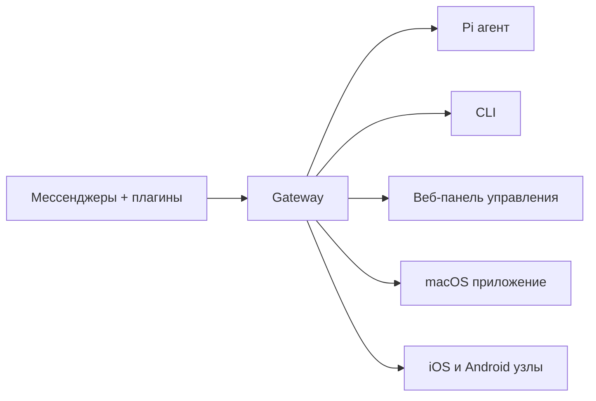

# OpenClaw 🦞

<p align="center">
    
    
</p>

> _"EXFOLIATE! EXFOLIATE!"_ — Космический лобстер, вероятно

<p align="center">
  <strong>Шлюз для AI-агентов на любой ОС: WhatsApp, Telegram, Discord, iMessage и другие.</strong><br />
  Отправьте сообщение и получите ответ агента прямо из кармана. Плагины добавляют Mattermost и другие каналы.
</p>

<Columns>
  <Card title="Начало работы" href="/start/getting-started" icon="rocket">
    Установите OpenClaw и запустите Gateway за несколько минут.
  </Card>
  <Card title="Запустите мастер настройки" href="/start/wizard" icon="sparkles">
    Пошаговая настройка с помощью `openclaw onboard` и процессов сопряжения.
  </Card>
  <Card title="Откройте панель управления" href="/web/control-ui" icon="layout-dashboard">
    Запустите веб-панель для чата, конфигурации и сессий.
  </Card>
</Columns>

## Что такое OpenClaw?

OpenClaw — это **самостоятельно размещаемый шлюз**, который соединяет ваши любимые мессенджеры — WhatsApp, Telegram, Discord, iMessage и другие — с AI-агентами для программирования, такими как Pi. Вы запускаете один процесс Gateway на своей машине (или сервере), и он становится мостом между вашими мессенджерами и всегда доступным AI-ассистентом.

**Для кого это?** Для разработчиков и опытных пользователей, которые хотят иметь личного AI-ассистента, доступного из любого места — без потери контроля над своими данными и без зависимости от облачных сервисов.

**Что делает его особенным?**

- **Самостоятельное размещение**: работает на вашем оборудовании, по вашим правилам
- **Многоканальность**: один Gateway обслуживает WhatsApp, Telegram, Discord и другие одновременно
- **Ориентирован на агентов**: создан для агентов программирования с использованием инструментов, сессий, памяти и маршрутизации между агентами
- **Открытый исходный код**: лицензия MIT, развивается сообществом

**Что вам нужно?** Node 22+, API-ключ (рекомендуется Anthropic) и 5 минут.

## Как это работает



Gateway — это единый источник истины для сессий, маршрутизации и подключений к каналам.

## Ключевые возможности

<Columns>
  <Card title="Многоканальный шлюз" icon="network">
    WhatsApp, Telegram, Discord и iMessage с одним процессом Gateway.
  </Card>
  <Card title="Плагины для каналов" icon="plug">
    Добавьте Mattermost и другие с помощью пакетов расширений.
  </Card>
  <Card title="Маршрутизация между агентами" icon="route">
    Изолированные сессии для каждого агента, рабочего пространства или отправителя.
  </Card>
  <Card title="Поддержка медиа" icon="image">
    Отправка и получение изображений, аудио и документов.
  </Card>
  <Card title="Веб-панель управления" icon="monitor">
    Браузерная панель для чата, конфигурации, сессий и узлов.
  </Card>
  <Card title="Мобильные узлы" icon="smartphone">
    Сопряжение iOS и Android узлов с поддержкой Canvas.
  </Card>
</Columns>

## Быстрый старт

<Steps>
  <Step title="Установите OpenClaw">
    ```bash
    npm install -g openclaw@latest
    ```
  </Step>
  <Step title="Выполните начальную настройку и установите сервис">
    ```bash
    openclaw onboard --install-daemon
    ```
  </Step>
  <Step title="Подключите WhatsApp и запустите Gateway">
    ```bash
    openclaw channels login
    openclaw gateway --port 18789
    ```
  </Step>
</Steps>

Нужна полная инструкция по установке и настройке для разработки? См. [Быстрый старт](/start/quickstart).

## Панель управления

Откройте веб-панель управления после запуска Gateway.

- Локальный адрес по умолчанию: [http://127.0.0.1:18789/](http://127.0.0.1:18789/)
- Удаленный доступ: [Веб-интерфейсы](/web) и [Tailscale](/gateway/tailscale)

<p align="center">
  
</p>

## Конфигурация (опционально)

Конфигурация находится в `~/.openclaw/openclaw.json`.

- Если вы **ничего не делаете**, OpenClaw использует встроенный бинарный файл Pi в режиме RPC с сессиями для каждого отправителя.
- Если вы хотите ограничить доступ, начните с `channels.whatsapp.allowFrom` и (для групп) правил упоминания.

Пример:

```json5
{
  channels: {
    whatsapp: {
      allowFrom: ["+15555550123"],
      groups: { "*": { requireMention: true } },
    },
  },
  messages: { groupChat: { mentionPatterns: ["@openclaw"] } },
}
```

## Начните отсюда

<Columns>
  <Card title="Разделы документации" href="/start/hubs" icon="book-open">
    Вся документация и руководства, организованные по сценариям использования.
  </Card>
  <Card title="Конфигурация" href="/gateway/configuration" icon="settings">
    Основные настройки Gateway, токены и конфигурация провайдеров.
  </Card>
  <Card title="Удаленный доступ" href="/gateway/remote" icon="globe">
    Шаблоны доступа через SSH и tailnet.
  </Card>
  <Card title="Каналы" href="/channels/telegram" icon="message-square">
    Настройка для конкретных каналов: WhatsApp, Telegram, Discord и других.
  </Card>
  <Card title="Узлы" href="/nodes" icon="smartphone">
    iOS и Android узлы с сопряжением и Canvas.
  </Card>
  <Card title="Помощь" href="/help" icon="life-buoy">
    Распространенные решения и точка входа для устранения неполадок.
  </Card>
</Columns>

## Узнать больше

<Columns>
  <Card title="Полный список возможностей" href="/concepts/features" icon="list">
    Полные возможности каналов, маршрутизации и медиа.
  </Card>
  <Card title="Маршрутизация между агентами" href="/concepts/multi-agent" icon="route">
    Изоляция рабочих пространств и сессии для каждого агента.
  </Card>
  <Card title="Безопасность" href="/gateway/security" icon="shield">
    Токены, списки разрешений и средства контроля безопасности.
  </Card>
  <Card title="Устранение неполадок" href="/gateway/troubleshooting" icon="wrench">
    Диагностика Gateway и распространенные ошибки.
  </Card>
  <Card title="О проекте и благодарности" href="/reference/credits" icon="info">
    Происхождение проекта, участники и лицензия.
  </Card>
</Columns>
