# Agentic Security Hardening Initiative

This document defines the Epic for remediating seven critical agentic-security failure modes identified in the [Agentic Security Assessment](/security/agentic-security-assessment). Each security concern maps to specific stories with testable acceptance criteria and verifiable outcomes.

> **Related Documentation:**
> - [Agentic Security Assessment](/security/agentic-security-assessment) - Detailed risk analysis and findings
> - [Formal Verification](/security/formal-verification) - Machine-checked security models
> - [Operational Security Guide](/gateway/security) - Day-to-day security operations

---

## Epic Overview

| Field | Value |
|-------|-------|
| **Epic Name** | Agentic Security Hardening Initiative |
| **Epic ID** | SEC-EPIC-001 |
| **Status** | Planning |
| **Owner** | Security Team |
| **Priority** | P0 - Critical |
| **Target Completion** | TBD |

### Executive Summary

OpenClaw operates as an AI gateway connecting frontier language models to real messaging surfaces and system tools. This creates unique security challenges where AI reasoning can directly translate into privileged system actions. This epic consolidates remediation work for seven identified failure modes, with emphasis on **architectural controls that are enforceable by the system itself**—not dependent on human vigilance or procedural compliance.

---

## Problem Statement

### The Seven Agentic-Security Failure Modes

The [Agentic Security Assessment](/security/agentic-security-assessment) identifies seven critical failure modes specific to AI agent architectures:

| # | Failure Mode | Risk Level | Description |
|---|--------------|------------|-------------|
| **1** | Agent/Control Plane Separation | Critical | Lack of architectural separation between agent reasoning and control plane execution allows prompt injection to translate directly into privileged operations |
| **2** | Internet-Exposed Control Surfaces | Critical | UI, APIs, WebSockets, and tool endpoints exposed without consistent authentication requirements |
| **3** | Untrusted Inputs (Prompt Injection) | Critical | External content from messages, URLs, files, and webhooks can influence tool execution through prompt injection |
| **4** | Credential Management | High | Over-privileged, long-lived credentials and sessions lack TTL enforcement and scope limitations |
| **5** | Runtime Policy Enforcement | High | Missing mandatory enforcement of tool execution policies allows potential bypasses |
| **6** | Runtime Isolation | High | Insufficient isolation between agent runtime and host system creates container escape and data exfiltration risks |
| **7** | Security as System Property | Medium | Security treated as deployment hygiene rather than a design-time constraint enables regression and drift |

### Core Problem

Traditional security approaches assume:
- Input validation is sufficient to prevent attacks
- Access control gates are well-defined boundaries
- Attackers are external entities with limited influence

Agentic systems violate these assumptions because:
- **AI reasoning itself is the attack surface** - Malicious input influences AI decisions, which then invoke tools
- **Trust boundaries are non-obvious** - Content traverses multiple planes (user → AI reasoning → tool execution → host)
- **The attacker operates through the AI** - Prompt injection turns the AI into an unwitting accomplice

### Why This Matters

Without addressing these failure modes:

1. **Prompt injection becomes remote code execution** - An attacker in a chat room can execute arbitrary commands
2. **Credential exposure compounds over time** - Long-lived tokens accumulate access across sessions
3. **Security bypasses accumulate** - Policy enforcement gaps create paths around intended controls
4. **Misconfiguration persists** - Without automated validation, insecure defaults remain deployed

---

## Security Objectives

Each objective maps to one or more failure modes and defines a measurable security improvement:

### O1: Architectural Separation (Failure Mode 1)

**Goal:** Enforce architectural separation between reasoning and control planes.

| Metric | Current | Target |
|--------|---------|--------|
| Tool calls requiring policy evaluation | Partial | 100% |
| Audit logging for tool dispatch | Limited | Complete |
| Boundary markers in code | None | All tool dispatch paths |

**Measurement:** Count of tool invocations that bypass policy engine should be zero.

### O2: Control Surface Hardening (Failure Mode 2)

**Goal:** Reduce internet-exposed control surface area with mandatory authentication.

| Metric | Current | Target |
|--------|---------|--------|
| Authenticated endpoints | Configurable | 100% by default |
| TLS enforcement for Control UI | Optional | Required |
| Rate limiting coverage | None | All exposed endpoints |

**Measurement:** Security audit reports zero unauthenticated control surface findings.

### O3: Content Gating (Failure Mode 3)

**Goal:** Implement content gating for untrusted inputs before they influence tool execution.

| Metric | Current | Target |
|--------|---------|--------|
| Prompt injection detection patterns | Basic | Comprehensive |
| External content boundary markers | None | All external content |
| Tool input sanitization | Partial | Complete |

**Measurement:** Prompt injection detection rate ≥ 95% on benchmark test suite.

### O4: Credential Lifecycle (Failure Mode 4)

**Goal:** Enforce credential lifecycle with TTL and least-privilege scoping.

| Metric | Current | Target |
|--------|---------|--------|
| Credentials with TTL | OAuth only | All credential types |
| Session expiration policy | None | Configurable, enforced |
| Credential scope limiting | None | Implemented |

**Measurement:** All credential types have configurable and enforced TTL.

### O5: Policy Enforcement (Failure Mode 5)

**Goal:** Implement runtime policy enforcement with violation detection and alerting.

| Metric | Current | Target |
|--------|---------|--------|
| Mandatory policy evaluation | Optional | Required |
| Policy violation alerts | None | Real-time |
| Policy-as-code coverage | Partial | Complete |

**Measurement:** All policy violations generate auditable alerts.

### O6: Isolation Strengthening (Failure Mode 6)

**Goal:** Strengthen sandbox isolation boundaries with defense-in-depth.

| Metric | Current | Target |
|--------|---------|--------|
| Namespace isolation | Basic | Complete |
| Seccomp profile coverage | None | Default enabled |
| Sandbox escape test coverage | Limited | Comprehensive |

**Measurement:** All sandbox escape tests pass for defined isolation boundaries.

### O7: Security as Design Constraint (Failure Mode 7)

**Goal:** Integrate security as a design-time constraint, not deployment hygiene.

| Metric | Current | Target |
|--------|---------|--------|
| CI/CD security integration | None | Blocking on critical |
| Secure-by-default configs | Partial | Complete |
| Security regression tests | Limited | Comprehensive |

**Measurement:** Security audit integrated into CI/CD with blocking on critical findings.

---

## Success Criteria

These are the verifiable outcomes that define epic completion:

| ID | Criterion | Verification Method | Owner |
|----|-----------|---------------------|-------|
| **SC1** | All tool execution flows through audited policy engine | Code review + unit tests covering all tool dispatch paths | Security Team |
| **SC2** | Zero unauthenticated access to control surfaces | `openclaw security audit` returns no auth findings | Security Team |
| **SC3** | Prompt injection detection rate ≥ 95% | Run benchmark test suite against detection system | Security Team |
| **SC4** | All credentials have configurable TTL | Configuration schema includes TTL for all credential types | Security Team |
| **SC5** | Runtime policy violations generate alerts | Integration test triggering violations and verifying alert generation | Security Team |
| **SC6** | Sandbox escape tests pass for all isolation boundaries | Automated test suite for namespace, filesystem, network isolation | Security Team |
| **SC7** | Security checks integrated into CI/CD pipeline | CI workflow includes `openclaw security audit` with blocking | Security Team |

### Acceptance Test Plan

```bash
# SC1: Tool dispatch policy coverage
npm test -- --grep "tool-policy" --coverage
# Verify 100% coverage of tool dispatch paths

# SC2: Authentication audit
openclaw security audit --deep
# Verify zero critical or warn findings for gateway/auth

# SC3: Prompt injection benchmark
npm test -- --grep "external-content" 
# Verify detection rate ≥ 95%

# SC4: Credential TTL verification
grep -r "ttl\|TTL\|expiresAt" src/config/types.auth.ts
# Verify all credential types include TTL fields

# SC5: Policy violation alerts
npm test -- --grep "policy-violation-alert"
# Verify alerts generated for test violations

# SC6: Sandbox escape tests
npm test -- --grep "sandbox-escape"
# Verify all isolation boundary tests pass

# SC7: CI/CD integration
grep "security audit" .github/workflows/*.yml
# Verify security audit step exists with blocking
```

---

## Epic Scope Diagram

```mermaid
flowchart TB
    subgraph Epic["SEC-EPIC-001: Agentic Security Hardening Initiative"]
        direction TB
        
        subgraph Concern1["Concern 1: Agent/Control Plane Separation"]
            S1_1["Story 1.1: Implement boundary markers"]
            S1_2["Story 1.2: Add tool dispatch audit logging"]
            S1_3["Story 1.3: Create isolation tests"]
            S1_4["Story 1.4: Document trust boundaries"]
        end
        
        subgraph Concern2["Concern 2: Exposed Control Surfaces"]
            S2_1["Story 2.1: Implement auth matrix"]
            S2_2["Story 2.2: Add rate limiting"]
            S2_3["Story 2.3: Network binding audit"]
            S2_4["Story 2.4: TLS enforcement"]
            S2_5["Story 2.5: WebSocket hardening"]
        end
        
        subgraph Concern3["Concern 3: Prompt Injection"]
            S3_1["Story 3.1: Enhance detection patterns"]
            S3_2["Story 3.2: Implement content gating"]
            S3_3["Story 3.3: Command injection sanitization"]
            S3_4["Story 3.4: Boundary markers"]
            S3_5["Story 3.5: Tool result sanitization"]
        end
        
        subgraph Concern4["Concern 4: Credential Management"]
            S4_1["Story 4.1: TTL enforcement"]
            S4_2["Story 4.2: Session expiration"]
            S4_3["Story 4.3: Automatic rotation"]
            S4_4["Story 4.4: Least-privilege scoping"]
            S4_5["Story 4.5: Usage audit logging"]
        end
        
        subgraph Concern5["Concern 5: Runtime Policy"]
            S5_1["Story 5.1: Policy-as-code framework"]
            S5_2["Story 5.2: Violation alerts"]
            S5_3["Story 5.3: Approval workflow"]
            S5_4["Story 5.4: Policy audit trail"]
            S5_5["Story 5.5: Policy testing framework"]
        end
        
        subgraph Concern6["Concern 6: Runtime Isolation"]
            S6_1["Story 6.1: Docker security config"]
            S6_2["Story 6.2: Seccomp profiles"]
            S6_3["Story 6.3: Namespace verification"]
            S6_4["Story 6.4: Filesystem isolation tests"]
            S6_5["Story 6.5: Network isolation controls"]
        end
        
        subgraph Concern7["Concern 7: Security as System Property"]
            S7_1["Story 7.1: CI/CD integration"]
            S7_2["Story 7.2: Secure-by-default configs"]
            S7_3["Story 7.3: Regression tests"]
            S7_4["Story 7.4: Security metrics"]
            S7_5["Story 7.5: Automated scanning"]
        end
    end
    
    Concern1 --> Concern2
    Concern2 --> Concern3
    Concern3 --> Concern4
    Concern4 --> Concern5
    Concern5 --> Concern6
    Concern6 --> Concern7
    
    style Concern1 fill:#ffcccc
    style Concern2 fill:#ffcccc
    style Concern3 fill:#ffddcc
    style Concern4 fill:#ffddcc
    style Concern5 fill:#ffffcc
    style Concern6 fill:#ffffcc
    style Concern7 fill:#ccffcc
```



**Dependency Flow:**
- Concerns 1-2 (Architectural) should be addressed first as they establish security boundaries
- Concerns 3-4 (Data Flow) depend on clear boundaries being established
- Concerns 5-6 (Runtime) build on architectural and data flow controls
- Concern 7 (Process) integrates all previous work into sustainable practices

---

## Out-of-Scope Items

The following are **explicitly excluded** from this epic to maintain focus on security hardening:

### Excluded Categories

| Category | Rationale |
|----------|-----------|
| **Feature development unrelated to security** | New features should be tracked in separate epics |
| **Performance optimizations** | Unless directly tied to security (e.g., rate limiting) |
| **UI/UX improvements** | Unless they address security usability (e.g., auth flows) |
| **Documentation-only changes** | Every story must include enforceable technical controls |
| **Manual intervention procedures** | All controls must be system-enforceable |

### Specific Exclusions

1. **New channel integrations** - Channel security uses existing allowlist/policy patterns
2. **Model provider integrations** - Provider-specific security is out of scope
3. **Deployment infrastructure** - Infrastructure hardening is separate from application security
4. **User education materials** - Focus is on technical controls, not training
5. **Compliance certifications** - SOC2/ISO27001 work is separate initiative
6. **Third-party security audits** - External assessments are follow-on work

### Boundary Clarifications

| In Scope | Out of Scope |
|----------|--------------|
| Tool execution policy enforcement | Tool feature development |
| Sandbox isolation hardening | New sandbox features |
| Authentication requirement enforcement | New auth provider integrations |
| Credential TTL implementation | Credential migration tooling |
| Security audit CI/CD integration | General CI/CD improvements |
| Prompt injection detection | AI model fine-tuning |

---

## Story Index

Stories are grouped by security concern and linked to detailed implementation specifications:

### Concern 1: Agent/Control Plane Separation

- [Stories: Agent/Control Plane Separation](/security/stories/concern-1-agent-control-plane)

**Summary:** Establish clear architectural boundaries between AI reasoning and privileged tool execution, ensuring all tool dispatch flows through auditable policy evaluation.

### Concern 2: Internet-Exposed Control Surfaces

- [Stories: Exposed Control Surfaces](/security/stories/concern-2-exposed-surfaces)

**Summary:** Harden all internet-exposed control surfaces with mandatory authentication, rate limiting, and TLS enforcement.

### Concern 3: Prompt Injection Defense

- [Stories: Prompt Injection Defense](/security/stories/concern-3-prompt-injection)

**Summary:** Implement comprehensive content gating and prompt injection detection to prevent untrusted input from influencing tool execution.

### Concern 4: Credential Lifecycle Management

- [Stories: Credential Management](/security/stories/concern-4-credentials)

**Summary:** Enforce credential lifecycle with TTL, automatic rotation, and least-privilege scoping for all credential types.

### Concern 5: Runtime Policy Enforcement

- [Stories: Runtime Policy Enforcement](/security/stories/concern-5-runtime-policy)

**Summary:** Implement mandatory runtime policy enforcement with violation detection, alerting, and approval workflows.

### Concern 6: Runtime Isolation

- [Stories: Runtime Isolation](/security/stories/concern-6-runtime-isolation)

**Summary:** Strengthen sandbox isolation with comprehensive namespace isolation, seccomp profiles, and escape detection.

### Concern 7: Security as System Property

- [Stories: Security as System Property](/security/stories/concern-7-security-system-property)

**Summary:** Integrate security checks into CI/CD pipeline with secure-by-default configurations and regression test coverage.

---

## Implementation Phases

### Phase 1: Foundation (Concerns 1, 2)

**Focus:** Establish architectural security boundaries

| Deliverable | Stories | Duration |
|-------------|---------|----------|
| Tool dispatch audit logging | 1.1, 1.2 | 2 weeks |
| Authentication matrix | 2.1 | 1 week |
| Rate limiting | 2.2 | 1 week |
| TLS enforcement | 2.4 | 1 week |

**Exit Criteria:** SC1 (tool policy coverage) and SC2 (authentication audit) pass.

### Phase 2: Data Flow Controls (Concerns 3, 4)

**Focus:** Control how data influences tool execution

| Deliverable | Stories | Duration |
|-------------|---------|----------|
| Enhanced prompt injection detection | 3.1, 3.2 | 2 weeks |
| Content boundary markers | 3.4 | 1 week |
| Credential TTL enforcement | 4.1, 4.2 | 2 weeks |

**Exit Criteria:** SC3 (prompt injection detection) and SC4 (credential TTL) pass.

### Phase 3: Runtime Hardening (Concerns 5, 6)

**Focus:** Harden runtime execution environment

| Deliverable | Stories | Duration |
|-------------|---------|----------|
| Policy violation alerts | 5.2 | 1 week |
| Sandbox seccomp profiles | 6.2 | 2 weeks |
| Isolation tests | 6.3, 6.4, 6.5 | 2 weeks |

**Exit Criteria:** SC5 (policy alerts) and SC6 (sandbox tests) pass.

### Phase 4: Process Integration (Concern 7)

**Focus:** Sustainable security practices

| Deliverable | Stories | Duration |
|-------------|---------|----------|
| CI/CD security integration | 7.1 | 1 week |
| Secure-by-default configs | 7.2 | 1 week |
| Security regression tests | 7.3 | 2 weeks |

**Exit Criteria:** SC7 (CI/CD integration) passes.

---

## Risk Registry

| Risk | Likelihood | Impact | Mitigation |
|------|------------|--------|------------|
| Breaking changes to tool execution | Medium | High | Comprehensive test coverage before changes |
| Performance impact from policy evaluation | Medium | Medium | Benchmark before/after, optimize critical paths |
| False positive prompt injection detection | High | Medium | Tunable thresholds, operator override capability |
| Credential TTL breaking existing integrations | Medium | Medium | Migration guide, backward-compatible defaults |
| Sandbox hardening breaking legitimate use cases | Medium | High | Extensive testing with real workloads |

---

## Related Documentation

| Document | Purpose |
|----------|---------|
| [Agentic Security Assessment](/security/agentic-security-assessment) | Detailed findings and architecture analysis for each failure mode |
| [Formal Verification](/security/formal-verification) | Machine-checked security models and TLA+ specifications |
| [Operational Security Guide](/gateway/security) | Day-to-day security operations and threat model |
| [Sandbox Documentation](/gateway/sandboxing) | Current sandbox implementation reference |
| [Authentication Documentation](/gateway/authentication) | Current authentication mechanisms |

---

## Appendix: Source Code References

The following source files are the primary targets for security remediation work:

| File | Concerns | Purpose |
|------|----------|---------|
| `src/agents/pi-embedded-runner.ts` | 1 | Agent reasoning execution flow |
| `src/agents/tool-policy.ts` | 1, 5 | Tool policy definitions and enforcement |
| `src/gateway/server-http.ts` | 2 | HTTP/WebSocket server, control surfaces |
| `src/gateway/auth.ts` | 2 | Gateway authentication |
| `src/gateway/control-ui.ts` | 2 | Control UI exposure |
| `src/security/external-content.ts` | 3 | Prompt injection detection |
| `src/agents/bash-tools.exec.ts` | 3 | Command execution |
| `src/agents/auth-profiles.ts` | 4 | API key and credential management |
| `src/config/types.auth.ts` | 4 | Credential type definitions |
| `src/sessions/send-policy.ts` | 5 | Send policy rules |
| `src/agents/sandbox/config.ts` | 6 | Sandbox configuration |
| `src/agents/sandbox/docker.ts` | 6 | Docker orchestration |
| `src/security/audit.ts` | 7 | Security audit checks |
| `src/security/fix.ts` | 7 | Security remediation |

---

## Change Log

| Date | Version | Changes | Author |
|------|---------|---------|--------|
| TBD | 1.0 | Initial epic definition | Security Team |
