# Security Stories: Agent/Control Plane Separation

This document contains implementation-ready Jira stories for addressing **Security Concern 1: Lack of separation between agent reasoning and control plane**. Each story includes testable acceptance criteria, dependencies, verification methods, and affected files.

> **Related Documentation:**
> - [Agentic Security Assessment - Concern 1](/security/agentic-security-assessment#concern-1-agentcontrol-plane-separation) - Detailed risk analysis
> - [Security Epic](/security/security-epic) - Parent epic and success criteria
> - [Formal Verification](/security/formal-verification) - Machine-checked security models

---

## Overview

| Field | Value |
|-------|-------|
| **Security Concern** | 1 - Lack of separation between agent reasoning and control plane |
| **Risk Level** | Critical |
| **Priority** | P0 |
| **Total Stories** | 4 |
| **Epic Reference** | [SEC-EPIC-001](/security/security-epic) |

### Problem Summary

In agentic systems, the AI model's reasoning output directly influences system actions. Without clear architectural separation between the reasoning plane (where the LLM generates decisions) and the control plane (where tool execution occurs), prompt injection or reasoning manipulation can translate immediately into privileged operations.

**Current State:**
- Tool calls flow from LLM response directly to tool dispatch (`src/agents/pi-embedded-runner/run.ts`)
- Policy evaluation and tool execution share the same memory space
- No audit logging at the boundary between reasoning and control planes
- Tool parameters are passed directly from AI output without intermediate validation layer

**Target State:**
- All tool dispatch passes through a single, audited boundary function
- Type system enforces separation between reasoning context and control context
- Comprehensive audit logging for all tool dispatch decisions
- Automated tests validate separation invariant

### Architecture Context

```mermaid
flowchart TB
    subgraph CurrentState["Current State (Problem)"]
        direction LR
        LLM1["LLM Response"] --> ToolCall1["Tool Call"]
        ToolCall1 --> Dispatch1["Dispatcher"]
        Dispatch1 --> Policy1["Policy Check"]
        Policy1 --> Exec1["Execution"]
        
        style LLM1 fill:#ffcccc
        style ToolCall1 fill:#ffcccc
        style Dispatch1 fill:#ffffcc
        style Policy1 fill:#ffffcc
        style Exec1 fill:#ccffcc
    end
    
    subgraph TargetState["Target State (Solution)"]
        direction LR
        LLM2["LLM Response"] --> ToolCall2["Tool Call"]
        ToolCall2 --> Boundary["🔒 Boundary<br/>Function"]
        Boundary --> Audit["Audit Log"]
        Boundary --> Policy2["Policy Check"]
        Policy2 --> Token["Capability<br/>Token"]
        Token --> Exec2["Execution"]
        
        style LLM2 fill:#ffcccc
        style ToolCall2 fill:#ffcccc
        style Boundary fill:#ff9999,stroke:#ff0000,stroke-width:3px
        style Audit fill:#cce5ff
        style Policy2 fill:#ffffcc
        style Token fill:#ccffcc
        style Exec2 fill:#ccffcc
    end
```



### Source Code References

| Component | File Path | Relevance |
|-----------|-----------|-----------|
| Agent Runner | `src/agents/pi-embedded-runner.ts` | Entry point for agent execution |
| Agent Execution | `src/agents/pi-embedded-runner/run.ts` | Main execution flow, tool dispatch origin |
| Tool Dispatcher | `src/agents/pi-tools.ts` | Tool invocation and policy filtering |
| Tool Policy | `src/agents/tool-policy.ts` | TOOL_GROUPS and TOOL_PROFILES definitions |
| Gateway Methods | `src/gateway/server-methods.ts` | Control plane authorization |
| Send Policy | `src/sessions/send-policy.ts` | Outbound message authorization |

---

## Story 1.1: Implement Reasoning/Control Plane Boundary Marker

### Metadata

| Field | Value |
|-------|-------|
| **Story ID** | SEC-1.1 |
| **Category** | Architecture |
| **Priority** | Critical |
| **Estimated Complexity** | Medium |
| **Status** | Planned |

### Description

Add explicit boundary markers in code to distinguish reasoning plane operations from control plane operations. All tool dispatch calls must pass through a single boundary-checking function that logs the transition and enforces policy evaluation before any tool execution proceeds.

The boundary function serves as the **single point of control** where:
1. The tool request is validated and serialized
2. Policy evaluation occurs
3. The decision is logged before execution
4. A capability token is issued for approved requests

This architectural change ensures that no code path can invoke tools without passing through the boundary, making the separation between "AI decided to call this tool" and "this tool is allowed to execute" explicit and auditable.

### Acceptance Criteria

- [ ] **AC-1.1.1**: All tool dispatch calls pass through a single boundary-checking function
  - The function `crossControlBoundary()` is called for every tool invocation
  - Direct tool calls bypassing this function are architecturally prevented
  - Function location: `src/agents/boundary.ts` (new file)

- [ ] **AC-1.1.2**: Boundary crossing events are logged with structured audit metadata
  - Log entry includes: `toolName`, `sessionId`, `requestId`, `timestamp`, `policyDecision`
  - Log level is `info` for allowed, `warn` for denied
  - Logs are in structured JSON format for automated analysis

- [ ] **AC-1.1.3**: Type system enforces separation between reasoning context and control context
  - `ReasoningContext` type contains LLM state, conversation history, system prompt
  - `ControlContext` type contains tool capabilities, policy state, execution permissions
  - Tool dispatch function signature requires explicit `ControlContext` parameter
  - TypeScript compilation fails if reasoning context is passed to tool execution

- [ ] **AC-1.1.4**: Boundary function validates tool request before policy evaluation
  - Tool name must exist in registered tool set
  - Tool parameters must match expected schema
  - Malformed requests are rejected before policy evaluation

### Dependencies

None - This is a foundational story.

### Security Risk Reduced

**Attack Vector Mitigated:** Prevents reasoning layer from directly invoking control plane operations without policy check.

| Before | After |
|--------|-------|
| Prompt injection can directly trigger tool execution | Prompt injection must pass through boundary function |
| No single enforcement point for tool invocation | All tools must pass through `crossControlBoundary()` |
| Policy bypass possible through code paths | TypeScript prevents policy bypass at compile time |

### Verification Method

| Verification Type | Method |
|-------------------|--------|
| **Unit Tests** | Verify tool calls route through boundary function; mock boundary to confirm invocation |
| **Integration Tests** | Validate audit logs are generated for all tool dispatches |
| **Static Analysis** | TypeScript compilation ensures type separation is enforced |
| **Architecture Tests** | AST analysis confirms no direct tool invocations bypass boundary |

**Test File:** `src/agents/boundary.test.ts` (new)

### Affected Files

| File | Change Type | Description |
|------|-------------|-------------|
| `src/agents/boundary.ts` | **Create** | New boundary function and types |
| `src/agents/pi-embedded-runner/run.ts` | Modify | Route tool dispatch through boundary |
| `src/agents/pi-tools.ts` | Modify | Accept ControlContext, enforce boundary |
| `src/agents/types/contexts.ts` | **Create** | ReasoningContext and ControlContext types |
| `src/agents/boundary.test.ts` | **Create** | Unit tests for boundary function |

### Implementation Notes

```typescript
// Example boundary function signature (src/agents/boundary.ts)
export interface BoundaryCrossing {
  toolName: string;
  toolParams: unknown;
  sessionId: string;
  requestId: string;
  reasoningContext: ReasoningContext;
}

export interface BoundaryResult {
  allowed: boolean;
  controlContext: ControlContext | null;
  policyDecision: PolicyDecision;
  auditId: string;
}

export async function crossControlBoundary(
  crossing: BoundaryCrossing
): Promise<BoundaryResult> {
  // 1. Validate tool request
  // 2. Log boundary crossing attempt
  // 3. Evaluate policy
  // 4. Log decision
  // 5. Return result with capability token if allowed
}
```

---

## Story 1.2: Add Tool Dispatch Audit Logging

### Metadata

| Field | Value |
|-------|-------|
| **Story ID** | SEC-1.2 |
| **Category** | Observability |
| **Priority** | High |
| **Estimated Complexity** | Small |
| **Status** | Planned |

### Description

Implement structured audit logging for all tool dispatch operations. Every tool invocation must generate an audit log entry capturing the tool name, arguments (with sensitive data redacted), policy evaluation result, and execution outcome. These logs enable forensic analysis during incident response and provide visibility into agent behavior patterns.

The audit logging system must:
- Use a dedicated audit log subsystem separate from operational logs
- Automatically redact sensitive parameters (passwords, tokens, keys)
- Include correlation IDs for tracing request flows
- Support log aggregation and SIEM integration

### Acceptance Criteria

- [ ] **AC-1.2.1**: Every tool dispatch generates an audit log entry
  - 100% of tool invocations produce audit records
  - No tool execution path bypasses audit logging
  - Audit logging failure does not block tool execution but is itself logged as error

- [ ] **AC-1.2.2**: Audit logs include tool name, session ID, policy decision, and timestamp
  - Required fields: `toolName`, `sessionId`, `requestId`, `policyDecision`, `timestamp`, `outcome`
  - Optional fields: `durationMs`, `errorType`, `parameterHash`
  - Timestamp uses ISO 8601 format with millisecond precision

- [ ] **AC-1.2.3**: Sensitive arguments are automatically redacted in audit logs
  - Redaction patterns cover: `password`, `token`, `key`, `secret`, `credential`, `auth`
  - Redacted values show `[REDACTED]` placeholder
  - Parameter schema can mark fields as sensitive for explicit redaction
  - Hash of original value is preserved for correlation (SHA-256, truncated)

- [ ] **AC-1.2.4**: Audit logs are queryable by session, time range, and tool name
  - Log format supports standard log aggregation tools (ELK, Splunk, etc.)
  - Session-based filtering enables incident timeline reconstruction
  - Tool name filtering enables pattern analysis across sessions

### Dependencies

| Dependency | Reason |
|------------|--------|
| **Story 1.1** | Boundary function provides single audit injection point |

### Security Risk Reduced

**Attack Vector Mitigated:** Provides forensic visibility into tool execution for incident response and anomaly detection.

| Before | After |
|--------|-------|
| Limited visibility into tool execution history | Complete audit trail of all tool invocations |
| Sensitive data potentially logged in plaintext | Automatic redaction protects credentials |
| No correlation between tool calls and sessions | Session-based tracking enables timeline analysis |

### Verification Method

| Verification Type | Method |
|-------------------|--------|
| **Integration Tests** | Verify audit log generation for sample tool invocations |
| **Log Format Tests** | Validate JSON structure and required fields |
| **Redaction Tests** | Confirm sensitive parameters are properly redacted |
| **Query Tests** | Verify logs can be filtered by session, time, tool name |

**Test File:** `src/logging/tool-audit.test.ts` (new)

### Affected Files

| File | Change Type | Description |
|------|-------------|-------------|
| `src/logging/tool-audit.ts` | **Create** | Tool dispatch audit logging module |
| `src/logging/redaction.ts` | **Create** | Sensitive data redaction utilities |
| `src/agents/pi-tools.ts` | Modify | Integrate audit logging at dispatch |
| `src/agents/boundary.ts` | Modify | Call audit logger on boundary crossing |
| `src/logging/subsystem.ts` | Modify | Add audit log subsystem |
| `src/logging/tool-audit.test.ts` | **Create** | Audit logging tests |

### Implementation Notes

```typescript
// Example audit log entry (src/logging/tool-audit.ts)
export interface ToolAuditEntry {
  // Identification
  auditId: string;           // Unique audit entry ID (UUID)
  requestId: string;         // Correlation ID for request tracing
  sessionId: string;         // Session identifier
  
  // Tool invocation details
  toolName: string;          // Name of tool invoked
  toolCategory: string;      // Tool category (fs, runtime, web, etc.)
  parameterHash: string;     // SHA-256 hash of parameters (truncated)
  
  // Policy evaluation
  policyDecision: 'allowed' | 'denied' | 'elevated';
  policyRule?: string;       // Which rule determined the decision
  
  // Execution outcome
  outcome: 'success' | 'failure' | 'timeout' | 'aborted';
  errorType?: string;        // Error classification if failed
  durationMs?: number;       // Execution duration
  
  // Metadata
  timestamp: string;         // ISO 8601 timestamp
  agentId?: string;          // Agent identifier if applicable
}
```

---

## Story 1.3: Create Agent Reasoning Isolation Tests

### Metadata

| Field | Value |
|-------|-------|
| **Story ID** | SEC-1.3 |
| **Category** | Tooling |
| **Priority** | High |
| **Estimated Complexity** | Medium |
| **Status** | Planned |

### Description

Develop a comprehensive test suite that validates reasoning operations cannot directly trigger tool execution without passing through policy enforcement. These tests serve as automated regression tests ensuring the separation invariant is maintained across code changes.

The test suite must cover:
- All tool categories defined in `TOOL_GROUPS` (`src/agents/tool-policy.ts`)
- Positive cases (allowed tools execute correctly)
- Negative cases (policy bypass attempts are blocked)
- Boundary conditions (edge cases in policy evaluation)

### Acceptance Criteria

- [ ] **AC-1.3.1**: Test suite covers all tool categories defined in TOOL_GROUPS
  - Tests exist for: `group:memory`, `group:web`, `group:fs`, `group:runtime`, `group:sessions`, `group:ui`, `group:automation`, `group:messaging`, `group:nodes`, `group:openclaw`
  - Each tool group has at least 3 test cases (allow, deny, edge case)
  - Test coverage report shows 90%+ of tool dispatch code paths

- [ ] **AC-1.3.2**: Tests verify policy engine is invoked for every tool dispatch
  - Mock policy engine to track invocations
  - Assert policy engine is called before any tool execution
  - Verify policy engine receives correct tool name and parameters

- [ ] **AC-1.3.3**: Tests include negative cases for policy bypass attempts
  - Test: Direct tool function calls without boundary crossing (should fail TypeScript compilation or throw runtime error)
  - Test: Malformed tool requests bypass policy (should be rejected)
  - Test: Tool name spoofing (should be detected and blocked)
  - Test: Policy engine error handling (should fail-safe, not fail-open)

- [ ] **AC-1.3.4**: Tests run as part of CI pipeline with blocking capability
  - Tests execute on every PR to the repository
  - Failed tests block PR merge
  - Test results are reported in PR comments

### Dependencies

| Dependency | Reason |
|------------|--------|
| **Story 1.1** | Boundary function must exist for testing |
| **Story 1.2** | Audit logs provide test assertions |

### Security Risk Reduced

**Attack Vector Mitigated:** Ensures separation invariant is maintained through automated regression testing, preventing accidental reintroduction of bypass paths.

| Before | After |
|--------|-------|
| Separation relies on code review only | Automated tests catch violations |
| Regression can reintroduce bypass paths | CI pipeline blocks regressions |
| Coverage gaps may exist in policy paths | 90%+ coverage requirement |

### Verification Method

| Verification Type | Method |
|-------------------|--------|
| **CI Pipeline** | Test suite runs on every PR |
| **Coverage Report** | Policy path coverage 90%+ |
| **Mutation Testing** | Verify tests detect intentional bypass attempts |
| **Test Review** | Security team reviews test completeness |

**Test File:** `src/agents/reasoning-isolation.test.ts` (new)

### Affected Files

| File | Change Type | Description |
|------|-------------|-------------|
| `src/agents/reasoning-isolation.test.ts` | **Create** | Comprehensive isolation test suite |
| `src/agents/tool-policy.test.ts` | Modify | Add policy enforcement verification tests |
| `src/agents/boundary.test.ts` | Modify | Add bypass attempt tests |
| `.github/workflows/security-tests.yml` | **Create** | CI workflow for security tests |
| `vitest.config.ts` | Modify | Include security tests in coverage |

### Implementation Notes

```typescript
// Example test structure (src/agents/reasoning-isolation.test.ts)
import { describe, it, expect, vi } from 'vitest';
import { TOOL_GROUPS } from './tool-policy';
import { crossControlBoundary } from './boundary';

describe('Agent Reasoning Isolation', () => {
  describe('Tool Group Coverage', () => {
    Object.entries(TOOL_GROUPS).forEach(([groupName, tools]) => {
      describe(`${groupName}`, () => {
        tools.forEach((toolName) => {
          it(`should route ${toolName} through boundary function`, async () => {
            const boundarySpy = vi.spyOn(boundary, 'crossControlBoundary');
            // Invoke tool through normal dispatch path
            await dispatchTool(toolName, {});
            expect(boundarySpy).toHaveBeenCalledWith(
              expect.objectContaining({ toolName })
            );
          });
        });
      });
    });
  });

  describe('Policy Bypass Prevention', () => {
    it('should reject direct tool invocation without boundary crossing', () => {
      // This test verifies TypeScript prevents direct calls
      // or runtime throws if attempted via any/unknown escape
    });

    it('should fail-safe when policy engine errors', async () => {
      vi.spyOn(policyEngine, 'evaluate').mockRejectedValue(new Error('Policy error'));
      const result = await crossControlBoundary({ toolName: 'exec', ... });
      expect(result.allowed).toBe(false); // Fail-safe, not fail-open
    });
  });
});
```

---

## Story 1.4: Document Trust Boundary Architecture

### Metadata

| Field | Value |
|-------|-------|
| **Story ID** | SEC-1.4 |
| **Category** | Architecture (paired with enforceable control) |
| **Priority** | Medium |
| **Estimated Complexity** | Medium |
| **Status** | Planned |

### Description

Create architecture documentation with Mermaid diagrams showing trust boundaries, **paired with runtime assertions that validate the documented boundaries**. This story explicitly links documentation to enforcement—the documentation is not standalone but reflects runtime-verifiable invariants.

The documentation must be machine-verifiable:
- Runtime assertions check that the documented boundaries exist
- Architecture tests verify code structure matches documentation
- CI pipeline validates documentation accuracy

### Acceptance Criteria

- [ ] **AC-1.4.1**: Documentation includes Mermaid diagram of reasoning/control plane separation
  - Diagram shows: Reasoning Plane, Policy Boundary, Control Plane, Execution Plane
  - All components are labeled with source file references
  - Trust levels are visually distinguished (colors, borders)
  - Diagram is embedded in `docs/security/agentic-security-assessment.md` Concern 1 section

- [ ] **AC-1.4.2**: Runtime assertions validate boundary invariants at startup
  - Assertions verify boundary function is registered in tool dispatch pipeline
  - Assertions verify policy engine is initialized before tool dispatch
  - Assertion failures prevent gateway startup with clear error message
  - Assertions are defined in `src/agents/invariants.ts`

- [ ] **AC-1.4.3**: Architecture tests verify code structure matches documented boundaries
  - AST analysis confirms all tool invocations go through boundary function
  - Test verifies ReasoningContext and ControlContext types are separate
  - Test verifies no imports leak control types into reasoning modules
  - Architecture tests run as part of CI pipeline

- [ ] **AC-1.4.4**: Documentation links to specific source code locations
  - Every architectural component in diagram has `Source: path/file.ts:LineNumber` citation
  - Links are validated during CI (files exist, line numbers are reasonable)
  - Broken links fail the documentation build

### Dependencies

| Dependency | Reason |
|------------|--------|
| **Story 1.1** | Boundary function must exist to document and validate |

### Security Risk Reduced

**Attack Vector Mitigated:** Makes security architecture explicit and machine-verifiable, preventing documentation drift from implementation.

| Before | After |
|--------|-------|
| Architecture exists only in code | Architecture is documented with diagrams |
| Documentation may drift from implementation | Runtime assertions validate documentation |
| Code changes may break invariants silently | Architecture tests catch structural violations |

### Verification Method

| Verification Type | Method |
|-------------------|--------|
| **Documentation Review** | Security team reviews diagram accuracy |
| **Runtime Startup** | Invariant assertions run at gateway start |
| **CI Pipeline** | Architecture tests verify code structure |
| **Link Validation** | Documentation build validates source citations |

**Test File:** `src/agents/architecture.test.ts` (new)

### Affected Files

| File | Change Type | Description |
|------|-------------|-------------|
| `docs/security/agentic-security-assessment.md` | Modify | Update Concern 1 diagram with implementation details |
| `src/agents/invariants.ts` | **Create** | Runtime boundary invariant assertions |
| `src/agents/architecture.test.ts` | **Create** | Architecture validation tests |
| `src/gateway/startup.ts` | Modify | Run invariant assertions on startup |
| `.github/workflows/docs.yml` | Modify | Add source citation validation |

### Implementation Notes

```typescript
// Example invariant assertions (src/agents/invariants.ts)
export function validateAgentControlSeparationInvariants(): void {
  // Invariant 1: Boundary function must be registered
  if (!toolDispatch.hasBoundaryFunction()) {
    throw new InvariantViolation(
      'AGENT_CONTROL_SEPARATION_001',
      'Tool dispatch pipeline missing boundary function'
    );
  }

  // Invariant 2: Policy engine must be initialized
  if (!policyEngine.isInitialized()) {
    throw new InvariantViolation(
      'AGENT_CONTROL_SEPARATION_002', 
      'Policy engine not initialized before tool dispatch'
    );
  }

  // Invariant 3: Context types must be distinct
  // (This is a compile-time check via TypeScript, logged for confirmation)
  logger.info('Invariant AGENT_CONTROL_SEPARATION validated successfully');
}
```


---

## Summary Table

| Story ID | Title | Category | Priority | Complexity | Dependencies | Status |
|----------|-------|----------|----------|------------|--------------|--------|
| SEC-1.1 | Implement Reasoning/Control Plane Boundary Marker | Architecture | Critical | Medium | None | Planned |
| SEC-1.2 | Add Tool Dispatch Audit Logging | Observability | High | Small | SEC-1.1 | Planned |
| SEC-1.3 | Create Agent Reasoning Isolation Tests | Tooling | High | Medium | SEC-1.1, SEC-1.2 | Planned |
| SEC-1.4 | Document Trust Boundary Architecture | Architecture | Medium | Medium | SEC-1.1 | Planned |

### Implementation Order

```mermaid
flowchart LR
    SEC11["SEC-1.1<br/>Boundary Marker<br/>🔴 Critical"]
    SEC12["SEC-1.2<br/>Audit Logging<br/>🟡 High"]
    SEC13["SEC-1.3<br/>Isolation Tests<br/>🟡 High"]
    SEC14["SEC-1.4<br/>Architecture Docs<br/>🟢 Medium"]
    
    SEC11 --> SEC12
    SEC11 --> SEC14
    SEC12 --> SEC13
    SEC11 --> SEC13
```



### Success Metrics

| Metric | Target | Measurement |
|--------|--------|-------------|
| Tool calls through boundary | 100% | Audit log analysis |
| Policy path test coverage | 90%+ | Coverage report |
| Audit log completeness | 100% | Log validation tests |
| Invariant validation | Pass on startup | Runtime assertion |
| Documentation accuracy | 100% | Architecture tests |

---

## Appendix: Tool Groups Reference

From `src/agents/tool-policy.ts:13-57`:

| Group Name | Tools | Risk Level |
|------------|-------|------------|
| `group:memory` | `memory_search`, `memory_get` | Low |
| `group:web` | `web_search`, `web_fetch` | Medium |
| `group:fs` | `read`, `write`, `edit`, `apply_patch` | High |
| `group:runtime` | `exec`, `process` | Critical |
| `group:sessions` | `sessions_list`, `sessions_history`, `sessions_send`, `sessions_spawn`, `session_status` | Medium |
| `group:ui` | `browser`, `canvas` | High |
| `group:automation` | `cron`, `gateway` | High |
| `group:messaging` | `message` | Medium |
| `group:nodes` | `nodes` | Medium |
| `group:openclaw` | (composite of above) | Varies |

---

## Revision History

| Version | Date | Author | Changes |
|---------|------|--------|---------|
| 1.0 | 2025-02-02 | Security Team | Initial story definitions |
