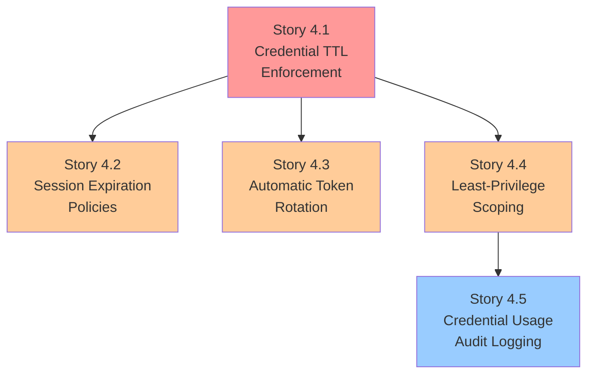

# Security Stories: Credential Management

This document contains implementation-ready Jira stories for addressing **Security Concern 4: Over-privileged, long-lived credentials and sessions**. Each story includes acceptance criteria, dependencies, verification methods, and affected files.

## Overview

| Field | Value |
|-------|-------|
| **Security Concern** | 4 - Over-privileged, long-lived credentials and sessions |
| **Related Assessment** | [Agentic Security Assessment - Concern 4](/security/agentic-security-assessment#concern-4-credential-management) |
| **Related Epic** | [Agentic Security Hardening Initiative](/security/security-epic) |
| **Total Stories** | 5 |
| **Combined Complexity** | Medium-Large |

### Problem Statement

Credential management in agentic systems is complex because multiple credential types coexist with varying security requirements:

- **API Keys:** Provider access (Anthropic, OpenAI, etc.) - currently stored indefinitely
- **Session Tokens:** Gateway authentication - no idle or absolute timeout
- **OAuth Tokens:** Refreshable credentials with provider-defined expiration
- **Channel Credentials:** WhatsApp, Telegram, Discord tokens - platform-managed
- **Device Identity:** Control UI device tokens - no rotation policy

Long-lived credentials with broad privileges create **risk amplification**: a single credential compromise can provide persistent, wide-ranging access that accumulates over time.

### Current Implementation References

```
Source: src/config/types.auth.ts:1-29
```

The current `AuthProfileConfig` and `AuthConfig` types define credential modes (`api_key`, `oauth`, `token`) and cooldown settings but lack:
- Configurable TTL per credential
- Scope limitation fields
- Session timeout configuration

```
Source: src/agents/auth-profiles/types.ts:1-74
```

The `AuthProfileCredential` union includes `ApiKeyCredential`, `TokenCredential`, and `OAuthCredential` with optional expiry only for token type. The `ProfileUsageStats` tracks cooldowns but not credential age or scope.

### Story Dependency Graph



---

## Story 4.1: Implement Credential TTL Enforcement

### Metadata

| Field | Value |
|-------|-------|
| **Story ID** | SEC-4.1 |
| **Category** | Runtime |
| **Priority** | Critical |
| **Estimated Complexity** | Medium |
| **Security Concern** | 4 |

### Description

Add mandatory TTL (time-to-live) configuration for all credential types with automatic expiration enforcement. This ensures that credentials cannot persist indefinitely, limiting the window of exposure if a credential is compromised.

The implementation should:
1. Extend `AuthProfileConfig` in `types.auth.ts` to include a `ttl` field
2. Extend credential types in `auth-profiles/types.ts` with `createdAt` and `expiresAt` fields
3. Add TTL validation at credential usage time that rejects expired credentials
4. Log credential expiration events for audit and alerting

### Acceptance Criteria

- [ ] **AC1:** All credential types in `src/config/types.auth.ts` have a configurable `ttl` field (optional, with sensible defaults: API keys 90 days, OAuth per-provider, tokens 24 hours)
- [ ] **AC2:** Credentials are automatically invalidated when TTL expires - `resolveApiKeyForProfile()` returns error for expired credentials
- [ ] **AC3:** Credential expiration events are logged to the audit system with structured metadata (credential ID hash, type, age at expiration)
- [ ] **AC4:** Configuration validation warns when TTL exceeds recommended maximums (API keys over 180 days, tokens over 7 days)

### Dependencies

None - This is a foundational story that other credential stories depend on.

### Security Risk Reduced

**Limits exposure window for compromised credentials.** Without TTL enforcement:
- Compromised API keys provide indefinite access
- Stolen tokens can be replayed long after theft
- Credential rotation is purely voluntary

With TTL enforcement:
- Credentials automatically expire based on policy
- Attackers face time-limited access windows
- Organizations can enforce rotation through expiration

### Verification Method

| Test Type | Description | Location |
|-----------|-------------|----------|
| Unit Test | Verify TTL field parsing and validation | `src/config/types.auth.test.ts` |
| Unit Test | Verify credential expiration check logic | `src/agents/auth-profiles/credential-ttl.test.ts` |
| Integration Test | Verify expired credentials are rejected at usage time | `src/agents/auth-profiles/oauth.test.ts` |
| Audit Test | Verify expiration events appear in audit log | `src/agents/auth-profiles/credential-ttl.test.ts` |

### Affected Files

| File | Change Type | Description |
|------|-------------|-------------|
| `src/config/types.auth.ts` | Modify | Add `ttl` field to `AuthProfileConfig` and validation |
| `src/agents/auth-profiles/types.ts` | Modify | Add `createdAt` and `expiresAt` to credential types |
| `src/agents/auth-profiles/credential-ttl.ts` | **Create** | New module for TTL enforcement logic |
| `src/agents/auth-profiles/oauth.ts` | Modify | Add expiration check to `resolveApiKeyForProfile()` |
| `src/agents/auth-profiles/store.ts` | Modify | Populate `createdAt` on credential creation |

### Implementation Notes

```typescript
// Example TTL configuration in types.auth.ts
export type AuthProfileConfig = {
  provider: string;
  mode: "api_key" | "oauth" | "token";
  email?: string;
  /** Credential TTL in seconds. Default varies by mode. */
  ttl?: number;
};

// Example defaults
const DEFAULT_TTL_BY_MODE = {
  api_key: 90 * 24 * 60 * 60,    // 90 days in seconds
  oauth: undefined,              // Defer to provider token expiry
  token: 24 * 60 * 60,          // 24 hours in seconds
};
```

---

## Story 4.2: Add Session Expiration Policies

### Metadata

| Field | Value |
|-------|-------|
| **Story ID** | SEC-4.2 |
| **Category** | Runtime |
| **Priority** | High |
| **Estimated Complexity** | Medium |
| **Security Concern** | 4 |

### Description

Implement configurable session idle timeout and absolute timeout with automatic session termination. Sessions currently persist indefinitely, meaning a session token obtained through any means provides perpetual access until manually revoked.

The implementation should:
1. Add `session.idleTimeout` and `session.absoluteTimeout` configuration options
2. Track session activity timestamps in session storage
3. Implement session timeout checking at request time
4. Automatically terminate expired sessions with audit logging

### Acceptance Criteria

- [ ] **AC1:** Sessions have configurable idle timeout with a sensible default (30 minutes), configurable via `session.idleTimeout` in seconds
- [ ] **AC2:** Sessions have configurable absolute timeout with a sensible default (24 hours), configurable via `session.absoluteTimeout` in seconds
- [ ] **AC3:** Expired sessions are automatically terminated when accessed, with an audit log entry including session ID, expiration reason (idle vs absolute), and session age
- [ ] **AC4:** Session activity timestamp is updated on each authenticated request to reset the idle timer

### Dependencies

- **Story 4.1:** Credential TTL Enforcement - Provides the TTL infrastructure pattern to follow

### Security Risk Reduced

**Prevents indefinite session persistence after abandonment.** Without session expiration:
- Abandoned sessions remain valid forever
- Stolen session tokens provide permanent access
- Shared device risk (previous user's session persists)

With session expiration:
- Idle sessions automatically terminate after inactivity
- All sessions have maximum lifetime regardless of activity
- Session hijacking provides time-limited access

### Verification Method

| Test Type | Description | Location |
|-----------|-------------|----------|
| Unit Test | Verify session timeout configuration parsing | `src/config/types.session.test.ts` |
| Integration Test | Verify idle timeout terminates inactive sessions | `src/gateway/session-timeout.test.ts` |
| Integration Test | Verify absolute timeout terminates long sessions | `src/gateway/session-timeout.test.ts` |
| Audit Test | Verify expiration events logged with correct metadata | `src/gateway/session-timeout.test.ts` |

### Affected Files

| File | Change Type | Description |
|------|-------------|-------------|
| `src/gateway/session-utils.ts` | Modify | Add session timeout checking to session validation |
| `src/sessions/session-timeout.ts` | **Create** | New module for session expiration logic |
| `src/config/types.session.ts` | Modify | Add `idleTimeout` and `absoluteTimeout` config options |
| `src/gateway/server-ws.ts` | Modify | Update activity timestamp on WebSocket messages |
| `src/gateway/server-http.ts` | Modify | Update activity timestamp on HTTP requests |

### Implementation Notes

```typescript
// Example session timeout configuration
export type SessionTimeoutConfig = {
  /** Idle timeout in seconds. Default: 1800 (30 minutes). 0 = disabled. */
  idleTimeout?: number;
  /** Absolute timeout in seconds. Default: 86400 (24 hours). 0 = disabled. */
  absoluteTimeout?: number;
};

// Session entry extension
export type SessionEntry = {
  // ... existing fields ...
  lastActivityAt?: number;  // Timestamp of last activity
  createdAt?: number;       // Session creation timestamp
};
```

---

## Story 4.3: Create Automatic Token Rotation

### Metadata

| Field | Value |
|-------|-------|
| **Story ID** | SEC-4.3 |
| **Category** | Runtime |
| **Priority** | High |
| **Estimated Complexity** | Large |
| **Security Concern** | 4 |

### Description

Implement automatic rotation for API tokens and OAuth refresh tokens with configurable rotation interval. Currently, OAuth tokens refresh only when they expire, and API keys never rotate. Proactive rotation limits the validity window of any individual token, reducing risk even if the token is never known to be compromised.

The implementation should:
1. Add `rotation.interval` configuration for proactive rotation timing
2. Implement rotation logic that generates new credentials before expiration
3. Maintain service continuity with overlapping validity (grace period)
4. Log rotation events with hashed old/new token identifiers for audit

### Acceptance Criteria

- [ ] **AC1:** Tokens are automatically rotated at configurable intervals before their TTL expires (default: rotate when 75% of TTL has elapsed)
- [ ] **AC2:** Rotation maintains service continuity with a configurable grace period where both old and new tokens are valid (default: 5 minutes)
- [ ] **AC3:** Rotation events are logged with structured audit data including credential type, old token hash (first 8 chars of SHA-256), new token hash, and rotation reason
- [ ] **AC4:** Rotation failures are handled gracefully with retry logic and do not interrupt active sessions

### Dependencies

- **Story 4.1:** Credential TTL Enforcement - Requires TTL infrastructure for rotation timing

### Security Risk Reduced

**Limits token validity window even if not compromised.** Without automatic rotation:
- Compromised tokens remain valid until manual revocation
- Long-lived tokens accumulate risk over time
- Token theft provides extended access window

With automatic rotation:
- Even undetected compromises have limited lifetime
- Attackers must continuously re-compromise credentials
- Rotation events provide audit trail for anomaly detection

### Verification Method

| Test Type | Description | Location |
|-----------|-------------|----------|
| Unit Test | Verify rotation timing calculation | `src/agents/token-rotation.test.ts` |
| Integration Test | Verify rotation maintains service continuity | `src/agents/token-rotation.integration.test.ts` |
| Integration Test | Verify grace period allows both old/new tokens | `src/agents/token-rotation.integration.test.ts` |
| Audit Test | Verify rotation events logged with correct hashes | `src/agents/token-rotation.test.ts` |

### Affected Files

| File | Change Type | Description |
|------|-------------|-------------|
| `src/agents/auth-profiles.ts` | Modify | Export new rotation functions |
| `src/agents/token-rotation.ts` | **Create** | New module for automatic rotation logic |
| `src/agents/auth-profiles/oauth.ts` | Modify | Integrate rotation with OAuth refresh flow |
| `src/config/types.auth.ts` | Modify | Add rotation configuration options |
| `src/agents/auth-profiles/usage.ts` | Modify | Track rotation history in usage stats |

### Implementation Notes

```typescript
// Example rotation configuration
export type RotationConfig = {
  /** Enable automatic rotation. Default: true for oauth, false for api_key. */
  enabled?: boolean;
  /** Rotation threshold as percentage of TTL (0-100). Default: 75. */
  rotateAtPercentage?: number;
  /** Grace period in seconds where both tokens are valid. Default: 300. */
  gracePeriodSeconds?: number;
  /** Maximum rotation retries on failure. Default: 3. */
  maxRetries?: number;
};

// Rotation event for audit
export type RotationEvent = {
  timestamp: number;
  credentialType: "api_key" | "oauth" | "token";
  oldTokenHash: string;  // First 8 chars of SHA-256
  newTokenHash: string;
  reason: "scheduled" | "manual" | "expiring";
  success: boolean;
  error?: string;
};
```

---

## Story 4.4: Implement Least-Privilege Credential Scoping

### Metadata

| Field | Value |
|-------|-------|
| **Story ID** | SEC-4.4 |
| **Category** | Architecture |
| **Priority** | High |
| **Estimated Complexity** | Medium |
| **Security Concern** | 4 |

### Description

Add credential scope definitions that restrict what operations each credential can perform. Currently, all credentials have equivalent privilege levels - any valid credential can perform any operation. This violates the principle of least privilege.

The implementation should:
1. Define scope types (read, write, execute, admin) in a new `CredentialScope` type
2. Add `scope` field to `AuthProfileConfig` and credential types
3. Implement scope validation at operation time
4. Log and block operations that exceed credential scope

### Acceptance Criteria

- [ ] **AC1:** Credentials have explicit scope definitions with granular permissions: `read` (view configs/sessions), `write` (modify configs), `execute` (invoke tools), `admin` (manage credentials/users)
- [ ] **AC2:** Operations validate required scope before execution using a centralized `validateCredentialScope()` function
- [ ] **AC3:** Scope violations are logged as security events and blocked with a clear error message indicating required vs actual scope
- [ ] **AC4:** Scope configuration supports both allowlist (`scopes: ["read", "execute"]`) and role-based (`role: "operator"`) patterns

### Dependencies

- **Story 4.1:** Credential TTL Enforcement - Provides credential metadata infrastructure

### Security Risk Reduced

**Limits blast radius of credential compromise to authorized operations.** Without scoping:
- Any credential can perform any operation
- API key theft enables full system access
- No defense-in-depth for credential compromise

With scoping:
- Compromised credentials limited to their assigned scope
- Read-only credentials cannot execute tools
- Operator credentials cannot access admin functions

### Verification Method

| Test Type | Description | Location |
|-----------|-------------|----------|
| Unit Test | Verify scope parsing and validation | `src/agents/credential-scope.test.ts` |
| Unit Test | Verify operation-to-scope mapping | `src/agents/credential-scope.test.ts` |
| Integration Test | Verify scope enforcement blocks unauthorized operations | `src/gateway/auth.scope.test.ts` |
| Security Test | Verify privilege escalation attempts are blocked | `src/security/credential-scope.security.test.ts` |

### Affected Files

| File | Change Type | Description |
|------|-------------|-------------|
| `src/config/types.auth.ts` | Modify | Add `scope` and `role` fields to `AuthProfileConfig` |
| `src/agents/credential-scope.ts` | **Create** | New module for scope definitions and validation |
| `src/gateway/auth.ts` | Modify | Integrate scope validation into authentication flow |
| `src/agents/auth-profiles/types.ts` | Modify | Add scope fields to credential union types |
| `src/gateway/server-methods.ts` | Modify | Add scope requirements to RPC method handlers |

### Implementation Notes

```typescript
// Scope definitions
export type CredentialScope = "read" | "write" | "execute" | "admin";

export type CredentialRole = "viewer" | "operator" | "admin";

// Role-to-scope mapping
const ROLE_SCOPES: Record<CredentialRole, CredentialScope[]> = {
  viewer: ["read"],
  operator: ["read", "write", "execute"],
  admin: ["read", "write", "execute", "admin"],
};

// Operation-to-scope mapping
const OPERATION_REQUIRED_SCOPE: Record<string, CredentialScope> = {
  "sessions.list": "read",
  "sessions.get": "read",
  "config.update": "write",
  "tools.invoke": "execute",
  "credentials.rotate": "admin",
};
```

---

## Story 4.5: Add Credential Usage Audit Logging

### Metadata

| Field | Value |
|-------|-------|
| **Story ID** | SEC-4.5 |
| **Category** | Observability |
| **Priority** | Medium |
| **Estimated Complexity** | Small |
| **Security Concern** | 4 |

### Description

Implement comprehensive audit logging for all credential usage, creation, rotation, and revocation events. Currently, credential operations are not systematically logged, making incident response and forensic analysis difficult.

The implementation should:
1. Define structured audit log format for credential events
2. Log all credential operations (use, create, rotate, revoke, expire)
3. Include context (operation, session, source IP where available)
4. Enable alerting for unusual access patterns

### Acceptance Criteria

- [ ] **AC1:** All credential operations generate audit log entries in a structured JSON format with consistent schema
- [ ] **AC2:** Audit logs include credential ID (hashed), operation type (`use`, `create`, `rotate`, `revoke`, `expire`), timestamp, and context (session ID, requesting identity)
- [ ] **AC3:** Unusual access patterns trigger security alerts, including: credential used from new location, multiple failed attempts, usage outside normal hours (configurable)
- [ ] **AC4:** Audit logs are written to a dedicated credential audit log file separate from general application logs

### Dependencies

- **Story 4.4:** Least-Privilege Credential Scoping - Provides scope information to include in audit logs

### Security Risk Reduced

**Enables detection of credential misuse and forensic analysis.** Without audit logging:
- Credential misuse goes undetected
- Incident response lacks visibility
- Compliance audits cannot verify credential policies

With audit logging:
- All credential activity is traceable
- Unusual patterns trigger alerts
- Post-incident forensics have complete timeline

### Verification Method

| Test Type | Description | Location |
|-----------|-------------|----------|
| Unit Test | Verify audit log format and content | `src/logging/credential-audit.test.ts` |
| Integration Test | Verify all credential operations generate logs | `src/agents/auth-profiles/audit.integration.test.ts` |
| Alert Test | Verify unusual patterns trigger alerts | `src/logging/credential-audit.alert.test.ts` |
| Format Test | Verify log schema matches documented format | `src/logging/credential-audit.test.ts` |

### Affected Files

| File | Change Type | Description |
|------|-------------|-------------|
| `src/agents/auth-profiles.ts` | Modify | Add audit logging calls to exported functions |
| `src/logging/credential-audit.ts` | **Create** | New module for credential audit logging |
| `src/agents/auth-profiles/oauth.ts` | Modify | Add audit logging to OAuth operations |
| `src/agents/auth-profiles/store.ts` | Modify | Add audit logging to store operations |
| `src/agents/token-rotation.ts` | Modify | Add audit logging to rotation events |

### Implementation Notes

```typescript
// Credential audit event schema
export type CredentialAuditEvent = {
  timestamp: number;
  eventType: "use" | "create" | "rotate" | "revoke" | "expire" | "scope_violation";
  credentialId: string;      // Hashed for privacy
  credentialType: "api_key" | "oauth" | "token";
  provider?: string;
  sessionId?: string;
  success: boolean;
  error?: string;
  context?: {
    operation?: string;
    requestingIdentity?: string;
    sourceIp?: string;
    userAgent?: string;
  };
};

// Alert threshold configuration
export type AuditAlertConfig = {
  /** Max failed attempts before alert. Default: 5. */
  maxFailedAttempts?: number;
  /** Alert on first use from new identity. Default: true. */
  alertOnNewIdentity?: boolean;
  /** Alert outside these hours (0-23). Default: undefined (disabled). */
  normalHoursStart?: number;
  normalHoursEnd?: number;
};
```

---

## Summary Table

| Story ID | Title | Category | Priority | Complexity | Dependencies | Status |
|----------|-------|----------|----------|------------|--------------|--------|
| SEC-4.1 | Implement Credential TTL Enforcement | Runtime | Critical | Medium | None | 🔴 Not Started |
| SEC-4.2 | Add Session Expiration Policies | Runtime | High | Medium | SEC-4.1 | 🔴 Not Started |
| SEC-4.3 | Create Automatic Token Rotation | Runtime | High | Large | SEC-4.1 | 🔴 Not Started |
| SEC-4.4 | Implement Least-Privilege Credential Scoping | Architecture | High | Medium | SEC-4.1 | 🔴 Not Started |
| SEC-4.5 | Add Credential Usage Audit Logging | Observability | Medium | Small | SEC-4.4 | 🔴 Not Started |

### Implementation Order

1. **Phase 1 (Foundation):** SEC-4.1 - Credential TTL Enforcement
2. **Phase 2 (Parallel):** SEC-4.2, SEC-4.3, SEC-4.4 - Can be implemented in parallel after SEC-4.1
3. **Phase 3 (Observability):** SEC-4.5 - Depends on SEC-4.4 for scope context

### Success Metrics

| Metric | Target | Measurement |
|--------|--------|-------------|
| Credentials with enforced TTL | 100% | Configuration audit |
| Sessions with expiration policy | 100% | Configuration audit |
| Credential operations with audit logs | 100% | Log coverage analysis |
| Scope violations detected and blocked | 100% | Security test coverage |

---

## References

### Source Code

- `src/config/types.auth.ts` - Credential configuration types
- `src/agents/auth-profiles.ts` - Auth profile module exports
- `src/agents/auth-profiles/types.ts` - Credential type definitions
- `src/agents/auth-profiles/oauth.ts` - OAuth token management
- `src/agents/auth-profiles/usage.ts` - Cooldown and usage tracking
- `src/gateway/session-utils.ts` - Session management utilities
- `src/pairing/pairing-store.ts` - Pairing and allowlist management

### Related Documentation

- [Agentic Security Assessment](/security/agentic-security-assessment) - Full security analysis
- [Security Epic](/security/security-epic) - Remediation initiative
- [Operational Security Guide](/gateway/security) - Day-to-day security operations
- [Formal Verification](/security/formal-verification) - Machine-checked security models

### External Standards

- NIST SP 800-63B - Digital Identity Guidelines: Authentication
- OWASP Authentication Cheat Sheet
- CIS Controls v8 - Control 5: Account Management
