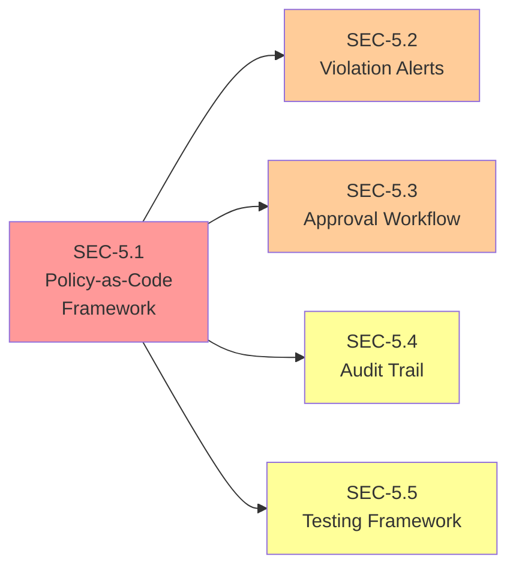
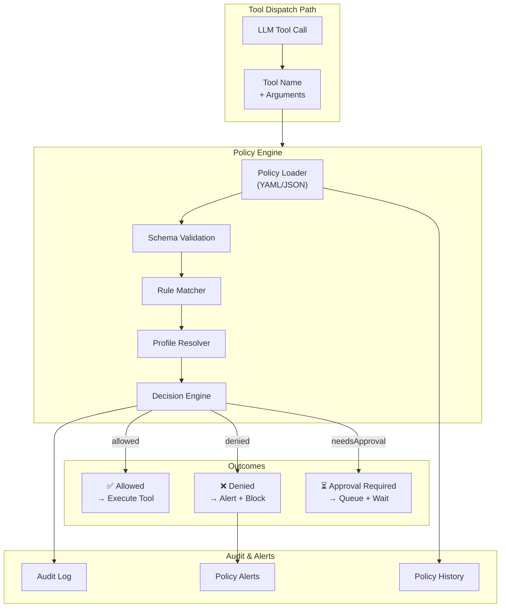

# Security Stories: Runtime Policy Enforcement

This document contains implementation-ready Jira stories for addressing **Security Concern 5: Missing runtime policy enforcement and execution guardrails**. Each story is designed for autonomous execution by Blitzy with testable acceptance criteria and verifiable outcomes.

> **Related Documentation:**
> - [Agentic Security Assessment - Concern 5](/security/agentic-security-assessment#concern-5-runtime-policy-enforcement) - Detailed risk analysis
> - [Security Epic](/security/security-epic) - Overall remediation initiative
> - [Operational Security Guide](/gateway/security) - Current security operations

---

## Overview

### Security Concern

**Concern 5:** Missing mandatory enforcement of tool execution policies and execution guardrails.

Policy enforcement is the last line of defense before tool execution. Without mandatory, consistent policy evaluation, tools can be invoked outside their intended scope, potentially through prompt injection or configuration errors.

### Current Architecture Reference

The existing tool policy system provides building blocks but lacks mandatory enforcement:

**Tool Groups and Profiles:**

```
Source: src/agents/tool-policy.ts:13-76
```

```typescript
export const TOOL_GROUPS: Record<string, string[]> = {
  "group:memory": ["memory_search", "memory_get"],
  "group:web": ["web_search", "web_fetch"],
  "group:fs": ["read", "write", "edit", "apply_patch"],
  "group:runtime": ["exec", "process"],
  "group:sessions": ["sessions_list", "sessions_history", "sessions_send", ...],
  "group:ui": ["browser", "canvas"],
  "group:automation": ["cron", "gateway"],
  "group:messaging": ["message"],
  "group:nodes": ["nodes"],
  "group:openclaw": [...], // All native tools
};

const TOOL_PROFILES: Record<ToolProfileId, ToolProfilePolicy> = {
  minimal: { allow: ["session_status"] },
  coding: { allow: ["group:fs", "group:runtime", "group:sessions", "group:memory", "image"] },
  messaging: { allow: ["group:messaging", "sessions_list", "sessions_history", ...] },
  full: {}, // No restrictions
};
```

**Send Policy Rules:**

```
Source: src/sessions/send-policy.ts:47-106
```

The send policy system allows rule-based authorization for outbound messages using channel, chatType, and keyPrefix matching with allow/deny actions.

**Node Command Policy:**

```
Source: src/gateway/node-command-policy.ts:99-137
```

Platform-based command allowlisting with configurable extensions and denylists.

**Sandbox Tool Policy:**

```
Source: src/agents/sandbox/tool-policy.ts:71-142
```

Sandbox-specific tool policy resolution with agent-level and global overrides, pattern-based matching (exact, wildcard, regex).

### Identified Gaps

| Gap | Description | Impact |
|-----|-------------|--------|
| Opt-in Enforcement | Policy profiles are optional, not mandatory | Tools may execute without policy check |
| No Violation Logging | Policy denials are not consistently logged | Blind spots in security monitoring |
| No Approval Workflow | High-risk tools lack approval workflow integration | Sensitive operations uncontrolled |
| Policy Testing Gap | No framework for testing policy configurations | Misconfigured policies deployed |
| No Content Trust Integration | Policies don't consider content trust level | Untrusted content gets full tool access |

---

## Story 5.1: Implement Policy-as-Code Framework

### Metadata

| Field | Value |
|-------|-------|
| **Story ID** | SEC-5.1 |
| **Category** | Architecture |
| **Security Concern** | 5 - Runtime Policy Enforcement |
| **Priority** | Critical |
| **Estimated Complexity** | Large |

### Description

Create a policy-as-code framework where all tool execution policies are defined in declarative configuration with runtime enforcement. This framework replaces the current opt-in profile system with a mandatory policy engine that evaluates every tool execution request.

The framework must:
- Define policies in structured YAML/JSON format with JSON Schema validation
- Provide a policy engine that intercepts all tool dispatch calls
- Support hot-reloading of policy changes without Gateway restart
- Integrate with existing tool profile system while adding mandatory enforcement

**Target Architecture:**

```yaml
# Example policy configuration
tools:
  policy:
    version: "1.0"
    enforcement: mandatory  # Block tools if policy can't be evaluated
    default: coding         # Default profile when no rules match
    rules:
      - name: "untrusted-content-minimal"
        match:
          sessionKey: "hook:*"
          contentTrust: untrusted
        profile: minimal
        audit: true
      - name: "telegram-group-no-runtime"
        match:
          channel: telegram
          chatType: group
        deny: ["group:runtime"]
        audit: true
      - name: "elevated-require-approval"
        match:
          tool: ["exec", "process"]
        requireApproval: true
        audit: true
```

### Acceptance Criteria

- [ ] **AC1:** Policies are defined in structured YAML/JSON format with schema validation
  - Policy files are validated against a JSON Schema on load
  - Invalid policies fail fast with clear error messages
  - Schema is versioned for forward compatibility
  
- [ ] **AC2:** Policy engine evaluates all tool execution requests against active policies
  - Every tool dispatch in `src/agents/pi-tools.ts` passes through policy engine
  - Policy engine returns `{allowed: boolean, reason: string, rule?: string}`
  - Denied tools are not executed; execution path is blocked, not just logged
  
- [ ] **AC3:** Policy changes require explicit version bump and take effect without restart
  - Policy files include a `version` field that must increment on changes
  - Gateway watches policy files and hot-reloads on change
  - Version mismatch between running and file policies generates audit log

### Dependencies

None - this is a foundational story.

### Security Risk Reduced

- **Makes policies explicit:** Policies are documented as code, not implicit in behavior
- **Enables auditability:** All policy decisions are traceable to specific rules
- **Ensures consistency:** Every tool call is evaluated, eliminating bypass paths
- **Supports compliance:** Policy-as-code enables policy review and approval workflows

### Verification Method

| Test Type | Description |
|-----------|-------------|
| Unit Tests | Policy evaluation logic with various rule combinations |
| Schema Validation Tests | Invalid policy files are rejected with clear errors |
| Integration Tests | Tool dispatch is blocked when policy denies |
| Hot-Reload Tests | Policy changes take effect without restart |
| Regression Tests | Existing tool profiles continue to work |

### Affected Files

| File | Change Type | Description |
|------|-------------|-------------|
| `src/agents/tool-policy.ts` | Modify | Add policy engine integration point |
| `src/config/types.policy.ts` | **New** | TypeScript types for policy configuration |
| `src/agents/policy-engine.ts` | **New** | Policy evaluation engine implementation |
| `src/agents/policy-schema.json` | **New** | JSON Schema for policy validation |
| `src/agents/pi-tools.ts` | Modify | Integrate policy engine into tool dispatch |
| `src/config/config.ts` | Modify | Add policy file loading and watching |

---

## Story 5.2: Add Runtime Policy Violation Alerts

### Metadata

| Field | Value |
|-------|-------|
| **Story ID** | SEC-5.2 |
| **Category** | Observability |
| **Security Concern** | 5 - Runtime Policy Enforcement |
| **Priority** | High |
| **Estimated Complexity** | Medium |

### Description

Implement real-time alerting for policy violations with configurable severity levels and notification channels. When the policy engine denies a tool execution, an alert is generated containing full context about the attempted operation, the policy rule that triggered the denial, and the session context.

Alerts must support multiple notification channels:
- Structured logging (always enabled)
- Webhook delivery (configurable)
- Gateway WebSocket notification (for Control UI)

Alert severity levels:
- **Critical:** Potential security breach (e.g., repeated bypass attempts)
- **High:** Policy denial on sensitive tool
- **Medium:** Standard policy denial
- **Low:** Informational (e.g., policy evaluation timing)

### Acceptance Criteria

- [ ] **AC1:** Policy violations generate immediate alerts with context
  - Alerts are generated synchronously with denial (before returning to caller)
  - Alert includes: timestamp, session ID, tool name, arguments (redacted), rule name
  - Alerts are structured (JSON) for machine processing
  
- [ ] **AC2:** Alert severity is configurable per policy rule
  - Each policy rule can specify `severity: critical|high|medium|low`
  - Default severity is `medium` if not specified
  - Severity affects alert routing (critical → all channels, low → log only)
  
- [ ] **AC3:** Alerts include tool name, attempted operation, policy rule violated
  - Tool name is the canonical name after normalization
  - Attempted operation includes tool arguments with sensitive data redacted
  - Policy rule includes the rule name and matched conditions

### Dependencies

- **Story 5.1:** Requires policy engine to generate alerts

### Security Risk Reduced

- **Rapid detection:** Immediate notification of policy bypass attempts
- **Forensic support:** Full context captured for incident investigation
- **Trend analysis:** Alert aggregation reveals attack patterns
- **Compliance evidence:** Audit trail of policy enforcement

### Verification Method

| Test Type | Description |
|-----------|-------------|
| Unit Tests | Alert generation with various denial scenarios |
| Integration Tests | Alert delivery to configured channels |
| Severity Tests | Correct routing based on severity level |
| Redaction Tests | Sensitive data is properly masked |
| Performance Tests | Alert generation doesn't block tool dispatch |

### Affected Files

| File | Change Type | Description |
|------|-------------|-------------|
| `src/agents/policy-engine.ts` | Modify | Add alert generation on denial |
| `src/logging/policy-alerts.ts` | **New** | Alert formatting and routing |
| `src/config/types.policy.ts` | Modify | Add severity configuration to rules |
| `src/gateway/server-ws.ts` | Modify | Add policy alert WebSocket channel |

---

## Story 5.3: Create Tool Execution Approval Workflow

### Metadata

| Field | Value |
|-------|-------|
| **Story ID** | SEC-5.3 |
| **Category** | Runtime |
| **Security Concern** | 5 - Runtime Policy Enforcement |
| **Priority** | High |
| **Estimated Complexity** | Large |

### Description

Implement configurable approval gates for high-risk tool operations that require explicit authorization before execution. When a policy rule specifies `requireApproval: true`, tool execution is paused pending approval through Control UI, CLI, or API.

The approval workflow:
1. Tool dispatch triggers policy evaluation
2. Policy engine returns `{allowed: false, requiresApproval: true, approvalId: string}`
3. Approval request is stored with full context (tool, arguments, session)
4. Notification sent to approval channels (Control UI, webhook)
5. User approves/denies through UI, CLI, or API
6. Approved: tool executes; Denied: rejection returned to agent
7. Approval has configurable TTL; expired approvals are auto-denied

**Approval Context:**

```typescript
interface ApprovalRequest {
  id: string;
  sessionId: string;
  agentId: string;
  tool: string;
  arguments: Record<string, unknown>; // Redacted
  policyRule: string;
  createdAt: Date;
  expiresAt: Date;
  status: 'pending' | 'approved' | 'denied' | 'expired';
  decidedBy?: string;
  decidedAt?: Date;
}
```

### Acceptance Criteria

- [ ] **AC1:** Tools can be configured to require approval before execution
  - Policy rules support `requireApproval: true` condition
  - Approval requirement can be based on tool name, arguments, or context
  - Tools in `tools.elevated` automatically require approval unless exempted
  
- [ ] **AC2:** Approval requests include full context (tool, arguments, session)
  - Request includes tool name, arguments (with sensitive fields redacted)
  - Request includes session ID, agent ID, and triggering policy rule
  - Request context is sufficient for informed approval decision
  
- [ ] **AC3:** Approvals have configurable TTL and are logged
  - Default TTL is 5 minutes; configurable per rule or globally
  - Expired approvals are automatically denied
  - All approval decisions (approve, deny, expire) are audit logged

### Dependencies

- **Story 5.1:** Requires policy engine for rule evaluation

### Security Risk Reduced

- **Human oversight:** Critical operations require explicit authorization
- **Prevents automation abuse:** Prompt injection can't auto-approve dangerous tools
- **Audit trail:** All approval decisions are logged with context
- **Time-bounded risk:** TTL limits window for stale approvals

### Verification Method

| Test Type | Description |
|-----------|-------------|
| Unit Tests | Approval creation, storage, and expiration |
| Integration Tests | End-to-end approval workflow |
| API Tests | Approval/denial through REST API |
| Timeout Tests | Expired approvals are auto-denied |
| Concurrent Tests | Multiple pending approvals handled correctly |

### Affected Files

| File | Change Type | Description |
|------|-------------|-------------|
| `src/agents/tool-approval.ts` | **New** | Approval workflow implementation |
| `src/agents/policy-engine.ts` | Modify | Add approval requirement handling |
| `src/agents/pi-tools.ts` | Modify | Integrate approval workflow |
| `src/config/types.tools.ts` | Modify | Add approval configuration options |
| `src/gateway/server-methods.ts` | Modify | Add approval API methods |
| `src/gateway/control-ui.ts` | Modify | Add approval UI notifications |

---

## Story 5.4: Implement Policy Change Audit Trail

### Metadata

| Field | Value |
|-------|-------|
| **Story ID** | SEC-5.4 |
| **Category** | Observability |
| **Security Concern** | 5 - Runtime Policy Enforcement |
| **Priority** | Medium |
| **Estimated Complexity** | Small |

### Description

Create comprehensive audit trail for all policy changes including who made the change, what changed (diff), when it changed, and from which source. This enables forensic analysis of policy modifications and supports compliance requirements.

**Audit Entry Structure:**

```typescript
interface PolicyAuditEntry {
  timestamp: Date;
  action: 'load' | 'reload' | 'update' | 'revert';
  source: 'file' | 'api' | 'cli';
  actor?: string; // User ID if available
  previousVersion: string;
  newVersion: string;
  diff: PolicyDiff;
  valid: boolean;
  error?: string;
}

interface PolicyDiff {
  rulesAdded: string[];
  rulesRemoved: string[];
  rulesModified: string[];
  detailedChanges: Array<{rule: string, field: string, old: unknown, new: unknown}>;
}
```

### Acceptance Criteria

- [ ] **AC1:** All policy changes are logged with before/after diff
  - Every policy load, reload, and update generates an audit entry
  - Diff shows rules added, removed, and modified
  - Failed policy loads are also logged with error details
  
- [ ] **AC2:** Audit trail includes change author and timestamp
  - File-based changes use file modification metadata
  - API/CLI changes include authenticated user ID
  - Timestamps are in ISO 8601 format with timezone
  
- [ ] **AC3:** Policy history is queryable for compliance reporting
  - CLI command `openclaw policy history` lists recent changes
  - API endpoint returns policy change history with filtering
  - History retention is configurable (default: 90 days)

### Dependencies

- **Story 5.1:** Requires policy engine with versioning support

### Security Risk Reduced

- **Forensic capability:** Investigate policy changes after security incidents
- **Compliance evidence:** Demonstrate policy change control for auditors
- **Rollback support:** Identify and revert problematic policy changes
- **Accountability:** Track who made changes and when

### Verification Method

| Test Type | Description |
|-----------|-------------|
| Unit Tests | Diff generation for various policy changes |
| Integration Tests | Audit entries written on policy reload |
| Query Tests | History retrieval with filters |
| Retention Tests | Old entries are pruned correctly |

### Affected Files

| File | Change Type | Description |
|------|-------------|-------------|
| `src/agents/policy-engine.ts` | Modify | Add audit logging on policy changes |
| `src/logging/policy-audit.ts` | **New** | Policy audit trail implementation |
| `src/cli/policy-commands.ts` | **New** | CLI commands for policy history |
| `src/gateway/server-methods.ts` | Modify | Add policy history API method |

---

## Story 5.5: Add Policy Testing Framework

### Metadata

| Field | Value |
|-------|-------|
| **Story ID** | SEC-5.5 |
| **Category** | Tooling |
| **Security Concern** | 5 - Runtime Policy Enforcement |
| **Priority** | Medium |
| **Estimated Complexity** | Medium |

### Description

Create a testing framework that allows policy authors to validate policies against test scenarios before deployment. The framework supports declarative test cases that specify tool execution attempts and expected outcomes, enabling policy validation in CI/CD pipelines.

**Test Case Format:**

```yaml
# policy-tests/runtime-policy.test.yaml
name: "Runtime Policy Tests"
policyFile: "policies/production.yaml"
tests:
  - name: "Untrusted content gets minimal tools"
    context:
      sessionKey: "hook:webhook-123"
      contentTrust: untrusted
    toolCall:
      name: exec
      arguments: { command: "ls -la" }
    expected:
      allowed: false
      reason: contains "minimal"
      
  - name: "Coding profile allows filesystem"
    context:
      profile: coding
    toolCall:
      name: write
      arguments: { path: "/workspace/file.txt" }
    expected:
      allowed: true
      
  - name: "Elevated tool requires approval"
    context:
      profile: full
    toolCall:
      name: exec
      arguments: { command: "sudo rm -rf /" }
    expected:
      allowed: false
      requiresApproval: true
```

### Acceptance Criteria

- [ ] **AC1:** Policy test scenarios can be defined in YAML format
  - Test cases specify context, tool call, and expected outcome
  - Context includes session properties, content trust, and profile
  - Expected outcomes include allowed/denied, reason matching, and approval requirement
  
- [ ] **AC2:** Test framework validates policy behavior against expected outcomes
  - Framework loads policy file and evaluates against test cases
  - Results show pass/fail with detailed mismatch information
  - Exit code indicates overall success/failure for CI integration
  
- [ ] **AC3:** CI integration runs policy tests on policy file changes
  - Policy test files live alongside policy configuration
  - Changes to policy files trigger policy test execution
  - Failed tests block merge/deployment

### Dependencies

- **Story 5.1:** Requires policy engine with testable interface

### Security Risk Reduced

- **Prevents misconfiguration:** Test policies before deployment
- **Regression protection:** Ensure policy changes don't break existing rules
- **Documentation by example:** Test cases document expected policy behavior
- **Confidence in changes:** Safe policy updates with automated validation

### Verification Method

| Test Type | Description |
|-----------|-------------|
| Unit Tests | Test case parsing and evaluation |
| Integration Tests | Full test run against sample policies |
| CI Tests | Policy tests block on failure |
| Error Tests | Clear error messages for invalid test files |

### Affected Files

| File | Change Type | Description |
|------|-------------|-------------|
| `src/agents/policy-test-framework.ts` | **New** | Test framework implementation |
| `src/cli/policy-test.ts` | **New** | CLI command for running policy tests |
| `.github/workflows/security.yml` | Modify | Add policy test step |
| `policies/test/` | **New** | Example policy test files |

---

## Summary Table

| Story ID | Title | Category | Priority | Complexity | Dependencies | Status |
|----------|-------|----------|----------|------------|--------------|--------|
| SEC-5.1 | Implement Policy-as-Code Framework | Architecture | Critical | Large | None | 🔴 Not Started |
| SEC-5.2 | Add Runtime Policy Violation Alerts | Observability | High | Medium | SEC-5.1 | 🔴 Not Started |
| SEC-5.3 | Create Tool Execution Approval Workflow | Runtime | High | Large | SEC-5.1 | 🔴 Not Started |
| SEC-5.4 | Implement Policy Change Audit Trail | Observability | Medium | Small | SEC-5.1 | 🔴 Not Started |
| SEC-5.5 | Add Policy Testing Framework | Tooling | Medium | Medium | SEC-5.1 | 🔴 Not Started |

### Dependency Graph



### Implementation Order

1. **Phase 1 (Foundation):** SEC-5.1 - Policy-as-Code Framework
2. **Phase 2 (Observability):** SEC-5.2 - Violation Alerts, SEC-5.4 - Audit Trail
3. **Phase 3 (Controls):** SEC-5.3 - Approval Workflow
4. **Phase 4 (Quality):** SEC-5.5 - Testing Framework

### Success Metrics

| Metric | Current | Target | Measurement |
|--------|---------|--------|-------------|
| Tool calls with policy evaluation | Partial | 100% | Audit log coverage |
| Policy violation alert latency | N/A | under 100ms | Alert timestamp delta |
| Approval workflow adoption | 0% | 100% for elevated tools | Approval request count |
| Policy change audit coverage | 0% | 100% | Audit entry count |
| Policy test coverage | 0% | 80%+ rules tested | Test case count |

---

## Appendix: Policy Engine Architecture

### Conceptual Architecture



### Integration Points

| Component | Integration | Purpose |
|-----------|-------------|---------|
| `pi-tools.ts` | Before tool execution | Mandatory policy check |
| `pi-embedded-runner.ts` | Tool call handling | Pass context to policy engine |
| `send-policy.ts` | Send authorization | Integrate with existing send policy |
| `sandbox/tool-policy.ts` | Sandbox tools | Unified policy evaluation |
| `node-command-policy.ts` | Node commands | Extend to use policy engine |

### Configuration Schema

```json
{
  "$schema": "http://json-schema.org/draft-07/schema#",
  "type": "object",
  "properties": {
    "version": { "type": "string", "pattern": "^\\d+\\.\\d+$" },
    "enforcement": { "enum": ["mandatory", "advisory"] },
    "default": { "type": "string" },
    "rules": {
      "type": "array",
      "items": {
        "type": "object",
        "properties": {
          "name": { "type": "string" },
          "match": { "type": "object" },
          "profile": { "type": "string" },
          "allow": { "type": "array", "items": { "type": "string" } },
          "deny": { "type": "array", "items": { "type": "string" } },
          "requireApproval": { "type": "boolean" },
          "severity": { "enum": ["critical", "high", "medium", "low"] },
          "audit": { "type": "boolean" }
        },
        "required": ["name"]
      }
    }
  },
  "required": ["version", "enforcement"]
}
```
