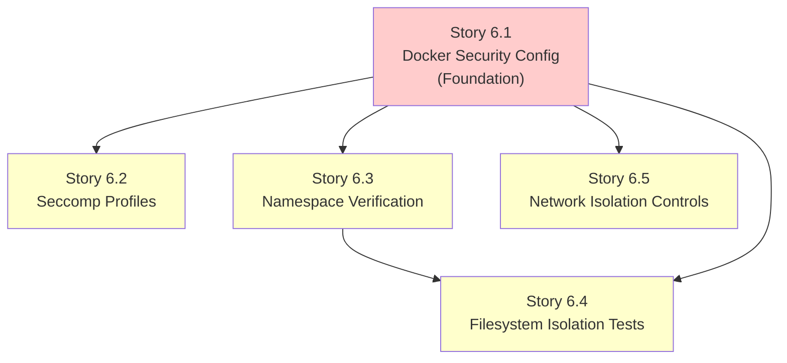
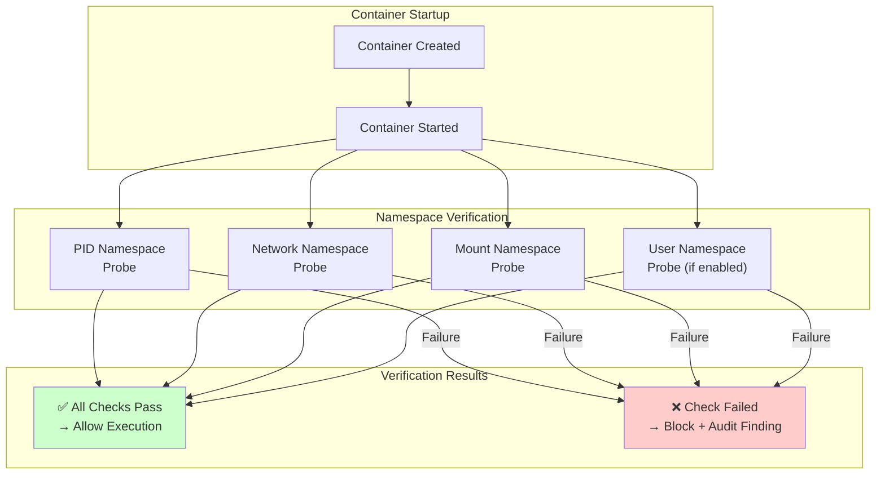
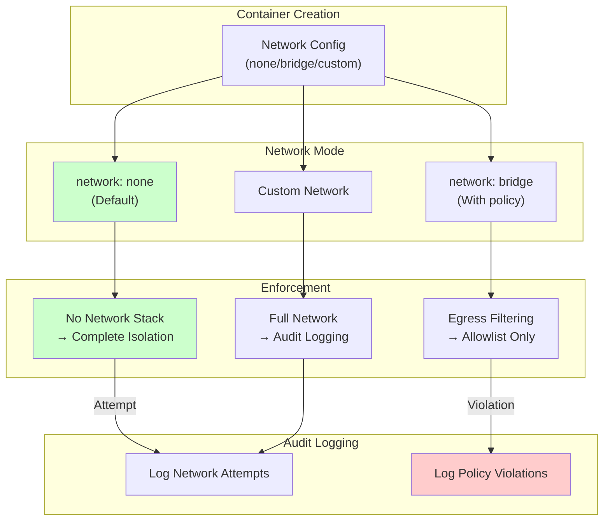

# Security Stories - Runtime Isolation

This document contains implementation-ready Jira stories for addressing **Security Concern 6: Insufficient isolation between agent runtime and host system**. Each story includes detailed acceptance criteria, dependencies, verification methods, and affected files to enable autonomous execution.

> **Related Documentation:**
> - [Agentic Security Assessment - Concern 6](/security/agentic-security-assessment#concern-6-runtime-isolation) - Detailed risk analysis
> - [Security Epic](/security/security-epic) - Parent epic and success criteria
> - [Sandboxing Guide](/gateway/sandboxing) - Current sandbox framework documentation

---

## Overview

| Field | Value |
|-------|-------|
| **Security Concern** | 6 - Insufficient isolation between agent runtime and host system |
| **Risk Level** | High |
| **Epic Reference** | [SEC-EPIC-001](/security/security-epic) |
| **Story Count** | 5 |
| **Total Estimated Complexity** | Medium-Large |

### Problem Summary

The OpenClaw sandbox framework provides Docker-based isolation for agent tool execution, but several gaps remain in the default security configuration:

1. **Sandbox mode is `off` by default** - Tool execution runs directly on the host unless explicitly configured
2. **No seccomp profile by default** - Dangerous syscalls are not filtered
3. **No AppArmor profile by default** - Mandatory Access Control is not enforced
4. **Limited resource limits** - Memory, CPU, and PID limits are not set by default
5. **Incomplete isolation verification** - No automated tests validate isolation boundaries

### Current Sandbox Security Controls

Based on analysis of `src/agents/sandbox/config.ts` and `src/agents/sandbox/docker.ts`:

| Control | Default Value | Security Impact | Source |
|---------|---------------|-----------------|--------|
| `readOnlyRoot` | `true` | ✅ Prevents filesystem modifications | `config.ts:64` |
| `network` | `"none"` | ✅ Disables network access | `config.ts:66` |
| `capDrop` | `["ALL"]` | ✅ Drops all Linux capabilities | `config.ts:68` |
| `no-new-privileges` | Always set | ✅ Prevents privilege escalation | `docker.ts:162` |
| `seccompProfile` | Not set | ⚠️ No syscall filtering | `config.ts:76` |
| `apparmorProfile` | Not set | ⚠️ No MAC enforcement | `config.ts:77` |
| `sandbox.mode` | `"off"` | ⚠️ Sandbox disabled by default | `config.ts:147` |

### Story Dependency Graph



---

## Story 6.1: Enhance Docker Security Configuration

### Metadata

| Field | Value |
|-------|-------|
| **Story ID** | SEC-6.1 |
| **Category** | Architecture |
| **Security Concern** | 6 |
| **Priority** | Critical |
| **Estimated Complexity** | Small |

### Description

Harden the default Docker container configuration with additional security constraints to reduce the container escape attack surface. This story focuses on verifying and documenting existing controls (`no-new-privileges`, `read-only root`, `capDrop: ALL`) and ensuring they are consistently applied across all sandbox container creation paths.

The `buildSandboxCreateArgs` function in `src/agents/sandbox/docker.ts` already implements several security controls:

```typescript
// Source: src/agents/sandbox/docker.ts:147-168
args.push("--security-opt", "no-new-privileges");
if (params.cfg.seccompProfile) {
  args.push("--security-opt", `seccomp=${params.cfg.seccompProfile}`);
}
```

This story ensures these controls are verified, documented, and tested.

### Acceptance Criteria

- [ ] **AC-6.1.1:** Default sandbox configuration includes `no-new-privileges` flag, verified by automated container inspection test
- [ ] **AC-6.1.2:** Root filesystem is read-only by default (`readOnlyRoot: true`), with test that verifies write attempts fail
- [ ] **AC-6.1.3:** All Linux capabilities are dropped by default (`capDrop: ["ALL"]`), verified by capability audit test that confirms zero capabilities
- [ ] **AC-6.1.4:** Configuration documentation explicitly lists all security-relevant defaults with their security implications

### Dependencies

None - this is the foundation story for isolation improvements.

### Security Risk Reduced

**Attack Vector Mitigated:** Container escape through privilege escalation, capability abuse, or filesystem modification.

**Specific Threats Addressed:**
- CVE-class container escapes using `CAP_SYS_ADMIN` or similar capabilities
- Privilege escalation via setuid binaries in container
- Persistent malware installation via filesystem writes

### Verification Method

| Test Type | Description | File |
|-----------|-------------|------|
| Unit Test | Verify `buildSandboxCreateArgs` includes all security flags | `src/agents/sandbox/docker.test.ts` |
| Integration Test | Container inspection confirms security options applied | `src/agents/sandbox/security-config.test.ts` |
| Capability Audit | `capsh --print` inside container shows no capabilities | Manual or scripted verification |

**Verification Commands:**

```bash
# Verify no-new-privileges
docker inspect <container> --format '{{.HostConfig.SecurityOpt}}'
# Expected: [no-new-privileges ...]

# Verify read-only root
docker inspect <container> --format '{{.HostConfig.ReadonlyRootfs}}'
# Expected: true

# Verify capabilities dropped
docker exec <container> capsh --print
# Expected: Current: = (empty capability set)
```

### Affected Files

| File | Change Type | Description |
|------|-------------|-------------|
| `src/agents/sandbox/docker.ts` | Verify | Ensure all security flags are present in container creation |
| `src/agents/sandbox/config.ts` | Verify | Ensure secure defaults are documented |
| `src/agents/sandbox/docker.test.ts` | Modify | Add security configuration verification tests |
| `src/agents/sandbox/security-config.test.ts` | Create | New integration test file for security configuration |

---

## Story 6.2: Implement Seccomp Profiles for Sandbox

### Metadata

| Field | Value |
|-------|-------|
| **Story ID** | SEC-6.2 |
| **Category** | Architecture |
| **Security Concern** | 6 |
| **Priority** | High |
| **Estimated Complexity** | Medium |

### Description

Create and apply restrictive seccomp (secure computing mode) profiles that block dangerous syscalls for sandbox containers. Seccomp provides kernel-level syscall filtering, preventing containers from invoking syscalls that could be used for container escape or kernel exploitation.

The current implementation supports seccomp profiles via configuration:

```typescript
// Source: src/agents/sandbox/config.ts:76
seccompProfile: agentDocker?.seccompProfile ?? globalDocker?.seccompProfile,
```

```typescript
// Source: src/agents/sandbox/docker.ts:163-165
if (params.cfg.seccompProfile) {
  args.push("--security-opt", `seccomp=${params.cfg.seccompProfile}`);
}
```

This story creates a default restrictive profile and enables it by default.

### Acceptance Criteria

- [ ] **AC-6.2.1:** Custom seccomp profile blocks dangerous syscalls not needed for shell tool execution (e.g., `ptrace`, `mount`, `reboot`, `keyctl`, `bpf`)
- [ ] **AC-6.2.2:** Seccomp profile is configurable per tool type through `sandbox.docker.seccompProfile` configuration
- [ ] **AC-6.2.3:** Seccomp violations are logged with syscall information (syscall number, action, container name) for security monitoring
- [ ] **AC-6.2.4:** Default seccomp profile is provided at `/etc/openclaw/seccomp-sandbox.json` and documented

### Dependencies

- **Story 6.1** - Docker security configuration foundation

### Security Risk Reduced

**Attack Vector Mitigated:** Kernel exploitation through dangerous syscalls and container escape via syscall abuse.

**Specific Threats Addressed:**
- Kernel exploits via `ptrace` or `process_vm_writev`
- Container escape via namespace manipulation syscalls
- Host filesystem access via `mount` syscalls

**Blocked Syscalls (Partial List):**
- `ptrace` - Process tracing/debugging
- `mount`, `umount`, `umount2` - Filesystem mounting
- `reboot`, `kexec_load` - System control
- `bpf`, `perf_event_open` - Kernel tracing
- `keyctl`, `add_key`, `request_key` - Kernel keyring

### Verification Method

| Test Type | Description | File |
|-----------|-------------|------|
| Unit Test | Verify seccomp profile JSON is valid | `src/agents/sandbox/seccomp.test.ts` |
| Integration Test | Verify blocked syscalls fail with EPERM | `src/agents/sandbox/seccomp-enforcement.test.ts` |
| Violation Logging Test | Verify seccomp violations generate log entries | `src/agents/sandbox/seccomp-logging.test.ts` |

**Verification Commands:**

```bash
# Test syscall blocking (run inside container)
strace -f -e trace=ptrace /bin/true
# Expected: EPERM or ENOSYS for ptrace

# Verify profile is applied
docker inspect <container> --format '{{.HostConfig.SecurityOpt}}'
# Expected: [... seccomp=/etc/openclaw/seccomp-sandbox.json ...]
```

### Affected Files

| File | Change Type | Description |
|------|-------------|-------------|
| `src/agents/sandbox/docker.ts` | Modify | Add default seccomp profile path, violation logging |
| `src/agents/sandbox/seccomp-profiles/sandbox-default.json` | Create | Default restrictive seccomp profile |
| `src/agents/sandbox/seccomp-profiles/sandbox-network.json` | Create | Profile for containers with network access |
| `src/agents/sandbox/config.ts` | Modify | Set default seccomp profile path |
| `src/agents/sandbox/seccomp.test.ts` | Create | Seccomp profile validation tests |

### Seccomp Profile Structure

```json
{
  "defaultAction": "SCMP_ACT_ALLOW",
  "syscalls": [
    {
      "names": ["ptrace", "mount", "umount", "umount2", "reboot", "kexec_load", "kexec_file_load"],
      "action": "SCMP_ACT_ERRNO",
      "errnoRet": 1
    },
    {
      "names": ["bpf", "perf_event_open"],
      "action": "SCMP_ACT_ERRNO",
      "errnoRet": 1
    },
    {
      "names": ["keyctl", "add_key", "request_key"],
      "action": "SCMP_ACT_ERRNO", 
      "errnoRet": 1
    }
  ]
}
```

---

## Story 6.3: Add Namespace Isolation Verification

### Metadata

| Field | Value |
|-------|-------|
| **Story ID** | SEC-6.3 |
| **Category** | Tooling |
| **Security Concern** | 6 |
| **Priority** | High |
| **Estimated Complexity** | Medium |

### Description

Implement runtime verification that container namespaces (PID, network, mount, user) are properly isolated. This ensures that isolation boundaries are actually enforced at runtime, not just configured. The verification system should detect misconfigurations before tool execution occurs.

Docker provides namespace isolation through:
- **PID namespace:** Container processes cannot see host processes
- **Network namespace:** Container has isolated network stack
- **Mount namespace:** Container has isolated filesystem view
- **User namespace:** Container UIDs are mapped (if enabled)

This story creates verification probes that validate these boundaries.

### Acceptance Criteria

- [ ] **AC-6.3.1:** Startup check verifies namespace isolation configuration before any tool execution occurs in the sandbox
- [ ] **AC-6.3.2:** Runtime probe validates namespace boundaries during execution (e.g., verifies PID 1 inside container is not init, verifies network namespace is isolated)
- [ ] **AC-6.3.3:** Namespace configuration issues are reported as security audit findings with severity `critical` and remediation guidance
- [ ] **AC-6.3.4:** Verification results are cached and re-validated on configuration changes

### Dependencies

- **Story 6.1** - Docker security configuration foundation

### Security Risk Reduced

**Attack Vector Mitigated:** Namespace escape and isolation boundary violations.

**Specific Threats Addressed:**
- Container escape via shared namespace with host
- Process injection across namespace boundaries
- Network access despite `network: none` configuration

### Verification Method

| Test Type | Description | File |
|-----------|-------------|------|
| Unit Test | Verify namespace check functions | `src/agents/sandbox/namespace-verify.test.ts` |
| Integration Test | Run escape attempt tests | `src/agents/sandbox/namespace-escape.test.ts` |
| Audit Integration | Verify findings appear in security audit | `src/security/audit.test.ts` |

**Verification Probes:**

```typescript
// PID namespace verification
async function verifyPidNamespace(containerName: string): Promise<boolean> {
  // Inside container, /proc/1/cmdline should be the container's init (sleep infinity)
  // NOT the host's systemd/init
  const result = await execDocker(["exec", containerName, "cat", "/proc/1/cmdline"]);
  return result.stdout.includes("sleep");
}

// Network namespace verification  
async function verifyNetworkNamespace(containerName: string): Promise<boolean> {
  // Attempt to reach host network - should fail
  const result = await execDocker(["exec", containerName, "ip", "route"], { allowFailure: true });
  return result.code !== 0 || !result.stdout.includes("default");
}
```

### Affected Files

| File | Change Type | Description |
|------|-------------|-------------|
| `src/agents/sandbox/runtime-status.ts` | Modify | Add namespace verification to runtime status |
| `src/agents/sandbox/namespace-verify.ts` | Create | Namespace verification probe implementations |
| `src/agents/sandbox/namespace-verify.test.ts` | Create | Unit tests for verification probes |
| `src/security/audit.ts` | Modify | Add namespace isolation audit checks |
| `src/security/audit-extra.ts` | Modify | Add sandbox namespace audit findings |

### Namespace Verification Flow



---

## Story 6.4: Create Filesystem Isolation Tests

### Metadata

| Field | Value |
|-------|-------|
| **Story ID** | SEC-6.4 |
| **Category** | Tooling |
| **Security Concern** | 6 |
| **Priority** | High |
| **Estimated Complexity** | Medium |

### Description

Develop a comprehensive test suite that validates filesystem isolation between the sandbox container and the host system. These tests should verify that containers cannot access, read, or modify host filesystem locations outside of explicitly allowed mount paths.

The current sandbox configuration mounts the workspace directory:

```typescript
// Source: src/agents/sandbox/docker.ts:228-237
const mainMountSuffix =
  params.workspaceAccess === "ro" && workspaceDir === params.agentWorkspaceDir ? ":ro" : "";
args.push("-v", `${workspaceDir}:${cfg.workdir}${mainMountSuffix}`);
```

Tests must verify that ONLY this mount is accessible, and that escape attempts via symlinks or path traversal fail.

### Acceptance Criteria

- [ ] **AC-6.4.1:** Tests verify sandbox cannot access host filesystem outside allowed paths (e.g., `/etc/passwd`, `/root`, `/var/run/docker.sock`)
- [ ] **AC-6.4.2:** Tests verify sandbox cannot write to host paths marked read-only (`workspaceAccess: ro` configuration)
- [ ] **AC-6.4.3:** Tests cover symlink escape attempts and path traversal attacks (e.g., `../../../etc/passwd`, symlink pointing outside workspace)
- [ ] **AC-6.4.4:** Tests run in CI pipeline and block merge on failure

### Dependencies

- **Story 6.1** - Docker security configuration foundation
- **Story 6.3** - Namespace isolation verification (to ensure mount namespace is isolated)

### Security Risk Reduced

**Attack Vector Mitigated:** Filesystem escape leading to host data exfiltration or modification.

**Specific Threats Addressed:**
- Reading sensitive host files (`/etc/shadow`, credentials)
- Writing malware to host filesystem
- Docker socket access for container escape
- Symlink attacks to bypass mount restrictions

### Verification Method

| Test Type | Description | File |
|-----------|-------------|------|
| Integration Test | Filesystem access boundary tests | `src/agents/sandbox/isolation.test.ts` |
| Negative Test | Verify escape attempts fail | `src/agents/sandbox/escape-attempts.test.ts` |
| CI Integration | Tests run on every PR | `.github/workflows/ci.yml` |

**Test Scenarios:**

```typescript
describe("Filesystem Isolation", () => {
  it("should not access host /etc/passwd", async () => {
    const result = await execInSandbox("cat /etc/passwd");
    // Container has its own /etc/passwd, not host's
    expect(result.stdout).not.toContain("root:x:0:0:root:/root:");
  });
  
  it("should not access /var/run/docker.sock", async () => {
    const result = await execInSandbox("ls -la /var/run/docker.sock", { allowFailure: true });
    expect(result.code).not.toBe(0);
  });
  
  it("should reject symlink escape attempts", async () => {
    // Create symlink in workspace pointing outside
    await execInSandbox("ln -s /etc/shadow /workspace/escape-link");
    const result = await execInSandbox("cat /workspace/escape-link", { allowFailure: true });
    expect(result.code).not.toBe(0);
  });
  
  it("should reject path traversal", async () => {
    const result = await execInSandbox("cat /workspace/../../../etc/shadow", { allowFailure: true });
    expect(result.code).not.toBe(0);
  });
});
```

### Affected Files

| File | Change Type | Description |
|------|-------------|-------------|
| `src/agents/sandbox/isolation.test.ts` | Create | Comprehensive filesystem isolation test suite |
| `src/agents/sandbox/escape-attempts.test.ts` | Create | Dedicated escape attempt test scenarios |
| `src/agents/sandbox/docker.ts` | Modify | Add test helper functions for sandbox execution |
| `src/agents/sandbox/test-utils.ts` | Create | Shared test utilities for sandbox testing |
| `.github/workflows/ci.yml` | Modify | Add sandbox isolation tests to CI pipeline |

### Filesystem Isolation Test Matrix

| Test Case | Expected Result | Severity if Failed |
|-----------|-----------------|-------------------|
| Read `/etc/passwd` | Container's passwd, not host | High |
| Read `/etc/shadow` | Permission denied | Critical |
| Access Docker socket | File not found | Critical |
| Write to read-only workspace | Permission denied | High |
| Symlink outside workspace | Access denied | Critical |
| Path traversal `../../../` | Contained within mount | Critical |
| Access `/proc/1/root` | Permission denied | Critical |

---

## Story 6.5: Implement Network Isolation Controls

### Metadata

| Field | Value |
|-------|-------|
| **Story ID** | SEC-6.5 |
| **Category** | Runtime |
| **Security Concern** | 6 |
| **Priority** | High |
| **Estimated Complexity** | Medium |

### Description

Enhance network isolation with configurable egress filtering and network namespace verification. While the default network mode is `"none"` (no network access), some tools may require network connectivity. This story implements controls for when network access is required, ensuring only specific hosts/ports are allowed and all network access attempts are logged.

Current network configuration:

```typescript
// Source: src/agents/sandbox/config.ts:66
network: agentDocker?.network ?? globalDocker?.network ?? "none",
```

```typescript
// Source: src/agents/sandbox/docker.ts:153-155
if (params.cfg.network) {
  args.push("--network", params.cfg.network);
}
```

### Acceptance Criteria

- [ ] **AC-6.5.1:** Default network mode `"none"` is verified at container startup with test that confirms no network connectivity
- [ ] **AC-6.5.2:** When network access is required (`network: "bridge"`), only specific hosts/ports defined in allowlist are accessible via iptables/nftables rules
- [ ] **AC-6.5.3:** Network access attempts from isolated containers (`network: "none"`) are logged with source container, attempted destination, and timestamp
- [ ] **AC-6.5.4:** Network policy configuration is validated at container creation to prevent misconfigurations

### Dependencies

- **Story 6.1** - Docker security configuration foundation

### Security Risk Reduced

**Attack Vector Mitigated:** Data exfiltration and command-and-control (C2) communication from compromised sandbox.

**Specific Threats Addressed:**
- Exfiltration of sensitive data to attacker-controlled servers
- C2 communication for persistent compromise
- Network-based attacks against internal services
- Cryptocurrency mining from compromised containers

### Verification Method

| Test Type | Description | File |
|-----------|-------------|------|
| Unit Test | Network configuration validation | `src/agents/sandbox/network-policy.test.ts` |
| Integration Test | Network isolation enforcement | `src/agents/sandbox/network-isolation.test.ts` |
| Egress Filter Test | Allowlist enforcement | `src/agents/sandbox/egress-filter.test.ts` |

**Verification Commands:**

```bash
# Verify no network access (network: none)
docker exec <container> curl -s --max-time 5 http://example.com
# Expected: Connection timeout or failure

# Verify egress filtering (when network enabled)
docker exec <container> curl -s --max-time 5 http://allowed-host.com
# Expected: Success
docker exec <container> curl -s --max-time 5 http://blocked-host.com
# Expected: Connection refused or timeout
```

### Affected Files

| File | Change Type | Description |
|------|-------------|-------------|
| `src/agents/sandbox/docker.ts` | Modify | Add network policy enforcement, logging |
| `src/agents/sandbox/network-policy.ts` | Create | Network policy configuration and validation |
| `src/agents/sandbox/network-policy.test.ts` | Create | Network policy unit tests |
| `src/agents/sandbox/network-isolation.test.ts` | Create | Network isolation integration tests |
| `src/config/types.sandbox.ts` | Modify | Add network policy configuration types |

### Network Policy Configuration

```yaml
# Example network policy configuration
agents:
  defaults:
    sandbox:
      docker:
        network: none  # Default: no network
        # When network is required:
        networkPolicy:
          mode: allowlist  # none | allowlist | full
          allowedHosts:
            - "api.openai.com:443"
            - "api.anthropic.com:443"
          blockedHosts:
            - "metadata.google.internal:*"  # Block cloud metadata
            - "169.254.169.254:*"           # Block AWS metadata
          logging: true  # Log all network access attempts
```

### Network Isolation Flow



---

## Summary Table

| Story ID | Title | Category | Priority | Complexity | Dependencies | Status |
|----------|-------|----------|----------|------------|--------------|--------|
| SEC-6.1 | Enhance Docker Security Configuration | Architecture | Critical | Small | None | 🔲 Not Started |
| SEC-6.2 | Implement Seccomp Profiles for Sandbox | Architecture | High | Medium | SEC-6.1 | 🔲 Not Started |
| SEC-6.3 | Add Namespace Isolation Verification | Tooling | High | Medium | SEC-6.1 | 🔲 Not Started |
| SEC-6.4 | Create Filesystem Isolation Tests | Tooling | High | Medium | SEC-6.1, SEC-6.3 | 🔲 Not Started |
| SEC-6.5 | Implement Network Isolation Controls | Runtime | High | Medium | SEC-6.1 | 🔲 Not Started |

### Implementation Order

```
1. SEC-6.1 (Foundation) ─────┬──► 2. SEC-6.2 (Seccomp)
                             │
                             ├──► 3. SEC-6.3 (Namespace Verify) ──► 4. SEC-6.4 (FS Tests)
                             │
                             └──► 5. SEC-6.5 (Network Controls)
```

### Story Status Legend

| Symbol | Status |
|--------|--------|
| 🔲 | Not Started |
| 🔄 | In Progress |
| ✅ | Completed |
| 🔴 | Blocked |

---

## Appendix: Source Code References

### Sandbox Configuration Defaults

```
Source: src/agents/sandbox/config.ts:57-82
```

Key security-relevant defaults:
- `readOnlyRoot: true` (line 64)
- `network: "none"` (line 66)
- `capDrop: ["ALL"]` (line 68)
- `seccompProfile: undefined` (line 76) - **Gap: not set by default**
- `apparmorProfile: undefined` (line 77) - **Gap: not set by default**

### Docker Container Creation

```
Source: src/agents/sandbox/docker.ts:126-207
```

Security options applied:
- `--read-only` flag (lines 147-149)
- `--network` flag (lines 153-155)
- `--cap-drop` flags (lines 159-161)
- `--security-opt no-new-privileges` (line 162)
- `--security-opt seccomp=` (lines 163-165)
- `--security-opt apparmor=` (lines 166-168)

### Sandbox Runtime Status

```
Source: src/agents/sandbox/runtime-status.ts:45-50
```

Current runtime status resolution that could be extended with namespace verification.

### Tool Execution in Sandbox

```
Source: src/agents/bash-tools.exec.ts:43-53
```

Functions for building Docker exec commands that must respect isolation boundaries.
