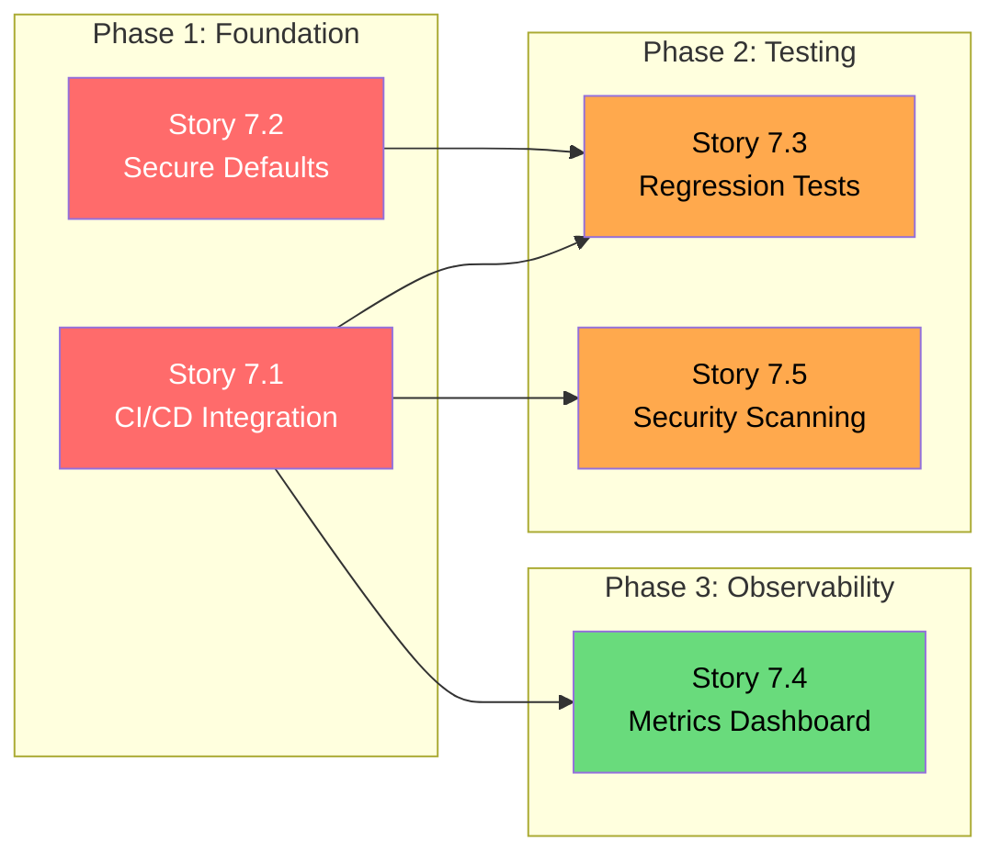

# Security Stories: Concern 7 - Security as System Property

## Overview

| Attribute | Value |
|-----------|-------|
| **Security Concern** | 7 - Security treated as deployment hygiene rather than a system property |
| **Related Assessment** | [Agentic Security Assessment - Concern 7](../agentic-security-assessment.md#concern-7-security-as-system-property) |
| **Related Epic** | [Security Remediation Epic](../security-epic.md) |
| **Total Stories** | 5 |
| **Priority Distribution** | Critical: 2, High: 2, Medium: 1 |

### Problem Statement

Security in OpenClaw is currently implemented as a set of deployment-time checks (`src/security/audit.ts`) that users may choose to run manually. This approach has critical limitations:

- Security checks are not enforced during development or CI/CD
- Default configurations may be insecure, relying on users to apply hardening
- Security regressions can be introduced without detection
- No continuous visibility into security posture
- Security scanning is not integrated into the development workflow

### Target State

Security must be an architectural property that is:
- **Enforced at development time** via CI/CD pipeline gates
- **Secure by default** with explicit opt-out for less secure options
- **Regression-proof** with automated test coverage
- **Observable** through metrics and dashboards
- **Proactively detected** through automated scanning

### Audit Check Categories

The current security audit system (`src/security/audit.ts`) defines the following check categories that should be integrated into CI/CD:

| Category | Description | Source |
|----------|-------------|--------|
| `filesystem` | File permissions, symlinks, world-readable files | `src/security/audit-fs.ts` |
| `gateway` | Bind address, auth config, TLS, Control UI | `src/security/audit.ts` |
| `channels` | DM policies, group policies, allowlists | `src/security/audit.ts` |
| `browser` | CDP exposure, remote control settings | `src/security/audit.ts` |
| `tools` | Elevated permissions, sandbox status | `src/security/audit.ts` |
| `plugins` | Trust verification, allowlist enforcement | `src/security/audit.ts` |
| `models` | Legacy model detection, hygiene checks | `src/security/audit.ts` |

---

## Story 7.1: Integrate Security Checks into CI/CD

### Metadata

| Field | Value |
|-------|-------|
| **Category** | Tooling |
| **Security Concern** | 7 |
| **Priority** | Critical |
| **Estimated Complexity** | Medium |

### Description

Add security audit as a mandatory CI/CD pipeline stage that blocks deployment on critical findings. The security audit currently implemented in `src/security/audit.ts` must be executable in CI environments and produce machine-readable output that can gate merge/deployment decisions.

This story transforms security from an optional post-deployment check to a mandatory pre-deployment gate, ensuring that no code with known security issues reaches production.

### Acceptance Criteria

- [ ] CI pipeline includes a security audit step that runs on every pull request
- [ ] Critical severity findings (`severity: "critical"`) block merge and deployment
- [ ] High severity findings produce warnings but allow merge with explicit override
- [ ] Audit results are posted as PR comments for developer visibility
- [ ] Audit step completes within 5 minutes to avoid CI bottlenecks
- [ ] Audit can be run locally with identical behavior to CI (`npm run security:audit`)

### Dependencies

| Dependency | Type | Description |
|------------|------|-------------|
| None | - | This is a foundational story with no prerequisites |

### Security Risk Reduced

- **Attack Vector Mitigated**: Deployment of code with known security misconfigurations
- **Risk Category**: Configuration drift, security regression
- **Impact**: Prevents insecure configurations from reaching production environments

### Verification Method

| Test Type | Description | Expected Outcome |
|-----------|-------------|------------------|
| CI Pipeline Test | Submit PR with intentional critical finding | PR is blocked from merge |
| CI Pipeline Test | Submit PR with high-severity finding | Warning comment posted, merge allowed |
| CI Pipeline Test | Submit PR with no findings | Audit passes, no blocking |
| Local Execution Test | Run `npm run security:audit` locally | Same results as CI execution |
| Performance Test | Measure audit execution time | Completes in under 5 minutes |

### Affected Files

| File | Change Type | Description |
|------|-------------|-------------|
| `.github/workflows/security.yml` | Create | New GitHub Actions workflow for security audit |
| `src/cli/security-audit.ts` | Create | CLI entry point for CI-compatible audit execution |
| `src/security/audit.ts` | Modify | Add machine-readable JSON output format |
| `src/security/audit-ci.ts` | Create | CI-specific audit runner with exit codes |
| `package.json` | Modify | Add `security:audit` script |

### Implementation Notes

```typescript
// src/security/audit-ci.ts - Example structure
export interface CIAuditResult {
  exitCode: 0 | 1 | 2; // 0=pass, 1=warnings, 2=critical
  findings: AuditFinding[];
  summary: {
    critical: number;
    high: number;
    medium: number;
    low: number;
  };
}

export async function runCIAudit(): Promise<CIAuditResult> {
  const findings = await runFullAudit();
  const critical = findings.filter(f => f.severity === "critical").length;
  return {
    exitCode: critical > 0 ? 2 : findings.length > 0 ? 1 : 0,
    findings,
    summary: categorizeFindings(findings),
  };
}
```

---

## Story 7.2: Implement Secure-by-Default Configurations

### Metadata

| Field | Value |
|-------|-------|
| **Category** | Architecture |
| **Security Concern** | 7 |
| **Priority** | Critical |
| **Estimated Complexity** | Medium |

### Description

Change default configuration values to secure options, requiring explicit opt-out for less secure settings. Currently, several configuration options default to permissive values that may expose security risks if users don't actively harden their deployment.

This story implements the principle of "secure by default" where the most restrictive security settings are applied unless explicitly overridden, with clear documentation of the security implications.

### Acceptance Criteria

- [ ] All security-relevant configurations default to the most restrictive option
- [ ] Less secure options require explicit configuration with deprecation-style warnings logged at startup
- [ ] Configuration schema (`src/config/schema.ts`) documents security implications of each option
- [ ] Changing a secure default to a less secure value requires acknowledgment (e.g., `acknowledgeInsecure: true`)
- [ ] Unit tests verify that defaults match documented secure values
- [ ] Migration guide documents changes for existing deployments

### Dependencies

| Dependency | Type | Description |
|------------|------|-------------|
| None | - | This is a foundational architectural change |

### Security Risk Reduced

- **Attack Vector Mitigated**: Misconfiguration of new deployments
- **Risk Category**: Insecure defaults, configuration drift
- **Impact**: Ensures new OpenClaw instances start with hardened configurations

### Verification Method

| Test Type | Description | Expected Outcome |
|-----------|-------------|------------------|
| Unit Test | Instantiate config with no overrides | All security settings at restrictive defaults |
| Unit Test | Set insecure option without acknowledgment | Warning logged, option rejected or deprecated |
| Integration Test | Start gateway with default config | Security audit passes with no findings |
| Schema Validation | Review schema documentation | Each security option has documented implications |

### Affected Files

| File | Change Type | Description |
|------|-------------|-------------|
| `src/config/defaults.ts` | Modify | Change default values to secure options |
| `src/config/types.auth.ts` | Modify | Add acknowledgment requirements for insecure options |
| `src/config/types.gateway.ts` | Modify | Update gateway config defaults |
| `src/config/types.tools.ts` | Modify | Update tool execution defaults |
| `src/config/schema.ts` | Modify | Add security implication documentation |
| `src/config/validation.ts` | Modify | Add insecure option warnings |
| `docs/gateway/configuration.md` | Modify | Document secure defaults and override procedures |

### Implementation Notes

Current insecure defaults to change:

| Configuration | Current Default | Secure Default | Acknowledgment Required |
|---------------|-----------------|----------------|------------------------|
| `gateway.bind` | `0.0.0.0` (all interfaces) | `127.0.0.1` (loopback only) | Yes, for non-loopback |
| `gateway.controlUi.enabled` | `true` | `false` | Yes, to enable |
| `tools.elevated.enabled` | `true` | `false` | Yes, to enable |
| `channels.dm.scope` | `open` | `pairing` | Yes, for `open` |
| `sandbox.enabled` | `false` | `true` | Yes, to disable |

```typescript
// src/config/validation.ts - Example acknowledgment pattern
export function validateInsecureOption(
  config: Config,
  path: string,
  secureValue: unknown,
  actualValue: unknown,
): void {
  if (actualValue !== secureValue && !config.acknowledgeInsecure?.[path]) {
    logger.warn(
      `Insecure configuration: ${path} is set to ${actualValue} (secure default: ${secureValue}). ` +
      `Set acknowledgeInsecure.${path}: true to suppress this warning.`
    );
  }
}
```

---

## Story 7.3: Add Security Regression Tests

### Metadata

| Field | Value |
|-------|-------|
| **Category** | Tooling |
| **Security Concern** | 7 |
| **Priority** | High |
| **Estimated Complexity** | Medium |

### Description

Create a dedicated security test suite that validates security invariants are maintained across code changes. These tests should cover the security properties defined in formal verification (`docs/security/formal-verification.md`) and ensure they are enforced at the code level.

Security regression tests differ from unit tests in that they specifically target security invariants rather than functional correctness. A code change that passes all unit tests may still introduce a security regression if it violates a security invariant.

### Acceptance Criteria

- [ ] Security test suite covers all security invariants from formal verification
- [ ] Tests run as part of CI pipeline with blocking capability on failure
- [ ] New security features require corresponding regression tests (enforced via PR checklist)
- [ ] Test suite includes negative tests (verify insecure patterns are rejected)
- [ ] Test coverage report for security-critical modules exceeds 90%
- [ ] Tests are isolated and do not require external services or network access

### Dependencies

| Dependency | Type | Description |
|------------|------|-------------|
| Story 7.1 | Prerequisite | CI/CD integration must be in place to run security tests |

### Security Risk Reduced

- **Attack Vector Mitigated**: Accidental introduction of security regressions
- **Risk Category**: Security regression, invariant violation
- **Impact**: Ensures security properties are preserved across all code changes

### Verification Method

| Test Type | Description | Expected Outcome |
|-----------|-------------|------------------|
| Mutation Test | Introduce known security flaw | Regression test fails |
| Coverage Test | Measure security module coverage | >= 90% for critical modules |
| CI Integration Test | Run security tests in pipeline | Tests execute and block on failure |
| Isolation Test | Run tests without network | All tests pass in isolated environment |

### Affected Files

| File | Change Type | Description |
|------|-------------|-------------|
| `src/security/regression.test.ts` | Create | Main security regression test suite |
| `src/security/invariants.test.ts` | Create | Tests for formal verification invariants |
| `src/security/negative.test.ts` | Create | Negative tests for insecure patterns |
| `vitest.config.ts` | Modify | Add security test configuration |
| `.github/workflows/security.yml` | Modify | Add security test step to pipeline |
| `docs/CONTRIBUTING.md` | Modify | Add security test requirements for PRs |

### Implementation Notes

Security invariants to test (from formal verification):

```typescript
// src/security/invariants.test.ts - Example invariant tests
describe("Security Invariants", () => {
  describe("Tool Execution Invariant", () => {
    it("should never execute tool without policy check", async () => {
      // Invariant: ∀ tool execution → policy.check() called
      const mockPolicy = vi.spyOn(toolPolicy, "check");
      await executeTool("bash", { command: "echo test" });
      expect(mockPolicy).toHaveBeenCalled();
    });
  });

  describe("Authentication Invariant", () => {
    it("should never process request without auth on protected endpoints", async () => {
      // Invariant: ∀ protected endpoint → auth verified
      const response = await request(gateway)
        .post("/api/execute")
        .send({ tool: "bash" });
      expect(response.status).toBe(401);
    });
  });

  describe("Sandbox Invariant", () => {
    it("should never execute elevated tool outside sandbox when sandbox enabled", async () => {
      // Invariant: sandbox.enabled ∧ tool.elevated → execution in sandbox
      const config = { sandbox: { enabled: true } };
      const execution = await executeElevatedTool(config, "bash");
      expect(execution.sandboxed).toBe(true);
    });
  });
});
```

---

## Story 7.4: Create Security Metrics Dashboard

### Metadata

| Field | Value |
|-------|-------|
| **Category** | Observability |
| **Security Concern** | 7 |
| **Priority** | Medium |
| **Estimated Complexity** | Medium |

### Description

Implement metrics collection and dashboard for security health indicators including audit findings, policy violations, credential usage, and authentication events. This provides continuous visibility into the security posture of running OpenClaw instances.

Security observability transforms security from a point-in-time assessment to a continuous monitoring capability, enabling trend analysis and early detection of security degradation.

### Acceptance Criteria

- [ ] Metrics are collected for all security-relevant events (auth, tool execution, policy violations)
- [ ] Dashboard displays security health score based on aggregated audit results
- [ ] Alerting thresholds are configurable for security metrics
- [ ] Metrics are exported in Prometheus format for integration with existing monitoring
- [ ] Dashboard includes historical trend visualization (7-day, 30-day views)
- [ ] Sensitive data (credentials, tokens) is never included in metrics

### Dependencies

| Dependency | Type | Description |
|------------|------|-------------|
| Story 7.1 | Prerequisite | CI/CD integration provides baseline audit data |
| Story 5.2 | Prerequisite | Runtime policy violation alerts (from Concern 5) |

### Security Risk Reduced

- **Attack Vector Mitigated**: Undetected security posture degradation
- **Risk Category**: Lack of visibility, slow incident detection
- **Impact**: Enables proactive security monitoring and trend analysis

### Verification Method

| Test Type | Description | Expected Outcome |
|-----------|-------------|------------------|
| Unit Test | Generate security event | Metric counter incremented |
| Integration Test | Trigger policy violation | Alert generated when threshold exceeded |
| Dashboard Test | Render security dashboard | All metrics displayed correctly |
| Export Test | Scrape Prometheus endpoint | Metrics exported in correct format |

### Affected Files

| File | Change Type | Description |
|------|-------------|-------------|
| `src/security/metrics.ts` | Create | Security metrics collection module |
| `src/security/health-score.ts` | Create | Security health score calculation |
| `src/gateway/metrics.ts` | Modify | Integrate security metrics with gateway metrics |
| `src/gateway/routes/metrics.ts` | Modify | Add security metrics endpoint |
| `src/config/types.metrics.ts` | Modify | Add security metrics configuration |
| `docs/gateway/observability.md` | Modify | Document security metrics |

### Implementation Notes

Security metrics to collect:

| Metric Name | Type | Description |
|-------------|------|-------------|
| `openclaw_security_audit_findings_total` | Counter | Total audit findings by severity |
| `openclaw_security_auth_attempts_total` | Counter | Authentication attempts by result |
| `openclaw_security_policy_violations_total` | Counter | Policy violations by type |
| `openclaw_security_tool_executions_total` | Counter | Tool executions by tool and sandbox status |
| `openclaw_security_health_score` | Gauge | Overall security health score (0-100) |

```typescript
// src/security/metrics.ts - Example structure
import { Counter, Gauge, Registry } from "prom-client";

export const securityRegistry = new Registry();

export const auditFindings = new Counter({
  name: "openclaw_security_audit_findings_total",
  help: "Total security audit findings",
  labelNames: ["severity", "category"],
  registers: [securityRegistry],
});

export const healthScore = new Gauge({
  name: "openclaw_security_health_score",
  help: "Overall security health score (0-100)",
  registers: [securityRegistry],
});

export function calculateHealthScore(findings: AuditFinding[]): number {
  const weights = { critical: 40, high: 25, medium: 10, low: 5 };
  const deductions = findings.reduce(
    (sum, f) => sum + (weights[f.severity] ?? 0),
    0
  );
  return Math.max(0, 100 - deductions);
}
```

---

## Story 7.5: Implement Automated Security Scanning

### Metadata

| Field | Value |
|-------|-------|
| **Category** | Tooling |
| **Security Concern** | 7 |
| **Priority** | High |
| **Estimated Complexity** | Small |

### Description

Integrate automated security scanning tools into the development workflow including:
- **detect-secrets**: Prevent accidental credential commits
- **npm audit**: Identify vulnerable dependencies
- **SAST**: Static application security testing for code patterns

This shifts security scanning left in the development lifecycle, catching issues before they reach code review.

### Acceptance Criteria

- [ ] detect-secrets runs as a pre-commit hook and in CI pipeline
- [ ] npm audit runs on every dependency change with configurable severity threshold
- [ ] SAST tool (e.g., semgrep) identifies security anti-patterns in code changes
- [ ] Scanning tools have baseline/allowlist capability for known false positives
- [ ] Scan results are integrated with PR comments for visibility
- [ ] Local developer experience mirrors CI behavior (`npm run security:scan`)

### Dependencies

| Dependency | Type | Description |
|------------|------|-------------|
| Story 7.1 | Prerequisite | CI/CD pipeline must exist to add scanning steps |

### Security Risk Reduced

- **Attack Vector Mitigated**: Credential leakage, vulnerable dependencies, insecure code patterns
- **Risk Category**: Supply chain security, credential exposure, code vulnerabilities
- **Impact**: Catches security issues at the earliest possible stage in development

### Verification Method

| Test Type | Description | Expected Outcome |
|-----------|-------------|------------------|
| Pre-commit Test | Attempt to commit file with fake secret | Commit blocked by detect-secrets |
| Dependency Test | Add package with known vulnerability | npm audit fails CI |
| SAST Test | Introduce insecure code pattern | SAST tool flags the pattern |
| Baseline Test | Add known false positive to baseline | Scan passes without alert |
| Local Test | Run `npm run security:scan` | Same results as CI |

### Affected Files

| File | Change Type | Description |
|------|-------------|-------------|
| `.pre-commit-config.yaml` | Create | Pre-commit hook configuration |
| `.github/workflows/security.yml` | Modify | Add scanning steps to CI |
| `.secrets.baseline` | Create | detect-secrets baseline file |
| `.semgrep.yml` | Create | Semgrep SAST rules configuration |
| `package.json` | Modify | Add scanning scripts |
| `docs/CONTRIBUTING.md` | Modify | Document pre-commit setup |

### Implementation Notes

Pre-commit configuration:

```yaml
# .pre-commit-config.yaml
repos:
  - repo: https://github.com/Yelp/detect-secrets
    rev: v1.5.0
    hooks:
      - id: detect-secrets
        args: ["--baseline", ".secrets.baseline"]
        exclude: package-lock.json

  - repo: local
    hooks:
      - id: npm-audit
        name: npm audit
        entry: npm audit --audit-level=high
        language: system
        files: package(-lock)?\.json$
        pass_filenames: false
```

GitHub Actions integration:

```yaml
# .github/workflows/security.yml (additions)
jobs:
  security-scan:
    runs-on: ubuntu-latest
    steps:
      - uses: actions/checkout@v4
      
      - name: Run detect-secrets
        uses: reviewdog/action-detect-secrets@v0.17
        with:
          reporter: github-pr-review
          
      - name: Run npm audit
        run: npm audit --audit-level=high
        
      - name: Run Semgrep
        uses: returntocorp/semgrep-action@v1
        with:
          config: .semgrep.yml
```

Semgrep rules for common security issues:

```yaml
# .semgrep.yml
rules:
  - id: hardcoded-credential
    patterns:
      - pattern-either:
          - pattern: password = "..."
          - pattern: token = "..."
          - pattern: apiKey = "..."
    message: "Hardcoded credential detected"
    severity: ERROR
    
  - id: unsafe-exec
    pattern: child_process.exec($CMD, ...)
    message: "Use execFile instead of exec to prevent command injection"
    severity: WARNING
```

---

## Story Summary

| Story | Title | Category | Priority | Complexity | Dependencies |
|-------|-------|----------|----------|------------|--------------|
| 7.1 | Integrate security checks into CI/CD | Tooling | Critical | Medium | None |
| 7.2 | Implement secure-by-default configurations | Architecture | Critical | Medium | None |
| 7.3 | Add security regression tests | Tooling | High | Medium | 7.1 |
| 7.4 | Create security metrics dashboard | Observability | Medium | Medium | 7.1, 5.2 |
| 7.5 | Implement automated security scanning | Tooling | High | Small | 7.1 |

## Implementation Order



## Success Metrics

| Metric | Current State | Target State | Measurement |
|--------|---------------|--------------|-------------|
| CI Security Gate | Not implemented | All PRs gated | CI pipeline pass rate |
| Secure Default Coverage | ~30% | 100% | Config audit |
| Security Test Coverage | 0% | ≥90% | Coverage report |
| Security Health Visibility | None | Real-time dashboard | Dashboard availability |
| Pre-commit Security Scan | Not implemented | All commits scanned | Hook execution rate |

## Related Documentation

- [Agentic Security Assessment](../agentic-security-assessment.md)
- [Security Remediation Epic](../security-epic.md)
- [Formal Verification](../formal-verification.md)
- [Gateway Security Guide](../../gateway/security/index.md)
- [Concern 5: Runtime Policy Enforcement](./concern-5-runtime-policy.md)
