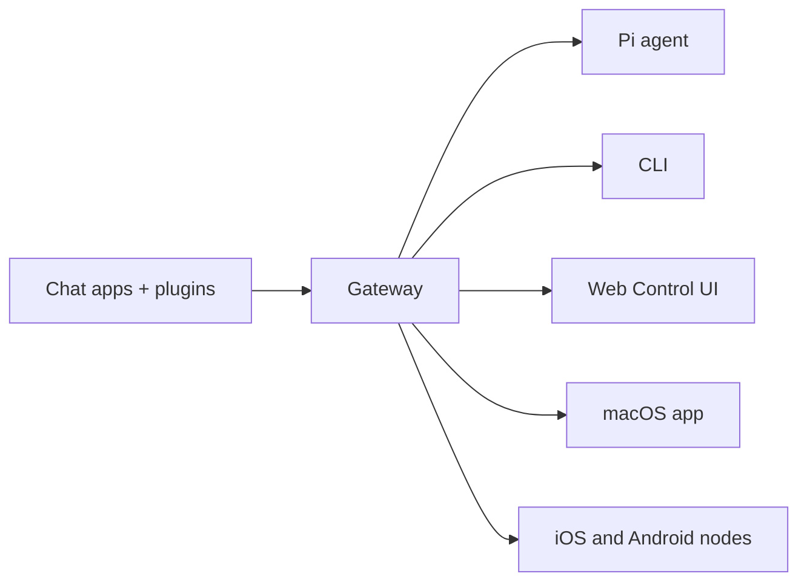

# OpenClaw 🦞

<p align="center">
    
    
</p>

> _"EXFOLIATE! EXFOLIATE!"_ — Một con tôm hùm không gian, có lẽ vậy

<p align="center">
  <strong>Gateway cho tác tử AI trên mọi hệ điều hành, hoạt động qua WhatsApp, Telegram, Discord, iMessage và nhiều hơn nữa.</strong><br />
  Gửi một tin nhắn, nhận phản hồi từ tác tử ngay trong túi của bạn. Plugin bổ sung Mattermost và hơn thế nữa.
</p>

<Columns>
  <Card title="Bat Dau" href="/start/getting-started" icon="rocket">
    Cài đặt OpenClaw và khởi chạy Gateway chỉ trong vài phút.
  </Card>
  <Card title="Chay Trinh Huong Dan" href="/start/wizard" icon="sparkles">
    Thiết lập có hướng dẫn với `openclaw onboard` và các luồng ghép nối.
  </Card>
  <Card title="Mo Control UI" href="/web/control-ui" icon="layout-dashboard">
    Mở bảng điều khiển trên trình duyệt để chat, cấu hình và quản lý phiên.
  </Card>
</Columns>

## OpenClaw là gì?

OpenClaw là một **Gateway tự lưu trữ** kết nối các ứng dụng chat yêu thích của bạn — WhatsApp, Telegram, Discord, iMessage và nhiều hơn nữa — với các tác tử AI lập trình như Pi. Bạn chạy một tiến trình Gateway duy nhất trên máy của mình (hoặc máy chủ), và nó trở thành cầu nối giữa các ứng dụng nhắn tin và một trợ lý AI luôn sẵn sàng.

**Dành cho ai?** Lập trình viên và người dùng nâng cao muốn có một trợ lý AI cá nhân có thể nhắn tin từ bất cứ đâu — mà không phải từ bỏ quyền kiểm soát dữ liệu hay phụ thuộc vào dịch vụ lưu trữ bên thứ ba.

**Điều gì làm nó khác biệt?**

- **Tự lưu trữ**: chạy trên phần cứng của bạn, theo luật của bạn
- **Đa kênh**: một Gateway phục vụ đồng thời WhatsApp, Telegram, Discord và nhiều kênh khác
- **Thuần tác tử**: được xây dựng cho các tác tử lập trình với công cụ, phiên, bộ nhớ và định tuyến đa tác tử
- **Mã nguồn mở**: giấy phép MIT, phát triển bởi cộng đồng

**Cần những gì?** Node 22+, một khóa API (khuyến nghị Anthropic) và 5 phút.

## Cách hoạt động



Gateway là nguồn sự thật duy nhất cho các phiên, định tuyến và kết nối kênh.

## Khả năng chính

<Columns>
  <Card title="Gateway da kenh" icon="network">
    WhatsApp, Telegram, Discord và iMessage với một tiến trình Gateway duy nhất.
  </Card>
  <Card title="Kenh plugin" icon="plug">
    Thêm Mattermost và nhiều kênh khác bằng các gói mở rộng.
  </Card>
  <Card title="Dinh tuyen da tac tu" icon="route">
    Các phiên được cô lập theo từng tác tử, không gian làm việc hoặc người gửi.
  </Card>
  <Card title="Ho tro media" icon="image">
    Gửi và nhận hình ảnh, âm thanh và tài liệu.
  </Card>
  <Card title="Web Control UI" icon="monitor">
    Bảng điều khiển trên trình duyệt cho chat, cấu hình, phiên và node.
  </Card>
  <Card title="Node di dong" icon="smartphone">
    Ghép nối node iOS và Android với hỗ trợ Canvas.
  </Card>
</Columns>

## Khoi dong nhanh

<Steps>
  <Step title="Cai dat OpenClaw">
    ```bash
    npm install -g openclaw@latest
    ```
  </Step>
  <Step title="Huong dan ban dau va cai dat dich vu">
    ```bash
    openclaw onboard --install-daemon
    ```
  </Step>
  <Step title="Ghep noi WhatsApp va khoi chay Gateway">
    ```bash
    openclaw channels login
    openclaw gateway --port 18789
    ```
  </Step>
</Steps>

Cần hướng dẫn cài đặt đầy đủ và thiết lập dev? Xem [Khoi dong nhanh](/start/quickstart).

## Bang dieu khien

Mở Control UI trên trình duyệt sau khi Gateway khởi động.

- Mặc định cục bộ: http://127.0.0.1:18789/
- Truy cập từ xa: [Web surfaces](/web) và [Tailscale](/gateway/tailscale)

<p align="center">
  
</p>

## Cau hinh (tuy chon)

Cấu hình nằm tại `~/.openclaw/openclaw.json`.

- Nếu bạn **không làm gì**, OpenClaw sử dụng binary Pi đi kèm ở chế độ RPC với các phiên theo từng người gửi.
- Nếu bạn muốn khóa chặt hơn, hãy bắt đầu với `channels.whatsapp.allowFrom` và (đối với nhóm) các quy tắc mention.

Ví dụ:

```json5
{
  channels: {
    whatsapp: {
      allowFrom: ["+15555550123"],
      groups: { "*": { requireMention: true } },
    },
  },
  messages: { groupChat: { mentionPatterns: ["@openclaw"] } },
}
```

## Bat dau tai day

<Columns>
  <Card title="Trung tam tai lieu" href="/start/hubs" icon="book-open">
    Toàn bộ tài liệu và hướng dẫn, được tổ chức theo từng trường hợp sử dụng.
  </Card>
  <Card title="Cau hinh" href="/gateway/configuration" icon="settings">
    Cài đặt Gateway cốt lõi, token và cau hinh nha cung cap.
  </Card>
  <Card title="Truy cap tu xa" href="/gateway/remote" icon="globe">
    Các mô hình truy cập SSH và tailnet.
  </Card>
  <Card title="Kenh" href="/channels/telegram" icon="message-square">
    Thiết lập theo từng kênh cho WhatsApp, Telegram, Discord và nhiều hơn nữa.
  </Card>
  <Card title="Nodes" href="/nodes" icon="smartphone">
    Node iOS và Android với ghép nối và Canvas.
  </Card>
  <Card title="Tro giup" href="/help" icon="life-buoy">
    Các cách khắc phục phổ biến và điểm vào xử lý sự cố.
  </Card>
</Columns>

## Tim hieu them

<Columns>
  <Card title="Danh sach tinh nang day du" href="/concepts/features" icon="list">
    Toàn bộ khả năng về kênh, định tuyến và media.
  </Card>
  <Card title="Dinh tuyen da tac tu" href="/concepts/multi-agent" icon="route">
    Cô lập không gian làm việc và phiên theo từng tác tử.
  </Card>
  <Card title="Bao mat" href="/gateway/security" icon="shield">
    Token, allowlist và các kiểm soát an toàn.
  </Card>
  <Card title="Xu ly su co" href="/gateway/troubleshooting" icon="wrench">
    Chẩn đoán Gateway và các lỗi thường gặp.
  </Card>
  <Card title="Gioi thieu va ghi nhan" href="/reference/credits" icon="info">
    Nguồn gốc dự án, người đóng góp và giấy phép.
  </Card>
</Columns>
