# 企业微信 (WeCom)

企业微信是腾讯推出的企业级通信与协作平台，支持文字、语音、图片、文件等多种沟通方式，并提供组织架构管理、应用集成等企业级能力，广泛应用于企业内部沟通与业务协同。

该插件可将 OpenClaw 与企业微信进行连接，支持 **Bot（智能体）** 和 **Agent（自建应用）** 双模式并行接入。Bot 模式提供实时流式对话体验，Agent 模式提供文件发送、主动推送、定时广播等企业级能力。两种模式智能互补，在 Bot 能力受限时自动切换 Agent 通道兜底，实现稳定、安全的消息收发与自动化能力集成。

# 步骤1：安装企业微信插件

OpenClaw plugins 命令安装：

```
openclaw plugins install @yanhaidao/wecom@latest
```

使用源码安装：

```
git clone https://github.com/yanhaidao/wecom.git && cd wecom
openclaw plugins install .
```

# 步骤2：创建企业微信应用

## 模式选择

本插件支持两种模式，您可以根据需求选择一种或同时启用：

| 模式                  | 适用场景   | 核心能力                                                 |
| :-------------------- | :--------- | :------------------------------------------------------- |
| **Bot（智能体）**     | 实时对话   | 流式响应（打字机效果）、群聊 @回复                       |
| **Agent（自建应用）** | 企业级推送 | 文件发送、主动推送、Cronjob 定时广播、图片/语音/视频接收 |

推荐同时启用两种模式，获得最佳体验。

## Bot 模式配置（智能体，可选）

### 1. 登录企业微信管理后台

前往 [企业微信管理后台](https://work.weixin.qq.com/wework_admin/frame) 登录。

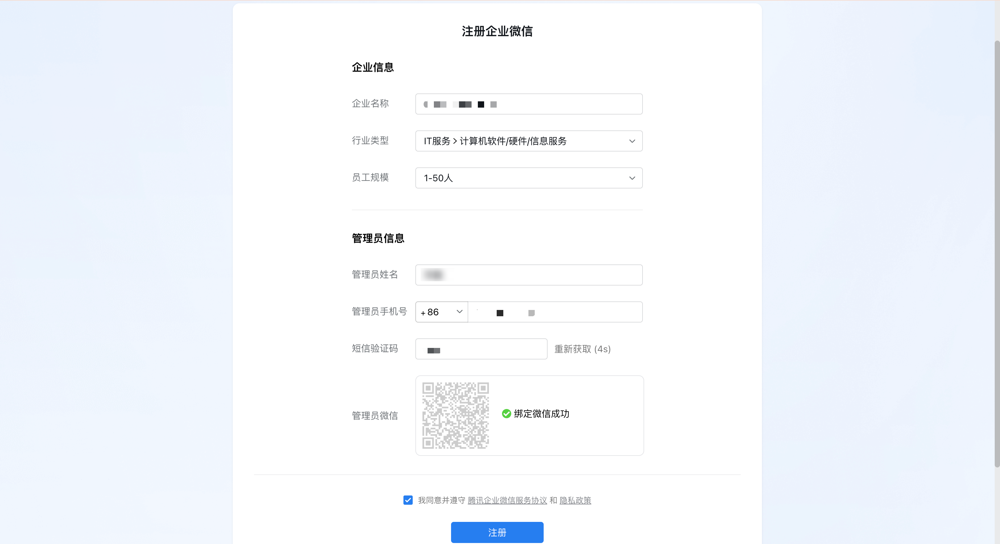

### 2. 创建智能机器人

进入「安全与管理」→「管理工具」→「智能机器人」，创建机器人并选择 **API 模式**。

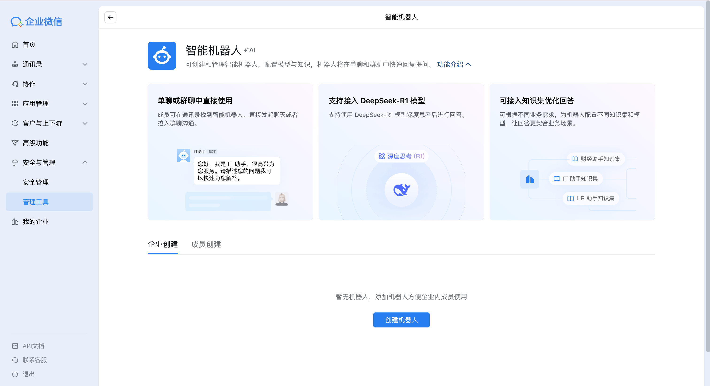
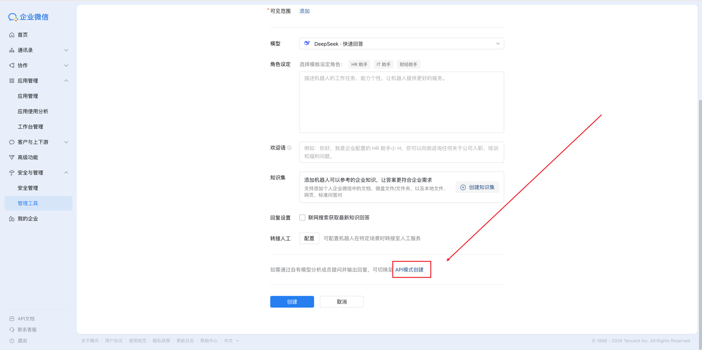

### 3. 配置回调 URL

填写回调 URL：`https://your-domain.com/wecom/bot`

记录页面中生成的 **Token** 和 **EncodingAESKey**，后续在"步骤3：配置 OpenClaw"中需要使用。

注意：请妥善保存 Token 和 EncodingAESKey，勿泄露。

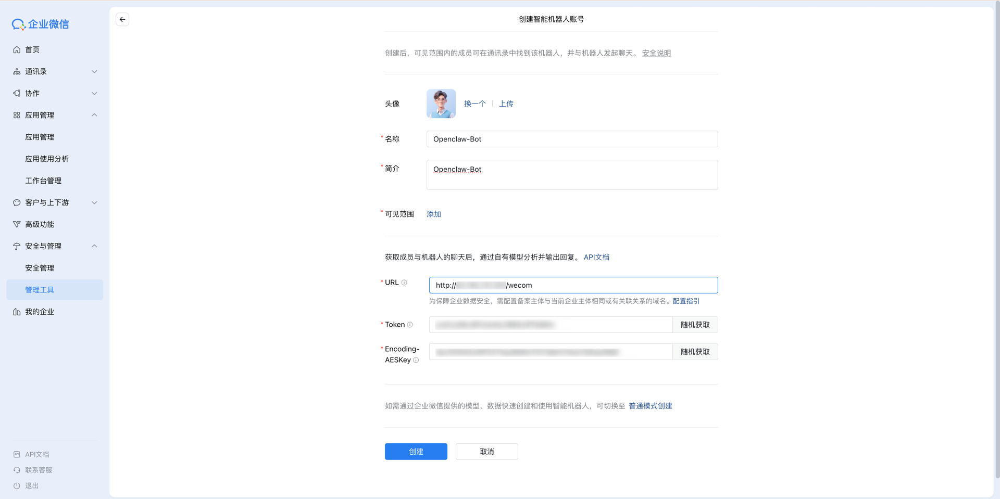

## Agent 模式配置（自建应用，可选）

### 1. 创建自建应用

在企业微信管理后台，进入「应用管理」→「自建」→ 创建应用。

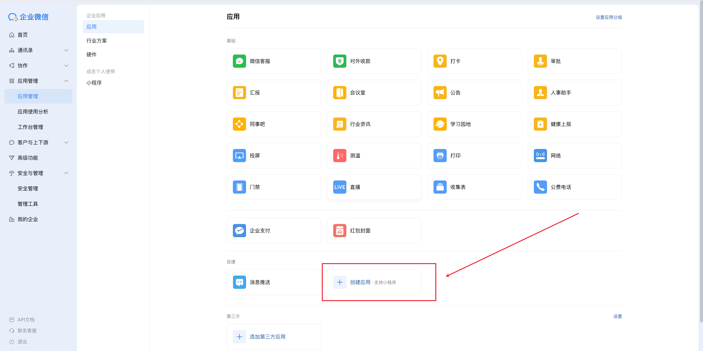

### 2. 获取应用凭证

在应用详情页获取以下信息，复制并妥善保存：

- **CorpId**（企业 ID，在「我的企业」页面查看）
- **AgentId**（应用 ID）
- **Secret**（应用密钥）

注意：出于安全考虑，Secret 不支持明文保存，首次查看或忘记需重新生成。

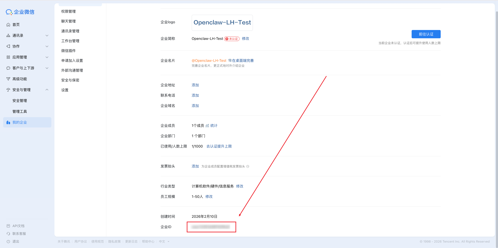
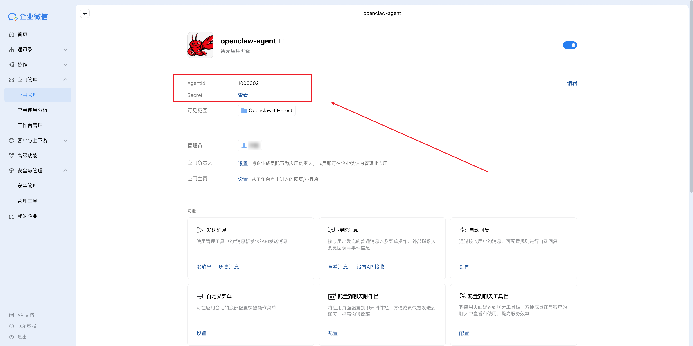

### 3. 设置 API 接收

在应用详情中设置「接收消息 - 设置 API 接收」：

- 填写回调 URL：`https://your-domain.com/wecom/agent`
- 记录回调 **Token** 和 **EncodingAESKey**

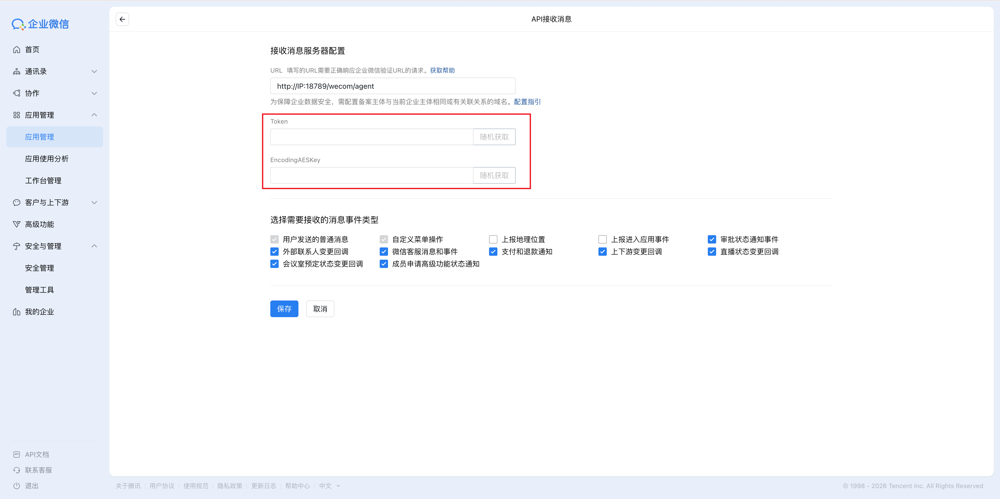

### 4. 配置企业可信 IP

进入应用详情 →「企业可信IP」→「配置」→ 添加你服务器的公网 IP 地址。

如果您使用内网穿透或动态 IP，建议在步骤3中配置 `channels.wecom.network.egressProxyUrl` 走固定出口代理，否则可能出现 `60020 not allow to access from your ip` 错误。
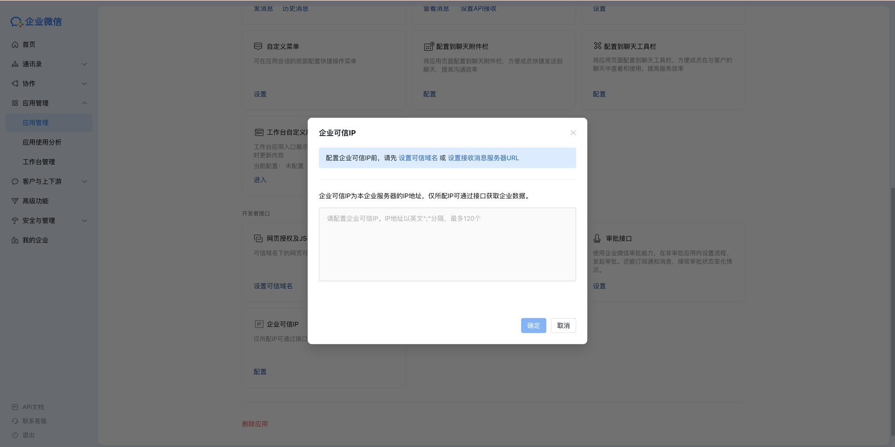

# 步骤3：配置 OpenClaw

## 方式一：通过命令行配置（推荐）

### Bot 模式

```
openclaw channels add --channel wecom
openclaw config set channels.wecom.enabled true
openclaw config set channels.wecom.bot.token "YOUR_BOT_TOKEN"
openclaw config set channels.wecom.bot.encodingAESKey "YOUR_BOT_AES_KEY"
```

### Agent 模式（可选）

```
openclaw config set channels.wecom.agent.corpId "YOUR_CORP_ID"
openclaw config set channels.wecom.agent.corpSecret "YOUR_CORP_SECRET"
openclaw config set channels.wecom.agent.agentId 1000001
openclaw config set channels.wecom.agent.token "YOUR_CALLBACK_TOKEN"
openclaw config set channels.wecom.agent.encodingAESKey "YOUR_CALLBACK_AES_KEY"
```

### 网络代理（可选，动态 IP 场景）

```
openclaw config set channels.wecom.network.egressProxyUrl "http://proxy.company.local:3128"
```

## 方式二：通过配置文件配置

编辑 `~/.openclaw/openclaw.json`：

```json
{
  "channels": {
    "wecom": {
      "enabled": true,
      "bot": {
        "token": "YOUR_BOT_TOKEN",
        "encodingAESKey": "YOUR_BOT_AES_KEY"
      },
      "agent": {
        "corpId": "YOUR_CORP_ID",
        "corpSecret": "YOUR_CORP_SECRET",
        "agentId": 1000001,
        "token": "YOUR_CALLBACK_TOKEN",
        "encodingAESKey": "YOUR_CALLBACK_AES_KEY"
      }
    }
  }
}
```

# 步骤4：启动与测试

## 1. 启动 Gateway

```
openclaw gateway
```

## 2. 验证连接状态

```
openclaw channels status
```

## 3. Bot 模式测试

回到企微管理后台，进入「安全与管理」→「管理工具」→「智能机器人」，找到 Openclaw 的 Bot，点击「详情」
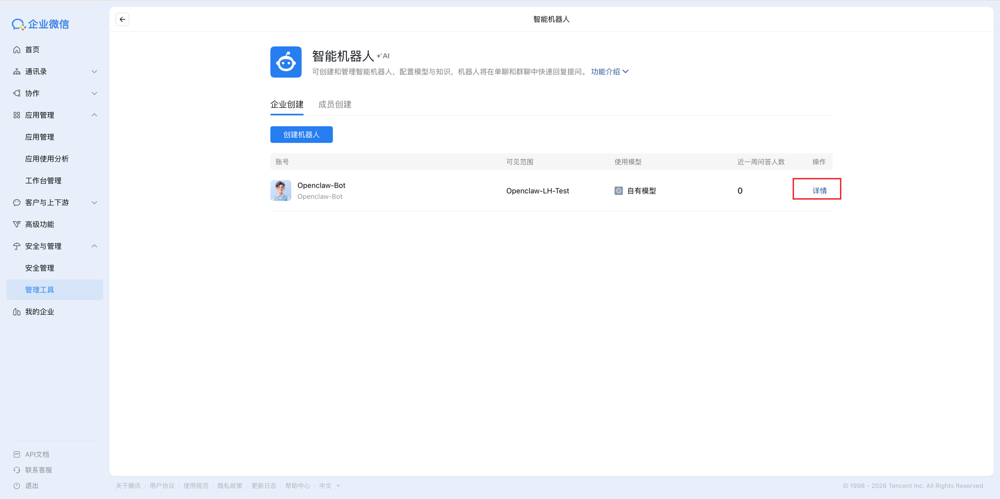

进入智能机器人详情界面后，选择「获取机器人二维码」，扫描后在企微客户端测试
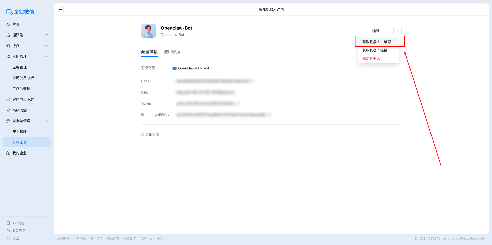
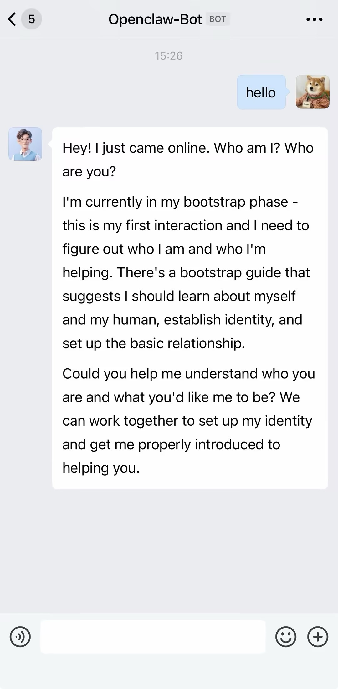

## 4. Agent 模式测试

进入企微客户端，选择「工作台」，找到 Openclaw 的 Agent 应用，进行对话测试
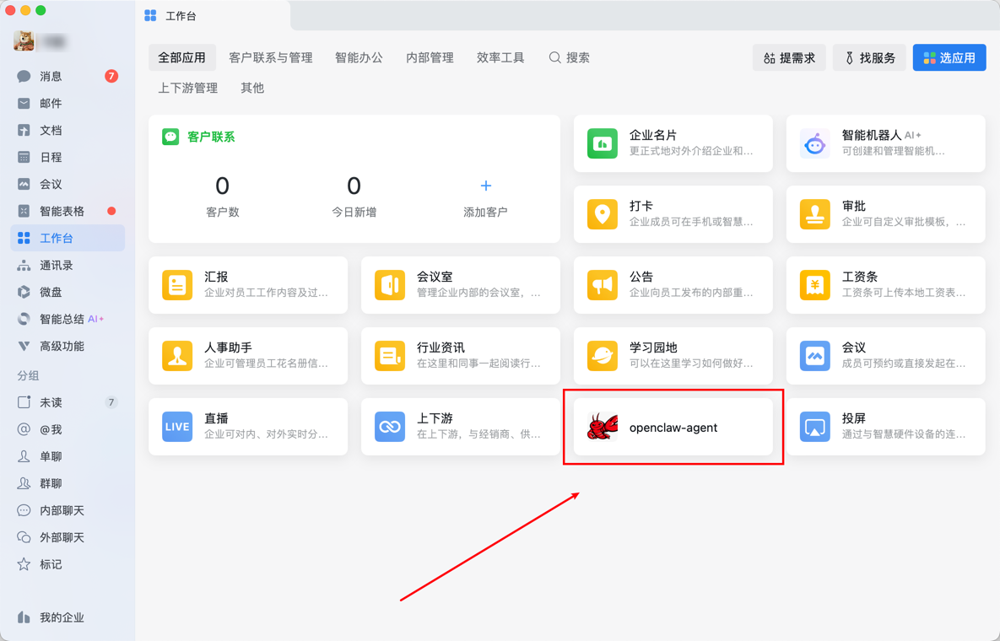
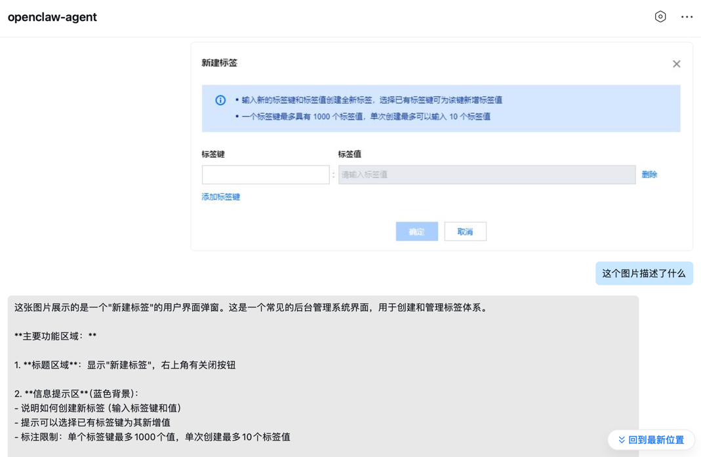

## 5. 双模式测试

同时启用 Bot 和 Agent 后，插件采用「Bot 优先 + Agent 兜底」策略，自动选择最优通道。

将 Bot 拉入群聊，在群聊中 @Bot 对话即可体验全部双模式能力（流式回复 + 文件发送 + 超时接力）。


