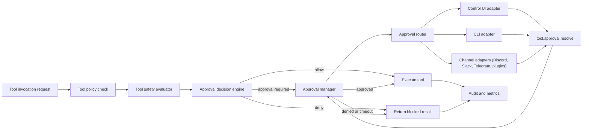
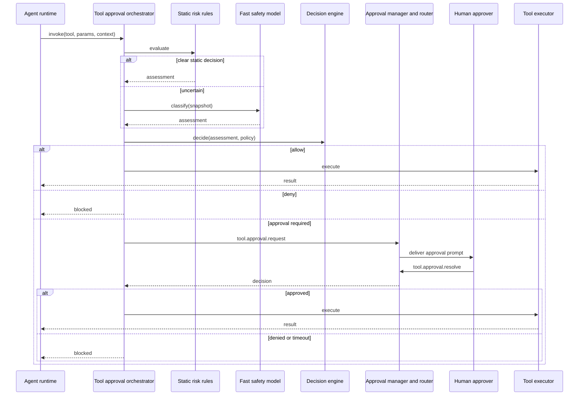

# Adaptive tool approval architecture

## Executive summary

OpenClaw already has strong hard controls (`tools.allow/deny`, sandboxing, `exec` approvals), but approval gating is currently concentrated around `exec` and static modes.
Users who run permissive tool policies want adaptive behavior: no prompts for clearly safe work, fast prompts when risk matters.

This proposal adds a unified approval layer for all tool calls:

- keep hard policy checks first (deny still wins)
- run a cheap safety evaluation pipeline for uncertain calls
- request approval only when the policy engine says the call is materially risky
- route approval requests through any connected operator surface (control UI, CLI, chat channels, plugin channels)

Human approval is the first implementation target, but the design is approver agnostic so automated approvers can be added later.

## Problem statement

Current controls answer "is this tool allowed" and "is this exec path allowlisted," but they do not consistently answer "does this specific invocation have real external impact right now."
The gap appears most often when:

- a permissive model can call many tools without context sensitive gating
- an invocation has side effects outside the local workspace
- the right approval path depends on channel or operator availability

## Design goals

- Minimize unnecessary prompts for low risk tool calls.
- Require explicit approval for high impact external side effects.
- Keep decisions deterministic and auditable.
- Reuse existing gateway approval/event infrastructure.
- Treat control UI and chat channels as equal approval transport adapters.
- Keep latency low by using a fast model only for ambiguous cases.

## Non goals

- Replacing hard allow/deny policy with model judgement.
- Sending raw chain of thought to any classifier.
- Full autonomous non-human approval in v1.

## Current state baseline

Existing building blocks that this architecture reuses:

- tool policy resolution in `src/agents/pi-tools.policy.ts`
- pre tool hook seam in `src/agents/pi-tools.before-tool-call.ts`
- `exec` allowlist and ask logic in `src/infra/exec-approvals.ts` and `src/agents/bash-tools.exec.ts`
- approval request and resolution APIs/events in `src/gateway/server-methods/exec-approval.ts`
- channel forwarding in `src/infra/exec-approval-forwarder.ts`

## High level design

The new flow adds a Tool Safety Evaluator and a unified Tool Approval Orchestrator in front of tool execution.

## Safety evaluation model

Evaluation has two stages to keep performance predictable:

1. Static rule stage

- deterministic parse of tool name, params, target surface, and known side effect class
- immediate decision for clear safe or clear unsafe cases

2. Fast model stage (optional)

- runs only when static stage returns uncertain
- uses a small model (`nano`, `flash`, local model) with tight timeout
- outputs structured risk labels and confidence, not free text policy decisions

The policy engine, not the model, makes the final allow/deny/approval decision.

## Risk taxonomy

| Class | Description                                    | Typical examples                                         | Default action                                 |
| ----- | ---------------------------------------------- | -------------------------------------------------------- | ---------------------------------------------- |
| `R0`  | Read only, no external mutation                | `read`, session/history queries                          | allow                                          |
| `R1`  | Local workspace mutation                       | `write`, `edit`, `apply_patch` in workspace              | allow or sandbox constrained allow             |
| `R2`  | External read or low impact external actions   | web fetch/search, status probes                          | allow with optional approval on low confidence |
| `R3`  | External mutation or irreversible side effects | `message`, `gateway` writes, `cron`, remote node actions | approval required                              |
| `R4`  | High impact operations                         | destructive system commands, security boundary changes   | deny or break glass approval                   |

## Mid level design

### Component responsibilities

| Component                  | Responsibility                                                                                      |
| -------------------------- | --------------------------------------------------------------------------------------------------- |
| Tool Safety Evaluator      | Produces normalized risk assessment from static rules and optional model classification             |
| Approval Decision Engine   | Applies org/agent/session policy to assessment and returns `allow`, `deny`, or `approval_required`  |
| Tool Approval Orchestrator | Sits in tool invocation path, handles request lifecycle and tool continuation                       |
| Approval Manager           | Stores pending approvals, timeout handling, idempotency, resolution state                           |
| Approval Router            | Resolves delivery targets from session channel, configured targets, and active operator connections |
| Channel adapters           | Deliver prompts and map user actions to `tool.approval.resolve`                                     |
| Audit pipeline             | Records request, decision, resolver identity, and execution outcome                                 |

### Invocation sequence

## Channel and connection model

Approvals are routed through an adapter model where each delivery surface is a channel:

- control UI adapter
- CLI/gateway operator socket adapter
- first party channel adapters (Discord, Slack, Telegram, Signal, iMessage, WhatsApp web)
- extension channel adapters (plugin channels)

Routing modes mirror existing patterns:

- `session`: send to origin session route
- `targets`: send to configured operator targets
- `both`: send to both session and targets

This lets approval UX align with how users already interact with OpenClaw.

## Context package for safety evaluation

To support contextual risk decisions without leaking full reasoning traces, the evaluator receives:

- tool name and normalized args
- resolved execution host and path targets (when relevant)
- session and channel metadata
- compact action summary for the current task step
- policy context (sandbox on/off, agent trust level, sender role)

The package excludes raw chain of thought.

## Fallback behavior

- If classifier is disabled or times out, policy falls back to static rules.
- If approval delivery fails on one adapter, router fanout continues to other targets.
- If no approver is reachable, timeout policy applies (`deny` by default).

## Security and audit requirements

- Every approval request gets an immutable id, TTL, and audit record.
- Resolution records resolver identity and transport channel.
- Decision artifacts are structured JSON and redaction safe.
- Deny by default on ambiguous parser errors for high risk classes.

## Migration strategy

- Start with `tool.approval.*` APIs while keeping `exec.approval.*` compatibility aliases.
- Move `exec` to the shared orchestrator first, then expand to non-`exec` tools.
- Keep existing `tools.allow/deny` and sandbox behavior unchanged.

## Related document

- Detailed implementation blueprint: [Adaptive Tool Approval Implementation Blueprint](/refactor/adaptive-tool-approval-implementation)
