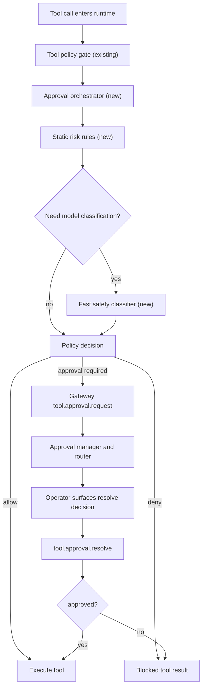

# Adaptive tool approval implementation blueprint

## Assumption

This blueprint assumes [Adaptive Tool Approval Architecture](/refactor/adaptive-tool-approval-architecture) is accepted without design changes.

## Delivery objective

Ship a production grade approval system that:

- evaluates every tool invocation for side effect risk
- asks for approval only when policy says it matters
- works across all channels and control surfaces
- keeps current `exec` behavior backward compatible during migration

## Scope boundaries

- In scope: runtime orchestration, gateway APIs/events, channel routing, config, audit, tests, rollout.
- Out of scope for v1: autonomous non-human approvals as default path.

## Target runtime flow



## Proposed module plan

### New runtime modules

- `src/approvals/risk-taxonomy.ts`
- `src/approvals/tool-risk-static.ts`
- `src/approvals/tool-risk-classifier.ts`
- `src/approvals/tool-decision-engine.ts`
- `src/approvals/tool-approval-orchestrator.ts`
- `src/approvals/types.ts`

### Gateway modules

- `src/gateway/tool-approval-manager.ts` (or extend `exec-approval-manager.ts`)
- `src/gateway/server-methods/tool-approval.ts`
- `src/infra/tool-approval-forwarder.ts`
- `src/gateway/protocol/schema/tool-approvals.ts`

### Integration touch points

- `src/agents/pi-tools.ts` (wrap tool execute path)
- `src/agents/pi-tools.before-tool-call.ts` (hook ordering and context handoff)
- `src/gateway/server-methods.ts` and `src/gateway/server-methods-list.ts`
- `src/config/types.approvals.ts`, `src/config/zod-schema.approvals.ts`, `src/config/types.openclaw.ts`

### Compatibility layer

- keep `exec.approval.request` and `exec.approval.resolve`
- map to generic `tool.approval.request` and `tool.approval.resolve` with tool type metadata

## Data contracts

### Runtime assessment contract

```ts
type ToolRiskAssessment = {
  toolName: string;
  riskClass: "R0" | "R1" | "R2" | "R3" | "R4";
  sideEffects: string[]; // e.g. ["external_write", "filesystem_write"]
  confidence: number; // 0..1
  source: "static" | "classifier" | "hybrid";
  reasonCodes: string[]; // deterministic tags
};
```

### Approval request contract

```ts
type ToolApprovalRequestPayload = {
  id: string;
  toolName: string;
  paramsSummary: string;
  sessionKey?: string | null;
  agentId?: string | null;
  channel?: string | null;
  riskClass: "R0" | "R1" | "R2" | "R3" | "R4";
  sideEffects: string[];
  reasonCodes: string[];
  expiresAtMs: number;
};
```

### Classifier IO contract

Input fields:

- tool invocation snapshot (tool name, normalized args, host/path targets)
- session/channel context
- compact action summary for current task step
- policy context

Output fields:

- `riskClass`
- `sideEffects[]`
- `confidence`
- `reasonCodes[]`

No free form decision text is used for final policy.

## Configuration model

### New config keys

Add to `approvals` section:

```json5
{
  approvals: {
    tools: {
      enabled: true,
      mode: "adaptive", // off | adaptive | always
      timeoutMs: 120000,
      classifier: {
        enabled: true,
        provider: "openai",
        model: "gpt-5-nano",
        timeoutMs: 1200,
        maxInputChars: 6000,
        minConfidence: 0.72,
        onLowConfidence: "require_approval", // require_approval | deny | allow
      },
      policy: {
        requireApprovalAtOrAbove: "R3",
        denyAtOrAbove: "R4",
        requireApprovalForExternalWrite: true,
        requireApprovalForMessagingSend: true,
      },
      routing: {
        mode: "both", // session | targets | both
        targets: [{ channel: "discord", to: "1234567890" }],
      },
    },
  },
}
```

### Backward compatibility behavior

- If `approvals.tools` is missing, existing behavior remains.
- Existing `approvals.exec` continues to work.
- When both are present, `approvals.tools` drives generic gating and `approvals.exec` remains a legacy override for `exec` until migration completes.

## API and protocol changes

### New methods

- `tool.approval.request`
- `tool.approval.resolve`
- `tool.approvals.get` (optional introspection)

### New events

- `tool.approval.requested`
- `tool.approval.resolved`
- `tool.approval.expired` (optional, for UI sync)

### Scope model

Reuse existing `operator.approvals` for request resolution surfaces.

## Decision algorithm

```ts
function decideToolInvocation(invocation, policyCtx) {
  enforceHardPolicy(invocation); // existing allow/deny gates

  const staticAssessment = evaluateStaticRisk(invocation, policyCtx);
  const assessment = staticAssessment.needsClassifier
    ? classifyWithFastModel(invocation, policyCtx, staticAssessment)
    : staticAssessment;

  const decision = applyDecisionPolicy(assessment, policyCtx);

  if (decision === "allow") return runTool(invocation);
  if (decision === "deny") return blocked("denied by policy");

  const req = requestApproval(invocation, assessment, policyCtx);
  const resolved = await waitForResolution(req.id, policyCtx.timeoutMs);
  if (!resolved.approved) return blocked("approval denied or timeout");
  return runTool(invocation);
}
```

## Channel routing implementation

### Adapter interface

```ts
type ToolApprovalAdapter = {
  id: string;
  deliverRequest: (request: ToolApprovalRequestPayload) => Promise<void>;
  deliverResolved: (id: string, decision: string, resolvedBy?: string) => Promise<void>;
  stop?: () => void;
};
```

### Initial adapters

- control UI and operator WS clients
- CLI path through gateway methods
- chat adapters via existing outbound delivery (`session`, `targets`, `both`)
- existing Discord interactive button path can be reused with generic payload fields

## Detailed rollout phases

### Phase 1: foundations

- add risk taxonomy and static rules
- add config schema for `approvals.tools`
- add runtime orchestrator wrapper with feature flag off by default

Acceptance:

- no behavior change when disabled
- unit tests for static taxonomy

### Phase 2: gateway generic approvals

- add tool approval manager, methods, events
- keep `exec.approval.*` aliases
- add protocol schema and generated validators

Acceptance:

- operator client can resolve generic approvals
- event scope filtering unchanged for `operator.approvals`

### Phase 3: routing and channel delivery

- implement `tool-approval-forwarder`
- route to session and configured targets
- add generic text command parser for approve/deny in channel adapters

Acceptance:

- approval request resolves successfully from at least control UI and one chat channel

### Phase 4: classifier integration

- implement fast model classifier client
- add timeout and fallback behavior
- add confidence threshold logic

Acceptance:

- median classifier latency within target budget
- deterministic fallback on timeout/error

### Phase 5: migrate exec path

- route `exec` through generic orchestrator
- preserve `exec` specific allowlist semantics
- deprecate direct-only `exec.approval.*` internals

Acceptance:

- current `exec` approval tests still pass
- no regression in `allow-once` and `allow-always`

## Test strategy

### Unit tests

- static risk classification by tool type and params
- policy engine decisions for each risk class and confidence boundary
- classifier output validation and fallback paths

### Integration tests

- tool invocation requiring approval across gateway API
- approval timeout, deny, allow once, allow always
- multi target routing dedup and failure isolation

### End to end tests

- full flow from channel message to approved tool execution
- mixed channel availability with fallback target routing
- migration parity for `exec` approvals

### Performance tests

- no approval path overhead target: low single digit milliseconds
- classifier path p95 under configured timeout
- approval fanout and resolution under load without event drop regressions

## Observability and audit

Add structured metrics and logs:

- `tool_approval_requests_total{tool,riskClass,channel}`
- `tool_approval_resolutions_total{decision,resolverType}`
- `tool_approval_timeout_total{tool}`
- `tool_safety_classifier_latency_ms`
- `tool_safety_classifier_fallback_total{reason}`

Audit record fields:

- request id, tool name, agent id, session key
- risk class and reason codes
- resolver identity and transport
- final execution status

## Security and privacy controls

- never send raw chain of thought to classifier
- redact secrets and tokens from params summary
- deny by default for malformed high risk requests
- enforce max payload size for classifier and channel messages

## Migration and deprecation plan

- release N: generic tooling behind feature flag, `exec` unchanged
- release N+1: `exec` dual path with parity checks
- release N+2: generic path default on, `exec` legacy internals deprecated
- release N+3: remove deprecated internals after compatibility window

## Risk register

| Risk                                | Impact                               | Mitigation                                                                          |
| ----------------------------------- | ------------------------------------ | ----------------------------------------------------------------------------------- |
| Classifier false negatives          | external side effects without prompt | conservative policy thresholds, static rules first, deny/approval on low confidence |
| Prompt fatigue from false positives | user friction                        | tune policy by tool class and session trust level                                   |
| Channel delivery failures           | blocked work or missed approvals     | multi target routing with timeout fallback                                          |
| Migration regressions for `exec`    | broken existing workflows            | dual path parity tests before default switch                                        |

## Completion checklist

- runtime orchestrator merged
- protocol and methods merged
- adapters merged for required channels
- tests and metrics merged
- docs updated: architecture, CLI, tools, and gateway protocol references

## Related document

- Architecture proposal: [Adaptive Tool Approval Architecture](/refactor/adaptive-tool-approval-architecture)
