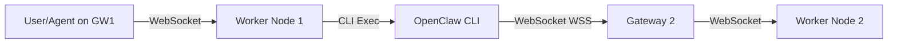
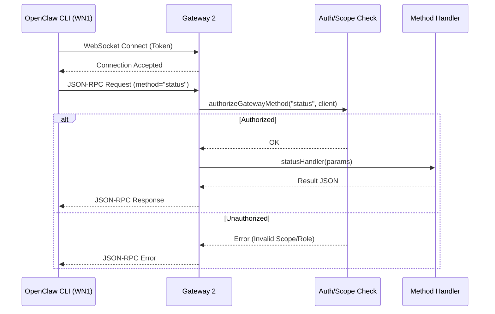

# Inter-Cluster Design: GW1-WN1 -> GW2-WN2

**Goal:** Enable a Worker Node (`WN1`) in Cluster 1 (`GW1`) to control a Gateway (`GW2`) in Cluster 2.

**Architecture:** "Master-Slave" via CLI Bridge.

## The "Somehow" Link

The link is established by `WN1` executing the OpenClaw CLI to send RPC commands to `GW2`.



## Detailed Design

### 1. Mechanism

`WN1` uses its `system.run` capability to execute the `openclaw` command-line tool. This tool acts as a client for `GW2`.

**Command Pattern:**

```bash
openclaw gateway call \
  --url "wss://gw2.example.com" \
  --token "gw2-auth-token" \
  <METHOD> \
  --params '<JSON>'
```

### 2. Prerequisites & Configuration

#### A. On Worker Node 1 (WN1)

1.  **Binary Access:** Ensure `openclaw` is in the system `$PATH`.
2.  **Security Allowlist:** The `system.run` capability allows execution based on `exec-approvals.json`. You must allow the `openclaw` binary.
    - _Option A (Recommended):_ Add exact allowlist entry for `openclaw` usage.
    - _Option B (Dev/Testing):_ Set `OPENCLAW_TOOLS_EXEC_SECURITY="full"` (allows all commands, use with caution).

#### B. On Gateway 1 (GW1)

The Agent or automation running on `GW1` needs the credentials for `GW2` to construct the command. These should be stored securely (e.g., in `1Password` or environment variables injected into the Agent's context).

### 3. Usage Example (Agent on GW1)

An agent on `GW1` wants `GW2` to list its connected nodes.

**Agent Action:**

```typescript
await tools.system.run({
  command: [
    "openclaw",
    "gateway",
    "call",
    "status",
    "--url",
    "wss://gw2-host:18789",
    "--token",
    "s3cr3t-t0k3n", // stored securely
    "--json",
  ],
});
```

**Result:** `WN1` executes the CLI, which connects to `GW2`, retrieves the status, and returns the JSON output to the Agent on `GW1`.

### 4. CLI Command: `gateway call`

The `gateway call` command is the core mechanism for this design. It allows a client (the Node) to execute a Remote Procedure Call (RPC) or other method on a target Gateway.

**Usage:**

```bash
openclaw gateway call <method> [options]
```

**Key Options:**

| Option            | Description                                                                                   | Source                                                                                                   |
| :---------------- | :-------------------------------------------------------------------------------------------- | :------------------------------------------------------------------------------------------------------- |
| `--url <url>`     | The WebSocket URL of the target Gateway (e.g., `wss://gw2.example.com`).                      | [src/cli/gateway-cli/call.ts](file:///home/nozim/Dev/Aibek/OpenClaw/src/cli/gateway-cli/call.ts)         |
| `--token <token>` | Authentication token for the target Gateway.                                                  | [src/cli/gateway-cli/call.ts](file:///home/nozim/Dev/Aibek/OpenClaw/src/cli/gateway-cli/call.ts)         |
| `--params <json>` | JSON string of parameters to pass to the method key-value pairs.                              | [src/cli/gateway-cli/register.ts](file:///home/nozim/Dev/Aibek/OpenClaw/src/cli/gateway-cli/register.ts) |
| `--json`          | Output the raw JSON response instead of human-readable text. Useful for parsing by the Agent. | [src/cli/gateway-cli/register.ts](file:///home/nozim/Dev/Aibek/OpenClaw/src/cli/gateway-cli/register.ts) |

**How it Works:**

1.  **Parsing:** The CLI parses the arguments using `commander` defined in [src/cli/gateway-cli/register.ts](file:///home/nozim/Dev/Aibek/OpenClaw/src/cli/gateway-cli/register.ts).
2.  **Connection:** It initializes a `GatewayClient` (from [src/gateway/client.ts](file:///home/nozim/Dev/Aibek/OpenClaw/src/gateway/client.ts)) which establishes a WebSocket connection to the provided `--url`.
3.  **Authentication:** The client authenticates using the provided `--token`.
4.  **RPC Invocation:** It sends a JSON-RPC message for the specified `<method>` with the given `--params`.
5.  **Response:** The Gateway processes the request and sends back a response, which the CLI prints to `stdout`.

### 5. Destination Side: Handling the Request (GW2)

On the receiver (`GW2`), the request is processed as follows:

1.  **WebSocket Connection:** The `GatewayServer` accepts the connection and performs a handshake.
2.  **Request Handling:** Incoming JSON-RPC messages are routed to `handleGatewayRequest` in [src/gateway/server-methods.ts](file:///home/nozim/Dev/Aibek/OpenClaw/src/gateway/server-methods.ts).
3.  **Authorization:**
    - The `authorizeGatewayMethod` function checks if the connected client (the CLI from WN1) has the required **Role** (e.g., `operator`) and **Scopes** (e.g., `operator.read`, `operator.write`) for the requested method.
    - _Note:_ The CLI connects with the `operator` role and full scopes by default if a valid token is provided.
4.  **Dispatch:**
    - If authorized, the request is dispatched to the specific handler in `coreGatewayHandlers` (e.g., `healthHandlers` for `health`, `nodeHandlers` for `node.list`).
5.  **Execution & Response:**
    - The handler executes the logic (e.g., querying the database, checking system status).
    - The result is sent back as a JSON-RPC response to the CLI.

**Diagram of Flow:**



### 6. Extensions (Optional)

To simplify this, a **"Gateway Client Skill"** could be created for `WN1`. This skill would wrap the CLI calls, exposing a cleaner API to the Agent (e.g., `remote_gateway.list_nodes(remote_id)`), hiding the raw CLI syntax and token management.

### 7. Appendix: The `GatewayClient` Concept

The `GatewayClient` is the standard entity/class used to connect to a Gateway via WebSocket. It handles:

- **Connection:** Establishing and maintaining the WebSocket link.
- **Authentication:** Handshaking with tokens or device identities.
- **Protocol:** Wrapping requests in JSON-RPC frames (`{ type: 'req', ... }`) and matching responses.

**Are Dashboard and Agents "Clients"?**

1.  **Dashboard (Control UI):** **YES.**
    - The frontend uses `GatewayBrowserClient` (in `ui/src/ui/gateway.ts`), which is the browser-compatible equivalent of `GatewayClient`.
    - It connects via WebSocket, authenticates (usually as an `operator`), and sends RPC commands just like a Node or CLI would.

2.  **Agents:** **IT DEPENDS.**
    - **Internal Agents:** Agents running _inside_ the Gateway process (e.g., standard system agents) are **NOT** clients in this network sense. They interact directly with the Gateway's internal event bus and methods.
    - **External/Remote Agents:** If an agent were to run effectively "outside" (e.g., a script on a laptop, or via the `openclaw` CLI as in this design), it **ACTS AS** a client. In our specific design, `WN1` is the `GatewayClient` that acts on behalf of the Agent.
